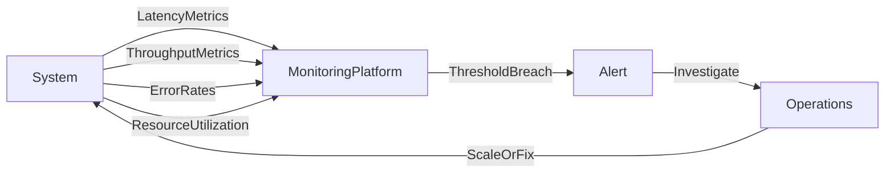

# 📊 Performance Monitoring

> [!abstract] TL;DR
> Performance monitoring tracks latency, throughput, and resource utilization over time to detect degradation before it causes outages, enabling proactive scaling and optimization.

## 🧠 Core Idea

As systems experience higher load and data growth, components may begin to slow down before they fail. **Performance monitoring** helps detect these slowdowns early.

> Goal: Detect performance degradation before it turns into outages.

By observing performance metrics continuously, teams can take corrective action before users experience failures.

---

## 📖 Definition

Performance monitoring involves tracking how efficiently system components process requests and workloads over time.

It focuses on identifying:

- Latency increases
- Throughput drops
- Resource exhaustion
- System bottlenecks

Early detection allows teams to scale, optimize, or repair components proactively.

---

## 🎯 Why Performance Monitoring Matters

Performance monitoring helps teams:

- Detect degradation before failure occurs
- Identify system bottlenecks
- Improve user experience
- Plan capacity and scaling
- Prevent cascading failures

Performance issues often precede system outages.

---

## 📦 Key Metrics to Monitor

### 1️⃣ Latency
Time taken to process requests.

---

### 2️⃣ Throughput
Number of requests processed per unit time.

---

### 3️⃣ Resource Utilization
- CPU usage
- Memory consumption
- Disk I/O
- Network usage

---

### 4️⃣ Error Rates
Increase in errors often correlates with performance issues.

---

## 🚀 Best Practices

### ✅ Monitor Trends, Not Just Spikes
Track gradual performance degradation.

### ✅ Use Dashboards
Visualize system behavior over time.

### ✅ Set Alerts
Trigger alerts when thresholds are crossed.

### ✅ Perform Capacity Planning
Scale infrastructure before limits are reached.

---

## 🧠 Design Insight

```
Performance degradation → Early signal
Early detection → Prevent outages
Monitoring → Enables proactive action
```

---

## 📊 Architecture Diagram



---

## Related Concepts

- [[_MOC_Monitoring|↑ Section MOC]]
- [[Monitoring]]
- [[Health_Monitoring]]
- [[Instrumentation]]
- [[Visualization_and_Alerts]]
- [[Usage_Monitoring]]

---

## Review Questions

1. What is the difference between tracking performance spikes versus trends, and why do both matter for reliability?
2. How do the four golden signals (latency, traffic, errors, saturation) help diagnose different types of production incidents?
3. Why should performance monitoring trigger proactive scaling before resource limits are hit, rather than reacting after degradation?

---

## 🔗 Related Topics

[[Monitoring]]
[[Health Monitoring]]
[[Availability Monitoring]]
[[Scalability]]
[[Performance Antipatterns]]

---

## 📚 Source

- Microsoft Azure Architecture Best Practices — Performance Monitoring  
  https://learn.microsoft.com/en-us/azure/architecture/best-practices/monitoring#performance-monitoring

---

## 🏷️ Tags

#SystemDesign #Monitoring #Performance #Reliability #Operations
