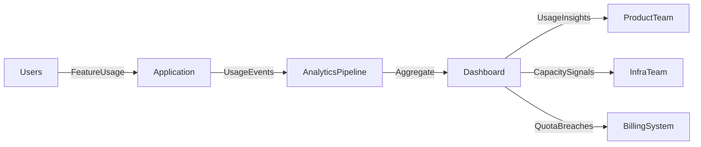

# 📊 Usage Monitoring

> [!abstract] TL;DR
> Usage monitoring tracks how users interact with features and how much resource each workload consumes, informing capacity planning, billing, quota enforcement, and product decisions.

## 🧠 Core Idea

**Usage monitoring** tracks how users interact with application features and system components.

> Goal: Understand real-world system usage to improve performance, capacity planning, and business decisions.

By observing how features are actually used, teams can optimize system behavior and guide product evolution.

---

## 📖 Definition

Usage monitoring collects data about:

- Feature usage frequency
- Traffic patterns
- Operational workloads
- Resource consumption by users or tenants

This information helps operators understand how systems behave under normal conditions.

---

## 🎯 Why Usage Monitoring Matters

Usage monitoring helps teams:

- Identify heavily used features or hotspots
- Detect underused features that may be removed
- Plan capacity as usage grows
- Improve user experience
- Support billing and quota management

Understanding usage patterns leads to better system and product decisions.

---

## 📦 Common Use Cases

### 1️⃣ Identify Popular Features
Heavily used components may require:

- Functional partitioning
- Replication
- Scaling improvements

---

### 2️⃣ Capacity Planning
Track transaction volume and active users to forecast infrastructure needs.

Example:
In e-commerce systems, monitoring transaction volume helps plan scaling needs during growth or seasonal spikes.

---

### 3️⃣ Detect User Friction
User behavior can reveal system problems.

Example:
High shopping cart abandonment may indicate checkout issues.

---

### 4️⃣ Billing and Chargeback
Usage data can support billing models where users pay based on resource consumption.

---

### 5️⃣ Quota Enforcement
Usage monitoring enables systems to:

- Throttle heavy users
- Limit access beyond quotas
- Maintain fairness in multitenant systems

---

## 🚀 Best Practices

### ✅ Monitor Feature Usage
Track which features users actually use.

### ✅ Collect Aggregated Metrics
Avoid excessive detail; focus on trends.

### ✅ Respect Privacy
Ensure user data is anonymized and compliant with regulations.

### ✅ Combine with Performance Monitoring
Usage spikes often correlate with performance issues.

---

## 🧠 Design Insight

```
Measure usage → Understand demand
Understand demand → Scale correctly
Scale correctly → Improve user experience
```

---

## 📊 Architecture Diagram



---

## Related Concepts

- [[_MOC_Monitoring|↑ Section MOC]]
- [[Monitoring]]
- [[Performance_Monitoring]]
- [[Visualization_and_Alerts]]
- [[Instrumentation]]

---

## Review Questions

1. How does usage monitoring differ from performance monitoring in terms of what it measures and who consumes the data?
2. How can usage monitoring data help detect user friction (e.g., high cart abandonment) that performance metrics alone would miss?
3. What privacy and compliance considerations apply when collecting user-level usage data?

---

## 🔗 Related Topics

[[Monitoring]]
[[Performance Monitoring]]
[[Availability Monitoring]]
[[Scalability]]
[[Capacity Planning]]

---

## 📚 Source

- Microsoft Azure Architecture Best Practices — Usage Monitoring  
  https://learn.microsoft.com/en-us/azure/architecture/best-practices/monitoring#usage-monitoring

---

## 🏷️ Tags

#SystemDesign #Monitoring #Usage #Analytics #Operations
