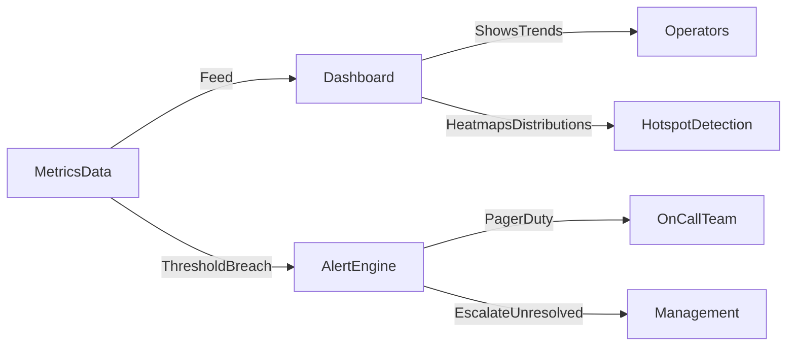

# 📊 Visualization and Alerts

> [!abstract] TL;DR
> Visualization transforms raw monitoring data into dashboards and trend graphs, while alerts notify operators when thresholds are crossed — together enabling fast detection and response to incidents.

## 🧠 Core Idea

A monitoring system is only useful if operators can **understand system behavior quickly** and be **notified when problems occur**.

> Goal: Present monitoring data clearly and alert operators when action is required.

Visualization helps teams detect trends and anomalies, while alerts ensure that critical issues receive immediate attention.

---

## 📖 Definition

Visualization and alerting involve:

- Presenting monitoring data in dashboards or reports
- Highlighting system trends and anomalies
- Automatically notifying operators when thresholds are crossed or failures occur

This enables rapid diagnosis and response to incidents.

---

## 🎯 Why Visualization Matters

Visualization allows operators to:

- Quickly understand system health
- Detect performance degradation
- Identify traffic spikes or unusual patterns
- Monitor resource usage trends

Dashboards reduce the time needed to diagnose issues.

---

## 🚨 Why Alerts Matter

Alerts notify teams when:

- Services become unavailable
- Performance drops below acceptable levels
- Resource limits are exceeded
- Error rates spike
- Security or operational anomalies occur

Timely alerts prevent small issues from becoming outages.

---

## 📦 Common Visualization Techniques

### 1️⃣ Dashboards
Display metrics such as:

- Request rate
- Latency
- Error rate
- Resource utilization

Dashboards provide real-time operational insight.

---

### 2️⃣ Trend Graphs
Show historical performance patterns for capacity planning and forecasting.

---

### 3️⃣ Heatmaps & Distributions
Reveal hotspots and uneven load distribution across services.

---

## 🚀 Alerting Best Practices

### ✅ Alert on Symptoms, Not Noise
Focus on user-impacting problems rather than minor fluctuations.

### ✅ Use Severity Levels
Differentiate between warnings and critical failures.

### ✅ Avoid Alert Fatigue
Too many alerts cause teams to ignore them.

### ✅ Automate Escalation
Notify additional responders if issues remain unresolved.

### ✅ Include Context
Alerts should contain enough data to diagnose issues quickly.

---

## 🧠 Design Insight

```
Data without visualization → Hard to understand
Monitoring without alerts → Slow response
Visualization + alerts → Fast incident response
```

---

## 📊 Architecture Diagram



---

## Related Concepts

- [[_MOC_Monitoring|↑ Section MOC]]
- [[Monitoring]]
- [[Instrumentation]]
- [[Performance_Monitoring]]
- [[Health_Monitoring]]
- [[Usage_Monitoring]]

---

## Review Questions

1. What is alert fatigue and what practices (severity levels, symptom-based alerting) help prevent it?
2. How do heatmaps and distribution graphs reveal performance problems that average metrics conceal?
3. Why should alerts include contextual data (links, runbooks, affected services) rather than just a threshold notification?

---

## 🔗 Related Topics

[[Monitoring]]
[[Instrumentation]]
[[Performance Monitoring]]
[[Health Monitoring]]
[[Availability Monitoring]]

---

## 📚 Source

- Microsoft Azure Architecture Best Practices — Visualizing Data and Raising Alerts  
  https://learn.microsoft.com/en-us/azure/architecture/best-practices/monitoring#visualizing-data-and-raising-alerts

---

## 🏷️ Tags

#SystemDesign #Monitoring #Observability #Alerts #Operations
