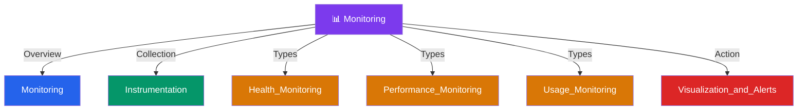

# 📊 Monitoring — Map of Content

> [!abstract] What This Section Covers
> Observability and monitoring for production systems: how to collect signals (instrumentation), what to measure (health, performance, usage), and how to surface those signals to operators (visualization and alerts). Monitoring is the feedback loop that turns a running system into one you can actually understand and fix.

## Concept Map

## Learning Path

1. [[Monitoring]] — What monitoring is, why it matters, and the three pillars: metrics, logs, traces
2. [[Instrumentation]] — How to emit metrics, structured logs, and distributed traces from application code
3. [[Health_Monitoring]] — Liveness vs readiness probes, synthetic checks, and dependency health
4. [[Performance_Monitoring]] — Latency percentiles (p50/p95/p99), throughput, error rates, and SLOs
5. [[Usage_Monitoring]] — Business-level and capacity metrics: DAU, request volume, storage growth
6. [[Visualization_and_Alerts]] — Dashboards, alert thresholds, on-call runbooks, and avoiding alert fatigue

## All Notes at a Glance

| Note | Summary | Difficulty |
|------|---------|------------|
| [[Monitoring]] | Overview of monitoring goals, the three pillars (metrics, logs, traces), and key tooling | Beginner |
| [[Health_Monitoring]] | Tracks whether individual services and their dependencies are alive and ready to serve traffic | Intermediate |
| [[Instrumentation]] | The practice of adding metric emission, logging, and tracing to application code so monitoring systems have data to consume | Intermediate |
| [[Performance_Monitoring]] | Measures latency (p50/p95/p99), throughput, and error rates against defined SLOs | Intermediate |
| [[Usage_Monitoring]] | Tracks business and capacity signals — request rates, active users, storage growth — to inform scaling decisions | Intermediate |
| [[Visualization_and_Alerts]] | Turns raw metrics into actionable dashboards and alert rules that page on-call engineers at the right threshold | Intermediate |

## Key Questions This Section Answers

- What is the difference between health, performance, and usage monitoring?
- What should trigger a page (alert) vs a warning vs a dashboard annotation?
- What is the difference between liveness and readiness probes?
- Why are p95/p99 latency metrics more useful than averages?
- How do you instrument a service without adding significant request overhead?
- What is the relationship between SLIs, SLOs, and SLAs?

## Related Sections

- [[_MOC_SystemDesign_Master|↑ System Design Master MOC]]
- [[_MOC_PerformanceAntipatterns]] — Monitoring is how you detect antipatterns in production
- [[_MOC_ApplicationLayer]] — Application-layer services are the primary target of instrumentation

#MOC #SystemDesign
