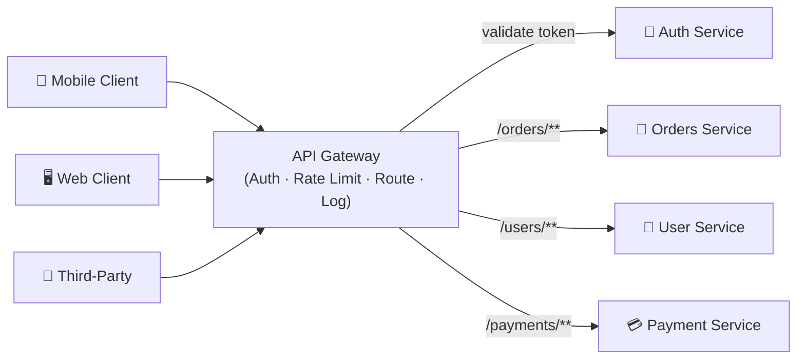

# 🚪 API Gateway

> [!abstract] TL;DR
> An API Gateway is the single front door for all client requests, handling cross-cutting concerns like auth, rate limiting, and routing so individual services don't have to.

## Intuition

Imagine a large hotel. Every guest walks through the **main lobby** — not directly into the kitchen or the laundry room. The lobby receptionist checks their ID, assigns them a room key, and routes them to the right floor. Guests never talk to housekeeping or room service directly; the lobby coordinates everything.

An **API Gateway** is that lobby. All external clients hit one endpoint, and the gateway decides what service handles each request, verifies the caller's identity, enforces usage limits, and logs everything — so each backend service can focus purely on its business logic.

### Formal Definition

An API Gateway is a server-side component that acts as the **single entry point** for all client requests in a microservices architecture. It aggregates cross-cutting concerns (authentication, rate limiting, routing, logging, SSL termination) into one place rather than duplicating them across every service.

**API Gateway vs Reverse Proxy:**

| Concern | Reverse Proxy | API Gateway |
|---|---|---|
| Primary job | Forward requests to upstream servers | Full request lifecycle management |
| Authentication | Rarely | Yes — validates tokens, API keys |
| Rate Limiting | Basic or none | Yes — per key, per IP, per route |
| Request transformation | Rarely | Yes — reshape payloads, translate protocols |
| Developer portal | No | Often built-in |
| Typical tools | Nginx (proxy mode), HAProxy | Kong, AWS API Gateway, Azure APIM |

## How It Works

### Core Functions

1. **Routing** — inspects the request path/host and forwards to the correct upstream service (e.g., `GET /users` → User Service, `POST /payments` → Payment Service).
2. **Authentication & Authorization** — validates JWTs, API keys, or OAuth tokens before the request ever reaches a backend. The gateway calls an Auth Service or validates locally.
3. **Rate Limiting** — enforces usage quotas per API key, IP address, or user. Returns `429 Too Many Requests` when exceeded.
4. **SSL Termination** — accepts HTTPS from clients, terminates TLS at the gateway, and forwards plain HTTP internally (avoids repeated cert management in every service).
5. **Request/Response Transformation** — rewrites headers, translates between REST and gRPC, aggregates responses from multiple services into one.
6. **Load Balancing** — distributes requests across multiple instances of the same service.
7. **Logging & Observability** — centralized request tracing, latency metrics, and error rates without touching individual services.
8. **Caching** — caches responses for GET endpoints to reduce backend load.

### Request Lifecycle

1. Client sends `POST /payments` with a Bearer token.
2. Gateway receives request over HTTPS → terminates TLS.
3. Gateway calls Auth Service (or validates JWT locally) → 401 if invalid.
4. Rate limiter checks per-key counter in Redis → 429 if exceeded.
5. Gateway transforms request if needed (e.g., strips internal headers).
6. Gateway routes to Payment Service instance, records trace ID.
7. Payment Service responds → gateway logs response time, forwards to client.

## Real-World Systems

- **Netflix** — Routes 2B+ API requests per day through a custom gateway ("Zuul", later "Zuul 2") that handles auth, dynamic routing, and resilience for 700+ downstream services.
- **Stripe** — Uses its API Gateway for authentication (API key validation) and per-key rate limiting, ensuring no single customer can exhaust shared infrastructure.
- **AWS API Gateway** — Fully managed gateway supporting REST, HTTP, and WebSocket APIs; integrates natively with Lambda, IAM auth, Cognito, and WAF.
- **Kong** — Open-source gateway (Nginx + Lua) widely used on-prem and in Kubernetes; pluggable architecture for auth, rate limiting, and observability.
- **Azure API Management** — Microsoft's managed gateway with a developer portal, policy engine, and built-in analytics.

## Trade-offs

| Advantage | Disadvantage |
|-----------|-------------|
| Single place for all cross-cutting concerns (auth, logging, rate limiting) | Single point of failure — must be deployed in HA (multiple instances + health checks) |
| Backend services are simpler and focused on business logic | Added network hop (~1–5 ms latency per request) |
| Centralized API versioning and backwards-compatibility management | Operational complexity — another system to configure, monitor, and scale |
| Easier to evolve internal architecture (rename/split services) without changing client contracts | Can become a bottleneck if under-provisioned |
| Unified observability and debugging surface | Risk of "god gateway" — logic creep that belongs in services migrates to the gateway |

## When to Use vs Avoid

**Use when:**
- You have multiple microservices and don't want each one implementing its own auth, rate limiting, and logging.
- Clients are external (mobile apps, third-party partners) and need a stable public API contract.
- You need protocol translation (e.g., REST clients talking to gRPC backends).
- You need fine-grained rate limiting and usage analytics per API key.

**Avoid when:**
- You have a monolith — one service talking to one DB; a gateway adds complexity with no benefit.
- All communication is strictly internal (service-to-service) — use a service mesh (Istio, Linkerd) instead.
- Your team lacks the ops maturity to run and maintain the gateway reliably; the risk of a misconfigured gateway outweighs the convenience.

## Common Pitfalls

1. **No HA deployment** — running a single gateway instance makes it the system's single point of failure. Always run 2+ instances behind a load balancer.
2. **Business logic in the gateway** — the gateway should route and govern, not implement features. Logic creep makes the gateway a maintenance nightmare.
3. **Missing circuit breakers on upstream calls** — if the Auth Service is slow, all requests stall at the gateway. Add timeouts and fallbacks.
4. **Not versioning your API** — `/v1/` and `/v2/` prefixes in the gateway let you evolve services without breaking existing clients.
5. **Forgetting end-to-end tracing** — inject a correlation/trace ID at the gateway and propagate it to all downstream services for distributed tracing.

## Related Concepts

- [[Load_Balancers]]
- [[Rate_Limiting]]
- [[Circuit_Breaker]]
- [[Communication]]
- [[Microservices]]

## Review Questions

1. What is the difference between a reverse proxy and an API Gateway? Name two functions a gateway has that a plain reverse proxy typically does not.
2. Draw the request lifecycle through an API Gateway for an authenticated POST request, naming each step where the gateway can reject the request and why.
3. An API Gateway is called a "single point of failure." What architectural patterns mitigate this risk?
4. When would you choose a service mesh over an API Gateway for cross-cutting concerns like auth and retries?
5. Netflix routes billions of requests per day through their gateway. What strategies would you use to ensure the gateway does not become a throughput bottleneck?

## Sources

- [Kong API Gateway Docs](https://docs.konghq.com/)
- [AWS API Gateway Overview](https://docs.aws.amazon.com/apigateway/latest/developerguide/welcome.html)
- [Netflix Zuul on GitHub](https://github.com/Netflix/zuul)
- [Martin Fowler — API Gateway pattern](https://martinfowler.com/articles/microservices.html)
- [Azure API Management Docs](https://learn.microsoft.com/en-us/azure/api-management/)

#SystemDesign #APIGateway #Microservices #Routing #Authentication #RateLimiting
