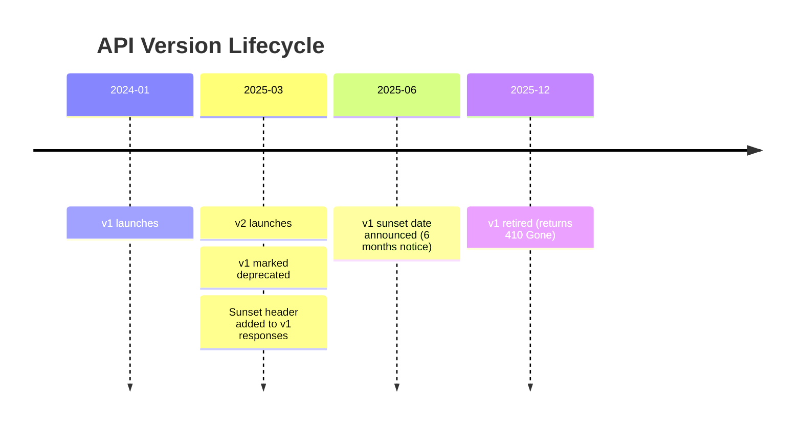

# 🔢 API Versioning

> [!abstract] TL;DR
> API versioning lets you evolve your API without breaking existing clients. The core idea: once a contract is public, honour it. Version when you must break it. The most common approach is URL path versioning (`/v1/`, `/v2/`) — visible, cacheable, and easy to test.

## Intuition — analogy FIRST

Think of a versioned API like a real estate lease. Your tenant (API client) signed a contract for apartment 1B. You can renovate apartment 2B however you like. You cannot tear out your tenant's kitchen mid-lease. When their lease ends (sunset date), they must move — but you gave them plenty of notice.

Old clients keep living in `/v1`. New clients move into `/v2`. Both work simultaneously until you retire `/v1`.

## How It Works

### The Four Versioning Approaches

| Approach | Example | Pros | Cons |
|---|---|---|---|
| URL path | `GET /v2/users` | Visible, cacheable, easy to test in browser | "Dirty" URLs |
| Query parameter | `GET /users?version=2` | Flexible, no URL change | Less explicit, ignored by some proxies |
| Request header | `API-Version: 2` | Clean URLs | Hard to test in browser/curl |
| Accept header | `Accept: application/vnd.myapp.v2+json` | True content negotiation (RFC standard) | Verbose, complex routing |

> [!note] Industry standard
> URL path versioning is used by Stripe (`/v1/charges`), Twitter/X (`/2/tweets`), GitHub (`/v3/`), and Twilio. It wins on discoverability and caching.

### Semantic Versioning for APIs

APIs typically use a **major version only** in the path (`v1`, `v2`). Minor/patch changes are non-breaking and transparent to callers.

- **Breaking change → bump major version** (`v1` → `v2`)
- **Non-breaking change → no new version needed**

### Breaking vs Non-Breaking Changes

| Change Type | Breaking? | Example |
|---|---|---|
| Add optional request field | No | New optional `?filter=` param |
| Add new response field | No (if clients ignore unknowns) | New `"metadata": {}` in response |
| Remove a field | **Yes** | Dropping `"phone"` from user response |
| Rename a field | **Yes** | `"user_id"` → `"id"` |
| Change field type | **Yes** | `"price": "10.00"` → `"price": 10.00` |
| Change HTTP status code | **Yes** | `200` → `201` on create |
| Remove an endpoint | **Yes** | `DELETE /v1/users/{id}` removed |
| Add a required request field | **Yes** | New required body field |

### Deprecation Strategy

```
Announcement → Sunset date published → Sunset header added → Version retired
```

HTTP `Sunset` header (RFC 8594) signals the retirement date to clients:

```
Sunset: Sat, 01 Jan 2027 00:00:00 GMT
Deprecation: true
Link: <https://api.example.com/v2/users>; rel="successor-version"
```

### Version Lifecycle



## Real-World Systems

- **Stripe** — `POST /v1/charges` — has maintained `/v1` since 2011. They never break it; they just add.
- **Twitter/X API v2** — new endpoint tree `/2/tweets`, `/2/users` alongside legacy `/1.1/`.
- **GitHub REST API** — uses `Accept: application/vnd.github.v3+json` (header versioning) in addition to path versioning for feature previews.
- **Salesforce** — numeric versions in path: `/services/data/v58.0/sobjects/`.

## Trade-offs

| Dimension | URL Path | Query Param | Header |
|---|---|---|---|
| Cacheability | Excellent (distinct URLs) | Good | Poor (Vary header needed) |
| Developer experience | Best | Good | Worst |
| Proxy/CDN support | Full | Partial | Limited |
| URL cleanliness | Worse | Medium | Best |
| Discoverability | Best | Good | Poor |

## When to Use vs Avoid

**Use API versioning when:**
- You have external/public consumers you cannot coordinate a simultaneous deploy with.
- You need to make breaking schema changes.
- You are building a platform API (SDK users depend on stability).

**Avoid over-versioning when:**
- Internal APIs where all clients deploy together (just coordinate the change).
- Very early product stage (pre-v1 iteration is fine without versions).
- Non-breaking additions — these never require a new version.

## Common Pitfalls

1. **Version too early** — creating `v2` for a field rename that could be handled non-breakingly.
2. **No sunset policy** — `v1` runs forever; operational burden accumulates.
3. **Inconsistent versioning** — some endpoints versioned, others not.
4. **Breaking changes in minor updates** — treating `v1.1` as non-breaking when it is.
5. **No migration guide** — clients can't upgrade without documentation of what changed.
6. **Copy-paste versioning** — duplicating entire controllers instead of routing at a single adapter layer.

## Related Concepts

- [[_MOC_API_Gateway|↑ Section MOC]]
- [[REST]] — versioning only applies when the contract is public; REST principles guide what counts as a contract
- [[API_Gateway]] — the gateway is where version routing logic lives
- [[Webhooks]] — webhooks also need versioning; event payload schema changes break consumers
- [[Rate_Limiting]] — rate limits may differ between API versions

## Review Questions

1. Your team wants to rename the `email` field to `email_address` in the `/v1/users` response. Is this a breaking change? What are your options without bumping to v2?
2. Compare URL path versioning vs Accept header versioning. In which scenarios would Accept header versioning be preferred, and what operational complexity does it introduce?
3. A client is still on your deprecated `/v1` API three months before the sunset date. What mechanisms (technical and communication) do you have to encourage migration?

## Sources

- [Stripe API versioning docs](https://stripe.com/docs/api/versioning)
- [RFC 8594 — The Sunset HTTP Header Field](https://www.rfc-editor.org/rfc/rfc8594)
- [GitHub API versioning](https://docs.github.com/en/rest/overview/api-versions)
- Kleppmann, M. — *Designing Data-Intensive Applications*, Ch. 4 (Encoding and Evolution)

#SystemDesign #API #Versioning #REST #BackwardCompatibility
