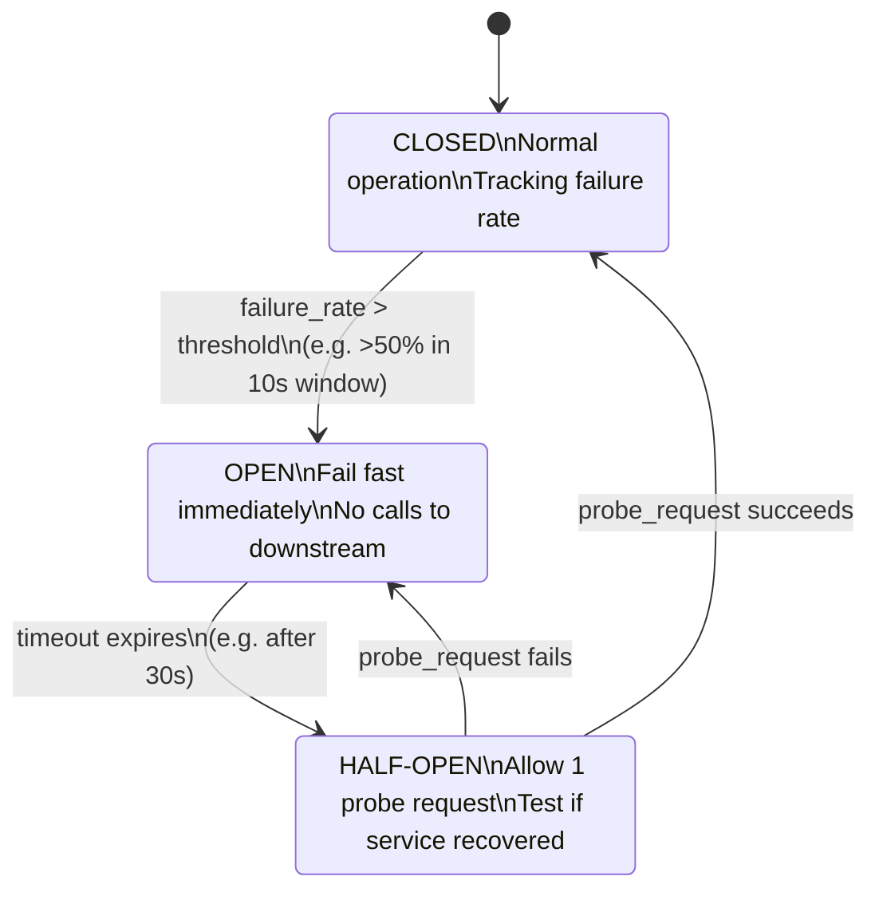

# ⚡ Circuit Breaker

> [!abstract] TL;DR
> A Circuit Breaker monitors calls to a downstream service and, when failures exceed a threshold, "opens the circuit" to fail fast and prevent cascading failures — then probes for recovery before resuming normal traffic.

## Intuition

Think about the **electrical circuit breaker** in your home's fuse box. When a fault (short circuit, overload) occurs, the breaker trips — it opens the circuit immediately rather than letting electricity flow into the fault, which would cause a fire. Once the fault is fixed, you flip the breaker back: it closes the circuit and power flows again.

Software circuit breakers work the same way. When calls to a downstream service start failing (the fault), the breaker "trips" — it stops sending requests to that service immediately instead of queuing them up and making the caller wait. This:
1. Gives the failing service time to recover (no more load from you)
2. Gives your callers fast error responses instead of slow timeouts
3. Prevents a single failing dependency from taking down your entire system

### Formal Definition

The Circuit Breaker is a **resilience design pattern** that wraps calls to an external service in a proxy that monitors for failures. When failures exceed a configured threshold, the proxy "opens" — calls return immediately with an error (fail fast) without reaching the downstream service. After a timeout, the breaker enters a probe state to test if the service has recovered.

## How It Works

### The Three States



#### Closed (Normal)

- All requests flow through to the downstream service.
- The breaker tracks outcomes: success, failure, timeout.
- Failure rate is calculated over a sliding time window (e.g., last 10 seconds) or a minimum request volume (e.g., at least 20 calls).
- When `failure_rate > threshold` (e.g., 50%), the breaker **opens**.

#### Open (Failing Fast)

- All requests are immediately rejected with a pre-defined fallback error — no network call is made.
- The downstream service gets zero load, giving it breathing room to recover.
- After a configured **timeout** (e.g., 30 seconds), the breaker transitions to Half-Open.

#### Half-Open (Testing Recovery)

- One "probe" request is allowed through to the downstream service.
- If the probe **succeeds**: breaker closes, normal traffic resumes.
- If the probe **fails**: breaker opens again, timeout resets.

### Configuration Parameters

| Parameter | Typical Value | Description |
|---|---|---|
| `failure_threshold` | 50% | % failures in window that trips the breaker |
| `min_requests` | 20 | Minimum calls before evaluating failure rate |
| `window_size` | 10 seconds | Rolling window for failure rate calculation |
| `open_timeout` | 30 seconds | How long to stay Open before probing |
| `half_open_max_calls` | 1–5 | Probe requests allowed before deciding |

### Fallback Strategies

When the circuit is Open, your code needs a fallback:
- **Return cached/stale data** — "show last known inventory count"
- **Return a default/empty response** — "return empty recommendations list"
- **Fail fast with a clear error** — `503 Service Unavailable` with `Retry-After`
- **Queue for later processing** — write to a durable queue, process when service recovers
- **Use a secondary/degraded service** — route to a backup endpoint

### Code Concept (Pseudocode)

```python
class CircuitBreaker:
    state = CLOSED
    failure_count = 0
    last_failure_time = None

    def call(self, fn, *args):
        if self.state == OPEN:
            if time_since(self.last_failure_time) > open_timeout:
                self.state = HALF_OPEN
            else:
                return fallback_response()   # fail fast

        try:
            result = fn(*args)
            self.on_success()
            return result
        except Exception as e:
            self.on_failure()
            raise e

    def on_success(self):
        self.failure_count = 0
        self.state = CLOSED

    def on_failure(self):
        self.failure_count += 1
        self.last_failure_time = now()
        if self.failure_count >= threshold:
            self.state = OPEN
```

## Real-World Systems

- **Netflix (Hystrix)** — Netflix pioneered production use of the circuit breaker pattern with Hystrix, wrapping every inter-service call. A slow Recommendation Service would trip its breaker, and the fallback returned a default list of popular movies instead of blocking the entire homepage render. Hystrix is now in maintenance mode, succeeded by Resilience4j.
- **Resilience4j** — The modern Java successor to Hystrix. Used across microservices at companies like Zalando and ING Bank. Supports count-based and time-based sliding window modes.
- **AWS App Mesh / Envoy** — Service mesh proxy implements circuit breaking at the infrastructure layer so application code doesn't need to. Configured via outlier detection policies.
- **Istio** — Kubernetes service mesh with built-in circuit breaking via `DestinationRule` outlier detection — automatically ejects unhealthy endpoints from load balancing pools.
- **Azure** — Azure's guidance explicitly recommends the circuit breaker pattern for all inter-service calls, with Application Gateway providing upstream health checks.

## Trade-offs

| Advantage | Disadvantage |
|-----------|-------------|
| Prevents cascading failures — one slow service can't take down the whole system | Adds complexity: fallback logic must be written and maintained for every protected call |
| Fail-fast improves user response time vs. waiting for timeout | False positives: a brief spike in errors (e.g., a 2s DB blip) may trip the breaker unnecessarily |
| Gives failing services time to recover by reducing their load | State must be shared across service instances (distributed state adds infrastructure) |
| Centralizes resilience policy separate from business logic | Misconfigured thresholds cause either too-frequent tripping or too-slow detection |
| Provides a clear signal for observability (breaker open = downstream degraded) | Half-Open probing adds a probe period before full recovery — some requests still fail |

## When to Use vs Avoid

**Use when:**
- Making synchronous calls to any external or downstream service that can fail or become slow.
- Protecting critical user-facing flows from cascading failure (e.g., payment flow calling fraud detection).
- The downstream service recovers on its own eventually and you want automatic restoration.
- Any microservices architecture where one slow service should not block all callers.

**Avoid when:**
- The "failure" is actually a business error (e.g., 404 Not Found for a missing resource) — don't count these as circuit breaker failures.
- The operation is idempotent and retrying immediately is safe — a simple retry with exponential backoff may be sufficient.
- Calling a database you own and fully control — use connection pool limits and query timeouts instead.

## Common Pitfalls

1. **Counting the wrong errors** — 4xx responses (client errors like 400, 404) should not count as failures in the circuit breaker. Only count 5xx, timeouts, and connection failures.
2. **No fallback = silent data loss** — opening the circuit without a fallback just converts slow failures into fast failures. Define what the caller should do in each open-circuit scenario.
3. **Single breaker for all endpoints** — a circuit breaker on a whole service trips even if only one endpoint is unhealthy. Use per-route or per-operation breakers.
4. **Shared state not distributed** — each app instance maintaining its own breaker state means 10 instances each need 10 failures before any trips. Use shared state (Redis, service mesh) or coordinate via health checks.
5. **Ignoring the Half-Open to Closed transition latency** — after recovery, the system is still in Half-Open until a probe succeeds. Don't immediately flood the service once the breaker enters Half-Open.

## Related Concepts

- [[API_Gateway]]
- [[Rate_Limiting]]
- [[Microservices]]
- [[Load_Balancers]]

## Review Questions

1. Describe the three states of a circuit breaker and what triggers transitions between them.
2. Why is the Half-Open state necessary? What would happen if you went directly from Open to Closed after a timeout?
3. A circuit breaker has a 50% failure threshold over a 10-second window with a minimum of 20 requests. The service receives 10 requests in 10 seconds, all of which fail. Does the breaker open? Why or why not?
4. What is a "retry storm" and how does a circuit breaker (combined with exponential backoff) prevent it?
5. You're using Hystrix (or Resilience4j) to protect a payment service call. Define what your fallback behavior should be and justify the choice.

## Sources

- [Martin Fowler — Circuit Breaker Pattern](https://martinfowler.com/bliki/CircuitBreaker.html)
- [Netflix Hystrix Wiki](https://github.com/Netflix/Hystrix/wiki)
- [Resilience4j Docs](https://resilience4j.readme.io/docs/circuitbreaker)
- [Microsoft Azure Architecture — Circuit Breaker Pattern](https://learn.microsoft.com/en-us/azure/architecture/patterns/circuit-breaker)
- [Istio Circuit Breaking](https://istio.io/latest/docs/tasks/traffic-management/circuit-breaking/)

#SystemDesign #CircuitBreaker #Resilience #CascadingFailures #Microservices #Hystrix #Resilience4j
