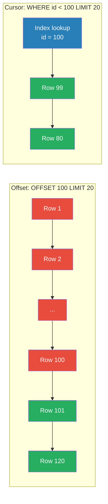

# 📄 Pagination Patterns

> [!abstract] TL;DR
> Pagination controls how large result sets are delivered in chunks. Three main patterns: offset (simple, gets slow), cursor (consistent, O(log n)), keyset (fastest for large data). For anything beyond small datasets or admin panels, use cursor or keyset pagination.

## Intuition — analogy FIRST

Imagine a library with a million books sorted by acquisition date.

- **Offset pagination** is like saying "skip the first 50,000 books, then hand me the next 20." The librarian still has to walk past 50,000 books every single time.
- **Cursor pagination** is like using a bookmark. You hand the librarian your bookmark and say "continue from here." They open right to that page.
- **Keyset pagination** is the same bookmark idea, but the bookmark is the actual book's ISBN — the librarian can jump directly to that shelf using the index.

## How It Works

### 1. Offset Pagination

```
GET /posts?offset=100&limit=20
```

Database query:
```sql
SELECT * FROM posts ORDER BY created_at DESC LIMIT 20 OFFSET 100;
```

The DB must scan and discard the first 100 rows on every request.

**Problems:**
- **Performance degrades at large offsets** — `OFFSET 1000000` forces the DB to read 1,000,020 rows to return 20.
- **Page drift** — if a new post is inserted while the user is paginating, every subsequent page shifts by one. Users may see duplicates or miss items.

**When to use:** Small datasets (< 10k rows), admin panels with random-access navigation ("jump to page 47"), reports where exact reproducibility is not required.

---

### 2. Cursor-Based Pagination

```
GET /posts?cursor=eyJpZCI6MTAwfQ==&limit=20
```

The cursor is a **base64-encoded opaque pointer** to a position. Typically it encodes the last-seen ID or (ID, timestamp) tuple.

```json
// Decoded cursor: {"id": 100, "created_at": "2026-07-01T12:00:00Z"}
```

Database query:
```sql
SELECT * FROM posts
WHERE id < 100           -- "continue after this ID"
ORDER BY id DESC
LIMIT 20;
```

Response format:
```json
{
  "data": [...],
  "pagination": {
    "next_cursor": "eyJpZCI6ODB9",
    "has_more": true
  }
}
```

Return `"next_cursor": null` on the last page.

**Why it works:**
- DB uses the index on `id` — O(log n) lookup, no scan.
- New inserts do not shift pages — the cursor anchors position by value, not by count.
- Consistent results even under concurrent writes.

**Limitation:** No random access (cannot jump to page 47). Only forward (and sometimes backward) navigation.

---

### 3. Keyset Pagination

Keyset is cursor pagination where the "cursor" is the actual column values rather than an opaque token:

```
GET /posts?after_id=100&after_created_at=2026-07-01T12:00:00Z&limit=20
```

```sql
SELECT * FROM posts
WHERE (created_at, id) < ('2026-07-01T12:00:00Z', 100)
ORDER BY created_at DESC, id DESC
LIMIT 20;
```

Requires a **[[Database_Indexes|composite index]]** on `(created_at DESC, id DESC)` for O(log n) performance.

**Advantage over cursor:** The WHERE clause is transparent — no base64 encoding needed. Marginally faster because there's no cursor decode step.

**Limitation:** Exposes sort-column values in the URL (potential information leakage). Cursor pagination hides this behind the opaque token.

---

### Comparison



| Dimension | Offset | Cursor | Keyset |
|---|---|---|---|
| DB query cost | O(offset + limit) | O(log n + limit) | O(log n + limit) |
| Page drift on inserts | Yes | No | No |
| Random page access | Yes | No | No |
| Implementation complexity | Low | Medium | Medium |
| URL transparency | Column values hidden | Opaque token | Column values exposed |
| Bi-directional navigation | Easy | Requires prev_cursor | Possible |

## Real-World Systems

- **GitHub API** — cursor-based: `GET /repos/{owner}/{repo}/commits?per_page=30&cursor=abc123`
- **Twitter/X timeline** — cursor-based with `since_id` and `max_id` (keyset on tweet ID, a snowflake ID that encodes time)
- **Stripe API** — cursor-based: `GET /v1/charges?starting_after=ch_xxx&limit=10`
- **Facebook Graph API** — cursor-based with `before`/`after` tokens in paging envelope
- **Elasticsearch** — uses `search_after` (keyset) for deep pagination at scale

## Trade-offs

| Scenario | Best Choice |
|---|---|
| Admin panel, small table (< 50k rows) | Offset |
| Real-time feed (tweets, notifications) | Cursor |
| Report export (millions of rows) | Keyset |
| User-facing infinite scroll | Cursor |
| "Jump to page N" requirement | Offset (only option) |

## When to Use vs Avoid

**Use cursor/keyset when:**
- Dataset is large (> 100k rows) or growing.
- Data is inserted/deleted frequently (feeds, activity logs).
- You only need sequential forward/backward navigation.
- You care about query latency at deep pages.

**Use offset when:**
- Random page access is required ("Go to page 47").
- Dataset is small and stable.
- You need a total page count in the UI.
- Simplicity matters more than performance.

## Common Pitfalls

1. **Using offset on large tables** — `OFFSET 500000` will timeout in production.
2. **Exposing cursor internals** — clients should treat cursors as opaque strings. Never parse them.
3. **Cursor without an index** — cursor pagination only helps if the WHERE column is indexed.
4. **Missing `has_more` flag** — clients need to know when to stop fetching.
5. **No tie-breaking on cursor** — if multiple rows share the same sort value (e.g., same `created_at`), cursor must include a secondary unique column (usually `id`) to avoid skipping rows.
6. **Mutable sort keys** — if a user can update the `updated_at` field used as the cursor, rows can shift between pages.

## Related Concepts

- [[_MOC_API_Gateway|↑ Section MOC]]
- [[REST]] — pagination is a core REST list-endpoint concern
- [[API_Versioning]] — changing pagination strategy from offset to cursor is a breaking change
- [[API_Gateway]] — gateway can enforce max `limit` values to prevent abuse

## Review Questions

1. A client reports they are seeing duplicate posts when scrolling through a feed. The feed uses offset pagination. Explain why this happens and how switching to cursor pagination fixes it.
2. Your posts table has 50 million rows sorted by `created_at`. A query with `OFFSET 10000000 LIMIT 20` takes 8 seconds. What pagination strategy would you use instead? Write the SQL query and describe the required index.
3. A product manager wants a UI that lets users "jump to any page." You are using cursor pagination. What are your options? What trade-off does each option carry?

## Sources

- [Stripe API pagination docs](https://stripe.com/docs/api/pagination)
- [GitHub API pagination](https://docs.github.com/en/rest/guides/using-pagination-in-the-rest-api)
- [Use the Index, Luke — Pagination](https://use-the-index-luke.com/no-offset)
- [Slack API cursor-based pagination](https://api.slack.com/docs/pagination)

#SystemDesign #API #Pagination #CursorPagination #Database #REST
