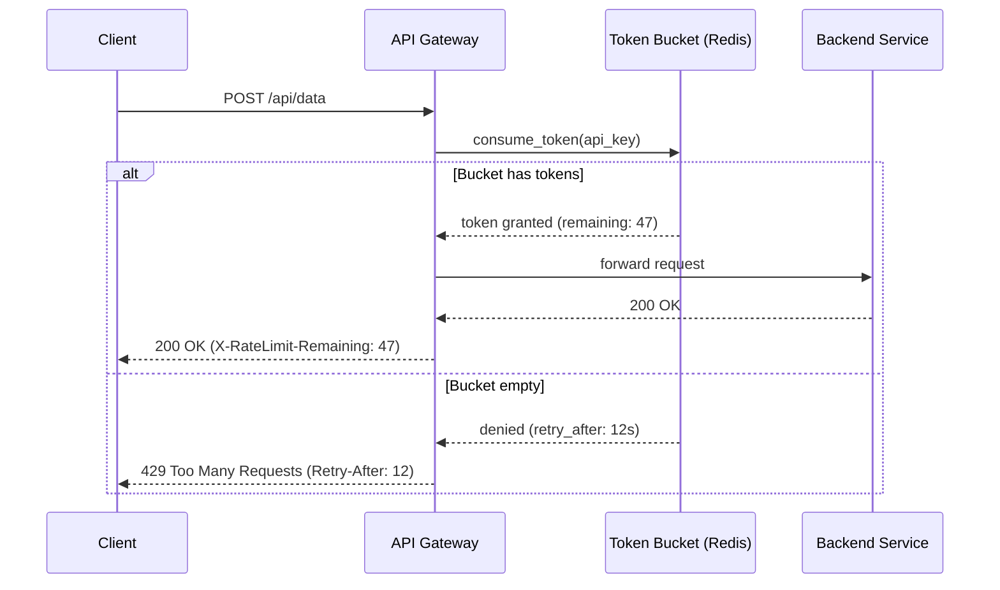

# 🚦 Rate Limiting

> [!abstract] TL;DR
> Rate limiting controls how many requests a client can make in a time window, protecting services from abuse and overload by returning 429 Too Many Requests when limits are exceeded.

## Intuition

Imagine a highway on-ramp during rush hour. Without metered signals, every car floods the highway at once and traffic grinds to a halt. With **ramp metering** — a traffic light that lets one car through every few seconds — flow on the highway stays smooth even when demand spikes.

Rate limiting is that ramp meter. It doesn't block all traffic, just ensures no single source overwhelms the system. Each client (API key, IP address, user) gets an allocation; exceed it and you wait or get rejected.

### Formal Definition

Rate limiting is a technique to **control the rate of requests** a client or service can make within a defined time window. It protects backend services from intentional abuse (DDoS, credential stuffing), unintentional overuse (buggy clients in a retry storm), and ensures fair resource distribution across all clients.

## How It Works

### The Five Algorithms

#### 1. Token Bucket (most common)

A bucket holds up to `capacity` tokens. Tokens are added at `refill_rate` tokens/second. Each request consumes 1 token. If the bucket is empty, the request is rejected.

- **Allows bursts** up to bucket capacity.
- **Smooth average rate** enforced over time.
- Used by: AWS, Stripe.

#### 2. Leaky Bucket

Requests enter a queue and are processed (leak out) at a **fixed constant rate** regardless of input rate. If the queue overflows, requests are dropped.

- **Strict output rate** — no bursts in output.
- Good for smoothing traffic sent to a downstream service.
- Implemented as a FIFO queue with a fixed-rate drainer.

#### 3. Fixed Window Counter

Divide time into fixed windows (e.g., each minute). Keep a counter per window. If counter exceeds limit, reject. Counter resets at window boundary.

- **Boundary burst problem**: a client can send `limit` requests at 11:59:59 and `limit` more at 12:00:01 — 2× the limit in 2 seconds.
- Simple and memory-efficient.

#### 4. Sliding Window Log

Store a timestamp log for each request. On each new request, remove timestamps older than the window. If log size < limit, allow. Otherwise, reject.

- **Accurate** — no boundary burst problem.
- **Memory-heavy** — stores every request timestamp per user.
- Used when precision matters more than memory.

#### 5. Sliding Window Counter (Hybrid — practical)

Combines fixed window counters with a weighted approximation of the previous window:

```
approx_count = prev_window_count × (1 - elapsed_fraction) + curr_window_count
```

- **Low memory** (only 2 counters per key).
- **Accurate enough** — typically within ~0.003% error vs. sliding log.
- Cloudflare uses this approach.

### Algorithm Comparison

| Algorithm | Burst Allowed | Memory | Accuracy | Complexity |
|---|---|---|---|---|
| Token Bucket | Yes | Low | High | Medium |
| Leaky Bucket | No | Low | High (output) | Medium |
| Fixed Window | Yes (boundary) | Very Low | Low | Low |
| Sliding Window Log | No | High | Very High | Medium |
| Sliding Window Counter | Minor | Low | High | Medium |

### Implementation: Distributed Rate Limiting with Redis

Single-server in-process counters break in a multi-instance deployment. The standard solution uses **Redis** (single-threaded, atomic operations):

**Token Bucket in Redis (Lua script for atomicity):**
```
FUNCTION check_rate_limit(key, capacity, refill_rate):
    tokens, last_refill = GET key
    now = current_timestamp()
    refilled = (now - last_refill) × refill_rate
    tokens = min(capacity, tokens + refilled)
    IF tokens >= 1:
        SET key (tokens - 1, now)
        RETURN ALLOW
    ELSE:
        RETURN DENY
```

**Fixed Window with Redis INCR:**
```
key = "rl:{user_id}:{window_start}"
count = INCR key
IF count == 1: EXPIRE key window_size
IF count > limit: RETURN 429
```

### Partitioning Strategies

- **Per API Key** — most common for public APIs; isolates each integrator.
- **Per IP** — protects unauthenticated endpoints; can penalize shared IPs (NAT, corporate networks).
- **Per User ID** — accurate but requires auth before rate check.
- **Per Endpoint** — different limits for cheap vs. expensive operations (e.g., `GET /users` = 1000/min, `POST /payments` = 10/min).
- **Global** — protect total system capacity regardless of caller.

### Response Headers

When rate limiting, return informative headers:

```
HTTP/1.1 429 Too Many Requests
Retry-After: 30
X-RateLimit-Limit: 100
X-RateLimit-Remaining: 0
X-RateLimit-Reset: 1753516800
```



## Real-World Systems

- **Stripe** — 100 requests/second per API key (live mode); 25/second (test mode). Uses token bucket. Exceeding returns `429` with `Retry-After`.
- **GitHub API** — 5,000 requests/hour for authenticated users; 60/hour unauthenticated. Fixed window with sliding approximation.
- **Twitter/X API** — 300 requests per 15-minute window for most endpoints; per-app and per-user limits independently tracked.
- **Cloudflare** — Sliding window counter implementation described in their engineering blog; runs at edge across 300+ PoPs.
- **AWS API Gateway** — Supports throttling at account, stage, and per-method level using token bucket.

## Trade-offs

| Advantage | Disadvantage |
|-----------|-------------|
| Protects services from intentional and accidental overload | Legitimate burst traffic can be incorrectly throttled |
| Ensures fair resource distribution across all clients | Distributed rate limiting adds Redis as a dependency (latency + operational cost) |
| Provides a clear SLA signal to API consumers | Fixed window counters allow boundary bursts — must choose algorithm carefully |
| Reduces infrastructure costs by capping peak load | Too-aggressive limits frustrate developers and hurt adoption |
| Enables tiered pricing models (free vs. paid rate limits) | Shared IPs (corporate NAT) punish innocent users when limiting by IP |

## When to Use vs Avoid

**Use when:**
- Exposing any public or partner-facing API where abuse is possible.
- Protecting expensive backend operations (ML inference, payment processing) from runaway loops.
- Implementing multi-tier pricing (free tier = 100 req/day, paid = 10,000 req/day).
- Any endpoint without authentication that could be hit by scrapers or bots.

**Avoid when:**
- Internal service-to-service calls within a trusted network where you control all callers — use back-pressure or circuit breakers instead.
- Your traffic is inherently low and bounded (internal tools with 5 users).

## Common Pitfalls

1. **Race conditions without atomic operations** — non-atomic check-then-increment lets concurrent requests all pass the check before any increments. Use Redis Lua scripts or `INCR` + `EXPIRE` atomically.
2. **Not handling Redis downtime** — if Redis is down, should you fail open (allow all) or fail closed (reject all)? Fail open is safer for availability; fail closed for security-sensitive APIs. Make this decision explicitly.
3. **Ignoring `Retry-After`** — clients that immediately retry on 429 without backing off create a retry storm. Document and enforce `Retry-After` in your API contract.
4. **Global-only limits** — a single slow endpoint can exhaust the global quota and block fast endpoints. Use per-endpoint limits.
5. **Not communicating limits to developers** — undocumented limits cause confusion. Always expose `X-RateLimit-*` headers and document limits in your API reference.

## Related Concepts

- [[_MOC_API_Gateway|↑ Section MOC]]
- [[API_Gateway]]
- [[Circuit_Breaker]]
- [[Back_Pressure]]
- [[Load_Balancers]]

## Review Questions

1. Explain the "boundary burst" problem with Fixed Window Counter rate limiting. How does Sliding Window Counter solve it?
2. Why is a Redis-based distributed rate limiter necessary in a multi-instance deployment? What Redis commands make this atomic?
3. Compare Token Bucket and Leaky Bucket: which allows bursts, and when would you prefer each?
4. A client sends 100 requests in the last 5 seconds of a minute and 100 requests in the first 5 seconds of the next minute. Under a Fixed Window of 100 req/min, are both batches allowed? Would they be allowed under a Sliding Window Log?
5. Design a rate limiting scheme for a payments API that has two types of users: free (10 req/min) and paid (500 req/min), across a fleet of 50 API servers.

## Sources

- [Cloudflare Blog: How We Built Rate Limiting](https://blog.cloudflare.com/counting-things-a-lot-of-different-things/)
- [Stripe Rate Limiting Docs](https://stripe.com/docs/rate-limits)
- [GitHub REST API Rate Limiting](https://docs.github.com/en/rest/overview/rate-limits-for-the-rest-api)
- [Redis Rate Limiting Patterns](https://redis.io/learn/howtos/ratelimiting)
- [System Design Interview — Alex Xu, Chapter 4: Design a Rate Limiter]

#SystemDesign #RateLimiting #Throttling #TokenBucket #APIGateway #Redis
