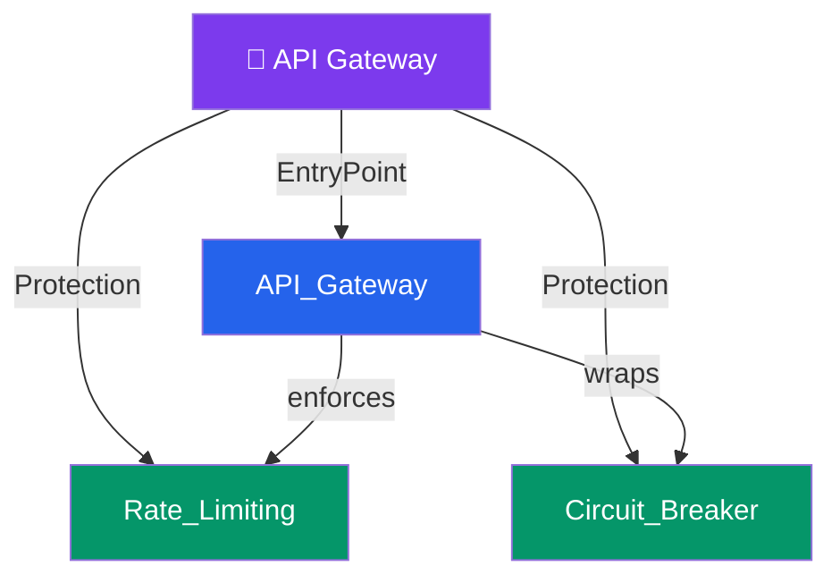

# 🚪 API Gateway — Map of Content

> [!abstract] What This Section Covers
> The API Gateway sits at the edge of your system, handling cross-cutting concerns so individual services don't have to: authentication, rate limiting, SSL termination, routing, and request transformation. This section also covers two essential resilience patterns — Rate Limiting to protect services from overload, and Circuit Breakers to prevent cascading failures across a dependency chain.

## Concept Map

## Learning Path

1. [[API_Gateway]] — What an API gateway does vs a load balancer: auth, routing, transformation, observability
2. [[Rate_Limiting]] — Algorithms (token bucket, leaky bucket, fixed window, sliding window) and where to enforce them
3. [[Circuit_Breaker]] — Closed/open/half-open state machine that stops cascading failures across service dependencies

## All Notes at a Glance

| Note | Summary | Difficulty |
|------|---------|------------|
| [[API_Gateway]] | Single entry point for all client requests — handles auth, SSL termination, routing, rate limiting, and request/response transformation | Intermediate |
| [[Rate_Limiting]] | Controls the request rate per client or service to protect backends from traffic spikes using token bucket, leaky bucket, or sliding window algorithms | Intermediate |
| [[Circuit_Breaker]] | Detects downstream failures and short-circuits calls to a failing service, allowing it to recover while returning fallback responses to callers | Intermediate |

## Key Questions This Section Answers

- What does an API Gateway do that a load balancer does not?
- How does a circuit breaker prevent cascading failures across a microservices dependency chain?
- What is the difference between a token bucket and a leaky bucket rate limiter?
- When should you enforce rate limiting at the API gateway vs within the service itself?
- What happens in the half-open state of a circuit breaker?
- How do API gateways support canary deployments and A/B routing?

## Related Sections

- [[_MOC_SystemDesign_Master|↑ System Design Master MOC]]
- [[_MOC_LoadBalancers]] — Load balancers handle traffic distribution; API gateways handle protocol-level concerns
- [[_MOC_Communication]] — API gateways front REST, gRPC, and GraphQL APIs
- [[_MOC_Security]] — Auth and TLS termination are core API gateway responsibilities

#MOC #SystemDesign
