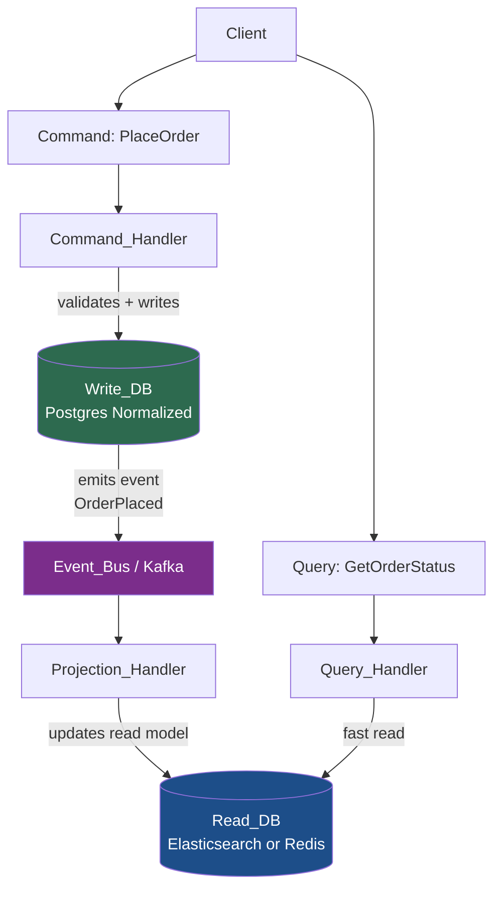

# ✂️ CQRS

> [!abstract] TL;DR
> Command Query Responsibility Segregation (CQRS) separates the **write model** (commands that mutate state) from the **read model** (queries that return data). The write side optimizes for consistency and business rule enforcement; the read side optimizes for query performance using denormalized projections. Both sides can scale independently, use different storage technologies, and evolve separately — at the cost of eventual consistency and increased system complexity.

---

## Intuition — analogy FIRST

Think of a large **restaurant kitchen** vs. the **menu board**.

When a customer places an order (command), it goes to the kitchen (write side). The kitchen updates its order tracker (write database — normalized, authoritative state) and calls out to the expediter: "Order 47 — steak, done." The expediter updates the **kitchen display board** (read model — a denormalized, query-optimized projection of what's ready). When the front-of-house staff asks "what's ready?" they look at the display board, not directly into the kitchen's order book.

The board might be slightly behind the kitchen (eventual consistency), but it's fast to read, formatted exactly for display, and never slows down the kitchen.

In plain CRUD, one model serves both — like having waitstaff run into the kitchen and flip through the order book every time a customer asks "is my food ready?"

---

## How It Works

### Core Separation

**Commands** — intent to change state:
- Verbs: `PlaceOrder`, `CancelShipment`, `UpdateUserProfile`
- Handled by a **Command Handler** that validates business rules, applies domain logic, and writes to the authoritative **Write DB**
- Returns: success/failure acknowledgment, not data
- Optimized for: consistency, business rule enforcement, transactional integrity

**Queries** — request to read state:
- Verbs: `GetOrderHistory`, `SearchProducts`, `GetUserDashboard`
- Handled by a **Query Handler** that reads directly from a **Read DB** (denormalized, pre-projected)
- Returns: data optimized for the caller's view
- Optimized for: performance, low latency, flexible shaping per use case

### Projection — Keeping the Read Side Synchronized

When a command succeeds, it emits events (or triggers change propagation). A **Projection** subscribes to these events and updates the read store accordingly. This is the bridge between write and read worlds.

### Storage Technology Choices

| Side | Common Choices | Reason |
|---|---|---|
| **Write DB** | PostgreSQL, MySQL, MongoDB | ACID transactions, normalized schema, business rule enforcement |
| **Read DB** | Elasticsearch | Full-text search, aggregations |
| | Redis | Sub-millisecond key-value lookups |
| | Cassandra | Wide-column, high read throughput |
| | DynamoDB | Scalable, low-latency reads at scale |
| | Materialized views in same DB | Simpler CQRS without separate store |

### CQRS Spectrum — How Far You Go

CQRS is not binary. Teams adopt it at different levels:

1. **Same DB, separate models** — one schema, but distinct read and write code paths (low complexity, modest benefit)
2. **Separate read models in same DB** — materialized views / denormalized tables alongside write tables
3. **Separate databases** — write DB + read DB, synced via events (full CQRS, highest benefit, highest complexity)
4. **CQRS + Event Sourcing** — write side stores events instead of current state; projections rebuild read models from event stream (maximum power, maximum complexity)

---

## Real-World Systems

| System / Company | CQRS Application |
|---|---|
| **Microsoft Azure** | CQRS is a first-class Azure Architecture Center pattern; used in Azure DevOps and Dynamics 365 |
| **Axon Framework** | Java framework that bakes in CQRS + Event Sourcing; used in banking and insurance systems |
| **E-commerce platforms** | Orders write to RDBMS for ACID guarantees; product catalog reads from Elasticsearch for faceted search |
| **Netflix** | Separate write path (update viewing history) from read path (personalized recommendation feed built from denormalized projections) |
| **Banking systems** | Account balance writes go through strict command validation; reporting dashboards read from denormalized analytics stores |

---

## Trade-offs

| Factor | Pro | Con |
|---|---|---|
| **Read scalability** | Read DB scales independently — optimize for query patterns | Separate DB means separate infrastructure cost |
| **Write scalability** | Write DB can be a simple normalized RDBMS — no query pressure | — |
| **Query flexibility** | Read model is shaped exactly for the consumer's needs | Every new query shape may require a new projection |
| **Consistency** | Write side is strongly consistent | Read side is **eventually consistent** — stale reads are possible |
| **Complexity** | Clean separation of concerns, simpler command handlers | Two models to maintain, projection synchronization logic, more moving parts |
| **Testing** | Commands and queries testable independently | Integration tests must cover projection pipeline |
| **Team fit** | Great for large teams with separate read/write owners | Overkill for small teams or simple domains — CRUD is better |

---

## When to Use vs. Avoid

**Use CQRS when:**
- Your system has a **significant read/write imbalance** (e.g., 100:1 read-to-write ratio) and reads need different optimization than writes.
- The **read model cannot be efficiently served** from the normalized write model (complex joins, full-text search, aggregations).
- You need to **scale reads and writes independently** (e.g., writes on a small transactional DB, reads on a distributed cache cluster).
- Your domain has **rich business rules** on the write side that are unrelated to query concerns.
- You are already implementing **[[Event_Sourcing]]** — CQRS pairs naturally with it.
- You have a **large team** that can own separate read and write surfaces.

**Avoid CQRS when:**
- Your application is **simple CRUD** — the complexity cost is not justified.
- Your team is **small** and cannot sustain two models + projection pipelines.
- **Eventual consistency is unacceptable** in your domain (e.g., a financial system where a user must immediately see the balance after a withdrawal — though even here, techniques exist).
- You are in **early product phases** — start simple, add CQRS when the pain is real.

---

## Common Pitfalls

1. **Applying CQRS everywhere** — not every bounded context needs it. Apply it selectively where read/write asymmetry actually exists.
2. **Ignoring eventual consistency** — users who submit a command and immediately query may see stale data. Design the UX to handle this (optimistic UI updates, "processing..." states).
3. **Projection lag** — if the projection pipeline falls behind, the read model is significantly stale. Monitor projection lag; alert when it exceeds SLA.
4. **Making commands return data** — commands should return acknowledgment, not query results. Returning data couples the two models and defeats the purpose.
5. **One giant read model** — creating a single "universal" read model defeats the purpose. Read models should be shaped per query/consumer.
6. **Skipping idempotency in projections** — events can be delivered more than once (at-least-once semantics). Projections must be idempotent (applying an event twice must produce the same result as applying it once).
7. **Treating CQRS as microservices** — CQRS is a within-service pattern. It does not require separate services, though it can be implemented that way.

---

## Related Concepts

- [[_MOC_EventDriven|↑ Section MOC]]
- [[Event_Sourcing]] — the natural write-side complement to CQRS; store events instead of current state
- [[Kafka]] — common event bus for propagating write-side events to read-side projections
- [[Consistency_Patterns]] — CQRS introduces eventual consistency; understand the trade-off space
- [[Databases]] — different databases for read and write sides is a key CQRS implementation choice
- [[Event_Driven_Architecture]] — CQRS fits naturally in event-driven systems
- [[Asynchronism]] — projection updates are inherently asynchronous

---

## Review Questions

1. **Consistency window:** A user submits a `PlaceOrder` command and is immediately redirected to an "Order Confirmation" page that queries the read model. The projection has a 2-second lag. What does the user see, and how would you design around this without violating CQRS principles?
2. **Projection design:** Your e-commerce system uses CQRS. A new requirement asks for a "top 10 products by revenue this week" dashboard that must refresh every 5 minutes. Walk through how you would design the projection: what events trigger it, what the read store looks like, and what storage technology you would choose.
3. **When NOT to use CQRS:** A startup with a 3-person engineering team is building a B2B SaaS application with ~500 users, standard CRUD operations, and no anticipated traffic spikes. A senior engineer proposes CQRS + Event Sourcing from day one. Argue against this proposal with specific trade-offs, and describe what simpler patterns they should use instead.

---

## Sources

- [Microsoft Azure Architecture Center — CQRS Pattern](https://learn.microsoft.com/en-us/azure/architecture/patterns/cqrs)
- [Martin Fowler — CQRS](https://martinfowler.com/bliki/CQRS.html)
- [Axon Framework Documentation](https://docs.axoniq.io/reference-guide/)
- [Designing Data-Intensive Applications — Martin Kleppmann (Chapter 11 & 12)](https://dataintensive.net/)
- [Greg Young — CQRS Documents](https://cqrs.files.wordpress.com/2010/11/cqrs_documents.pdf)

#SystemDesign #CQRS #Architecture #EventDriven #ReadWriteSeparation #AdvancedPatterns
