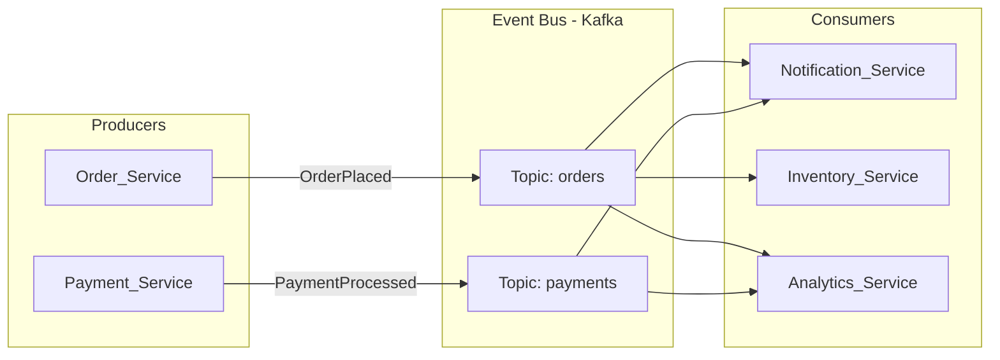

# ⚡ Event-Driven Architecture

> [!abstract] TL;DR
> Event-Driven Architecture (EDA) is a design paradigm where services communicate by **producing and consuming events** rather than making direct synchronous calls. Producers emit events without knowing who will consume them; consumers react independently. This creates loose coupling, natural fan-out, and high scalability — at the cost of eventual consistency, harder traceability, and invisible execution flows.

---

## Intuition — analogy FIRST

Think of a **radio broadcast tower**.

A radio station (producer) broadcasts a signal (event) on a frequency (topic). Every radio in range (consumer) tuned to that frequency receives the broadcast — the station does not know how many radios are listening, does not wait for them to respond, and does not care if they tune in 10 seconds late. A new listener can join at any time without the station changing anything.

The alternative — traditional synchronous calls — is like a **phone call**. The caller (service A) dials the receiver (service B) directly, waits for them to pick up, speaks, waits for a response, and only continues after the conversation ends. If B is busy or down, A is stuck.

EDA gives you the broadcast model. Services are decoupled in time, space, and identity.

---

## How It Works

### Three EDA Patterns

**1. Event Notification**
A service announces that something happened. Consumers may act on it — but the producer does not care what they do or whether they succeed. Fire and forget.

- Example: `OrderPlaced` event fired; Notification Service sends a confirmation email. Producer doesn't need to know the email was sent.
- Property: maximum decoupling, but no visibility into downstream effects.

**2. Event-Carried State Transfer**
The event contains **all the data** consumers need to act — no callback to the originating service required. Consumers are self-sufficient.

- Example: `UserProfileUpdated { userId, name, email, address, updatedAt }` contains the full updated profile. Consumers update their local cached copy without calling the User Service.
- Property: reduces inter-service calls at the cost of larger event payloads and potential data duplication.

**3. Event Sourcing**
The event log is the authoritative source of truth for state. Current state is derived by replaying events. See [[Event_Sourcing]] for a full treatment.

### Choreography vs. Orchestration

| Dimension | Choreography | Orchestration |
|---|---|---|
| **Control** | Distributed — each service decides what to do when it receives an event | Centralized — an orchestrator (saga/workflow) directs each step |
| **Coupling** | Low — services only know about events, not each other | Medium — orchestrator knows all participants |
| **Visibility** | Low — no single place to see the full flow | High — orchestrator tracks state |
| **Failure handling** | Complex — compensating events propagate failures | Explicit — orchestrator retries and compensates |
| **Example** | Order Service emits `OrderPlaced` → Payment, Inventory, Notification each react | Order Saga Service calls Payment, then Inventory, then Notification in sequence |
| **Best for** | Simple fan-out, loose coupling | Complex multi-step transactions (Saga pattern) |

### Schema Registry — Governing Event Schemas

In an EDA with many producers and consumers, event schema drift breaks consumers silently. A **Schema Registry** (e.g., Confluent Schema Registry with Avro) solves this:

1. Producers register the event schema before publishing.
2. Consumers validate events against the registered schema on consumption.
3. The registry enforces **compatibility rules** (backward, forward, or full compatibility) — preventing breaking schema changes.
4. **Avro** is a common serialization format: compact binary encoding, schema stored separately (efficient wire transfer).

### Exactly-Once Semantics — Why It's Hard

| Delivery Guarantee | Meaning | Risk |
|---|---|---|
| **At-most-once** | Message may be lost; never duplicated | Data loss |
| **At-least-once** | Message delivered at least once; may duplicate | Duplicate processing |
| **Exactly-once** | Delivered exactly once | Complex to implement; requires idempotency + transactions |

True exactly-once across distributed systems requires transactional coordination. Kafka's Transactions API provides exactly-once within Kafka. Cross-system exactly-once requires the **Outbox Pattern** (write event to DB in same transaction as state change, then reliably relay to event bus).

**Idempotency** is the practical solution: design consumers so that processing the same event twice produces the same result as processing it once.

> Each consumer subscribes to the topics it cares about independently. Order Service does not know Notification, Inventory, or Analytics exist.

### Distributed Tracing in EDA

Because there is no single call stack, tracing a request across services requires **distributed tracing**:
- Attach a **correlation ID / trace ID** to each event.
- Propagate the ID through all downstream events triggered by the original.
- Collect spans in a tracing backend (Jaeger, Zipkin, Datadog APM).
- Reconstruct the execution graph from spans.

Without distributed tracing, debugging EDA production issues is extremely difficult.

---

## Real-World Systems

| Company | EDA Application |
|---|---|
| **Amazon** | Virtually the entire order lifecycle runs on events — `OrderPlaced` triggers inventory reservation, payment processing, fulfillment, and notifications independently |
| **Uber** | Driver-rider matching: geolocation events from drivers flow to a matching engine that emits assignment events consumed by rider apps and driver apps |
| **Netflix** | Content pipeline: video upload events trigger encoding, thumbnail generation, metadata extraction, CDN distribution — all independent event consumers |
| **LinkedIn** | Activity feed, connection events, and recommendation updates are all event-driven; Kafka was built at LinkedIn for this purpose |
| **Airbnb** | Booking events fan out to calendar sync, host notification, payment processing, and fraud detection |

---

## Trade-offs

| Factor | Pro | Con |
|---|---|---|
| **Coupling** | Producers and consumers are decoupled in code, time, and space | No explicit contract between producer and consumer — schema drift is a risk |
| **Scalability** | Consumers scale independently; event bus buffers load spikes | Event bus can become a bottleneck if under-provisioned |
| **Fan-out** | One event naturally serves N consumers without producer changes | All consumers see all events; filtering logic pushed to consumers |
| **Resilience** | Producer continues if a consumer is down; consumers catch up via replay | Consumers can fall behind — lag management is operational overhead |
| **Consistency** | High availability via decoupling | Eventual consistency — no distributed transaction across consumers |
| **Observability** | Events create a natural audit trail | No obvious execution flow — distributed tracing required |
| **Debugging** | Can replay events to reproduce issues | Tracing causality across async boundaries is harder |
| **Changeability** | Add new consumers without changing producers | Removing consumers or changing event schemas requires coordination |

---

## When to Use vs. Avoid

**Use EDA when:**
- You have **decoupled microservices** that should not know each other's internals.
- You need **fan-out** — one event triggers multiple independent downstream actions.
- You need **async processing** — producer should not wait for slow consumers (email, analytics, fraud detection).
- You need **resilience** — producer continues working even when a consumer is temporarily down.
- You need **temporal decoupling** — consumers can process events at their own rate.
- You are building **event-driven pipelines** — content processing, data transformation, ETL.

**Avoid EDA when:**
- You need **strong consistency** — a synchronous transaction where all parties must succeed together (use distributed transactions or Saga pattern instead).
- Your flow is **inherently synchronous and simple** — a REST call that returns data immediately is simpler and more understandable.
- Your team lacks **observability tooling** — EDA without distributed tracing is a debugging nightmare.
- You have very **few services** — the overhead of an event bus is not justified for 2-3 services.
- **Request-response** is the dominant pattern — EDA adds complexity without benefit.

---

## Common Pitfalls

1. **No distributed tracing** — the most common EDA operational failure. Without correlation IDs and a tracing backend, you cannot reconstruct what happened across services.
2. **Schema drift** — producer changes an event schema; consumers break silently. Enforce schema registry with compatibility rules before you have more than 2 consumers.
3. **Ignoring consumer lag** — if a consumer falls behind, it will eventually process a backlog that may be stale or irrelevant. Monitor lag; define alert thresholds.
4. **Event as database** — storing critical state only in events without a projection. Use projections to maintain queryable state; the event bus is not a database.
5. **No idempotency** — at-least-once delivery is the norm. Every consumer must handle duplicate events without side effects.
6. **Choreography spaghetti** — as the number of services and events grows, choreography becomes impossible to reason about. Document event flows explicitly (AsyncAPI), and consider orchestration for complex multi-step flows.
7. **Synchronous patterns disguised as EDA** — calling a service and waiting for a reply event (pseudo-synchronous) eliminates EDA's benefits and adds complexity. Use HTTP/gRPC for synchronous flows.
8. **Fat events with too much data** — events that contain entire domain objects become a hidden coupling mechanism and inflate the event store. Include only what changed and what consumers need.

---

## Related Concepts

- [[_MOC_EventDriven|↑ Section MOC]]
- [[Kafka]] — the dominant event bus for EDA at scale; distributed, durable, replayable
- [[RabbitMQ]] — event bus for simpler EDA topologies with complex routing needs
- [[CQRS]] — a natural pattern within EDA; commands produce events that update read models
- [[Event_Sourcing]] — a specific pattern within EDA where the event log is the source of truth
- [[Microservices]] — EDA is the communication backbone of mature microservice architectures
- [[Asynchronism]] — EDA is the primary mechanism for asynchronous inter-service communication

---

## Review Questions

1. **Pattern identification:** You're designing a system where: (a) users can place orders, (b) the payment service must process the payment, (c) the inventory service must reserve stock, (d) the notification service must send a confirmation email, and (e) the analytics service must record the sale. Which of the three EDA patterns (notification, event-carried state transfer, event sourcing) best fits each downstream service, and why?
2. **Choreography failure handling:** In a choreography-based order flow, `OrderPlaced` triggers Payment which emits `PaymentFailed`. Inventory has already reserved stock based on `OrderPlaced`. How does the system undo the inventory reservation? Walk through the compensating event design, including what event Inventory listens to and what it emits.
3. **Schema evolution in production:** Your `OrderPlaced` event currently has `{ orderId, userId, items[], totalAmount }`. A new requirement needs `{ orderId, userId, items[], totalAmount, currency, shippingAddress }`. You have 12 consumers of this event in production. Describe a zero-downtime schema migration strategy, including: what schema compatibility rule to use, what to do with existing consumers, and how to handle the transition period.

---

## Sources

- [Martin Fowler — What do you mean by Event-Driven?](https://martinfowler.com/articles/201701-event-driven.html)
- [Martin Fowler — Event-Driven Architecture](https://martinfowler.com/tags/event%20architecture.html)
- [AsyncAPI Specification](https://www.asyncapi.com/) — OpenAPI for event-driven APIs
- [Confluent — Event-Driven Microservices](https://www.confluent.io/blog/journey-to-event-driven-part-1-why-event-first-thinking-changes-everything/)
- [Designing Data-Intensive Applications — Martin Kleppmann (Chapter 11)](https://dataintensive.net/)
- [AWS — Event-Driven Architecture](https://aws.amazon.com/event-driven-architecture/)

#SystemDesign #EventDrivenArchitecture #EDA #Microservices #Decoupling #Asynchronism #Architecture
