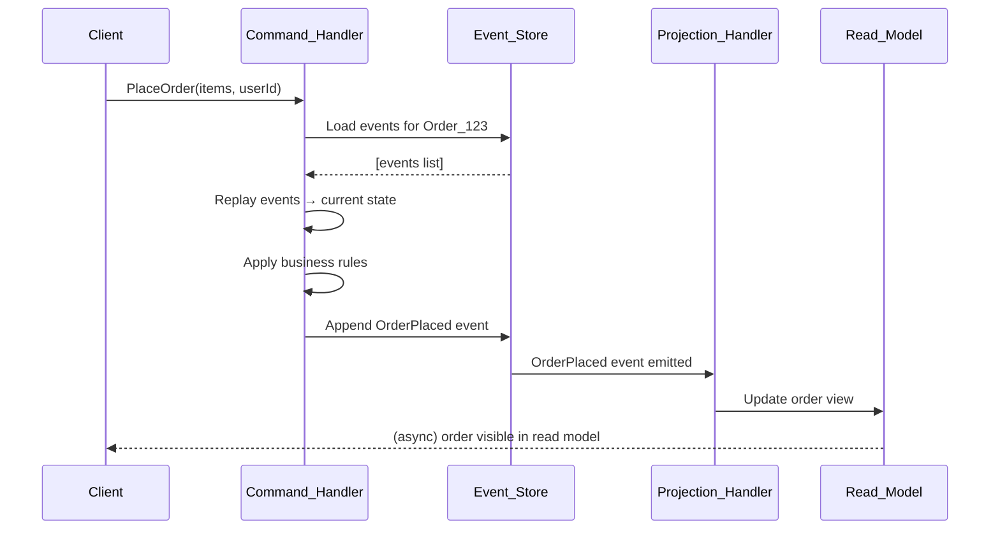

# 📜 Event Sourcing

> [!abstract] TL;DR
> Event Sourcing flips the data model: instead of storing the **current state** of an entity, you store the full **sequence of events** that led to that state. The current state is derived by replaying all events. This gives you a complete, immutable audit trail, time-travel debugging (replay to any point in the past), and natural integration with [[CQRS]] — at the cost of query complexity, event schema evolution challenges, and the need for snapshots at scale.

---

## Intuition — analogy FIRST

Think of **double-entry accounting ledgers**.

A bank does not store "Alice has $430." It stores every transaction:

```
+$1000  Salary deposit     2026-01-01
-$400   Rent               2026-01-05
-$170   Groceries          2026-01-12
+$0     ...
```

The balance ($430) is **derived** by summing all entries. You never overwrite a row — you only append. If there's a dispute, you can replay history to any date. You can audit every cent. You can ask "what was Alice's balance on January 10th?" by replaying up to that date.

Traditional CRUD is like a **whiteboard** — you erase and rewrite the current state. Event Sourcing is like a **ledger** — you only append, and the current state is always derivable from the log.

Git is another everyday example: every commit is an event. The current state of a file is the result of replaying all commits. You can `git checkout` to any past state. The commit log is the source of truth, not the working tree.

---

## How It Works

### Core Concepts

| Concept | Description |
|---|---|
| **Event** | An immutable fact that something happened. Past tense. `OrderPlaced`, `PaymentFailed`, `ItemShipped`. Contains all data needed to describe what happened. |
| **Event Store** | An append-only log of all events, ordered by time. The authoritative source of truth. |
| **Aggregate** | A domain entity (e.g., `Order`, `BankAccount`) that processes commands and emits events. Its current state is derived from its event history. |
| **Projection** | A read model built by replaying events. Different projections answer different questions from the same event stream. |
| **Snapshot** | A periodic checkpoint of an aggregate's state to avoid replaying millions of events on every load. |
| **Replay** | Re-processing all events from the beginning (or from a snapshot) to rebuild state or a projection. |

### State Derivation

Traditional model:
```
UPDATE accounts SET balance = 430 WHERE id = 'alice';
```

Event Sourced model:
```
INSERT INTO events (aggregate_id, type, data, timestamp) VALUES
  ('alice', 'MoneyDeposited', {amount: 1000}, '2026-01-01'),
  ('alice', 'MoneyWithdrawn', {amount: 400}, '2026-01-05'),
  ('alice', 'MoneyWithdrawn', {amount: 170}, '2026-01-12');

-- Current state = apply(fold) all events:
-- balance = 0 + 1000 - 400 - 170 = 430
```

### Snapshots for Performance

Replaying 10 million events per aggregate load is impractical. Snapshots solve this:

1. At a threshold (e.g., every 500 events), serialize the aggregate's current state as a snapshot.
2. On load: fetch the latest snapshot, then replay only events since that snapshot.
3. This bounds replay cost to a fixed window regardless of total history size.



### Rebuild and Replay

One of Event Sourcing's superpowers: you can rebuild any projection from scratch by replaying all events. This means:
- Bug in a projection? Fix the code and replay from the beginning to correct the read model.
- New business requirement? Create a new projection that answers a new question — no data migration needed.
- Temporal query? Replay up to a specific timestamp to know "what was the state on day X?"

---

## Real-World Systems

| System | How Event Sourcing Applies |
|---|---|
| **Banking systems** | Every deposit, withdrawal, and transfer is an event. The ledger IS the event store. Regulatory compliance demands immutable transaction history. |
| **Git** | Every commit is an event. The current file state is derived by replaying commits. `git log` is the event stream; `git checkout` is time travel. |
| **Accounting software** (QuickBooks, Xero) | Journal entries are append-only events. The trial balance is a projection. |
| **EventStoreDB** | Purpose-built open-source event store by Greg Young (who formalized Event Sourcing), with built-in projection support. |
| **Axon Framework** | Java/Kotlin framework for CQRS + Event Sourcing used in enterprise fintech and insurance. |
| **Amazon** | Shopping cart history and order lifecycle managed as event sequences for audit, support, and ML training. |

---

## Trade-offs

| Factor | Pro | Con |
|---|---|---|
| **Audit trail** | Complete, immutable history of every state change — built-in compliance | Storage grows unbounded without archiving strategy |
| **Time travel** | Replay to any point in time — debugging, temporal queries | Replaying millions of events is slow without snapshots |
| **New projections** | Create any new read model from existing events — zero data migration | Every new query shape requires building and maintaining a new projection |
| **Event schema evolution** | Events are immutable, but schemas change — hard to migrate old events | Upcasting (versioning events) adds complexity |
| **Debugging** | Full event history makes bugs reproducible | Complex to trace causality across aggregates and events |
| **Integration with CQRS** | Natural pairing — write side produces events, projections populate read side | Adds CQRS complexity on top of Event Sourcing complexity |
| **Eventual consistency** | Projections are updated asynchronously — high availability | Stale reads between event emission and projection update |
| **Snapshot maintenance** | Bounds replay time | Adds snapshot storage and invalidation logic |

---

## When to Use vs. Avoid

**Use Event Sourcing when:**
- You have **strict audit requirements** — regulators or business rules demand a complete history of every change (finance, healthcare, legal).
- You need **temporal queries** — "what was the state of this account on March 15th?"
- Your domain is **event-driven by nature** — state transitions are the most important business concepts.
- You are implementing **[[CQRS]]** and want the write side to be the event log rather than current state.
- You need to **rebuild read models** without rerunning business processes (projection replay).
- You want **zero-data-loss debugging** — the event log makes every production bug reproducible.

**Avoid Event Sourcing when:**
- You have **simple CRUD requirements** — adding Event Sourcing to a blog or simple form app is massive over-engineering.
- **No audit requirements** exist and you do not need temporal queries.
- Your team is **unfamiliar with the pattern** and the learning curve cost exceeds the benefit.
- You are at **small scale** — the operational overhead isn't justified.
- Your domain has **simple, stable state** that changes infrequently.

---

## Common Pitfalls

1. **Events named as CRUD operations** — `UserUpdated` is not an event. `UserEmailChanged` is. Events should capture business intent, not data changes.
2. **Fat events** — including too much data (entire object snapshot) in events inflates the store and couples schema to the event. Include only what changed and what caused it.
3. **Thin events** — including too little data forces consumers to call back for context, creating temporal coupling. Include all data needed to process the event independently.
4. **Ignoring event versioning** — events are immutable but your schema will change. Define an upcasting strategy (V1 → V2 migration on read) before you write your first event in production.
5. **No snapshot strategy** — aggregates with thousands of events become slow to load. Define snapshot thresholds before going to production.
6. **Querying the event store directly** — the event store is not a query engine. Always project into a read model for queries. Scanning 10M events to answer a query is an anti-pattern.
7. **Forgetting idempotency** — events may be replayed or delivered more than once. Projection handlers and command handlers must be idempotent (safe to apply twice).
8. **Treating projections as permanent** — projections are derived, not authoritative. They can always be rebuilt. Don't put critical business logic in projections; put it in command handlers.

---

## Related Concepts

- [[_MOC_EventDriven|↑ Section MOC]]
- [[CQRS]] — the natural pair; CQRS separates read/write models; Event Sourcing provides the write-side event log
- [[Kafka]] — commonly used as the event store or event bus; Kafka's log model shares Event Sourcing's append-only property
- [[Consistency_Patterns]] — Event Sourcing introduces eventual consistency in projections; understand BASE vs ACID
- [[Asynchronism]] — projection updates are inherently asynchronous; embrace eventual consistency
- [[Event_Driven_Architecture]] — Event Sourcing is a specific flavor of event-driven design
- [[Databases]] — choosing the right event store (EventStoreDB, Kafka, PostgreSQL append-only tables)

---

## Review Questions

1. **Event design:** A user changes their email address. Compare these two event designs: (a) `UserUpdated { userId, oldEmail, newEmail, updatedAt }` vs. (b) `UserEmailChanged { userId, newEmail, changedAt, reason }`. Which is better and why? What if later you need to enforce "only 3 email changes per year" — how does each design support or hinder this?
2. **Snapshot strategy:** An e-commerce aggregate (`Order`) accumulates events over its lifetime: `OrderCreated`, `ItemAdded` (repeated), `PromoApplied`, `PaymentAuthorized`, `ItemShipped` (repeated), `OrderCompleted`. A popular order from a B2B customer has 10,000 `ItemAdded` events. How does this affect load time, and what snapshot strategy would you implement? Where in the lifecycle would you trigger snapshots?
3. **Schema evolution:** Six months into production, you need to add a `currency` field to `MoneyDeposited` events (previously all amounts were assumed USD). You have 50 million existing `MoneyDeposited` events without the `currency` field. You cannot modify historical events. Describe the upcasting strategy you would implement so old events are handled correctly alongside new events.

---

## Sources

- [Martin Fowler — Event Sourcing](https://martinfowler.com/eaaDev/EventSourcing.html)
- [Greg Young — CQRS and Event Sourcing](https://cqrs.files.wordpress.com/2010/11/cqrs_documents.pdf)
- [EventStoreDB Documentation](https://developers.eventstore.com/)
- [Axon Framework — Event Sourcing Guide](https://docs.axoniq.io/reference-guide/axon-framework/events/event-sourcing)
- [Designing Data-Intensive Applications — Martin Kleppmann (Chapter 11)](https://dataintensive.net/)
- [Microsoft Azure — Event Sourcing Pattern](https://learn.microsoft.com/en-us/azure/architecture/patterns/event-sourcing)

#SystemDesign #EventSourcing #EventDriven #Architecture #AuditTrail #AppendOnly #AdvancedPatterns
