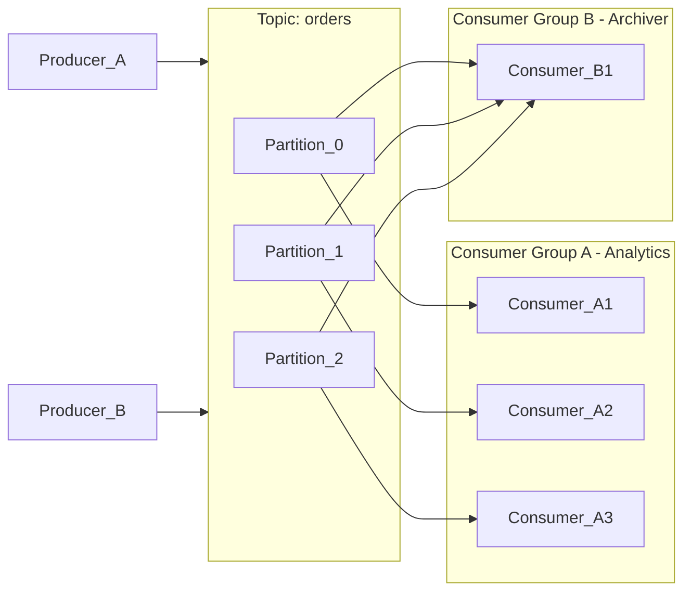

# 📨 Kafka

> [!abstract] TL;DR
> Apache Kafka is a distributed event streaming platform built around a durable, ordered, append-only log. Producers write events to named topics; consumers read at their own pace using offsets. Unlike traditional message queues, Kafka **retains** messages — enabling replay, parallel consumption by multiple independent consumer groups, and massive throughput through sequential disk writes, zero-copy transfers, and batching.

---

## Intuition — analogy FIRST

Think of Kafka as a **newspaper printing press**.

The press prints newspapers (events) and places them on a conveyor belt (topic). Every subscriber (consumer group) gets their own copy from the belt — the morning reader, the digital archive team, and the recycling crew all consume independently without interfering with each other. The belt retains the newspapers for a configured number of days (retention policy), so if the archive team arrives late, they can still catch up from where they left off. A traditional message queue, by contrast, is like a **single mailbox** — once the mail carrier delivers the letter, it's gone.

---

## How It Works

### Core Concepts

| Concept | Description |
|---|---|
| **Topic** | A named, ordered stream of events. The logical unit you produce to and consume from. |
| **Partition** | Topics are split into partitions for parallelism. Within a partition, order is guaranteed. Across partitions, it is not. |
| **Offset** | A monotonically increasing integer that identifies a message's position within a partition. Consumers track offsets to know where they are. |
| **Producer** | Client that writes events to a topic. Can choose a partition (by key hash, round-robin, or custom). |
| **Consumer** | Client that reads events from a topic at its own offset. |
| **Consumer Group** | A logical subscriber composed of multiple consumer instances. Each partition is assigned to exactly one member of the group — enabling parallel consumption. Two groups each get all messages. |
| **Broker** | A Kafka server node. A cluster typically runs 3+ brokers for fault tolerance. |
| **Replication Factor** | How many broker copies each partition has. RF=3 means one leader and two followers. |
| **ZooKeeper / KRaft** | Coordination layer. ZooKeeper was the original metadata store; KRaft (Kafka Raft) is the modern replacement that removes the ZooKeeper dependency. |
| **Retention** | Messages are kept for a configured time (e.g., 7 days) or size (e.g., 100 GB), regardless of consumption. |

### Kafka as Message Queue vs. Event Log

| | Traditional Queue (RabbitMQ) | Kafka Event Log |
|---|---|---|
| **Deletion** | After acknowledgment | After retention window |
| **Replay** | Not possible | Yes — seek to any offset |
| **Consumers** | Competing (one gets it) | Multiple independent groups |
| **Ordering** | Queue-level | Per-partition |

### High Throughput Mechanisms

1. **Sequential disk writes** — Kafka always appends to the end of a log file. Sequential I/O is orders of magnitude faster than random I/O.
2. **Zero-copy** — Data moves from disk to network via `sendfile()` system call, bypassing user-space entirely.
3. **Batching** — Producers accumulate messages and send them in compressed batches, amortizing network overhead.
4. **Page cache** — Kafka relies on the OS page cache rather than JVM heap, avoiding GC pressure.

> Consumer Group A has 3 consumers — one per partition, full parallelism. Consumer Group B has 1 consumer — it reads all 3 partitions sequentially. Both groups receive all messages independently.

---

## Real-World Systems

| Company | Use Case | Scale |
|---|---|---|
| **LinkedIn** | Kafka originated at LinkedIn for activity stream processing and operational metrics | 7 trillion messages/day at peak |
| **Netflix** | Real-time event pipeline for recommendations, monitoring, and A/B test telemetry | Millions of events/second |
| **Uber** | Driver-rider matching events, surge pricing signals, fraud detection | Hundreds of billions of events/day |
| **Confluent Platform** | Managed Kafka-as-a-service with schema registry, stream processing, and connectors | Commercial Kafka ecosystem |
| **Robinhood** | Financial transaction event streaming and risk signal propagation | — |

---

## Trade-offs

| Factor | Pro | Con |
|---|---|---|
| **Throughput** | Millions of messages/second — sequential writes + zero-copy | — |
| **Ordering** | Guaranteed within a partition | No ordering guarantee across partitions |
| **Replay** | Seek to any offset — easy reprocessing | Requires careful offset management |
| **Retention** | Decouples producers and consumers temporally | Disk cost for long retention windows |
| **Operational complexity** | Mature ecosystem, many connectors | Cluster management, partition rebalancing, ZooKeeper/KRaft ops |
| **Consistency** | Configurable acks (0, 1, all) | Eventual consistency; exactly-once requires transactions |
| **Latency** | Low (sub-10ms in LAN) | Not as low as in-memory queues for single-message use cases |

---

## When to Use vs. Avoid

**Use Kafka when:**
- You need **high-throughput event streaming** (IoT telemetry, clickstream, logs).
- You need an **event log** with replay capability (event sourcing, audit trail).
- Multiple independent services need to consume the **same stream** (fan-out).
- You are **decoupling microservices** that produce and consume at different rates.
- You need **durable, ordered, partitioned** message storage.

**Avoid Kafka when:**
- You need a **simple task queue** with complex routing — use [[RabbitMQ]] instead.
- You need **request-response semantics** — use HTTP or gRPC.
- Your team is small and operational complexity is a burden — consider a managed queue service.
- Messages are very small in volume (<1K/day) and simplicity matters more than throughput.

---

## Common Pitfalls

1. **Too few partitions** — you cannot add consumers to a group beyond the number of partitions. Plan partition count up front (scaling down is not supported without data migration).
2. **Ignoring consumer lag** — if consumers fall behind producers, lag grows. Monitor lag and alert before it becomes a problem.
3. **Key choice for ordering** — sending all events with the same key forces them to one partition, creating a hot partition. Distribute keys evenly.
4. **Not configuring `acks=all`** — with `acks=0` or `acks=1`, messages can be lost on broker failure. Use `acks=all` + `min.insync.replicas` for durability.
5. **Not handling duplicate delivery** — at-least-once delivery is the default. Consumers must be **idempotent** or use exactly-once transactions (Kafka Transactions API).
6. **Schema drift** — evolving event schemas without a Schema Registry (Avro + Confluent Schema Registry) breaks consumers.
7. **Treating Kafka as a database** — Kafka is not a query engine. Don't put it where you need random access; project into a read store.

---

## Related Concepts

- [[_MOC_EventDriven|↑ Section MOC]]
- [[RabbitMQ]] — traditional message broker; use when you need complex routing or work queues
- [[Message_Queues]] — general messaging patterns Kafka fits into
- [[Event_Sourcing]] — Kafka is commonly used as the event store backbone
- [[Asynchronism]] — Kafka enables async communication between services
- [[Event_Driven_Architecture]] — Kafka is the most common event bus for EDA at scale
- [[CQRS]] — Kafka often connects write-side aggregates to read-side projections

---

## Review Questions

1. **Partition assignment in consumer groups:** If a topic has 6 partitions and Consumer Group A has 4 members, how are partitions distributed? What happens if you add a 7th consumer to the group?
2. **Durability vs. throughput trade-off:** Explain the difference between `acks=0`, `acks=1`, and `acks=all`. Which setting risks silent message loss, and what extra configuration do you need alongside `acks=all` to guarantee no data loss even on broker failure?
3. **Kafka vs. RabbitMQ selection:** A payments team needs to process each payment job exactly once, with complex routing rules (VIP customers go to a priority queue, failed payments go to a DLQ). A data team needs to replay the last 30 days of payment events for a new ML model. Which system fits each use case, and why?

---

## Sources

- [Apache Kafka Documentation](https://kafka.apache.org/documentation/)
- [Kafka: The Definitive Guide (Confluent)](https://www.confluent.io/resources/kafka-the-definitive-guide/)
- [LinkedIn Engineering — Kafka Origins](https://engineering.linkedin.com/blog/2019/apache-kafka-trillion-messages)
- [Confluent — Kafka vs. RabbitMQ](https://www.confluent.io/blog/kafka-vs-rabbitmq/)
- [The Log: What every software engineer should know about real-time data's unifying abstraction — Jay Kreps](https://engineering.linkedin.com/distributed-systems/log-what-every-software-engineer-should-know-about-real-time-datas-unifying)

#SystemDesign #Kafka #EventDriven #MessageBroker #Streaming #DistributedSystems
