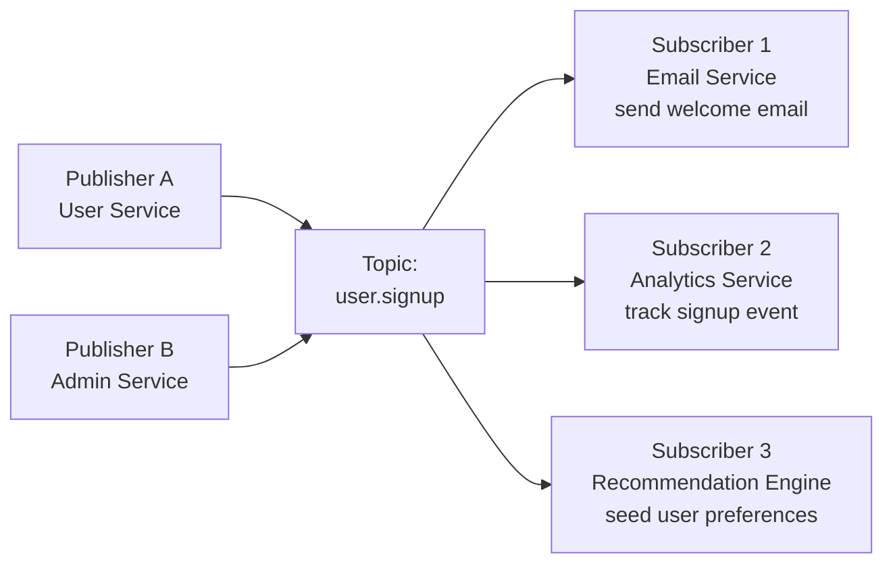
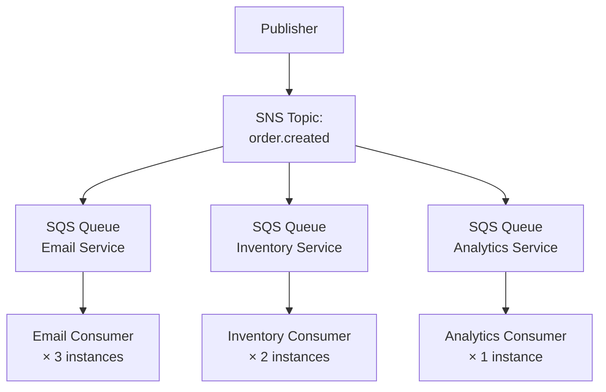

# 📢 Pub/Sub Pattern

> [!abstract] TL;DR
> Publish-Subscribe decouples message producers from consumers. Publishers send to a **topic**; all subscribers to that topic receive a copy. One event fans out to many independent consumers simultaneously. Compare to message queues (point-to-point, one consumer per message). Core pattern behind Kafka, SNS, Google Pub/Sub, and Redis Pub/Sub.

## Intuition — analogy FIRST

Imagine a newspaper (publisher). It doesn't know who reads it — it just prints an edition and puts it on every subscriber's doorstep. Your neighbour subscribing to sports gets the sports section. You subscribing to news get the news section. The newspaper doesn't coordinate between you.

If the newspaper were a message queue instead, it would hand the single paper to *one* person, and that person would be responsible for showing it to everyone else — much more coupled.

Pub/Sub: the newspaper model. Message queue: the single-copy handoff model.

## How It Works

### Core Model



**Key properties:**
- **Decoupling:** Publisher doesn't know subscribers exist. Adding subscriber S4 requires zero changes to the publisher.
- **Fan-out:** One message → N independent consumers get their own copy.
- **Asynchronous:** Publisher fires and forgets. Subscribers process at their own pace.

---

### Pub/Sub vs Message Queue

| Dimension | Message Queue (Point-to-Point) | Pub/Sub (Fan-out) |
|---|---|---|
| Receivers | One consumer per message | All subscribers receive a copy |
| Decoupling | Partial (producer knows queue name) | Full (producer knows only topic name) |
| Use case | Task distribution, work queues | Event notification, broadcast |
| Message retention | Until consumer ACKs | Depends on implementation |
| Scaling | Parallel consumers share load | All consumers receive independently |

> [!example] Practical difference
> **Queue:** "Process this payment" → one payment worker picks it up (you don't want two workers both charging the customer).
> **Pub/Sub:** "Payment succeeded" → email service, analytics service, and fraud service all need to hear about it simultaneously.

---

### Major Pub/Sub Implementations

| System | Persistence | Replay | Scale | Best For |
|---|---|---|---|---|
| **Redis Pub/Sub** | None (fire-and-forget) | No | Millions of msgs/s | Real-time, in-process fan-out |
| **AWS SNS** | No | No | Managed, unlimited | Cloud-native fan-out to SQS/Lambda |
| **AWS SNS + SQS** | SQS queues persist | No (unless SQS FIFO) | Managed | Durable fan-out at scale |
| **Google Cloud Pub/Sub** | Yes (7 days default) | Yes | Managed, unlimited | GCP-native event streaming |
| **Kafka** | Yes (configurable) | Yes (replay full history) | Millions msgs/s | Durable streaming, event sourcing |
| **RabbitMQ** (fanout exchange) | Optional | No | Thousands msgs/s | Low-latency, on-prem |

### AWS SNS → SQS Fan-out Pattern

The most common cloud Pub/Sub pattern: SNS fans out to multiple SQS queues. Each queue has its own independent consumer. Each consumer can scale independently. Messages are durable (SQS persists for up to 14 days).



### Kafka Topics as Durable Pub/Sub

Kafka adds **persistence and replay** to pub/sub. Messages are retained for days/weeks. New subscribers can replay historical events from offset 0.

Consumer groups in Kafka are point-to-point *within* the group but pub/sub *across* groups — each consumer group gets a full copy of every message.

---

### Event Schema and Envelope

A well-structured event payload:

```json
{
  "event_id": "evt_01HZXK...",
  "event_type": "order.created",
  "timestamp": "2026-07-26T12:00:00Z",
  "source": "order-service",
  "version": "1.0",
  "data": {
    "order_id": "ord_789",
    "user_id": "usr_123",
    "total_amount": 5999
  }
}
```

Always include: `event_id` (idempotency), `event_type`, `timestamp`, `version`.

## Real-World Systems

**Uber surge pricing:**
- Driver location update → topic: `driver.location`
- Subscribers: surge calculator, ETA calculator, dispatch service, heat map service
- All four services need every location update simultaneously; none knows about the others.

**News site article published:**
- `article.published` event → topic
- Subscribers: email newsletter service, push notification service, search indexer, CDN cache invalidator, social share service

**E-commerce order placed:**
- `order.created` event → SNS topic
- Subscribers: fulfillment SQS queue, email confirmation SQS queue, analytics SQS queue, fraud detection SQS queue

## Trade-offs

| Dimension | Benefit | Cost |
|---|---|---|
| Decoupling | Add/remove subscribers without changing publisher | Harder to trace end-to-end flow |
| Fan-out | One publish → N consumers, zero coordination | All subscribers must handle every event (filter or discard) |
| Scalability | Consumers scale independently | Message ordering across consumers is complex |
| Async processing | Non-blocking publish | Consumer failures silently drop processing unless monitored |
| Flexibility | Schema can evolve with versioning | Schema changes must be backward-compatible |

## When to Use vs Avoid

**Use Pub/Sub when:**
- Multiple independent services need to react to the same event.
- You want to decouple producers from consumers (add new consumers without touching publisher).
- Fan-out: one event triggers many downstream side effects.
- Building event-driven or microservices architecture.

**Avoid Pub/Sub when:**
- You need a response/result back (request-response — use REST/gRPC instead).
- You need exactly-one processing (Pub/Sub guarantees at-least-once; use a queue with deduplication).
- The event is only relevant to one consumer (use a direct queue instead; Pub/Sub adds unnecessary complexity).
- Ordering across multiple consumers is strictly required (Kafka with single-partition topics is an option, but adds constraints).

## Common Pitfalls

1. **No schema registry** — producers and consumers evolve schemas independently, causing deserialization failures. Use Avro/Protobuf with a schema registry.
2. **Subscribers crashing silently** — a failed subscriber just stops receiving. Add health monitoring and DLQ for every subscription.
3. **Hot topics** — a single high-volume topic can overwhelm slower subscribers. Use backpressure mechanisms or separate the high-volume subscriber into its own topic.
4. **Redis Pub/Sub for durability** — Redis Pub/Sub drops messages if no subscriber is connected. Use Redis Streams or Kafka for at-least-once delivery.
5. **No idempotency** — at-least-once delivery means duplicate messages. All subscriber handlers must be idempotent (same event ID processed twice = same outcome).
6. **Tight event coupling** — designing events as "commands" (`send_email_to_user`) instead of facts (`user.signed_up`) forces subscribers to know about publisher intent. Events should be facts.

## Related Concepts

- [[_MOC_Event_Driven|↑ Section MOC]]
- [[Kafka]] — durable, high-throughput pub/sub with replay capability
- [[RabbitMQ]] — pub/sub via fanout exchanges with optional durability
- [[Message_Queues]] — point-to-point counterpart to pub/sub
- [[Event_Driven_Architecture]] — pub/sub is the core delivery mechanism in EDA
- [[Dead_Letter_Queue]] — where failed subscriber deliveries should go

## Review Questions

1. Explain the difference between a message queue and a pub/sub topic. Give a concrete scenario where you would choose each, and explain why the other pattern would be wrong.
2. You are building a payment system. When `payment.succeeded` fires, 5 services need to react: email confirmation, invoice generation, inventory decrement, analytics, and fraud flagging. Design the pub/sub topology using AWS SNS + SQS. What happens if the fraud service is down for 30 minutes?
3. Your team proposes using Redis Pub/Sub to fan out order events to 3 downstream services. You're worried about reliability. What specific scenario would cause data loss, and what alternative would you recommend?

## Sources

- [AWS SNS + SQS fan-out pattern](https://docs.aws.amazon.com/sns/latest/dg/sns-sqs-as-subscriber.html)
- [Google Cloud Pub/Sub overview](https://cloud.google.com/pubsub/docs/overview)
- [Kafka consumer groups](https://kafka.apache.org/documentation/#intro_consumers)
- [Enterprise Integration Patterns — Publish-Subscribe Channel](https://www.enterpriseintegrationpatterns.com/PublishSubscribeChannel.html)

#SystemDesign #PubSub #EventDriven #Messaging #Kafka #Decoupling #FanOut
