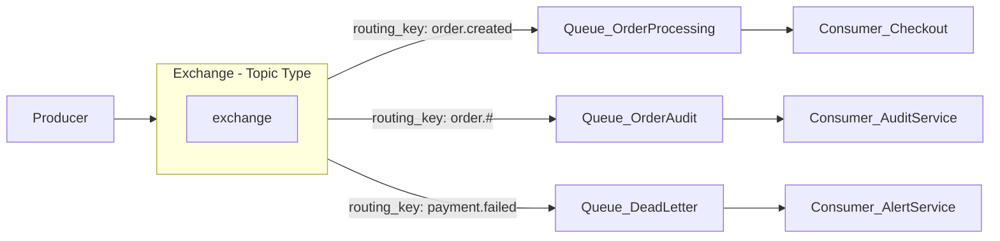

# 🐇 RabbitMQ

> [!abstract] TL;DR
> RabbitMQ is a traditional message broker implementing the AMQP protocol. Producers publish messages to **exchanges** which apply routing rules to deliver messages to the right **queues**. Consumers receive and **acknowledge** messages — which are then deleted. This "route and delete" model makes RabbitMQ ideal for work queues and complex routing scenarios, but unlike Kafka, messages are not replayed after consumption.

---

## Intuition — analogy FIRST

Think of RabbitMQ as a **postal sorting office**.

A sender (producer) drops a letter (message) into the sorting office (exchange) and writes the destination type on the envelope (routing key). The sorting office reads the label and drops the letter into the right mailbox slot (queue): express goes to Express Queue, international to International Queue, local to Local Queue. Once the postman (consumer) picks up the letter and delivers it, the letter is gone — the mailbox is empty. There's no way to re-read a letter that was already delivered.

[[Kafka]], by contrast, is like a **news archive** — every article is kept on file and any subscriber can come back and read yesterday's edition.

---

## How It Works

### Core Concepts

| Concept | Description |
|---|---|
| **Exchange** | Receives messages from producers and routes them to queues based on type and routing key. The brains of routing. |
| **Queue** | Stores messages until a consumer picks them up. Can be durable (survives broker restart) or transient. |
| **Binding** | A rule that connects an exchange to a queue, optionally with a routing key or pattern. |
| **Routing Key** | A string label attached to a message, used by exchanges to decide where to route it. |
| **Acknowledgment (ack)** | Consumer explicitly confirms it processed a message. Only then does RabbitMQ delete it. |
| **Dead Letter Queue (DLQ)** | Where messages go when they expire (TTL), are rejected, or exceed the max retry count. |
| **Prefetch** | Limits how many unacknowledged messages a consumer can hold at once — prevents overload. |
| **Publisher Confirms** | Broker confirms to the producer that a message was safely persisted. |

### Exchange Types

| Exchange Type | Routing Behavior | Use Case |
|---|---|---|
| **Direct** | Routes to queues where binding key = routing key (exact match) | Task dispatch, point-to-point |
| **Fanout** | Routes to **all** bound queues, ignores routing key | Broadcast notifications |
| **Topic** | Routing key pattern matching (`*` = one word, `#` = zero or more) | Log levels, multi-dimensional routing |
| **Headers** | Routes based on message header attributes, not routing key | Complex attribute-based routing |

### RabbitMQ vs. Kafka — Core Philosophy

| Dimension | RabbitMQ | Kafka |
|---|---|---|
| **Mental model** | Route and delete (post office) | Retain and replay (event log) |
| **Message lifetime** | Deleted after ack | Kept until retention window expires |
| **Replay** | Not possible by design | Native — seek to any offset |
| **Routing** | Rich (4 exchange types, patterns) | None — consumers pull from topic directly |
| **Max throughput** | ~50K–100K msg/s | Millions/s |
| **Ordering** | Per-queue | Per-partition |
| **Best for** | Work queues, complex routing, task distribution | Event streaming, audit log, fan-out |

---

## Real-World Systems

| Company | Use Case |
|---|---|
| **Stripe** | Job queues for asynchronous payment processing and webhook dispatch |
| **GitHub Actions** | Distributing CI/CD job execution across runner pools |
| **Instagram** | Push notification fanout to mobile devices at time of post |
| **Zalando** | Order processing pipelines with retry and DLQ logic |
| **Pivotal / VMware** | Core product — RabbitMQ is embedded in many enterprise middleware stacks |

---

## Trade-offs

| Factor | Pro | Con |
|---|---|---|
| **Routing flexibility** | 4 exchange types, topic patterns, header routing | Complexity grows with routing topology |
| **Reliability** | Explicit acks, DLQ, publisher confirms, durable queues | Durable queues + acks reduce throughput |
| **Replay** | — | No replay — message gone after ack by design |
| **Throughput** | Sufficient for most workloads (~50K msg/s) | Cannot match Kafka's millions/s |
| **Competing consumers** | Native — multiple consumers on one queue share load | One queue = one logical pipeline; no independent consumer groups like Kafka |
| **Operational complexity** | Single binary, easy to run locally, good UI | Clustering, mirrored queues, and HA add complexity |
| **Message size** | Works well with small-medium messages | Large messages (>128 MB) should use external storage with message pointer |

---

## When to Use vs. Avoid

**Use RabbitMQ when:**
- You need **complex routing logic** — multiple queues, priority queues, topic patterns.
- You have **work queues** with competing consumers (one job, one worker processes it).
- You need **explicit acknowledgment** and retry semantics (with DLQ for failures).
- You need **message TTL** (expire stale jobs automatically).
- Your throughput is under ~100K messages/second.
- You need **flow control** via prefetch limits.

**Avoid RabbitMQ when:**
- You need an **event log with replay** — use [[Kafka]].
- You need **multiple independent consumers** reading the same stream — use [[Kafka]] consumer groups.
- You need throughput in the **millions of messages per second** — Kafka's sequential disk model wins.
- You need **long-term message retention** beyond immediate processing.

---

## Common Pitfalls

1. **Forgetting to set `durable: true`** — transient queues and messages are lost on broker restart. Always use durable queues + persistent delivery mode in production.
2. **Missing acknowledgments** — if consumers crash without acking, messages are redelivered. But if you never ack (bug), the queue fills up and blocks new messages.
3. **No DLQ configured** — poison messages (ones that always fail) loop forever, blocking the queue. Always configure a Dead Letter Exchange.
4. **Prefetch set too high** — a slow consumer hogs all messages while other consumers starve. Set `prefetch_count=1` for fair dispatch in work queues.
5. **Mixing concerns in one exchange** — using a single fanout exchange for both task dispatch and notifications couples unrelated consumers. Use separate exchanges per concern.
6. **Not using publisher confirms** — without confirms, the producer has no guarantee the broker accepted the message. Silent loss is possible on broker crash.
7. **Large message payloads** — RabbitMQ holds messages in memory before writing to disk. Large payloads spike memory usage. Store large data externally and pass a reference.

---

## Related Concepts

- [[_MOC_EventDriven|↑ Section MOC]]
- [[Kafka]] — the event streaming alternative; use when you need replay, high throughput, or fan-out
- [[Message_Queues]] — general patterns for async messaging
- [[Task_Queues]] — RabbitMQ's primary use case pattern
- [[Asynchronism]] — messaging queues are the primary asynchronism mechanism
- [[Event_Driven_Architecture]] — RabbitMQ can serve as the event bus for simpler EDA topologies
- [[Idempotent_Operations]] — consumers must be idempotent since at-least-once delivery can cause duplicates

---

## Review Questions

1. **Exchange type selection:** Your e-commerce system needs to: (a) send every order event to exactly one warehouse worker for fulfillment, (b) broadcast a flash sale announcement to all connected services simultaneously, (c) route `payment.failed.fraud` and `payment.failed.insufficient_funds` differently but catch all `payment.failed.*` in an audit queue. Which exchange type would you use for each, and why?
2. **Reliability configuration:** A financial system uses RabbitMQ for payment job dispatch. Walk through every setting you would configure to ensure no payment job is ever silently lost — cover the producer side, broker side (queue configuration), and consumer side.
3. **RabbitMQ vs. Kafka decision:** A team proposes using RabbitMQ to power a feature where 5 different microservices all need to independently process every new user signup event, including replaying the last 90 days of signups to bootstrap a new ML model. Critique this design choice and propose an alternative.

---

## Sources

- [RabbitMQ Documentation](https://www.rabbitmq.com/documentation.html)
- [RabbitMQ — AMQP 0-9-1 Model Explained](https://www.rabbitmq.com/tutorials/amqp-concepts)
- [CloudAMQP — RabbitMQ vs Kafka](https://www.cloudamqp.com/blog/when-to-use-rabbitmq-or-apache-kafka.html)
- [RabbitMQ — Reliability Guide](https://www.rabbitmq.com/reliability.html)
- [Designing Data-Intensive Applications — Martin Kleppmann (Chapter 11)](https://dataintensive.net/)

#SystemDesign #RabbitMQ #MessageBroker #AMQP #TaskQueue #Asynchronism
