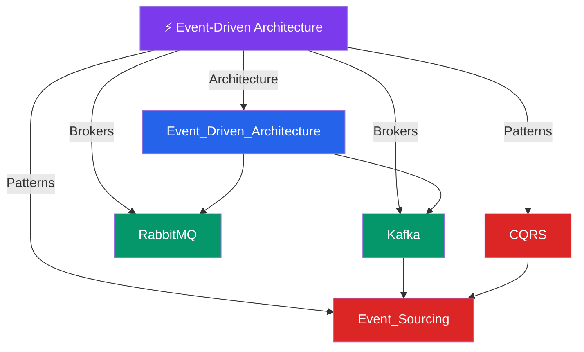

# ⚡ Event-Driven Architecture — Map of Content

> [!abstract] What This Section Covers
> Systems where components communicate by emitting and reacting to events rather than direct calls. Covers the foundational architecture pattern, the two dominant brokers (Kafka and RabbitMQ), and two advanced patterns that emerge naturally from event streams — CQRS for read/write separation and Event Sourcing for immutable audit logs as the source of truth.

## Concept Map

## Learning Path

1. [[Event_Driven_Architecture]] — Producers, consumers, event brokers, and the decoupling benefits vs complexity cost
2. [[RabbitMQ]] — AMQP-based message broker: exchanges, queues, routing, and when it beats Kafka
3. [[Kafka]] — Distributed log with consumer groups, partitions, and replay — the backbone of data pipelines
4. [[CQRS]] — Command Query Responsibility Segregation: separate models for writes and reads
5. [[Event_Sourcing]] — Store state changes as an immutable log of events rather than mutable rows

## All Notes at a Glance

| Note | Summary | Difficulty |
|------|---------|------------|
| [[Event_Driven_Architecture]] | Architecture where services emit and react to events via a broker, enabling loose coupling and independent scaling | Intermediate |
| [[Kafka]] | Distributed commit log providing durable, ordered, replayable event streams with high throughput via partitioned topics | Intermediate |
| [[RabbitMQ]] | AMQP message broker with flexible routing via exchanges, fanout, and dead-letter queues — better for task distribution than streaming | Intermediate |
| [[CQRS]] | Pattern separating the write model (commands) from the read model (queries) to optimize each independently | Advanced |
| [[Event_Sourcing]] | Storing every state change as an immutable event rather than overwriting current state — enables full audit log and temporal queries | Advanced |

## Key Questions This Section Answers

- When should you choose Kafka over RabbitMQ and vice versa?
- What does CQRS buy you, and what complexity does it introduce?
- Why is event sourcing hard — what are the failure modes of an immutable event log?
- How does event replay in Kafka enable building new read models from historical data?
- What is the outbox pattern and why does it matter for exactly-once semantics?
- How do you handle schema evolution in event-driven systems?

## Related Sections

- [[_MOC_SystemDesign_Master|↑ System Design Master MOC]]
- [[_MOC_Asynchronism]] — Event-driven is the architectural extension of async messaging
- [[_MOC_Databases]] — CQRS and Event Sourcing both affect database design fundamentally
- [[_MOC_ApplicationLayer]] — Microservices are the natural consumers and producers in event-driven systems

#MOC #SystemDesign
