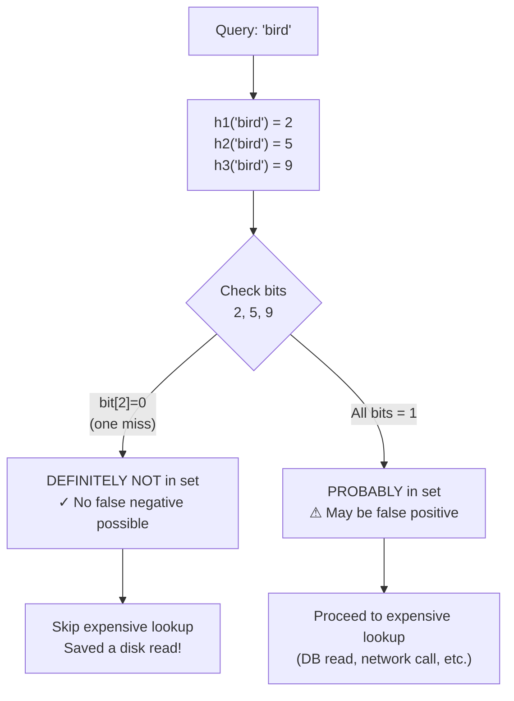

# Bloom Filter — Probabilistic Membership

> [!abstract] TL;DR
> A Bloom filter answers "is this element in the set?" using a bit array and k hash functions. It **never produces false negatives** (if it says "not in set", it's definitely not), but **can produce false positives** (if it says "in set", it probably is — but might be wrong). O(1) insert and lookup, space orders of magnitude smaller than storing the actual set. Used to avoid expensive lookups for data that definitely doesn't exist.

## Intuition — analogy FIRST

Picture a massive bingo card with 1 million squares, all blank. When you add a word to your vocabulary list, you stamp **k different squares** (determined by hashing the word k times). Later, to check if a word is in the list, you hash it k times and check those same squares. If **any** square is blank, the word was never added — guaranteed. If all k squares are stamped, the word was *probably* added (but another combination of previous words may have stamped the same squares by coincidence).

This "false positive" rate is the price of the extraordinary space savings. There is no false negative: a blank square is proof of absence.

## How It Works

### Data Structure

```
bit_array: [0, 0, 0, 0, 0, 0, 0, 0, 0, 0]  ← m bits, all zero initially
           [0  1  2  3  4  5  6  7  8  9]  ← indices
```

### Insert Operation

For each element x, compute k hash functions: h₁(x), h₂(x), ..., hₖ(x). Set those k bit positions to 1.

```
insert("cat"):  h1("cat")=1, h2("cat")=5, h3("cat")=8  → set bits 1,5,8
insert("dog"):  h1("dog")=3, h2("dog")=5, h3("dog")=7  → set bits 3,5,7

bit_array: [0, 1, 0, 1, 0, 1, 0, 1, 1, 0]
```

### Query Operation

Hash the query element with the same k functions. If **all** k bits are 1 → "probably in set". If **any** bit is 0 → "definitely NOT in set".



**After inserting 'cat' and 'dog':** `bit_array = [0,1,0,1,0,1,0,1,1,0]`
- Query "cat": bits 1,5,8 all 1 → probably in set (correct)
- Query "bird": bit 2 = 0 → definitely NOT in set (skip the DB call)
- Query "bat": bits all happen to be 1 from prior collisions → false positive (rare but possible)

### False Positive Rate — The Math

Given:
- **m** = number of bits in array
- **n** = number of elements inserted
- **k** = number of hash functions

**False positive probability:**

```
p ≈ (1 - e^(-kn/m))^k
```

**Optimal k** (minimizes false positive rate for given m and n):

```
k_optimal = (m/n) × ln(2) ≈ 0.693 × (m/n)
```

**Sizing rule of thumb:** For a 1% false positive rate, use approximately **9.6 bits per element**. For 0.1%, use ~14.4 bits per element. Compare to storing a 64-bit pointer per element — the Bloom filter uses 7-15x less space.

| Elements (n) | Bits (m) | k | False Positive Rate |
|---|---|---|---|
| 1,000,000 | 9,585,058 | 7 | 1% |
| 1,000,000 | 14,377,588 | 10 | 0.1% |
| 1,000,000 | 4,792,529 | 3 | 10% |

### Variants

**Count-Min Sketch** — Instead of a bit array, use a 2D array of counters with multiple hash functions. Answers "how many times have I seen element x?" with bounded overcount error. Used for frequency estimation (heavy hitters, top-K). Cannot undercount.

**Scalable Bloom Filter** — Dynamically grows by adding new layers when the current layer's target false positive rate is exceeded. Used when the total set size is unknown upfront.

**Counting Bloom Filter** — Replace bits with small counters to support deletions (decrement on delete). 4x more space than a standard Bloom filter.

## Real-World Systems

| System | Use Case | Scale |
|---|---|---|
| **Google Chrome** Safe Browsing | URL blacklist checked locally before network call | ~300K malicious URLs stored in ~1.8 MB |
| **Cassandra / HBase / RocksDB** | Before reading an SSTable from disk for a key, check the Bloom filter. Skip the disk I/O if key definitely absent | Saves millions of disk reads/sec |
| **Medium** | Track articles a user has already read — don't show again | Per-user filter, very compact |
| **Akamai CDN** | One-hit-wonder filter — only cache content requested more than once | Avoids caching items never re-requested |
| **Bitcoin** | SPV (Simplified Payment Verification) — lightweight clients use Bloom filters to request relevant transactions | Reduces bandwidth |
| **PostgreSQL** | `pg_trgm` extension uses Bloom index | Speeds up LIKE queries |

## Trade-offs

| Dimension | Bloom Filter | Hash Set / HashSet |
|---|---|---|
| **Space** | O(m) bits — very compact | O(n × element_size) — much larger |
| **Insert time** | O(k) — constant | O(1) amortised |
| **Lookup time** | O(k) — constant | O(1) amortised |
| **False negatives** | Never | Never |
| **False positives** | Possible (tunable) | Never |
| **Deletion** | Not supported (standard) | Supported |
| **Exact membership** | No | Yes |
| **Enumeration** | Not possible | Possible |

## When to Use vs Avoid

**Use when:**
- You want to avoid expensive lookups (disk, network, DB) for elements that definitely don't exist
- False positives are tolerable and cause only wasted work (not incorrect results)
- Space is severely constrained relative to the set size
- Write-once or append-only workloads (no deletions needed)

**Avoid when:**
- You cannot tolerate false positives (security-critical membership: "is this user an admin?")
- You need to delete elements (use Counting Bloom Filter instead, with 4x space overhead)
- The set is small enough that a hash set fits in memory — Bloom filter complexity not worth it
- You need exact counts (use Count-Min Sketch for estimates, or an actual counter map)

## Common Pitfalls

1. **Wrong sizing** — Failing to calculate m based on expected n and target false positive rate p before deployment. Rebuilding a Bloom filter from scratch is expensive.

2. **Treating false positives as correctness failures** — Bloom filters are guards, not truth. Always have a fallback (actual lookup) when the filter says "present".

3. **Using Bloom filters as a cache** — A Bloom filter does not store values, only membership signals. It is a gateway to a real data store, not a replacement.

4. **Ignoring the need for good hash functions** — Poor hash functions increase collision rates beyond the theoretical p. Use MurmurHash3, xxHash, or FNV for speed; avoid MD5/SHA-1 for performance-sensitive paths.

5. **Not accounting for growth** — A standard Bloom filter has fixed m. Inserting more than n elements degrades the false positive rate toward 100%. Use a Scalable Bloom Filter or pre-size generously.

6. **Forgetting Bloom filters are not serialised automatically** — On restart, the bit array must be persisted to disk (or rebuilt). RocksDB stores one Bloom filter per SSTable block — it is serialised alongside the data file.

## Related Concepts

- [[_MOC_SearchAlgorithms|↑ Section MOC]]
- [[Databases]] — Bloom filters are embedded in LSM-tree storage engines (Cassandra, RocksDB) to skip SSTable reads
- [[Caching]] — Bloom filters gate cache lookups, preventing cache pollution from one-hit-wonders
- [[Consistent_Hashing]] — both are probabilistic primitives used in distributed data systems
- [[Inverted_Index]] — Lucene uses Bloom filters internally per segment to skip term lookups

## Review Questions

1. **Chrome's Safe Browsing stores ~300K URLs in 1.8 MB using a Bloom filter.** Calculate the bits-per-element and estimate the false positive rate given that Chrome uses approximately 7 hash functions. What happens to your browsing experience when a false positive fires?

2. **Cassandra has 10 SSTables on disk for a given partition key.** Without Bloom filters, how many disk seeks are required to confirm a key does not exist? With per-SSTable Bloom filters and a 1% false positive rate, what is the expected number of unnecessary disk reads per query?

3. **You need to support deletion in your Bloom filter** to handle expired session tokens. Compare the standard Bloom filter, Counting Bloom Filter, and a simple Redis SET for this use case. Under what conditions does each approach win?

## Sources

- Burton H. Bloom, "Space/Time Trade-offs in Hash Coding with Allowable Errors", 1970 — original paper
- Broder & Mitzenmacher, "Network Applications of Bloom Filters: A Survey", 2004
- Google Chrome Safe Browsing Architecture — [chromium.org](https://www.chromium.org/developers/design-documents/safebrowsing/)
- RocksDB Bloom Filter Documentation — [rocksdb.org](https://github.com/facebook/rocksdb/wiki/RocksDB-Bloom-Filter)
- "Probabilistic Data Structures and Algorithms" — Andrii Gakhov

#SystemDesign #BloomFilter #Probabilistic #DataStructures #Algorithms #Cassandra #RocksDB
