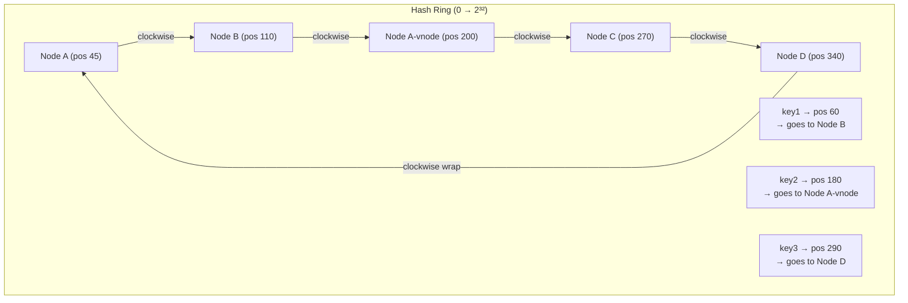

# Hash Ring — Consistent Hashing

> [!abstract] TL;DR
> Consistent hashing maps both keys and nodes to a circular ring. Each key routes to the nearest clockwise node. Adding or removing a node remaps only **K/N keys** (not all K), enabling near-zero reshuffling in distributed caches and databases. Virtual nodes further smooth out distribution skew.

## Intuition — analogy FIRST

Imagine a clock face numbered 0–359 degrees. You have four delivery drivers (nodes) standing at different positions around the clock. When a package (key) arrives, it spins clockwise until it finds the first driver — that driver owns the package.

Now hire a fifth driver: only the packages that land between the new driver and the previous one (a small arc) need to be reassigned. Everyone else keeps their packages unchanged.

**Naive modulo hashing breaks this guarantee.** With `node = hash(key) % N`, adding one node changes N to N+1, which almost certainly remaps nearly every single key to a different node — catastrophic for a cache because every entry becomes a miss simultaneously.

## How It Works

### Step 1 — Build the ring

Hash the address space (0 to 2³²−1) into a circle. Place each node by hashing its identifier:

```
ring_position(node) = hash(node_id) % RING_SIZE
```

### Step 2 — Place keys

Place each key on the ring the same way:

```
ring_position(key) = hash(key) % RING_SIZE
```

The key is **owned by the first node found travelling clockwise** from the key's position.

### Step 3 — Add/remove nodes

- **Add** Node E between Node A and Node B → only keys between Node A's position and Node E's new position move from B to E.
- **Remove** Node B → only Node B's keys shift to Node C (the next clockwise node).

**Math:** With N nodes and K keys, adding or removing one node remaps exactly **K/N keys** on average — far better than the ~K remappings of modulo hashing.

### Virtual Nodes (vnodes)

A physical node is mapped to **multiple positions** on the ring (e.g., 256 positions for Cassandra defaults). Benefits:

- Evens out load when nodes have different capacities or when few physical nodes exist
- When a node leaves, its keys spread across many successors rather than dumping onto one neighbour
- Allows heterogeneous nodes — a powerful machine can hold more vnodes



**Read path:** hash the key → walk clockwise → first node hit owns the key.
**Write path:** same lookup, then replicate to the next N−1 nodes clockwise (configurable replication factor).

## Real-World Systems

| System | Implementation Detail |
|---|---|
| **Apache Cassandra** | Consistent hashing + 256 vnodes per node by default; partitioner is configurable (Murmur3Partitioner) |
| **Amazon DynamoDB** | Hash ring underlies partition routing; replicated across 3 AZs |
| **Memcached** (libketama) | Client-side consistent hashing; standard library for distributed Memcached |
| **Redis Cluster** | 16 384 hash slots assigned to nodes — a discrete ring of fixed slots |
| **Akamai CDN** | Consistent hashing routes requests to edge cache servers |
| **Riak** | 160-bit ring; ring state gossiped between nodes |

## Trade-offs

| Dimension | Consistent Hashing | Naive Modulo Hashing |
|---|---|---|
| **Keys remapped on topology change** | K/N (optimal) | ~K (catastrophic) |
| **Load distribution (few nodes)** | Can be uneven without vnodes | Balanced for fixed N |
| **Load distribution (vnodes)** | Very even | N/A |
| **Complexity** | Moderate — need sorted ring data structure | Trivial |
| **Hot spots** | Possible if vnodes are few or hash function is poor | Uniform for uniform keys |
| **Node failure blast radius** | Only successor node absorbs traffic | Entire cluster remaps |
| **Space overhead** | O(V) for V virtual nodes in ring index | O(1) |

## When to Use vs Avoid

**Use when:**
- Distributed caches where remapping = cache stampede (Memcached, Redis Cluster)
- Distributed databases with dynamic node membership (Cassandra, Riak)
- Load balancers where session stickiness matters
- CDN edge routing with unpredictable node availability

**Avoid when:**
- You have a fixed, small cluster that never changes (modulo hashing is simpler)
- You need strict ordering guarantees (consistent hashing is about membership, not order)
- Your keys are extremely non-uniform — hotspots persist even with vnodes

## Common Pitfalls

1. **Too few virtual nodes** — With 3 physical nodes and 1 vnode each, the ring has only 3 points. One node's failure dumps all its load onto one successor. Rule of thumb: 100–200+ vnodes per physical node.

2. **Ignoring replication factor** — Consistent hashing alone only determines the primary. You still need to replicate. Ensure your replication strategy (next N clockwise nodes) accounts for rack/AZ awareness.

3. **Hash function bias** — A weak hash function clusters keys, creating hot arcs. Use Murmur3 or SHA-256; avoid MD5 for distribution purposes.

4. **Client vs server-side routing** — Memcached uses client-side hashing (clients must all agree on the ring). Cassandra uses server-side (any node can be a coordinator). Mixing strategies causes split-brain routing.

5. **Thundering herd on node addition** — When a node joins and bootstraps data, it triggers heavy streaming from existing nodes. Throttle bootstrap bandwidth to avoid starving live traffic.

6. **Forgetting consistency levels** — Consistent hashing tells you *where* data lives, not how *consistent* reads are. QUORUM reads are still needed for strong consistency.

## Related Concepts

- [[Database_Sharding]] — sharding strategies including range-based vs hash-based vs consistent hashing
- [[Databases]] — where consistent hashing sits in the overall data tier picture
- [[Load_Balancers]] — L4/L7 load balancers can use consistent hashing for session stickiness
- [[Replication]] — consistent hashing determines primary; replication handles redundancy
- [[Caching]] — consistent hashing is the backbone of distributed cache cluster management

## Review Questions

1. **Why does naive modulo hashing (`hash(key) % N`) cause a cache stampede when a single node is added?** Walk through the math for a 4-node → 5-node transition and estimate how many keys remap.

2. **A Cassandra cluster has 6 physical nodes each with 256 vnodes. One node fails.** Approximately how many vnodes' worth of data need to stream to successors, and how does rack-aware replication mitigate this?

3. **You are designing a distributed rate limiter.** Every request for user U must hit the same node to avoid double-counting. Which component of consistent hashing guarantees this, and what breaks it if nodes frequently join/leave?

## Sources

- Karger et al., "Consistent Hashing and Random Trees" — original 1997 MIT paper
- Amazon DynamoDB: Dynamo paper (DeCandia et al., SOSP 2007) — [link](https://www.allthingsdistributed.com/files/amazon-dynamo-sosp2007.pdf)
- Apache Cassandra Documentation — Partitioners: [cassandra.apache.org](https://cassandra.apache.org/doc/latest/cassandra/architecture/dynamo.html)
- "Consistent Hashing: Algorithmic Tradeoffs" — Damian Gryski blog
- System Design Interview – Alex Xu, Vol. 1, Chapter 5

#SystemDesign #DistributedSystems #Hashing #ConsistentHashing #VirtualNodes #Cassandra #DynamoDB
