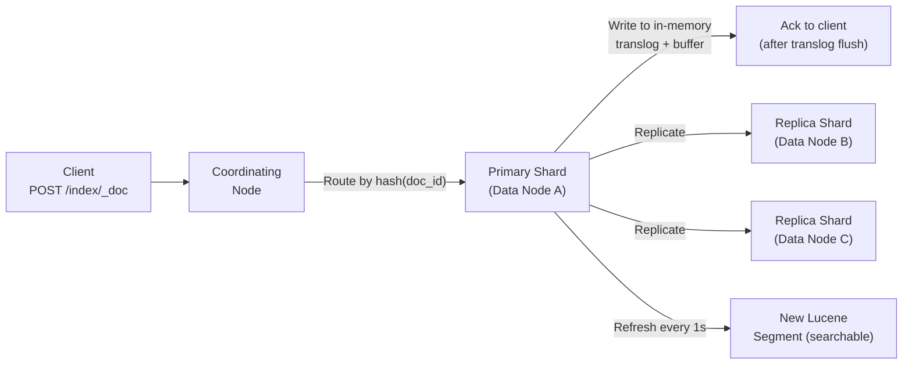
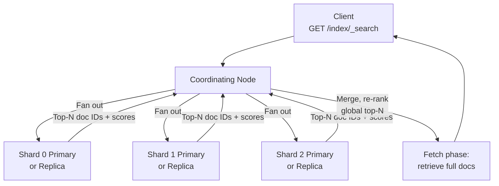

# Elasticsearch — Distributed Search and Analytics

> [!abstract] TL;DR
> Elasticsearch is a distributed, document-oriented search and analytics engine built on top of Apache Lucene. It wraps Lucene's inverted index in a horizontally scalable, schema-flexible, RESTful cluster. Core value: query billions of documents in milliseconds with relevance ranking, aggregations, and geospatial support. Core cost: near-real-time (not immediate) indexing, high operational complexity, and no ACID transactions.

## Intuition — analogy FIRST

Think of Elasticsearch as a **distributed library with a brilliant head librarian (the coordinating node)**. When you ask for "books about quantum mechanics published after 2010", the head librarian doesn't search the entire library alone. Instead, they send researchers to different floors (shards) simultaneously. Each floor researcher returns their best 10 books. The head librarian then picks the globally best 10 from all the floor responses and hands them to you.

Each floor has a primary bookshelf and a backup copy on another floor (replica). If a floor burns down, the backup floor takes over seamlessly.

## How It Works

### Core Concepts

| Concept | Elasticsearch | SQL Analogy |
|---|---|---|
| **Index** | Container for related documents | Database / Table |
| **Document** | JSON object stored and indexed | Row |
| **Field** | Key-value pair in a document | Column |
| **Shard** | Lucene instance; horizontal partition of an index | Table partition |
| **Replica shard** | Read-only copy of a primary shard | Read replica |
| **Node** | Single Elasticsearch process | Server |
| **Cluster** | Group of nodes sharing the same cluster.name | Database cluster |

### Node Types

- **Master node** — cluster state management (shard assignment, node tracking). Dedicated masters recommended for large clusters (3 dedicated masters for quorum).
- **Data node** — stores shards, executes queries. CPU/RAM/disk intensive.
- **Ingest node** — pre-processes documents before indexing (pipeline: parse, enrich, transform).
- **Coordinating node** — routes requests, scatter-gathers query results. Every node can act as a coordinating node.

### Write Path — Indexing a Document



**Near-Real-Time (NRT):** Documents are buffered in memory and flushed to a new Lucene segment every **1 second** (configurable `refresh_interval`). Until the refresh, a just-indexed document is not searchable. This is the "near" in NRT.

**Translog:** Before being searchable, every write is appended to a transaction log on disk. On crash recovery, the translog replays uncommitted operations. The translog is flushed to a Lucene commit (fsync) every 5 seconds or after 512MB by default.

### Read Path — Executing a Query



**Two-phase execution:**
1. **Query phase** — coordinating node fans out to all shards. Each shard returns doc IDs and scores for local top-N results. Coordinating node merges to get global top-N IDs.
2. **Fetch phase** — coordinating node fetches the full document source for only the global top-N doc IDs. Avoids fetching large documents from every shard.

### Query Types

```json
// Match query — full-text with analysis
{ "query": { "match": { "description": "electric vehicle" } } }

// Term query — exact, no analysis (use for keywords, IDs, enums)
{ "query": { "term": { "status": "published" } } }

// Range query
{ "query": { "range": { "price": { "gte": 100, "lte": 500 } } } }

// Bool query — combine clauses
{
  "query": {
    "bool": {
      "must":     [{ "match": { "title": "elasticsearch" } }],
      "should":   [{ "term":  { "tags": "distributed" } }],
      "must_not": [{ "term":  { "status": "draft" } }],
      "filter":   [{ "range": { "date": { "gte": "2023-01-01" } } }]
    }
  }
}
```

**Key distinction:** `must`/`should` contribute to relevance score. `filter` does not score — it is cached and faster for exact conditions.

### Aggregations

Elasticsearch is also an analytics engine. Aggregations answer questions like "what are the top 10 product categories by revenue?":

```json
{
  "aggs": {
    "by_category": {
      "terms": { "field": "category", "size": 10 },
      "aggs": {
        "total_revenue": { "sum": { "field": "price" } }
      }
    }
  }
}
```

### ELK Stack

| Component | Role |
|---|---|
| **Elasticsearch** | Storage, indexing, querying |
| **Logstash** | Ingest pipeline: collect, parse, transform, forward logs |
| **Kibana** | Visualisation dashboard — built on ES queries |
| **Beats** | Lightweight shippers (Filebeat, Metricbeat) that send data to Logstash or ES directly |

## Real-World Systems

| Company | Use Case | Scale |
|---|---|---|
| **Wikipedia** | Full-text article search across 60M+ articles | Multi-language, relevance-ranked |
| **GitHub** | Code search across billions of files | Custom tokeniser for code symbols |
| **Netflix** | Log analytics for 2B+ events/day | ELK stack for operational observability |
| **Airbnb** | Listing search with geospatial + price filters | Geo-distance queries, real-time availability |
| **Uber** | Trip and driver geospatial queries | Geo-point fields, bounding box queries |
| **LinkedIn** | People and job search | Custom relevance models on top of ES |

## Trade-offs

| Dimension | Elasticsearch | PostgreSQL FTS | Algolia |
|---|---|---|---|
| **Query latency (full-text)** | Milliseconds at scale | Seconds at large scale | Sub-10ms (optimised) |
| **Relevance ranking** | BM25 + custom script scores | Basic ts_rank | Custom relevance + typo-tolerance |
| **Write consistency** | Near-real-time (1s refresh) | Immediate ACID | Near-real-time |
| **ACID transactions** | None | Full | None |
| **Operational complexity** | High (cluster, shards, JVM) | Low (same DB) | Minimal (SaaS) |
| **Cost** | Self-hosted or Elastic Cloud | Included in Postgres | Expensive SaaS |
| **Aggregations at scale** | Excellent | Limited | Limited |
| **Schema flexibility** | Dynamic mapping (risk) | Strict schema | Strict schema |

## When to Use vs Avoid

**Use when:**
- Full-text search with relevance ranking over large corpora (articles, products, code)
- Log analytics and observability (ELK stack)
- Geospatial queries (nearby restaurants, driver locations)
- Aggregations and analytics over time-series or event data
- Multi-field, multi-condition queries that outgrow SQL

**Avoid when:**
- Primary OLTP store requiring ACID transactions (use Postgres/MySQL)
- Simple key-value lookups — overhead not justified (use Redis/DynamoDB)
- Very small datasets — operational complexity of a cluster isn't worth it
- Schema changes are frequent — each mapping change requires reindexing
- Strict data durability requirements without operational expertise

## Common Pitfalls

1. **Using ES as the source of truth** — ES can lose data in split-brain scenarios or misconfigured durability settings. Always write to a durable primary store (Postgres) and sync to ES asynchronously.

2. **Dynamic mapping gone wrong** — By default, ES infers field types from the first document. A field typed as `long` because the first value was a number will reject a string later. Define explicit mappings for production indexes.

3. **Over-sharding** — Creating too many shards increases overhead. Rule of thumb: target 20–40 GB per shard. 1000 tiny shards on a 3-node cluster is worse than 30 properly-sized shards.

4. **Ignoring the refresh interval** — Setting `refresh_interval: 1s` (default) for bulk indexing jobs slows ingest significantly. Set to `-1` during bulk load, then restore.

5. **Heap memory misconfiguration** — JVM heap should be 50% of available RAM, capped at 31GB (beyond 31GB, JVM switches to 64-bit pointers, negating the benefit). Leave the other 50% for the OS page cache (used by Lucene).

6. **Not planning for reindexing** — Any field mapping change requires creating a new index and reindexing all data. Large indexes can take hours or days. Plan with aliases and zero-downtime reindex strategies.

## Related Concepts

- [[_MOC_SearchAlgorithms|↑ Section MOC]]
- [[Inverted_Index]] — the core data structure Lucene (and thus ES) is built upon
- [[Databases]] — ES is complementary to, not a replacement for, a primary relational/NoSQL database
- [[Monitoring]] — ELK stack is one of the most common observability platforms
- [[Bloom_Filter]] — Lucene uses Bloom filters per segment to skip term lookups efficiently

## Review Questions

1. **A document is indexed at 10:00:00.000.** A user queries for that document at 10:00:00.500. Is the document returned? Why or why not? What setting controls this behaviour, and what is the trade-off of reducing it to 100ms?

2. **Your Elasticsearch index has 5 primary shards. A query for top-10 results is executed.** Each shard returns its local top-10 (50 docs total). The coordinating node then fetches full documents for the global top-10. What is the worst-case total number of shard requests, and how does a 3-replica-per-shard configuration change the read path?

3. **You need to change a field's data type from `text` to `keyword`** in a live production index serving 10 million queries per day. Outline a zero-downtime migration strategy using aliases, reindexing, and an atomic alias swap.

## Sources

- Elasticsearch: The Definitive Guide — Gormley & Tong (free online): [elastic.co/guide](https://www.elastic.co/guide/en/elasticsearch/guide/current/index.html)
- Elasticsearch Documentation — [elastic.co/docs](https://www.elastic.co/docs)
- Apache Lucene Core Documentation — [lucene.apache.org](https://lucene.apache.org/core/)
- "Elasticsearch in Action" — Radu Gheorghe, Matthew Lee Hinman
- Netflix Tech Blog: Elasticsearch at Netflix Scale — [netflixtechblog.com](https://netflixtechblog.com)

#SystemDesign #Elasticsearch #Lucene #ELKStack #Search #FullTextSearch #DistributedSystems #Analytics
