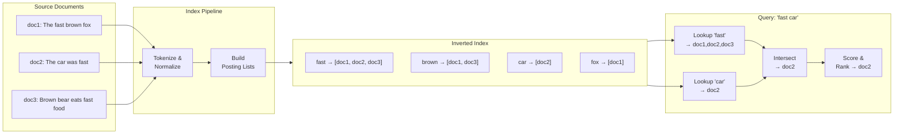

# Inverted Index — The Engine Behind Full-Text Search

> [!abstract] TL;DR
> An inverted index maps each unique word (term) to the list of documents containing it — the reverse of a traditional forward index (document → words). It powers every major search engine: Elasticsearch, Solr, Lucene, and Google all use inverted indexes at their core. Querying "fast car" becomes two posting-list lookups intersected in milliseconds, regardless of corpus size.

## Intuition — analogy FIRST

A book's index at the back is a perfect analogy. You don't re-read every page to find where "photosynthesis" is mentioned — you flip to the index, find "photosynthesis", and see "pp. 34, 67, 112". The word points you to the pages.

A forward index is the opposite: "Chapter 3 contains: glucose, chlorophyll, photosynthesis, sunlight". You'd have to scan every chapter summary to find which chapters mention photosynthesis.

Inverting the index — word → documents — makes the lookup instantaneous at the cost of building and storing the index upfront. This is exactly the trade-off search engines make: **read latency drops to milliseconds; write latency increases because every new document must update the index.**

## How It Works

### Phase 1 — Document Ingestion and Tokenisation

```
doc1: "The fast brown fox"
doc2: "The car was fast"
doc3: "Brown bear eats fast food"
```

**Tokenise** — split on whitespace and punctuation.
**Normalise** — lowercase, remove stop words ("the", "was", "a"), apply stemming ("eating" → "eat", "cars" → "car").

```
doc1 tokens: [fast, brown, fox]
doc2 tokens: [car, fast]
doc3 tokens: [brown, bear, eat, fast, food]
```

### Phase 2 — Build Posting Lists

For each term, record which documents contain it (and optionally: position within the document, term frequency):

```
fast   → [(doc1, tf=1, pos=[2]), (doc2, tf=1, pos=[4]), (doc3, tf=1, pos=[4])]
brown  → [(doc1, tf=1, pos=[3]), (doc3, tf=1, pos=[1])]
car    → [(doc2, tf=1, pos=[1])]
fox    → [(doc1, tf=1, pos=[4])]
bear   → [(doc3, tf=1, pos=[2])]
```

### Phase 3 — Query Execution

Query: `"fast car"` (AND query — must contain both)

1. Look up "fast" posting list → {doc1, doc2, doc3}
2. Look up "car" posting list → {doc2}
3. Intersect → {doc2}
4. Score doc2 using TF-IDF or BM25, return ranked results



### Scoring — TF-IDF vs BM25

**TF-IDF (Term Frequency — Inverse Document Frequency):**

```
TF(t, d)  = (count of term t in doc d) / (total terms in doc d)
IDF(t)    = log(N / df(t))       ← N = total docs, df(t) = docs containing t
score     = TF × IDF
```

Common words (low IDF) contribute less; rare words in a document (high TF-IDF) contribute more.

**BM25 (Best Match 25)** — modern standard used by Elasticsearch and Lucene:
- Adds saturation: doubling the term frequency doesn't double the score (diminishing returns)
- Accounts for document length (long documents penalised so they don't dominate by having more words)
- Two tuning parameters: k₁ (term frequency saturation ~1.2–2.0) and b (length normalisation ~0.75)

### Sharding and Segment Merging (Lucene)

A large corpus shards the inverted index:
- Each **shard** (Elasticsearch) or **segment** (Lucene) is a self-contained inverted index
- New documents go to an **in-memory buffer**, flushed to a new immutable **segment** on disk
- Background **segment merging** consolidates many small segments into larger ones (reducing file handles and improving query performance)
- Queries **fan out** to all shards, collect partial results, merge and re-rank at the coordinating node

## Real-World Systems

| System | Stack | Notable Characteristic |
|---|---|---|
| **Elasticsearch** | Built on Lucene | Distributed, RESTful API, near-real-time (1s refresh) |
| **Apache Solr** | Built on Lucene | Older, heavy XML config; enterprise deployments |
| **Algolia** | Custom engine | Optimised for typo-tolerance and sub-10ms latency |
| **Google** | Custom distributed inverted index | Planetary scale; PageRank combined with TF-IDF signals |
| **PostgreSQL** (`tsvector`) | Built-in FTS | Full-text search without a separate search cluster |
| **SQLite FTS5** | Built-in | Embedded inverted index for mobile/desktop apps |

## Trade-offs

| Dimension | Inverted Index | B-Tree Index (SQL LIKE) |
|---|---|---|
| **Full-text query speed** | O(posting list size) — fast | O(n) table scan for leading wildcard `%foo%` |
| **Exact match speed** | Same as B-tree | O(log n) — B-tree wins |
| **Write amplification** | High — every write updates N posting lists | Low — one tree update per row |
| **Storage overhead** | Large — index can be bigger than source data | Moderate |
| **Ranking / relevance** | Native (TF-IDF, BM25) | None |
| **Phrase queries** | Supported (position data) | Not practical |
| **Consistency** | Near-real-time (buffered writes) | ACID immediate |
| **Operational complexity** | High (separate cluster) | Low (built into RDBMS) |

## When to Use vs Avoid

**Use when:**
- You need full-text search with relevance ranking ("find articles about electric cars")
- Users expect typo tolerance, stemming, synonyms
- Searching across large unstructured corpora (logs, articles, product descriptions)
- Phrase and proximity queries are required

**Avoid when:**
- You need exact-match lookups with ACID guarantees — use a B-tree index in SQL
- Your "search" is just a prefix lookup on a bounded enum — use a regular index
- You have strict near-zero write latency requirements — the indexing overhead is significant
- The corpus is tiny (< 10K documents) — in-memory full scan may be faster and simpler

## Common Pitfalls

1. **Treating Elasticsearch as a primary database** — ES is eventually consistent and does not support multi-document ACID transactions. Your source of truth belongs in Postgres/MySQL; ES is a read-optimised search replica.

2. **Ignoring analyzer configuration** — The same analyzer must be used at index time and query time. Mismatches (e.g., indexing with stemming but querying without) produce no results for valid queries.

3. **Forgetting stop words are context-dependent** — Removing "not" as a stop word destroys the meaning of "not recommended". Domain-aware stop word lists are critical.

4. **Schema changes require full re-index** — Adding a new field to an existing Elasticsearch index requires creating a new index and re-ingesting all documents. Plan your schema upfront.

5. **Not monitoring segment count** — Too many small segments (e.g., from many small writes) severely degrades query performance. Force-merge or let the background merger run during low-traffic periods.

6. **Phrase queries without position data** — Storing positions per term takes extra space. If you disable position storage to save space, phrase queries ("exact phrase search") become impossible.

## Related Concepts

- [[_MOC_SearchAlgorithms|↑ Section MOC]]
- [[Elasticsearch]] — distributed search engine built directly on Lucene's inverted index
- [[Databases]] — contrast with B-tree and hash indexes in relational databases
- [[SQL_Tuning]] — understanding when an inverted index beats a B-tree LIKE query
- [[Bloom_Filter]] — Lucene uses Bloom filters per segment to skip terms that don't exist

## Review Questions

1. **A user searches for "running shoes".** Walk through the full pipeline: tokenisation, normalisation (stemming: "running" → "run"), posting list intersection, and BM25 scoring. How does a 500-word document mentioning "run" once compare to a 20-word document mentioning "run" twice?

2. **Your Elasticsearch cluster has 5 primary shards.** A user searches for "electric vehicle". Describe the scatter-gather execution: which nodes execute the query, what do they return to the coordinating node, and how does the coordinating node produce the final top-10 results?

3. **You are building a product search for an e-commerce site.** A user types "iphone case". Should you use AND (intersection) or OR (union) semantics for the two terms? What are the trade-offs in precision vs recall, and how does a minimum_should_match parameter help?

## Sources

- Manning, Raghavan, Schütze — "Introduction to Information Retrieval" (free online) — [nlp.stanford.edu/IR-book](https://nlp.stanford.edu/IR-book/)
- Lucene in Action — McCandless, Hatcher, Gospodnetic
- Elasticsearch: The Definitive Guide — Clinton Gormley, Zachary Tong — [elastic.co/guide](https://www.elastic.co/guide/en/elasticsearch/guide/current/index.html)
- "Okapi BM25" — Robertson & Zaragoza (2009) — Foundation for modern full-text ranking
- Apache Lucene Architecture — [lucene.apache.org](https://lucene.apache.org/core/)

#SystemDesign #InvertedIndex #FullTextSearch #Lucene #Elasticsearch #TFIDF #BM25 #Search
