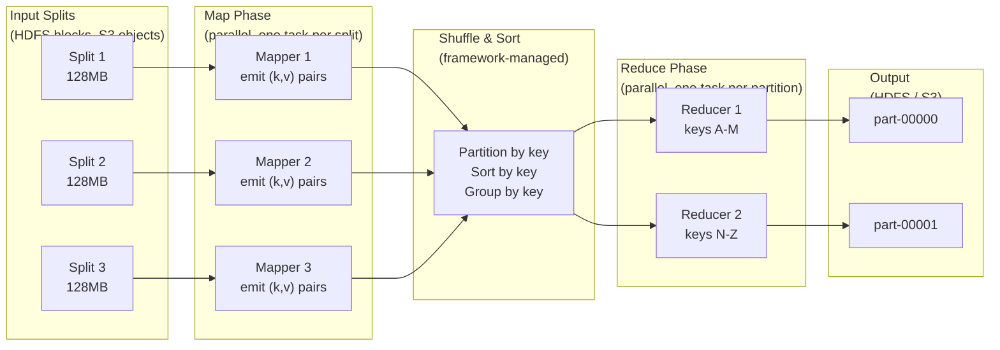

# MapReduce — Parallel Batch Processing at Scale

> [!abstract] TL;DR
> MapReduce is a programming model for processing massive datasets in parallel across commodity hardware clusters. You write two simple functions — **Map** (transform each record into key-value pairs) and **Reduce** (aggregate values with the same key) — and the framework handles distribution, fault tolerance, and output merging automatically. Google's 2004 paper used it to process 10TB+ datasets; Hadoop made it open-source. Modern alternatives (Spark, Flink) improve on it with in-memory processing and streaming.

## Intuition — analogy FIRST

Imagine you run a library and need to count how many times every word appears across 1 million books. Doing it sequentially would take years.

Instead, you hire 1,000 librarians (mappers). You hand each librarian 1,000 books. Each librarian reads every word and writes index cards: one card per word occurrence — "the" → 1, "cat" → 1, "the" → 1, etc. They produce millions of cards.

Then you hire 26 sorters (shuffle phase). Sorter A collects all "a-words", sorter B all "b-words", etc. Each sorter hands their sorted stack to a specialist (reducer). The specialist simply counts the cards in each pile and writes the total: "the" → 14,832,991.

That's MapReduce. Your business logic fits into two simple functions. The framework does all the logistics.

## How It Works

### The Two Functions

**Map function:** Takes one input record (key, value). Emits zero or more intermediate (key, value) pairs.

```python
def map(document_id, document_text):
    for word in document_text.split():
        emit(word.lower(), 1)          # emit intermediate key-value pair

# Input:  (doc1, "The cat sat on the mat")
# Output: [("the",1), ("cat",1), ("sat",1), ("on",1), ("the",1), ("mat",1)]
```

**Reduce function:** Takes one key and all values for that key. Emits aggregated output.

```python
def reduce(word, counts):
    emit(word, sum(counts))            # aggregate all counts for this word

# Input:  ("the", [1, 1, 1, 1, 1])
# Output: ("the", 5)
```

### The Three Phases



### The Shuffle Phase (The Hard Part)

The shuffle is the framework's most expensive and complex step — and the part developers don't write:

1. **Partition** — Each mapper partitions its output by key using a hash function: `partition = hash(key) % num_reducers`. All values for a given key always go to the same reducer.
2. **Sort** — Within each partition, intermediate key-value pairs are sorted by key. This is what allows the reducer to receive values grouped by key.
3. **Merge** — Across mappers, data for the same reducer is merged and transferred over the network (the network shuffle — often the bottleneck).
4. **Group** — Values for identical keys are grouped so the reduce function receives (key, [v1, v2, v3, ...]).

**Combiner (optional):** A mini-reducer run locally on each mapper's output before the shuffle. For the word count, instead of emitting ("the", 1) fifty times, the combiner emits ("the", 50) once — dramatically reducing network I/O. Only valid for associative and commutative operations.

### Fault Tolerance

- **Master** (JobTracker in Hadoop) monitors all tasks
- If a mapper fails, the master re-runs that map task on a different machine (input data is read from HDFS again)
- If a reducer fails, the master re-runs the reduce task (intermediate data from mappers is re-read from local disk)
- **Stragglers:** Slow tasks are the main latency killer. Hadoop launches **speculative execution** — backup copies of slow tasks — and takes the first result

### Complexity

```
Map:     O(N/M) per mapper — N total records, M mappers run in parallel
Shuffle: O(N log N) — dominated by the sort across all intermediate key-value pairs
Reduce:  O(output size) per reducer
Total wall-clock time: O(N/M) + O(N log N / R) where R = number of reducers
```

## Real-World Systems

| System | Notes |
|---|---|
| **Google MapReduce (2004)** | Original implementation; processed web crawl data, logs, inverted index construction |
| **Apache Hadoop** | Open-source MapReduce + HDFS; dominant 2008–2015; still used for batch ETL |
| **Apache Spark** | In-memory MapReduce; DAG execution (multiple map/reduce chained without disk writes); 10–100x faster for iterative workloads |
| **Apache Flink** | Streaming-first; sub-second latency; also handles batch via unified API |
| **AWS EMR** | Managed Hadoop/Spark on EC2; no cluster management |
| **Google Dataflow** | Managed Apache Beam runner; unified batch + streaming |
| **dbt** | SQL-based transformation layer on warehouse data; conceptually a MapReduce abstraction |

## Trade-offs

| Dimension | Hadoop MapReduce | Apache Spark | Apache Flink |
|---|---|---|---|
| **Processing model** | Batch only | Batch + micro-batch streaming | True streaming + batch |
| **Latency** | Minutes to hours | Seconds (batch); sub-second (streaming) | Milliseconds to seconds |
| **Memory use** | Disk-heavy (spills between stages) | In-memory (configurable spill) | In-memory with managed memory |
| **Fault tolerance** | Rerun failed tasks from HDFS | Lineage-based recomputation (RDD) | Checkpointing + state snapshots |
| **Ease of use** | Verbose Java API | Expressive Python/Scala/SQL API | Good API; steeper learning curve |
| **Iterative algorithms** (ML) | Very slow — disk between each iteration | Fast — data stays in memory | Fast |
| **Operational complexity** | High (YARN, NameNode, DataNode) | Moderate | Moderate–High |
| **Ecosystem maturity** | Very mature (10+ years) | Very mature | Mature, growing |

## When to Use vs Avoid

**Use MapReduce / batch processing when:**
- Processing TB–PB datasets offline (nightly ETL, log processing, data warehouse jobs)
- No strict latency requirement — output is used hours or days later
- Transforming raw data at rest (S3, HDFS) into structured analytics tables
- Running iterative analytics that don't need real-time results (e.g., monthly billing aggregation)

**Avoid when:**
- Real-time or near-real-time results needed (use Kafka + Flink/Spark Streaming)
- Dataset fits in memory on one machine — distributed overhead dominates; use pandas, DuckDB
- Interactive exploratory queries — latency too high (use Spark SQL, Presto/Trino, BigQuery)
- Simple tasks on small data — MapReduce startup overhead (minutes) dwarfs actual computation

## Common Pitfalls

1. **Data skew in the shuffle** — If one key ("the" in word count) has vastly more values than others, one reducer becomes a hot spot while all others finish. Mitigation: salting keys, using a custom partitioner, or pre-aggregating with a combiner.

2. **Not using a combiner** — Forgetting to write a combiner for associative operations wastes enormous network bandwidth. The combiner is free performance for sum, count, max, min operations.

3. **Too many small input files** — Hadoop's overhead per task is high. 10,000 files of 1MB each is far worse than 100 files of 100MB each. Compact small files with SequenceFiles or Parquet before processing.

4. **Ignoring speculative execution** — A single slow node (hardware issue, network congestion) can delay the entire job if speculative execution is disabled. Enable it for production jobs.

5. **Writing too many output files** — Each reducer writes one output file. With 1,000 reducers, you get 1,000 output files — painful for downstream readers. Coalesce output or use a single reducer for small outputs.

6. **Using MapReduce for iterative algorithms** — Machine learning algorithms that require 100 passes over data (gradient descent) are catastrophically slow in Hadoop MapReduce because each iteration reads/writes disk. Use Spark MLlib instead.

## Related Concepts

- [[_MOC_SearchAlgorithms|↑ Section MOC]]
- [[Kafka]] — Kafka is often the source of streaming data that triggers or feeds into batch MapReduce/Spark jobs
- [[Databases]] — MapReduce is an alternative to SQL-on-Hadoop; output often lands in a data warehouse
- [[Data_Pipelines]] — MapReduce is one building block in larger ETL/ELT pipeline architectures
- [[Elasticsearch]] — Spark jobs commonly write transformed output to Elasticsearch for search

## Review Questions

1. **You are running a word count MapReduce job on 1 TB of text split into 128MB HDFS blocks across a 20-node cluster.** How many map tasks will run? If the word "the" appears in 40% of all records, how many key-value pairs does the single reducer for "the" need to process, and how does a combiner help?

2. **A MapReduce job takes 45 minutes but one reducer consistently finishes 30 minutes after all others.** What is the most likely cause? Name three ways to diagnose and fix the issue.

3. **Compare Hadoop MapReduce vs Apache Spark for training a logistic regression model with 50 iterations of gradient descent over a 500GB dataset.** Quantify the disk I/O difference between the two frameworks and explain which wins and why.

## Sources

- Dean & Ghemawat, "MapReduce: Simplified Data Processing on Large Clusters", OSDI 2004 — [research.google.com](https://research.google.com/archive/mapreduce-osdi04.pdf)
- Apache Hadoop Documentation — [hadoop.apache.org](https://hadoop.apache.org/docs/current/)
- Apache Spark: "Resilient Distributed Datasets: A Fault-Tolerant Abstraction for In-Memory Cluster Computing", Zaharia et al., NSDI 2012
- "Designing Data-Intensive Applications" — Martin Kleppmann, Chapter 10 (Batch Processing)
- Apache Flink Documentation — [flink.apache.org](https://flink.apache.org/docs/)

#SystemDesign #MapReduce #BatchProcessing #Hadoop #Spark #Flink #BigData #DistributedComputing
