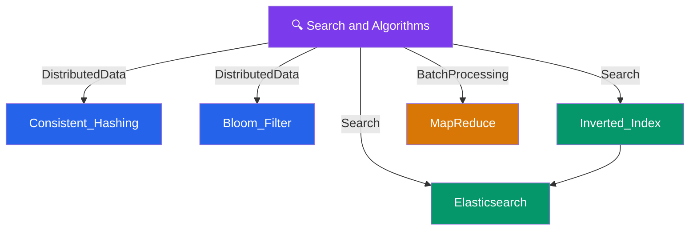

# 🔍 Search & Algorithms — Map of Content

> [!abstract] What This Section Covers
> The data structures and algorithms that power distributed systems at scale: how to distribute data evenly without rehashing everything (Consistent Hashing), how to check membership without storing all keys (Bloom Filters), how search engines index text (Inverted Index), how to run full-text search in production (Elasticsearch), and how to process massive datasets across a cluster (MapReduce).

## Concept Map

## Learning Path

1. [[Consistent_Hashing]] — Ring-based partitioning that minimizes remapping when nodes are added or removed
2. [[Bloom_Filter]] — Probabilistic data structure that answers "definitely not in set" with zero false negatives
3. [[Inverted_Index]] — Core data structure behind every search engine: term → document list
4. [[Elasticsearch]] — Production search built on Lucene + inverted indexes: sharding, replicas, analyzers
5. [[MapReduce]] — Batch computation model: split input → Map phase → shuffle/sort → Reduce phase

## All Notes at a Glance

| Note | Summary | Difficulty |
|------|---------|------------|
| [[Consistent_Hashing]] | Hashes nodes and keys onto a ring so that adding or removing a node only remaps a fraction of keys — essential for distributed caches and databases | Intermediate |
| [[Bloom_Filter]] | Space-efficient probabilistic data structure that answers membership queries with guaranteed no false negatives but possible false positives | Intermediate |
| [[Inverted_Index]] | Maps each unique term to the list of documents containing it, enabling O(1) document lookup by keyword rather than full-table scan | Intermediate |
| [[Elasticsearch]] | Distributed search and analytics engine using Lucene inverted indexes with horizontal sharding, replication, and a rich query DSL | Intermediate |
| [[MapReduce]] | Programming model for processing large datasets in parallel: Map tasks transform input, Reduce tasks aggregate results across a cluster | Intermediate |

## Key Questions This Section Answers

- Why consistent hashing over modulo hashing when nodes are added or removed?
- Where do Bloom filters save disk I/O in practice (e.g., Cassandra, HBase, CDNs)?
- How does an inverted index make full-text search faster than a LIKE query?
- When would you run Elasticsearch vs a relational full-text search extension (pg_trgm)?
- What are the limitations of MapReduce compared to streaming systems like Spark or Flink?
- How does virtual node (vnode) assignment improve load distribution in consistent hashing?

## Related Sections

- [[_MOC_SystemDesign_Master|↑ System Design Master MOC]]
- [[_MOC_Databases]] — Consistent hashing and Bloom filters appear in NoSQL internals (Cassandra, DynamoDB)
- [[_MOC_EventDriven]] — MapReduce and streaming pipelines often consume Kafka topics
- [[_MOC_Caching]] — Bloom filters are used in cache layers to avoid unnecessary backend lookups

#MOC #SystemDesign
