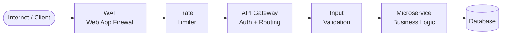

# 🛡️ API Security

> [!abstract] TL;DR
> API security is defense-in-depth: every request passes through layered controls before it touches business logic. The OWASP API Top 10 names the most exploited gaps — broken object-level auth, missing rate limiting, excessive data exposure. Hardening means: HTTPS only, authenticate every endpoint, validate all input (whitelist), apply rate limiting, set security headers, and use parameterized queries. Never trust the caller, even if they have a valid token.

---

## Intuition — analogy FIRST

Think of an API as a bank's teller window. The bank doesn't just unlock the door for anyone:

1. **Security guard (WAF):** blocks known criminals before they enter
2. **Queue management (rate limiter):** prevents one person from monopolizing all tellers
3. **ID check (authentication):** confirms who you are
4. **Account authorization:** confirms you can access *this* account, not just *any* account
5. **Teller validates your form (input validation):** rejects forms with nonsense data before processing
6. **Tinted windows (security headers):** prevents outsiders from watching transactions

Every layer can be bypassed if another layer fails. That is why each layer must be independently enforced — never rely on "the layer before me already checked this."

---

## How It Works

### Security Layer Architecture



Each node is a kill switch — a request that fails at any layer is rejected before it reaches the next.

---

### 1. HTTPS Only (TLS 1.2+)

The absolute minimum. All API traffic must be over TLS.

- Redirect all HTTP to HTTPS at the load balancer
- Set `Strict-Transport-Security: max-age=31536000; includeSubDomains` (HSTS) — tells browsers to never attempt HTTP
- Disable TLS 1.0 and 1.1 in your load balancer configuration

---

### 2. Authentication on Every Endpoint

No endpoint should be accidentally unauthenticated. Apply an authentication middleware globally and explicitly opt-out only for health-check/public routes.

```
// BAD: opt-in auth (easy to forget)
router.get('/admin/users', authMiddleware, handler)

// GOOD: opt-out (secure by default)
app.use(authMiddleware)          // applied to all routes
router.get('/health', noAuth, healthCheck)  // explicit public exception
```

**API Keys vs OAuth Tokens:**

| | API Keys | OAuth Access Tokens |
|---|---|---|
| Best for | M2M, third-party integrations | User-delegated access |
| Revocation | Delete the key | Let token expire or revoke via auth server |
| Scoping | Usually all-or-nothing | Fine-grained scopes |
| Rotation | Manual or scheduled | Automatic via refresh token |
| Example | Stripe secret key, SendGrid key | GitHub OAuth, Google API |

---

### 3. Authorization — Object-Level and Function-Level

**Broken Object Level Authorization (BOLA/IDOR)** is the #1 OWASP API vulnerability. A user with a valid token requests another user's resource by guessing the ID.

```
// VULNERABLE
GET /api/orders/12345
// Server returns order 12345 regardless of who owns it

// SECURE
GET /api/orders/12345
// Server checks: does authenticated user OWN order 12345? Reject if not.
```

**Broken Function Level Authorization:** Admin endpoints accessible to regular users.

```
POST /api/admin/delete-user   // Must check role === 'admin', not just any valid token
```

Never rely on "security through obscurity" — attackers enumerate IDs and guess endpoint paths.

---

### 4. Input Validation — Whitelist, Not Blacklist

Blacklisting tries to block known bad inputs. Attackers always find new encodings. Whitelisting defines exactly what is valid and rejects everything else.

```
// BAD: Blacklisting
if (input.contains("DROP TABLE")) reject()

// GOOD: Whitelisting
if (!input.matches("^[a-zA-Z0-9_-]{1,50}$")) reject()
```

Validate:
- **Type** (string, integer, boolean)
- **Format** (UUID, email, date format)
- **Length** (min and max)
- **Allowed characters** (regex whitelist)
- **Allowed values** (enum for fixed sets)

Use a validation library (Joi, Zod, Pydantic, Hibernate Validator) — never hand-roll validation.

---

### 5. SQL Injection Prevention — Parameterized Queries

SQL injection remains in the OWASP Top 10 because developers still concatenate user input into queries.

```sql
-- VULNERABLE
query = "SELECT * FROM users WHERE email = '" + userInput + "'"
-- attacker input: ' OR '1'='1  →  returns all users

-- SAFE: Parameterized query
query = "SELECT * FROM users WHERE email = ?"
execute(query, [userInput])
-- DB treats userInput as data, never as SQL
```

Also applies to: NoSQL injection (MongoDB `$where`), LDAP injection, OS command injection. The pattern is the same: never interpolate user data into executable strings.

---

### 6. Rate Limiting

Prevents abuse, brute force, and DDoS at the API layer. Apply at multiple scopes:

| Scope | Example Limit | Use |
|---|---|---|
| Global | 10,000 req/min per IP | DDoS mitigation |
| Per API key | 1,000 req/min | Fair usage enforcement |
| Per endpoint | 5 login attempts/min per user | Brute force prevention |
| Per resource | 100 req/min per user per resource | Prevent scraping |

Return `429 Too Many Requests` with `Retry-After` header. Use sliding window or token bucket algorithms. See [[Rate_Limiting]] for implementation detail.

---

### 7. CORS Policy

CORS (Cross-Origin Resource Sharing) controls which browser origins can call your API.

```
// BAD: wildcard allows any website to make authenticated requests
Access-Control-Allow-Origin: *

// GOOD: explicit allowlist
Access-Control-Allow-Origin: https://app.example.com
Access-Control-Allow-Methods: GET, POST, PUT
Access-Control-Allow-Headers: Content-Type, Authorization
```

A wildcard `*` with `Access-Control-Allow-Credentials: true` is blocked by browsers — but the risk is accidentally being too permissive. Maintain an explicit allowlist of origins.

---

### 8. Security Headers

Every API response should include:

| Header | Value | Purpose |
|---|---|---|
| `Strict-Transport-Security` | `max-age=31536000; includeSubDomains` | Force HTTPS |
| `X-Content-Type-Options` | `nosniff` | Prevent MIME-type sniffing |
| `X-Frame-Options` | `DENY` | Prevent clickjacking |
| `Content-Security-Policy` | (see below) | Restrict script/resource sources |
| `Referrer-Policy` | `strict-origin-when-cross-origin` | Limit referrer data leakage |
| `Permissions-Policy` | `camera=(), microphone=()` | Disable browser features |

Remove information-leaking headers: `Server: nginx/1.14.0`, `X-Powered-By: Express`. Attackers use these for targeted exploits.

---

### 9. Request Signing — AWS Signature V4 Pattern

For high-security APIs (especially webhooks and M2M), sign requests cryptographically instead of relying on a token alone.

**Webhook signing (Stripe pattern):**
1. Stripe computes `HMAC-SHA256(secret, timestamp + "." + payload)`
2. Sends the signature in `Stripe-Signature` header
3. Your server recomputes the HMAC and compares — if it matches, the request is authentic
4. Reject requests where `|now - timestamp| > 5 minutes` to prevent replay attacks

**AWS Signature V4:**
```
StringToSign = Method + "\n" + CanonicalURI + "\n" + Date + "\n" + HashedPayload
Signature = HMAC-SHA256(signingKey, StringToSign)
Authorization: AWS4-HMAC-SHA256 Credential=.../Signature=...
```

This ties the request to a specific time, specific payload, and specific caller — any tampering invalidates the signature.

---

### 10. OWASP API Top 10 (2023)

| Rank | Vulnerability | Example | Fix |
|---|---|---|---|
| API1 | Broken Object Level Authorization (BOLA) | `GET /users/456` when user is 123 | Check ownership on every object access |
| API2 | Broken Authentication | No token expiry; weak API keys | Proper auth, expiring tokens, MFA |
| API3 | Broken Object Property Level Auth | Can update `role` field via mass assignment | Allowlist updateable fields |
| API4 | Unrestricted Resource Consumption | No rate limits; 1GB upload allowed | Rate limiting, payload size limits |
| API5 | Broken Function Level Authorization | Regular user hits `/admin/delete` | Role checks on admin endpoints |
| API6 | Unrestricted Access to Sensitive Flows | Unlimited OTP attempts | Rate limit sensitive flows |
| API7 | Server-Side Request Forgery (SSRF) | API fetches attacker-supplied URL hitting `169.254.169.254` | Validate/allowlist URLs; block cloud metadata IPs |
| API8 | Security Misconfiguration | Debug mode on, verbose errors, wildcard CORS | Secure defaults, minimal attack surface |
| API9 | Improper Inventory Management | Old `/v1/` endpoint still live and unmonitored | Maintain API inventory; decommission old versions |
| API10 | Unsafe Consumption of APIs | Trust third-party API responses without validation | Validate and sanitize all external data |

---

## Real-World Systems / Standards

| System | API Security Practice |
|---|---|
| **Stripe** | Idempotency keys prevent double-charging; webhook signing (HMAC-SHA256); API versioning via date-based headers |
| **AWS Signature V4** | Every AWS SDK call signs the request with your secret key + timestamp + payload hash — impossible to replay or tamper |
| **GitHub API** | Rate limits (5,000 req/hour authenticated; 60 unauthenticated); OAuth scopes; fine-grained personal access tokens |
| **Twilio** | Webhook signature validation using your auth token; request timestamp validation (5-min window) |
| **Cloudflare WAF** | Managed ruleset blocks SQLi, XSS, OWASP Top 10 at the edge before traffic reaches origin |

---

## Trade-offs (table)

| Control | Pros | Cons |
|---|---|---|
| Strict input whitelisting | Eliminates injection at source | Legitimate edge-case inputs may be rejected; requires maintenance |
| Short JWT expiry (15 min) | Limits breach window | More refresh traffic; UX complexity |
| API key auth (no OAuth) | Simple to implement | All-or-nothing; no fine-grained scopes; no user context |
| Aggressive rate limiting | Stops abuse and DDoS | May throttle legitimate burst traffic; needs tuning per use case |
| Parameterized queries (ORM) | Eliminates SQLi class | ORM abstractions can generate inefficient queries |
| Security headers | Low effort, high value | Some headers (CSP) require significant tuning to not break functionality |
| Request signing | Cryptographically verifiable | Extra complexity for callers; key management required |

---

## When to Use vs Avoid

**Always:** HTTPS, authentication, parameterized queries, input validation, rate limiting, security headers. These are non-negotiable baselines regardless of scale.

**Use request signing (HMAC)** for webhooks and high-value M2M integrations where you need proof the payload wasn't tampered with in transit.

**Use WAF** at the edge for public-facing APIs — it blocks known attack patterns before they consume backend resources.

**Use API keys** for third-party developer integrations where individual user context is not needed (e.g., CLI tools, CI/CD pipelines, server-to-server).

**Use OAuth scopes** when you need fine-grained, user-delegated permission control.

**Avoid verbose error messages in production.** `"Column 'users.email' does not exist at position 32"` tells an attacker your schema. Return generic errors to clients; log details server-side.

---

## Common Pitfalls

1. **BOLA (Insecure Direct Object Reference).** Checking that a user is logged in but not checking that they own the resource. Always validate ownership at the resource level, not just at the route level.

2. **Mass assignment vulnerabilities.** Passing the entire request body to an ORM update: `user.update(req.body)` — an attacker adds `{"role": "admin"}` to the payload. Explicitly list allowed fields.

3. **Logging sensitive data.** Request/response logging that captures Authorization headers, API keys, or PII. Redact sensitive fields before logging.

4. **No payload size limits.** An attacker uploads a 10GB file or sends a deeply nested JSON object to exhaust memory. Set `Content-Length` limits and depth limits on JSON parsing.

5. **Trusting internal services without auth.** "It's only called from our own services so it doesn't need auth." Internal microservices still need authentication — lateral movement exploits this assumption.

6. **Forgotten API versions.** `v1` of your API is deprecated but still running. It lacks the security controls added in `v2`. Attackers find it via fuzzing. Actively decommission old API versions.

---

## Related Concepts

- [[_MOC_Security|↑ Section MOC]]
- [[Rate_Limiting]] — algorithms and implementation for throttling API requests
- [[Authentication_and_Authorization]] — foundational identity and access control for APIs
- [[OAuth_and_JWT]] — token-based auth patterns for API access
- [[API_Gateway]] — the infrastructure layer where many of these controls are applied
- [[TLS_and_HTTPS]] — transport security prerequisite for all API security

---

## Review Questions

1. An attacker sends `GET /api/v1/invoices/9999` to your API with a valid JWT for user A. The invoice belongs to user B. Your authentication middleware correctly validates the JWT. What specific check is missing, what OWASP category is this, and where in your code should the check live?

2. A partner integration sends webhooks to your API. You want to verify the webhook is genuinely from your partner and the payload hasn't been modified. Design the signing mechanism both sides need to implement, including replay attack prevention.

3. Your API returns detailed error messages including stack traces to help developers debug. In a security review, this is flagged as a risk. Explain the threat, propose a fix that preserves debuggability for your team while protecting production users.

---

## Sources

- OWASP API Security Top 10 (2023): https://owasp.org/API-Security/editions/2023/en/0x00-header/
- Stripe Webhook Signatures: https://stripe.com/docs/webhooks/signatures
- AWS Signature Version 4: https://docs.aws.amazon.com/general/latest/gr/signature-version-4.html
- OWASP REST Security Cheat Sheet: https://cheatsheetseries.owasp.org/cheatsheets/REST_Security_Cheat_Sheet.html
- Mozilla Security Headers Reference: https://developer.mozilla.org/en-US/docs/Web/HTTP/Headers
- OWASP Input Validation Cheat Sheet: https://cheatsheetseries.owasp.org/cheatsheets/Input_Validation_Cheat_Sheet.html

#SystemDesign #Security #API #OWASP #RateLimiting #InputValidation #SQLInjection #CORS #SecurityHeaders #WebhookSigning
