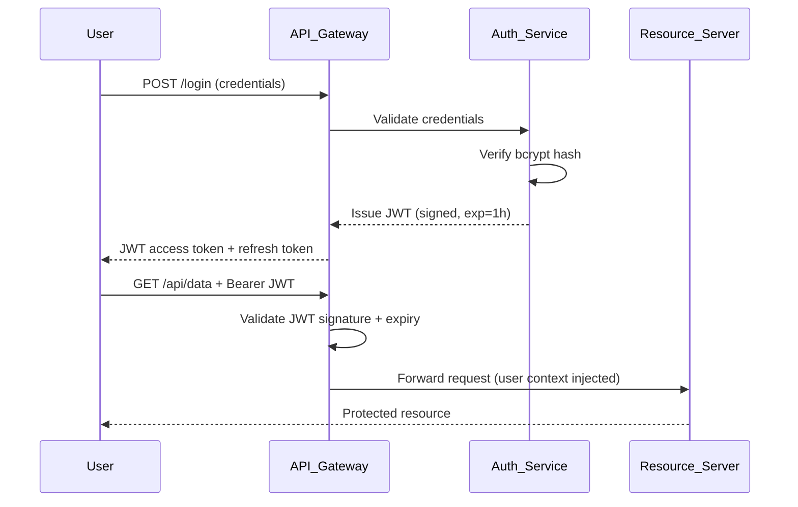

# 🔐 Authentication and Authorization

> [!abstract] TL;DR
> **Authentication (AuthN)** answers "Who are you?" — verifying identity. **Authorization (AuthZ)** answers "What can you do?" — enforcing permissions. They are distinct concepts that work in sequence: authenticate first, then authorize. Use bcrypt/Argon2 for passwords, JWTs for stateless sessions, and RBAC or ABAC for permission models depending on complexity.

---

## Intuition — analogy FIRST

Think of a nightclub:

- **Authentication** is the bouncer checking your ID at the door — proving you are who you claim to be.
- **Authorization** is your wristband color after you get in — a VIP band lets you into the back room; a regular band does not.

You can be authenticated (you showed a valid ID) but still unauthorized (your wristband doesn't allow entry to the VIP area). These are two entirely separate checkpoints, and conflating them is one of the most common security mistakes in engineering.

---

## How It Works

### Authentication Methods

| Method | Mechanism | Strength |
|---|---|---|
| Password + Hash | User provides password; server verifies bcrypt/Argon2 hash | Medium |
| MFA — TOTP | Time-based one-time password (Google Authenticator) | High |
| MFA — SMS | OTP sent via SMS | Medium (SIM-swap risk) |
| SSO via SAML | Enterprise federation; XML assertions between IdP and SP | High |
| SSO via OAuth/OIDC | Token-based federation; JSON assertions | High |
| Certificate-based | Mutual TLS; client presents X.509 cert | Very High |

### Password Storage — Never Plaintext

```
plaintext      →  NEVER store this
MD5/SHA-1      →  NEVER (fast, rainbow-table vulnerable)
bcrypt         →  GOOD — adaptive cost factor, built-in salt
Argon2id       →  BEST — memory-hard, winner of Password Hashing Competition
```

Always add a **salt** (random per-user bytes mixed into the hash) to prevent rainbow-table attacks. bcrypt and Argon2 handle this automatically.

### Sessions vs JWTs

| Aspect | Session Cookies | JWTs |
|---|---|---|
| Storage | Server-side session store (Redis) | Client-side (stateless) |
| Revocation | Instant — delete session from store | Hard — must wait for expiry or use a blocklist |
| Scalability | Requires sticky sessions or shared store | Scales horizontally (no shared state) |
| Size | Small (session ID only) | Larger (full payload) |
| Best for | Monoliths, traditional web apps | Microservices, APIs, SPAs |

### Authorization Models

**ACL (Access Control List):** A list attached to each resource naming who has what access. Simple, but becomes unmanageable at scale.

**RBAC (Role-Based Access Control):** Users are assigned roles (admin, editor, viewer); roles have permissions. Easy to reason about. Used by GitHub org roles, AWS managed policies.

**ABAC (Attribute-Based Access Control):** Decisions based on attributes of user, resource, and environment (e.g., "allow if user.department == resource.owner AND time < 18:00"). More expressive but harder to audit. Used by AWS IAM condition keys.

**Policy-Based (OPA/Cedar):** Permissions expressed as declarative policies evaluated at runtime. Used by Netflix (OPA), AWS Cedar.

### Token-Based Auth Flow



---

## Real-World Systems / Standards

| System | AuthN | AuthZ |
|---|---|---|
| **Google SSO** | SAML 2.0 / OIDC (OAuth 2.0 + ID token) | Workspace scopes |
| **GitHub** | Password + MFA + SSH keys | Org roles (RBAC): owner, member, billing manager |
| **AWS IAM** | Access key + secret / STS tokens | ABAC via policy conditions (`aws:RequestTag`) |
| **Kubernetes** | X.509 certs / OIDC tokens | RBAC (ClusterRole, RoleBinding) |
| **Stripe** | API key (secret key) | Restricted keys scoped to specific API capabilities |

---

## Trade-offs (table)

| Approach | Pros | Cons |
|---|---|---|
| Session cookies | Simple revocation, small token | Requires shared state store, CSRF risk |
| JWT (stateless) | Scalable, no DB lookup per request | Hard to revoke, larger payload, secret rotation risk |
| RBAC | Intuitive, auditable | Role explosion at scale; coarse-grained |
| ABAC | Fine-grained, context-aware | Complex policy management, harder to debug |
| MFA (TOTP) | Strong second factor, offline | User friction, recovery key management |
| MFA (SMS) | Easy UX | SIM-swapping attacks, telecom dependency |

---

## When to Use vs Avoid

**Use sessions** when your app is a traditional server-rendered monolith with a single domain. Sessions are easy to revoke and straightforward to audit.

**Use JWTs** when you have multiple microservices or a distributed API — they avoid a round-trip to a central session store on every request. Keep expiry short (15–60 min) and use refresh tokens.

**Use RBAC** when your permission structure maps cleanly to a small, stable set of job functions. Start here by default.

**Use ABAC** when RBAC produces role explosion (hundreds of roles) or when you need context-aware decisions (time-of-day, resource sensitivity level, geographic restrictions).

**Avoid** certificate-based auth for end users (complex UX) — reserve it for service-to-service (mTLS).

---

## Common Pitfalls

1. **Storing passwords in plaintext or with MD5/SHA-1.** Use bcrypt (cost factor 12+) or Argon2id. Non-negotiable.

2. **Conflating AuthN and AuthZ.** Authentication confirms identity; authorization checks permissions. A system that authenticates but skips authorization checks is a fully open API to any logged-in user.

3. **Not expiring tokens.** JWTs without `exp` claims are permanent — if a token leaks, that user is compromised forever. Always set expiry (15–60 min for access tokens).

4. **Overly permissive roles.** "Give everyone admin for now, tighten later" almost never gets tightened. Apply principle of least privilege from day one.

5. **Storing refresh tokens insecurely.** Refresh tokens are as powerful as passwords. Store server-side with rotation — each use issues a new token and invalidates the old.

6. **Missing authorization checks on internal/admin endpoints.** Attackers look for `POST /admin/delete-user` that only checks for *any* valid JWT, not an *admin* JWT.

---

## Related Concepts

- [[OAuth_and_JWT]] — token standards and OAuth 2.0 flows
- [[TLS_and_HTTPS]] — securing the transport layer during auth exchanges
- [[API_Gateway]] — where token validation and auth middleware typically live
- [[API_Security]] — broader API hardening including auth

---

## Review Questions

1. A user logs into your app successfully but can see another user's private data by changing the `userId` in the URL. Is this an authentication failure or an authorization failure? What OWASP category does this represent?

2. Your team wants to use JWTs for a banking application. A user reports their phone was stolen. How do you invalidate the stolen user's JWT immediately without switching to server-side sessions entirely?

3. Compare RBAC and ABAC for a healthcare system where doctors can only access records for patients assigned to their ward, and only during their scheduled shift. Which model fits better, and why?

---

## Sources

- OWASP Authentication Cheat Sheet: https://cheatsheetseries.owasp.org/cheatsheets/Authentication_Cheat_Sheet.html
- OWASP Authorization Cheat Sheet: https://cheatsheetseries.owasp.org/cheatsheets/Authorization_Cheat_Sheet.html
- NIST SP 800-63B (Digital Identity Guidelines): https://pages.nist.gov/800-63-3/sp800-63b.html
- AWS IAM Best Practices: https://docs.aws.amazon.com/IAM/latest/UserGuide/best-practices.html
- bcrypt Design Paper — Provos & Mazières (1999)

#SystemDesign #Security #Authentication #Authorization #IAM #RBAC #ABAC #JWT #SSO #MFA
