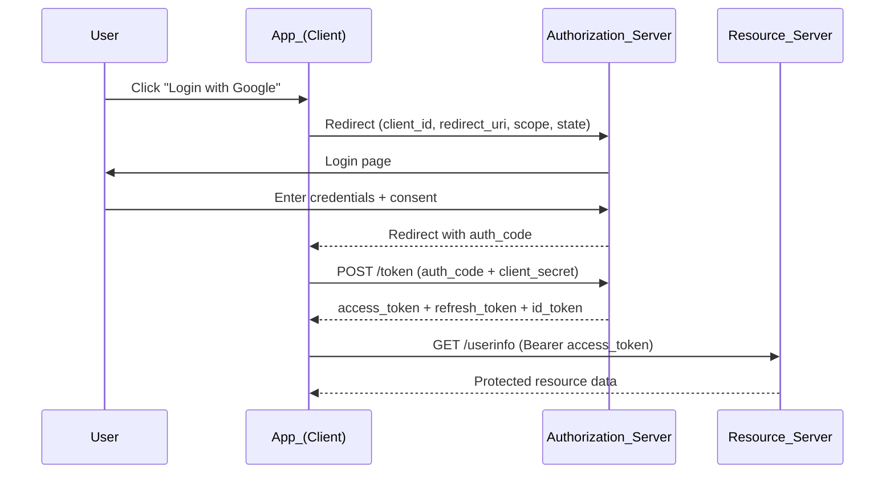

# 🎟️ OAuth 2.0 and JWT

> [!abstract] TL;DR
> **OAuth 2.0** is an *authorization* framework for delegating access to resources without sharing credentials — "Login with Google" delegates read access to your profile without giving the app your Google password. **JWT (JSON Web Token)** is a compact, self-contained token format: `header.payload.signature`. JWTs enable stateless validation across services. **OIDC** adds an identity layer on top of OAuth 2.0 for SSO. Never store JWTs in localStorage (XSS risk); always set `exp`; prefer RS256 over HS256 for distributed systems.

---

## Intuition — analogy FIRST

**OAuth 2.0 — the valet key analogy:**
A car's valet key opens the door and starts the engine, but cannot open the glove compartment or trunk. You hand a valet your valet key — not your master key. OAuth 2.0 gives a third-party app a "valet key" (access token) with limited scope, not your actual credentials. The app can do what the token permits; nothing more.

**JWT — the stamped wristband analogy:**
At a multi-venue festival, the organizer stamps your wrist at the entrance. At any venue stage, staff can verify the stamp without calling the organizer's office. The stamp is self-contained proof. A JWT is your digital wristband: any service that knows the signing key can verify it instantly, no central lookup needed.

---

## How It Works

### OAuth 2.0 — Four Flows

| Flow | Use Case | How It Works |
|---|---|---|
| **Authorization Code** | Web apps with a backend server | Redirect to auth server, get auth code, exchange for tokens server-side |
| **PKCE** (Proof Key for Code Exchange) | Mobile apps / SPAs (no secure backend) | Authorization Code + cryptographic challenge to prevent code interception |
| **Client Credentials** | Machine-to-machine (M2M) | App sends client ID + secret directly; gets access token (no user involved) |
| **Device Flow** | TVs, CLIs, IoT | Device shows a code; user approves on phone/browser; device polls for token |

**Authorization Code Flow (most common):**



**Key roles in OAuth 2.0:**
- **Resource Owner:** The user who owns the data
- **Client:** The app requesting access
- **Authorization Server:** Issues tokens (Google, GitHub, Auth0)
- **Resource Server:** Hosts the protected data (Google Drive API, GitHub API)

### Access Token + Refresh Token Pattern

```
Access Token:    Short-lived (15 min – 1 hour). Sent with every API request.
Refresh Token:   Long-lived (days – months). Used ONCE to get a new access token.
                 Stored securely server-side; rotate on each use.
```

When the access token expires, the client silently uses the refresh token to get a new one without re-prompting the user.

### JWT — Anatomy

A JWT is three Base64URL-encoded JSON objects joined by dots:

```
eyJhbGciOiJSUzI1NiIsInR5cCI6IkpXVCJ9   ← Header
.eyJzdWIiOiJ1c2VyXzEyMyIsImVtYWlsIjoiYW...  ← Payload (Claims)
.SflKxwRJSMeKKF2QT4fwpMeJf36POk6yJV_adQ...  ← Signature
```

**Header:**
```json
{ "alg": "RS256", "typ": "JWT" }
```

**Payload (Claims):**
```json
{
  "sub": "user_123",          // Subject (user ID)
  "iss": "https://auth.example.com",  // Issuer
  "aud": "api.example.com",  // Audience (intended recipient)
  "exp": 1753574400,          // Expiry (Unix timestamp) — ALWAYS set this
  "iat": 1753570800,          // Issued at
  "email": "user@example.com",
  "roles": ["editor"]
}
```

**Signature:** The server signs the header + payload using its private key (RS256) or a shared secret (HS256). Any recipient with the public key can verify the signature without contacting the auth server.

### HS256 vs RS256

| | HS256 (HMAC-SHA256) | RS256 (RSA-SHA256) |
|---|---|---|
| Key type | Shared secret (symmetric) | Public/private key pair (asymmetric) |
| Verification | Any service with the secret | Any service with the *public* key |
| Secret distribution | Must share secret with all verifying services — secret sprawl risk | Public key is safe to distribute widely |
| Best for | Single service (auth + verification same app) | Distributed microservices |

**Prefer RS256** when multiple services validate JWTs. Share only the public key. The private key stays on the auth server.

### JWT vs Opaque Tokens

| | JWT (Self-Contained) | Opaque Token |
|---|---|---|
| Validation | Local — check signature + claims | Remote — lookup in DB/cache |
| Revocation | Hard — must wait for `exp` or use blocklist | Instant — delete from store |
| Latency | Zero (no network call) | +latency for each token lookup |
| Token size | Larger (carries claims) | Small (random string) |
| Privacy | Claims visible to anyone with Base64 decoder (encode ≠ encrypt) | Opaque — no info leakage |

### OpenID Connect (OIDC) — OAuth 2.0 + Identity

OAuth 2.0 alone says nothing about who the user *is* — it only delegates access. OIDC adds:
- An **ID Token** (a JWT containing user identity: `sub`, `name`, `email`, `picture`)
- A `/userinfo` endpoint
- Standardized scopes: `openid`, `profile`, `email`

OIDC = OAuth 2.0 + "who is this user?" → enables SSO across apps.

**Google Sign-In, Microsoft Entra ID, Auth0, Okta** all implement OIDC.

---

## Real-World Systems / Standards

| System | How they use OAuth/JWT/OIDC |
|---|---|
| **GitHub OAuth** | "Login with GitHub" — Authorization Code flow; access token scoped to `repo`, `read:user`, etc. |
| **Google OIDC** | Sign-in across all Google products; ID token is a JWT; used by thousands of third-party apps |
| **Auth0** | Hosted authorization server; handles OIDC, SAML, social logins; issues RS256 JWTs |
| **Stripe API Keys** | Client Credentials pattern — secret key is your M2M token; no user flow |
| **AWS Cognito** | Issues JWTs (access token, ID token, refresh token) for app user pools |
| **Kubernetes RBAC** | OIDC tokens from your IdP authenticate kubectl; RBAC then controls what you can do |

---

## Trade-offs (table)

| Design Choice | Pros | Cons |
|---|---|---|
| JWT access tokens (short-lived, 15 min) | Stateless, scalable | Must refresh frequently; refresh token becomes the attack surface |
| JWT access tokens (long-lived, 24h) | Fewer refresh calls | Large breach window if token stolen |
| Opaque tokens + token introspection | Instant revocation | Network call per request; single point of failure at introspection endpoint |
| Authorization Code + PKCE | Secure for SPAs/mobile; prevents code interception | Extra round trip for PKCE challenge |
| Client Credentials | Simple for M2M | No user context; secret must be stored securely in env/vault |
| OIDC for SSO | Standards-based, well-supported | More complex than simple session auth; requires HTTPS |

---

## When to Use vs Avoid

**Use Authorization Code + PKCE** for any user-facing app (web, mobile, SPA) — it is the current best practice, replacing the deprecated Implicit flow.

**Use Client Credentials** for machine-to-machine calls (microservices calling APIs, scheduled jobs). There is no user — the client is the principal.

**Use OIDC** when you need SSO across multiple apps or need to convey user identity (not just access).

**Use JWT** for stateless, distributed systems where multiple services need to validate tokens without a shared session store.

**Avoid the Implicit flow** — it was deprecated in OAuth 2.1 because tokens appear in the URL fragment (accessible to browser history and referrer headers). Use PKCE instead.

**Avoid storing JWTs in `localStorage`** — XSS attacks can steal anything in localStorage. Use `httpOnly` cookies for web apps (not accessible from JavaScript).

---

## Common Pitfalls

1. **JWT without an `exp` claim.** A token that never expires is permanently valid even if the user's account is deleted, their role changes, or the token leaks. Always set `exp`. Typical: 15–60 min for access tokens.

2. **Storing JWT in `localStorage`.** Any XSS vulnerability on your domain lets an attacker steal all JWTs from localStorage. Use `httpOnly; Secure; SameSite=Strict` cookies instead.

3. **Not validating the `aud` (audience) claim.** A JWT issued for `api-a.example.com` should be rejected by `api-b.example.com`. Without audience validation, any token from your auth server works on any service.

4. **Using HS256 with the shared secret exposed.** If multiple services all hold the same HS256 secret, any compromised service can forge tokens. Switch to RS256.

5. **Not rotating refresh tokens.** Refresh token rotation (each use invalidates the old, issues a new one) is essential. If a leaked refresh token is used first by an attacker, the legitimate user's attempt to refresh will fail — alerting you and invalidating the attacker's copy.

6. **Treating OAuth as an authentication protocol.** OAuth 2.0 says "you are authorized to access this scope." It does not authenticate. If you trust an `access_token` as proof of identity without validating the `id_token` or `/userinfo`, you can be fooled by a token issued for a different app.

---

## Related Concepts

- [[_MOC_Security|↑ Section MOC]]
- [[Authentication_and_Authorization]] — OAuth handles delegated authorization; OIDC adds authentication
- [[API_Gateway]] — token validation and scope enforcement happen here
- [[TLS_and_HTTPS]] — all OAuth flows require HTTPS; tokens sent over HTTP are trivially stolen
- [[API_Security]] — token storage, scope management, and revocation are core API security concerns

---

## Review Questions

1. A mobile app uses the Authorization Code flow without PKCE. An attacker intercepts the auth code via a malicious app registered with the same redirect URI. How does PKCE prevent the attacker from exchanging this code for tokens?

2. Your services use RS256 JWTs. You rotate the auth server's signing key. Service B is still using the old public key for validation. What happens to in-flight tokens, and how should you implement key rotation without downtime (hint: JWKS endpoint)?

3. A product manager asks why logged-out users can sometimes still access the API for up to an hour after clicking "Sign Out." Explain the JWT revocation problem and propose two different mitigations with their trade-offs.

---

## Sources

- OAuth 2.0 RFC 6749: https://www.rfc-editor.org/rfc/rfc6749
- OAuth 2.0 Security Best Current Practice (RFC 9700): https://www.rfc-editor.org/rfc/rfc9700
- OpenID Connect Core 1.0: https://openid.net/specs/openid-connect-core-1_0.html
- JWT RFC 7519: https://www.rfc-editor.org/rfc/rfc7519
- Auth0 — "OAuth 2.0 and OpenID Connect": https://auth0.com/docs/authenticate/protocols/oauth
- jwt.io — JWT debugger and library list: https://jwt.io/

#SystemDesign #Security #OAuth #JWT #OIDC #OpenIDConnect #Tokens #SSO #Authorization #Authentication
