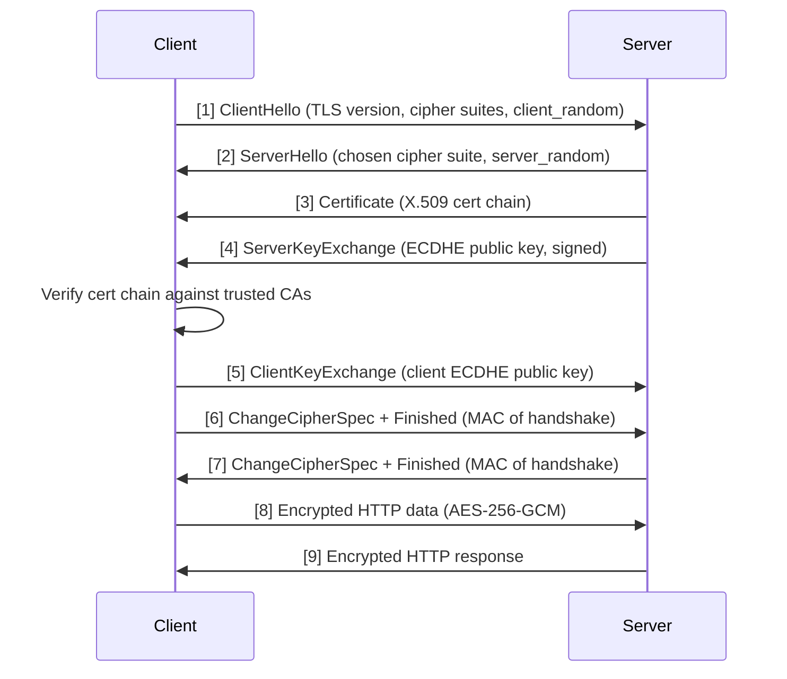

# 🔒 TLS and HTTPS

> [!abstract] TL;DR
> TLS (Transport Layer Security) is the cryptographic protocol that makes HTTPS secure. It uses **asymmetric encryption** (RSA/ECDHE) to establish a shared secret, then switches to **symmetric encryption** (AES-256) for all data. The handshake validates the server's identity via a certificate chain rooted in a trusted CA. TLS 1.3 cut the handshake to 1 round trip. mTLS adds client certificate validation — essential for service-to-service auth in microservices.

---

## Intuition — analogy FIRST

Imagine passing a secret note in class. Before you can send the note, you need to:

1. **Agree on a code** without anyone intercepting it. You do this using a "lock-box trick": you send your friend an open padlock (public key); your friend puts the secret code inside and snaps it shut; only your padlock's key (private key) can open it.
2. **Verify your friend is really your friend** and not an impostor — you recognize their handwriting from a trusted teacher's signature on a reference letter (the Certificate Authority chain).
3. **Now send all future notes** using that agreed code — fast, symmetric encryption.

TLS does exactly this, at wire speed, before the first byte of HTTP data is sent.

---

## How It Works

### Symmetric vs Asymmetric Encryption

| Type | Algorithm | Speed | Use in TLS |
|---|---|---|---|
| Asymmetric | RSA-2048, ECDH | Slow (math-heavy) | Key exchange only |
| Symmetric | AES-256-GCM | Fast (hardware-accelerated) | All actual data |

Asymmetric encryption is used *only* to securely establish the symmetric key. Then everything else runs over the fast symmetric cipher.

### Certificate Chain of Trust

```
Root CA (self-signed, baked into OS/browser)
  └── Intermediate CA (signed by Root CA)
        └── Leaf Certificate (your-domain.com, signed by Intermediate CA)
```

Browsers trust Root CAs pre-installed (Mozilla, Google maintain lists). A certificate is valid if the chain is intact and the leaf cert matches the domain.

### ECDHE — Forward Secrecy

ECDHE (Elliptic Curve Diffie-Hellman Ephemeral) generates a **fresh key pair for every session**. Even if the server's private key is later compromised, past sessions cannot be decrypted — each session's ephemeral key was never stored. This property is called **forward secrecy** and is why ECDHE replaced RSA key exchange.

### TLS Handshake Sequence



Both sides independently derive the same symmetric session key from the ECDHE exchange — this key never travels over the wire.

### TLS 1.3 Improvements (2018)

TLS 1.2 required **2 round trips** before data could flow. TLS 1.3 reduced this to **1 round trip** by:
- Removing weak cipher suites (RC4, DES, 3DES, RSA key exchange)
- Combining key exchange into the first ClientHello
- Supporting **0-RTT resumption** (replayed data on reconnect — caution: not safe for non-idempotent requests due to replay attacks)

### mTLS — Mutual TLS

Standard TLS: only the server proves its identity (via certificate).

mTLS: **both** the client and server present certificates. The server validates the client cert before accepting the connection.

```
Client ←──── validates server cert ────→ Server
Client ────── presents client cert ────→ Server validates
```

mTLS is used for:
- **Service-to-service auth** in microservices (each service has its own cert)
- **gRPC** inter-service communication
- **VPN and zero-trust networks** (device identity)
- **API clients** requiring strong client identity (banking, government)

### Certificate Pinning

Instead of trusting *any* cert signed by a trusted CA for your domain, pinning **hardcodes** the specific cert or public key hash in the client. Breaks CA compromise attacks and MITM by rogue CAs. Downside: requires app update when cert rotates — a major operational risk. Use only in high-security scenarios (mobile banking).

---

## Real-World Systems / Standards

| System | TLS Usage |
|---|---|
| **All HTTPS web traffic** | TLS 1.2/1.3; browsers refuse to load HTTP resources on HTTPS pages (mixed content) |
| **Cloudflare** | Terminates TLS at the edge (CDN PoP); re-encrypts to origin with separate TLS session |
| **gRPC** | mTLS is the default recommendation for service-to-service; each pod gets a cert from SPIFFE/SPIRE |
| **Kubernetes (etcd)** | mTLS between API server and etcd; certificates managed by kubeadm |
| **Let's Encrypt** | Free, automated CA using ACME protocol; issues 90-day certs with auto-renewal |
| **AWS ACM** | Managed TLS cert provisioning for ALB/CloudFront; auto-renews, no key management needed |

---

## Trade-offs (table)

| Choice | Pros | Cons |
|---|---|---|
| TLS 1.3 | Faster (1-RTT), stronger (fewer ciphers), forward secrecy mandatory | Some legacy clients/proxies don't support it |
| TLS 1.2 | Broad compatibility | Allows weak ciphers if misconfigured, 2-RTT handshake |
| mTLS | Strong mutual auth, eliminates credential theft | Cert lifecycle management overhead; hard to rotate at scale |
| 0-RTT resumption | Lowest latency on reconnect | Replay attack risk (only use for idempotent GET requests) |
| Certificate pinning | Protects against rogue CAs | Cert rotation breaks app without update |
| Short-lived certs (90d) | Limits breach window if key is stolen | Requires automation (ACME/certbot) — manual rotation is error-prone |

---

## When to Use vs Avoid

**Always use TLS 1.2+ for any production traffic.** There is no legitimate reason to serve HTTP for anything other than a redirect to HTTPS.

**Use TLS 1.3** wherever possible — it is strictly better than 1.2. Only fall back to 1.2 for legacy client compatibility.

**Use mTLS** for service-to-service communication in microservices, especially across network boundaries. Service meshes (Istio, Linkerd) can inject mTLS transparently without modifying application code.

**Use HSTS (HTTP Strict Transport Security)** to instruct browsers to never attempt HTTP for your domain: `Strict-Transport-Security: max-age=31536000; includeSubDomains; preload`.

**Avoid 0-RTT** for anything that mutates state (POST, PUT, DELETE) — replay attacks can execute the same request twice.

**Avoid certificate pinning** unless you have a dedicated team managing cert rotation. A forgotten pinned cert causes a production outage when the cert expires.

---

## Common Pitfalls

1. **Expired certificates.** Certificate expiry causes hard 503 errors — browsers refuse to connect. Automate renewal with Let's Encrypt/ACME or AWS ACM. Set alerts at 30, 14, and 7 days before expiry.

2. **Self-signed certificates in production.** They provide encryption but zero identity verification — any attacker can issue their own self-signed cert for your domain. Use a trusted CA.

3. **Not enforcing HSTS.** Without HSTS, a first-visit attacker can downgrade the connection to HTTP (MITM). Set HSTS with a long `max-age` and `preload` for the highest traffic domains.

4. **TLS 1.0 and 1.1 still enabled.** These versions have known vulnerabilities (POODLE, BEAST). Disable them in your load balancer/nginx config. PCI-DSS compliance requires TLS 1.2 minimum.

5. **Terminating TLS at the load balancer and sending plaintext to backends.** Traffic inside a VPC feels "safe" but is not. Use internal TLS or mTLS to the backend. Especially critical in multi-tenant environments.

6. **Ignoring the certificate chain.** A leaf cert alone is not enough — the full chain (leaf → intermediate → root) must be served. Browsers will reject incomplete chains, causing intermittent errors on mobile or strict clients.

---

## Related Concepts

- [[_MOC_Security|↑ Section MOC]]
- [[HTTP]] — the application protocol TLS secures
- [[Authentication_and_Authorization]] — TLS proves server identity; auth proves user identity
- [[API_Gateway]] — TLS termination typically happens at the gateway
- [[OAuth_and_JWT]] — tokens transmitted over TLS; TLS is a prerequisite for secure token exchange
- [[API_Security]] — HTTPS and HSTS are foundational API security controls

---

## Review Questions

1. A junior engineer asks why you use ECDHE instead of RSA for key exchange, since RSA encryption is already asymmetric. Explain forward secrecy and why it matters even if your server's private key is never compromised today.

2. Your microservices use TLS for external traffic but plain HTTP internally "because it's a private VPC." A lateral movement attack compromises one container. What does the attacker see on the internal network, and how would mTLS have changed the outcome?

3. Your startup uses a 2-year wildcard certificate managed manually. The certificate is 3 days from expiry and the engineer who manages it is on vacation. Design a rotation process that prevents this from ever being a crisis again.

---

## Sources

- RFC 8446 — TLS 1.3 Specification: https://www.rfc-editor.org/rfc/rfc8446
- Cloudflare: "How does TLS work?": https://www.cloudflare.com/learning/ssl/how-does-ssl-work/
- Mozilla SSL Configuration Generator: https://ssl-config.mozilla.org/
- SPIFFE/SPIRE — workload identity for mTLS: https://spiffe.io/
- Let's Encrypt — ACME Protocol: https://letsencrypt.org/how-it-works/
- SSL Labs Server Test: https://www.ssllabs.com/ssltest/

#SystemDesign #Security #TLS #HTTPS #SSL #Cryptography #mTLS #ForwardSecrecy #Certificates #PKI
