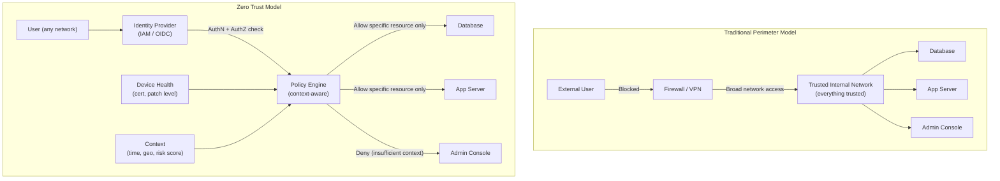
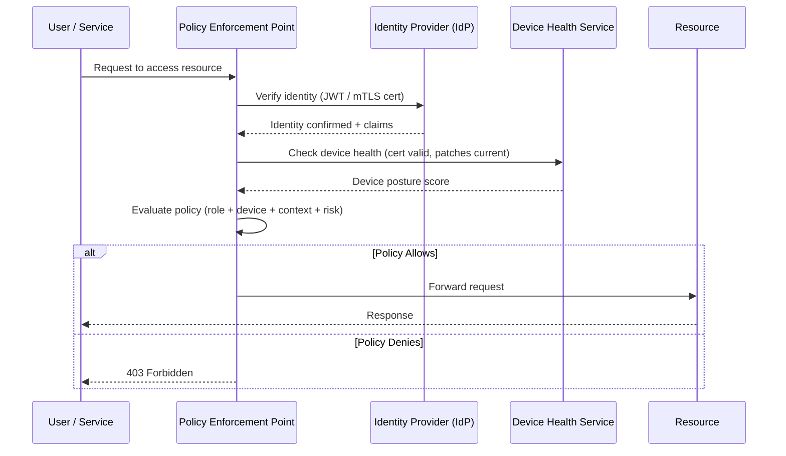

# Shield Zero Trust Architecture

> [!abstract] TL;DR
> "Never trust, always verify." Traditional perimeter security assumes everything inside the corporate network is safe — zero trust rejects this assumption entirely. Every request — regardless of network location — must be authenticated, authorized, and continuously validated. Pioneered by Google (BeyondCorp, 2011), now the dominant security model for cloud-native systems.

---

## Intuition — analogy FIRST

Traditional perimeter security is like a medieval castle: thick walls and a moat keep enemies out, but once someone is inside, they can walk anywhere freely. The problem? Modern "castles" have hundreds of doors (SaaS integrations, VPN endpoints, contractor laptops, compromised credentials) — the perimeter is riddled with holes.

Zero Trust is like a modern office building with badge readers on every single door — not just the entrance. Getting through the front door doesn't grant you access to the server room, the executive floor, or the finance department. Every door checks your identity, your clearance level, and the current time before it opens. If your badge is revoked, every door refuses you simultaneously.

---

## How It Works + mermaid

### Traditional Perimeter vs Zero Trust



### Request Flow in Zero Trust



---

## Core Principles

**1. Verify Explicitly**
- Authenticate and authorize every single request — network location is not a trust signal.
- Use strong identity: MFA, hardware tokens (YubiKey), certificate-based auth.
- Continuous validation: re-verify mid-session if risk changes (new location, anomalous behavior).

**2. Least Privilege Access**
- Grant only the minimum permissions required for the task, for the minimum duration.
- Just-in-time (JIT) access: temporary elevation for privileged operations (prod DB access for 1 hour, then auto-revoke).
- Just-enough-access (JEA): scope permissions to specific actions, not broad roles.

**3. Assume Breach**
- Design as if attackers are already inside your network — because they often are.
- Micro-segmentation: network policies between services so a compromised service can't reach everything.
- Encrypt all traffic (mTLS between services, TLS for all external traffic).
- Comprehensive audit logging: every request logged with who, what, when, from where.

---

## Key Components

| Component | Role | Example Products |
|-----------|------|-----------------|
| Identity Provider (IdP) | AuthN — who are you? | Okta, Azure AD, Google Workspace |
| Policy Engine | AuthZ — are you allowed? | Open Policy Agent (OPA), Google IAP |
| Device Health / MDM | Is your device trusted? | CrowdStrike, Jamf, Intune |
| mTLS | Mutual auth between services | Istio, Linkerd, SPIFFE/SPIRE |
| Micro-segmentation | Network isolation between services | Calico, Cilium, NSX |
| JIT Access | Temporary elevated permissions | HashiCorp Boundary, CyberArk |
| SIEM / Audit Log | Continuous monitoring | Splunk, Datadog, Chronicle |

---

## VPN vs Zero Trust Comparison

| Dimension | VPN | Zero Trust |
|-----------|-----|-----------|
| Trust model | Trust the network location | Trust the identity + context |
| Access scope | Broad network access | Per-resource access |
| User experience | Connect VPN → access everything | Seamless, no "connect to VPN" |
| Scalability | VPN concentrator is a bottleneck | Distributed enforcement points |
| Insider threat | Once on VPN, largely unchecked | Every request verified |
| Remote work | Works but clunky | Native |
| Compliance | Perimeter logs | Per-request audit trail |

---

## mTLS — Mutual TLS for Service-to-Service

In a zero trust service mesh, every service must prove its identity:

```
Standard TLS: Client verifies server cert (client is anonymous)
mTLS: Client verifies server cert AND server verifies client cert
```

Each service gets a short-lived X.509 certificate (e.g., 24h TTL) issued by an internal CA (SPIRE). When Service A calls Service B:
1. A presents its cert: "I am service-a, cert issued by our internal CA"
2. B presents its cert: "I am service-b, cert issued by our internal CA"
3. Both verify each other before exchanging data
4. Even if an attacker is on the same network, they can't impersonate Service A without its private key

---

## BeyondCorp — Google's Zero Trust Model

> [!info] The original zero trust implementation (2011)

**Context:** After Operation Aurora (2010 Chinese APT attack), Google decided the perimeter model was broken. They spent 6 years migrating to BeyondCorp.

**Key insight:** An employee working from a coffee shop Wi-Fi with a managed, up-to-date laptop should get the same access as one in the office — because "being in the office" is no longer a meaningful security signal.

**BeyondCorp components:**
1. **Device inventory:** every managed device has a certificate. Unmanaged devices → restricted access.
2. **User inventory:** identity tied to Google SSO + hardware security keys.
3. **Access proxy:** all internal apps sit behind an access proxy (Google IAP). No direct network access.
4. **Access policy:** policy engine checks user identity + device inventory + request context → allow/deny.
5. **No VPN:** Google employees don't use a VPN. The access proxy IS the security boundary.

**BeyondProd:** same model extended to internal services — microservices authenticate to each other via service identities (ALTS), and a central policy engine enforces what service A is allowed to call on service B.

---

## Real-World Systems

- **Google BeyondCorp (2011):** First major enterprise zero trust deployment. Published as whitepaper series. 100,000+ employees, no VPN.
- **Cloudflare Access:** Cloudflare's ZTA product — every request to internal apps goes through Cloudflare, which checks identity before forwarding.
- **Okta + Pomerium:** Common open-source stack: Okta as IdP, Pomerium as access proxy, OPA as policy engine.
- **NIST SP 800-207:** The US government's zero trust standard — defines the canonical architecture.
- **DoD Zero Trust Strategy (2022):** US Department of Defense mandated zero trust for all systems by 2027.

---

## Trade-offs (table)

| Dimension | Benefit | Cost / Drawback |
|-----------|---------|-----------------|
| Security posture | Dramatically reduced blast radius on breach | High implementation complexity |
| Insider threat | Every action logged and authorized | Operational overhead for access requests |
| Remote work | Works from any network natively | Requires robust IdP (new SPOF) |
| Performance | Minimal overhead with local PEP | Latency added per request for policy eval |
| Developer experience | Can be transparent with good tooling | Can frustrate devs with access friction |
| Compliance | Per-request audit trail | Cost of logging at scale |

---

## When to Use vs Avoid

**Use Zero Trust when:**
- Cloud-native or hybrid environment — "inside the network" is meaningless
- Regulatory requirements (financial, healthcare, government)
- Remote-first or contractor-heavy workforce
- Post-breach remediation (classic trigger: "we got breached via a compromised VPN")
- Microservices architecture — mTLS between services is zero trust for east-west traffic

**May be overkill:**
- Tiny startup (<10 engineers, single region, no compliance requirements)
- Purely internal tooling with no sensitive data

---

## Common Pitfalls

> [!danger] Zero trust anti-patterns
> 1. **"We installed Okta so we have zero trust"** — IdP is one component. Without device health checks and per-resource policies, you still have broad trust after login.
> 2. **Treating zero trust as a product, not a philosophy** — no single vendor product achieves zero trust. It's an architecture principle applied across your stack.
> 3. **Forgetting east-west traffic** — most ZTA implementations focus on north-south (external users to internal apps) and ignore service-to-service traffic. mTLS covers east-west.
> 4. **JIT access without automation** — manual approval workflows create bottlenecks. Automate temporary access grants with time-bounded tokens.
> 5. **Long-lived certificates** — if service certs live for 1 year, a compromised private key is dangerous for a year. Use short-lived certs (24h) auto-rotated by SPIRE.
> 6. **Audit log gaps** — logging only denials misses lateral movement by legitimate credentials. Log everything.

---

## Related Concepts

- [[_MOC_Security|↑ Section MOC]]
- [[Authentication_and_Authorization]] — the identity layer that zero trust builds on
- [[TLS_and_HTTPS]] — mTLS is the service-to-service zero trust mechanism
- [[Service_Mesh]] — Istio/Linkerd implement mTLS and enforce zero trust east-west
- [[API_Security]] — API gateway as the policy enforcement point for external traffic
- [[Secret_Management]] — short-lived credentials used by ZTA components
- [[Microservices]] — ZTA's east-west story applies to all microservice deployments

---

## Review Questions

1. Explain the difference between traditional VPN-based security and zero trust. In a concrete attack scenario — an attacker steals an employee's VPN credentials — how does each model respond differently?

2. In a Kubernetes microservices deployment, Service A needs to call Service B's `/admin` endpoint. Describe how mTLS + an OPA policy engine would enforce zero trust for this east-west call.

3. Google BeyondCorp eliminated VPNs entirely. What are the three core components that replaced VPN-based network trust, and what is the "access proxy" doing that the VPN used to do?

---

## Sources

- [BeyondCorp: A New Approach to Enterprise Security (Google, 2014)](https://research.google/pubs/pub43231/)
- [NIST Special Publication 800-207: Zero Trust Architecture](https://doi.org/10.6028/NIST.SP.800-207)
- [Cloudflare Zero Trust Architecture](https://www.cloudflare.com/learning/security/glossary/what-is-zero-trust/)
- SPIFFE/SPIRE — service identity for zero trust: https://spiffe.io/

#SystemDesign #Security #ZeroTrust #BeyondCorp #mTLS #Advanced
