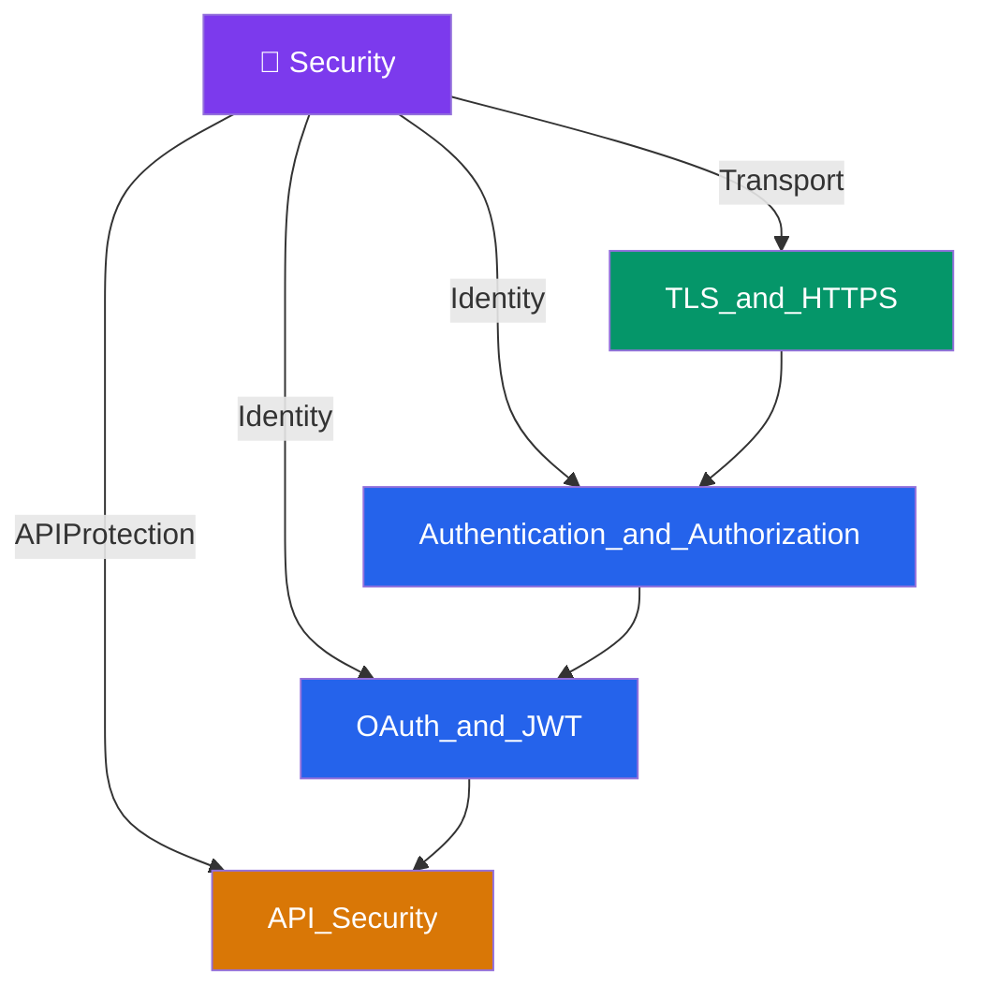

# 🔐 Security — Map of Content

> [!abstract] What This Section Covers
> The security layer of production systems: how data is encrypted in transit (TLS/HTTPS), how users prove who they are (Authentication and Authorization), how modern identity delegation works (OAuth 2.0 and JWT), and how APIs are protected from abuse and attack (API Security). These four notes cover the security fundamentals expected in every senior system design discussion.

## Concept Map

## Learning Path

1. [[TLS_and_HTTPS]] — How TLS handshakes, certificates, and encryption protect data in transit
2. [[Authentication_and_Authorization]] — The distinction between identity (authn) and permission (authz); sessions, tokens, and RBAC
3. [[OAuth_and_JWT]] — OAuth 2.0 authorization flows and JWT as a stateless identity token
4. [[API_Security]] — Input validation, injection prevention, CORS, rate limiting, and OWASP API Top 10

## All Notes at a Glance

| Note | Summary | Difficulty |
|------|---------|------------|
| [[Authentication_and_Authorization]] | Authentication verifies identity; authorization determines what that identity is permitted to do — covers sessions, tokens, RBAC, and ABAC | Intermediate |
| [[TLS_and_HTTPS]] | TLS encrypts data in transit using asymmetric key exchange and symmetric bulk encryption; HTTPS is HTTP over TLS | Intermediate |
| [[OAuth_and_JWT]] | OAuth 2.0 enables third-party access delegation; JWT encodes claims as a signed, stateless token reducing database lookups | Intermediate |
| [[API_Security]] | Protects APIs from abuse via input validation, auth enforcement, rate limiting, CORS policy, and defenses against injection and SSRF | Intermediate |

## Key Questions This Section Answers

- JWT vs opaque tokens — what is the real trade-off between them?
- What does mTLS (mutual TLS) add over regular TLS?
- What is the difference between OAuth 2.0 and OpenID Connect (OIDC)?
- How do you revoke a JWT before its expiry?
- What is the difference between RBAC and ABAC for authorization?
- What OWASP API Top 10 vulnerabilities are most commonly exploited in production?

## Related Sections

- [[_MOC_SystemDesign_Master|↑ System Design Master MOC]]
- [[_MOC_API_Gateway]] — API gateways enforce auth and TLS termination as edge-layer security
- [[_MOC_Communication]] — TLS wraps all production communication protocols
- [[_MOC_ApplicationLayer]] — Application services implement authorization logic

#MOC #SystemDesign
