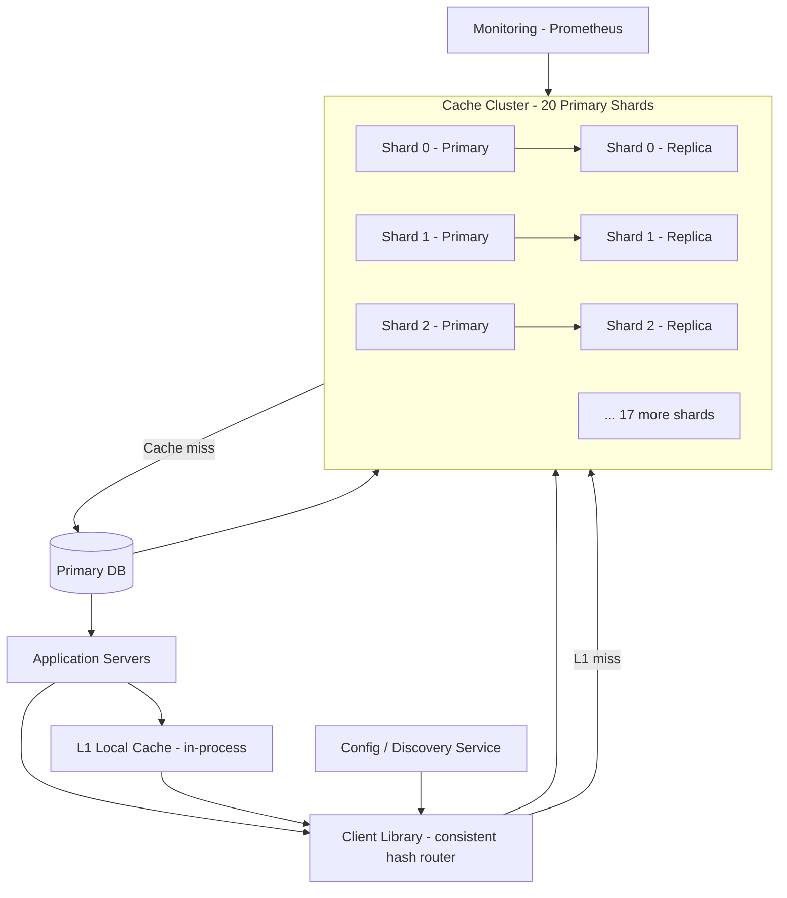

# 🏗️ System Design: Distributed Cache

> [!abstract] TL;DR
> A distributed caching system (like Redis Cluster or Memcached) serves 1M RPS at sub-millisecond latency using consistent hashing across cache nodes, LRU eviction, primary-replica replication, and Bloom filters to prevent cache penetration.

---

## Requirements Clarification

**Functional Requirements:**
- RF1: `put(key, value, ttl)` — store a key-value pair with optional TTL
- RF2: `get(key)` → value or nil — retrieve a value by key
- RF3: `delete(key)` — remove a key
- RF4: Automatic eviction of expired and least-recently-used entries when memory is full
- RF5: High availability — cache should remain operational if individual nodes fail

**Non-Functional Requirements:**
- Scale: 1M read RPS, 100K write RPS
- Latency: p50 < 0.5ms, p99 < 2ms for both reads and writes
- Availability: 99.99% (52 minutes downtime/year)
- Memory: Store up to 1 TB of cached data across the cluster
- Consistency: Eventual — brief replication lag between primary and replica nodes is acceptable
- Throughput: Handle burst traffic up to 3× steady-state without degradation

---

## Capacity Estimation

**Memory:**
- 1 TB total cached data across the cluster
- Average key-value size: 1 KB (key ~50 bytes, value ~950 bytes overhead + data)
- 1 TB / 1 KB = ~1 billion key-value pairs
- With 20 cache nodes at 64 GB RAM each: 20 × 64 GB = 1,280 GB ≈ 1.25 TB (with headroom)

**Nodes Required:**
- 1M RPS across 20 nodes = 50K RPS per node
- Single Redis node handles ~200K simple GET commands/sec → ample headroom
- With replication (1 primary + 1 replica): 40 nodes total (20 primaries + 20 replicas)

**Network:**
- 1M reads/sec × 1 KB avg response = 1 GB/s outbound bandwidth → 40-node cluster → 25 MB/s per node — well within 10 Gbps NIC

---

## High-Level Design



**Read path:**
1. App checks L1 local cache (in-process HashMap, ~1μs)
2. L1 miss → client library hashes key → routes to correct cache shard (~0.3ms)
3. Cache shard hit → return value, update L1
4. Cache miss → fetch from DB → `put()` into cache → return to app

**Write path (cache-aside):**
1. App writes to primary DB
2. App calls `cache.delete(key)` to invalidate (preferred over `put()` on write — avoids stale writes)
3. Next read repopulates cache from DB (lazy loading)

---

## Core Components Deep Dive

### Client Library (Cache Router)

The client library is the intelligence layer — application servers embed it and use it for all cache interactions. Responsibilities:
- **Consistent hashing**: maps each key to a specific shard — no central coordinator needed
- **Connection pooling**: maintains persistent connections to all shards (not just the one being accessed)
- **Retry & failover**: on shard unavailability, routes reads to replica; writes are buffered or fail fast
- **L1 cache**: a small (e.g., 32 MB) in-process LRU cache for the hottest keys

### Consistent Hashing with Virtual Nodes

Naive approach: `shard = hash(key) % num_shards`. Problem: when you add/remove a shard, the modulo changes and almost every key maps to a different shard — invalidating the entire cache (a thundering herd on the DB).

**Consistent hashing** places nodes on a virtual ring of 2^32 positions. Each key is also hashed to a position on the ring, and routes to the next node clockwise. When a node is added/removed, only the keys between the new node and its predecessor are remapped — on average `1/N` of keys.

**Virtual nodes (vnodes):** Each physical node is represented by multiple positions on the ring (e.g., 150 vnodes per node). This:
- Distributes load more evenly across heterogeneous nodes
- Ensures that when a node fails, its load distributes across many nodes (not just one neighbor)
- Allows weight-based load balancing (higher-spec nodes get more vnodes)

```
Ring positions (simplified with 5 nodes, 2 vnodes each):
... NodeA(0) ... NodeC(103) ... NodeB(210) ... NodeE(298) ... NodeD(411) ...
... NodeC(512) ... NodeA(640) ... NodeD(755) ... NodeB(820) ... NodeE(934) ...

Key "user:12345" → hash → position 350 → routes to NodeE(298)... wait, next clockwise is NodeD(411) → routes to NodeD
```

### Cache Node — Internal Structure

Each cache node is essentially:
- **In-memory hash map**: O(1) average get/put by key
- **LRU (Least Recently Used) eviction**: when memory is full, evict the least recently accessed entry
  - Implemented as a doubly-linked list + hash map: O(1) access AND O(1) eviction
  - Alternative: LFU (Least Frequently Used) — better for skewed access patterns but more complex
- **TTL expiration**: two strategies:
  - *Lazy expiration*: check TTL on access; if expired, delete and return miss (simple, but stale keys occupy memory)
  - *Active expiration*: background thread periodically scans and deletes expired keys (Redis uses a probabilistic sampling approach — scan 20 random keys, delete expired ones, repeat if >25% were expired)
- **Persistence (optional)**: RDB snapshots or AOF (append-only file) for warm restarts

### Replication

Each primary shard has one or more replicas (Redis's primary-replica model):
- **Asynchronous replication**: primary processes write, acknowledges to client, then asynchronously streams commands to replicas. Trade-off: brief inconsistency window (~5ms lag), but fast writes.
- **Semi-synchronous**: primary waits for at least 1 replica to acknowledge before responding — higher durability, slightly higher write latency.
- **Reads from replicas**: can serve reads to reduce load on primary — acceptable for slightly stale data (e.g., user profile cache)

**Failover:** If primary dies, replica is promoted (automatic via Sentinel or Cluster mode). Client library detects the topology change via config service and re-routes.

### The Three Cache Failure Modes

#### 1. Cache Stampede (Thundering Herd)

**Problem:** A popular cache key expires. At that exact moment, 10,000 concurrent requests all get a cache miss and all go to the DB simultaneously — the DB is overwhelmed.

**Solutions:**
- **Mutex lock**: first request acquires a distributed lock (Redis `SET NX`), fetches from DB, populates cache, releases lock. Other requests wait briefly then hit the populated cache.
- **Probabilistic early expiration (PER)**: before a key expires, some requests "volunteer" early to refresh it. Each request computes: `expiry_time - beta × log(random())` — if this is in the past, refresh now. This probabilistically refreshes the key before it expires, avoiding the stampede entirely.
- **Background refresh**: a separate thread monitors keys approaching expiry and pre-fetches them before they expire.

#### 2. Cache Penetration

**Problem:** Requests for keys that don't exist in the cache AND don't exist in the DB. These always miss the cache and hit the DB — a common DDoS vector (send millions of random user IDs that don't exist).

**Solutions:**
- **Cache null values**: when the DB returns no result, cache a sentinel value (e.g., `""` or `null`) with a short TTL (60 seconds). Next request hits cache, gets null — no DB call.
- **Bloom filter**: before querying cache or DB, check a Bloom filter that contains all valid keys. Bloom filter guarantees: if it says "not present," the key definitely doesn't exist (zero false negatives). Only ~1% of valid keys are incorrectly flagged as absent (false positives). Store Bloom filter in Redis for distributed access.

#### 3. Cache Avalanche

**Problem:** A large number of cache entries expire at the same time (e.g., you pre-populate the cache at startup with 1M entries all set to expire in 1 hour — they all expire simultaneously at T+1hr, flooding the DB).

**Solutions:**
- **Randomize TTLs**: instead of `TTL = 3600s`, use `TTL = 3600 + random(0, 300)` — spreads expiry across a 5-minute window, smoothing the load.
- **Staggered cache warming**: when populating on startup, distribute writes over time rather than bulk-loading at once.
- **Circuit breaker on DB**: if DB query rate spikes suddenly (avalanche starting), circuit breaker trips and returns stale cached data while the cache repopulates.

### Hot Key Problem

**Problem:** A single key (e.g., a celebrity's profile, a viral article) receives millions of requests — all going to the same cache shard, creating a hotspot.

**Solutions:**
- **L1 local cache**: keep the hottest ~1,000 keys in each application server's in-process cache (per-server, not shared). Updates propagate via invalidation events. Reduces cache cluster load by 90%+ for truly hot keys.
- **Key replication (scatter reads)**: store the hot key on multiple shards as `hot_key:shard_0`, `hot_key:shard_1`, ..., `hot_key:shard_N`. Client randomly picks one to read from. Writes must update all replicas. This distributes read load across N shards.
- **Read from replicas**: hot key reads can be distributed across primary + all its replicas.

---

## Data Model

### Key-Value Schema

Keys follow a structured naming convention for namespace isolation and debuggability:

```
{namespace}:{version}:{entity}:{id}
  e.g., user:v2:profile:12345
  e.g., product:v1:detail:67890
  e.g., session:v1:token:abc123xyz
```

Versioning in the key (`v2`) enables instant cache busting for all entries of a type — just bump the version and old entries become effectively invisible (they'll expire naturally via TTL).

### Value Format

Values are typically JSON-serialized application objects, or MessagePack for better compression:

```json
{
  "user_id": 12345,
  "username": "alice",
  "email": "alice@example.com",
  "tier": "pro",
  "cached_at": 1722000000,
  "_version": "v2"
}
```

Include `cached_at` in the value for debugging cache staleness.

### TTL Strategy

| Data Type | TTL | Rationale |
|---|---|---|
| Session tokens | 30 minutes | Security: sessions should expire |
| User profiles | 5 minutes | Mutable, but low-frequency changes |
| Product catalog | 1 hour | Infrequent updates |
| Home page content | 15 minutes | Balance freshness vs. DB load |
| Static config | 24 hours | Rarely changes |
| Computed aggregates | 10 minutes | Expensive to recompute |

---

## Key Design Decisions & Trade-offs

### Decision 1: Two-Tier Caching (L1 + L2)
L1 (in-process): sub-microsecond access, no network. Limited to ~32MB (don't bloat the JVM/process heap).
L2 (Redis Cluster): 1-2ms, shared across all app servers, 1TB capacity.
The L1 cache handles the hottest 0.1% of keys, dramatically reducing L2 load for viral content.

### Decision 2: Cache-Aside vs. Write-Through
**Chose cache-aside (lazy loading):** Only cache what's actually read. Write-through would cache every write even for data rarely read — wastes memory. The downside (cold start cache miss penalty) is acceptable.

**On writes: `delete` not `update`:** When the DB record changes, delete the cache key (cache invalidation) rather than updating it with the new value. Reason: two concurrent writes could result in a stale value being written to cache (race condition). Deletion is always safe — the next read repopulates from the authoritative DB.

### Decision 3: Eviction Policy
**LRU (Least Recently Used)** is the default choice — evicts the key that hasn't been accessed in the longest time. Good for temporal locality patterns (recently accessed data is likely to be accessed again). 

**LFU (Least Frequently Used)** is better for highly skewed access patterns (a few keys accessed billions of times, most accessed once). Redis supports both; choose based on access pattern analysis.

### Decision 4: Synchronous vs. Asynchronous Replication
**Chose asynchronous:** Replication lag of ~5ms is acceptable for a cache. The worst case is a brief period of serving slightly stale data from a replica, which is already inherent in cache-aside patterns (the cache itself can be up to TTL seconds stale). Synchronous replication would add 5ms to every write — unacceptable for a <2ms latency SLA.

---

## Scalability & Bottlenecks

### Scaling Horizontally
Add new shards: consistent hashing ensures only `1/N` of keys remapped. Use rolling addition (add one shard at a time, let data redistribute, add next) to avoid DB overload during rebalancing.

### Memory Pressure
When a shard approaches memory limit, eviction begins. Monitor `evicted_keys` metric in Redis — high eviction rate means cache is undersized (reduce TTLs or add nodes). Aim to keep memory usage below 75% to leave headroom for burst writes.

### Thundering Herd During Failover
When a shard fails: its keys all miss simultaneously → all go to DB. Mitigation: replica promotion is fast (<30 seconds); circuit breaker on DB to absorb the burst; L1 local cache serves the hottest keys during failover window.

### Monitoring Key Metrics

| Metric | Healthy | Alert Threshold |
|---|---|---|
| Cache hit rate | >90% | <80% |
| Eviction rate | <1% of ops | >5% |
| Memory usage | <75% | >85% |
| Replication lag | <10ms | >100ms |
| Command latency p99 | <2ms | >10ms |

---

## Related Concepts

- [[_MOC_CaseStudies|↑ Section MOC]]
- [[Caching]] — cache strategies: cache-aside, write-through, write-behind
- [[Consistent_Hashing]] — distributing keys across shards without full remapping on topology changes
- [[Replication]] — primary-replica setup for high availability
- [[Key_Value_Store]] — the underlying data structure of a cache node
- [[Load_Balancers]] — distributing application traffic that drives cache reads

---

## Review Questions

1. Why does naive modulo sharding (`hash(key) % N`) cause a cache avalanche when a node is added or removed? How does consistent hashing solve this?
2. What is a virtual node (vnode) in consistent hashing, and why does using 150 vnodes per physical node improve load distribution?
3. Describe the cache stampede problem in detail. Implement the probabilistic early expiration (PER) solution and explain why it works.
4. You have a key that receives 500K requests/second (a viral tweet's like count). The key maps to shard 7. What is your strategy to prevent shard 7 from becoming a bottleneck?
5. Explain why `delete(key)` on a cache write is safer than `put(key, new_value)`. Construct a race condition that can occur with the `put` approach.
6. What is the difference between cache penetration and cache avalanche? For each, give the scenario that causes it and the solution.
7. A cache has 20 nodes. If one node fails, what percentage of cache keys experience a miss (assuming consistent hashing with no vnodes, and with 150 vnodes per node)? Which is better and why?

---

## Sources

#SystemDesign #CaseStudy #DistributedCache #Redis #ConsistentHashing #LRU #BloomFilter #ThunderingHerd #CacheStampede
