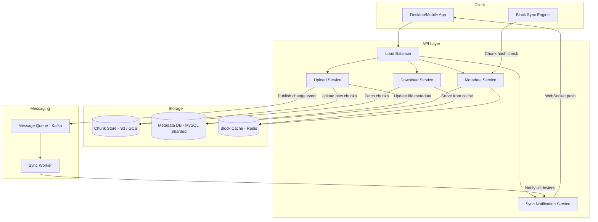

# 🏗️ System Design: Google Drive

> [!abstract] TL;DR
> Google Drive serves 1B users with 15 GB free storage each (~15 PB total) and syncs files across devices efficiently. The key insight is **chunking files into 4 MB blocks** identified by content hash (SHA-256). On edit, only changed chunks are uploaded — not the whole file (delta sync). Content-addressed storage enables deduplication: two users uploading the same file share the same chunks in object storage. Sync between devices uses WebSocket notifications to push change events, after which the client downloads only the changed chunks.

---

## Requirements Clarification

**Functional Requirements:**
- RF1: Users can upload, download, and delete files from any device
- RF2: Files sync automatically across all of a user's devices
- RF3: Support for folders and nested directory structures
- RF4: File versioning — users can view and restore previous versions (up to 30 days)
- RF5: File sharing with configurable permissions (view only, edit, owner)

**Non-Functional Requirements:**
- Scale: 1B users × 15 GB free = **15 PB** minimum; in practice, paid users have 2 TB → far more
- Daily active: ~300M DAU
- File operations: ~500M file uploads/day; ~2B file views/downloads/day
- Upload throughput: assuming avg 1 MB file → 500M × 1 MB ÷ 86,400s ≈ **5.8 GB/sec** inbound
- Latency: File changes should sync to other devices within 5 seconds
- Availability: 99.99% — data loss is catastrophic; unavailability is bad
- Consistency: Strong consistency for file metadata (no two conflicting versions shown simultaneously); eventual for cross-device sync is acceptable with conflict detection
- Durability: 11 nines (99.999999999%) — files must never be lost; use S3-class replication

---

## Capacity Estimation

**Storage:**
- 1B users × 15 GB average used (assuming 30% utilization of free tier) ≈ 4.5 PB
- Paid users add significantly more; total is in the exabytes for Google
- With 3× replication + geographic redundancy (6× effective): ~27 PB for free tier alone

**Deduplication savings:**
- If 20% of all chunks are duplicates (e.g., common OS files, shared documents), deduplication saves 20% of raw storage
- Content-addressed storage (hash as key) makes deduplication automatic and free

**Metadata:**
- Each file record: ~1 KB (name, size, owner, timestamps, chunk list, permissions)
- 1B users × 1,000 files avg × 1 KB = **1 PB of metadata** — this alone requires a distributed DB

**Chunk count:**
- If avg file is 2 MB and chunk size is 4 MB → ~0.5 chunks per file; but large files (videos, backups) have many chunks
- Assume avg 3 chunks per file × 1,000 files × 1B users = **3 trillion chunk references** in metadata

**Bandwidth:**
- Upload: 500M files/day × 1 MB avg = 500 TB/day inbound
- Download (reads are 4× writes): ~2 PB/day outbound → CDN is mandatory

---

## High-Level Design



**Upload flow:**
1. Client detects file change (file system watcher)
2. Block Sync Engine splits file into 4 MB chunks; computes SHA-256 hash of each chunk
3. For each chunk: query Metadata Service — "does chunk `{hash}` already exist?" (dedup check)
4. Upload only new chunks to Upload Service → stored in S3 by content hash
5. Update Metadata Service: new file version record with ordered list of chunk hashes
6. Publish `file.changed` event to Kafka
7. Kafka → Sync Worker → notifies all user's other devices via WebSocket

**Download/sync flow:**
1. Device receives WebSocket notification: "file X changed, new version Y"
2. Client calls Metadata Service: get chunk list for version Y
3. For each chunk in the list: check local disk cache (already downloaded?) → if not, download from S3
4. Reassemble file from chunks on disk → replace old version
5. Update local metadata cache

---

## Core Components Deep Dive

### Chunking and Content-Addressed Storage

**Why chunk files?**

| Property | Without Chunking | With Chunking (4 MB) |
|----------|------------------|----------------------|
| Small edit to large file | Re-upload entire file | Upload only changed chunks |
| Resume interrupted upload | Start over | Resume from last committed chunk |
| Deduplication | File-level (coarse) | Chunk-level (granular) |
| Memory for upload | Buffer entire file | Buffer one chunk at a time |

**Content-addressed storage:** The chunk is stored under its content hash (`sha256(chunk_bytes)`). Two identical chunks — regardless of which user, which file, or which folder — map to the same key in S3. This is **automatic deduplication at the chunk level.**

**Fixed vs variable-size chunking:**
- **Fixed-size (4 MB):** Simple, predictable. Downside: inserting a byte at the start shifts all chunk boundaries → every chunk's content changes → effectively re-uploading the whole file for large files.
- **Variable-size (content-defined chunking / Rabin fingerprinting):** Chunk boundaries are determined by content patterns. Inserting a byte shifts only one chunk. Better delta efficiency. Used by rsync, restic. More complex to implement.

**Google Drive uses fixed chunks** for simplicity; this is acceptable because most edits are append-only (appending to a text doc affects only the last chunk) or edit-in-place of a small region (Word documents).

**Chunk size trade-off:**
- Smaller chunks (1 MB): more granular delta sync, but more metadata overhead, more round trips
- Larger chunks (16 MB): fewer round trips, but re-upload more data on small changes
- **4 MB** is the common sweet spot (also S3's minimum multipart part size)

### Block Sync Engine (Client-Side)

The client's local sync engine is responsible for:

1. **File system watcher:** OS-level event listeners (inotify on Linux, FSEvents on macOS, ReadDirectoryChangesW on Windows) that fire when any file in the sync folder changes
2. **Chunk splitter:** Reads changed files, splits into 4 MB chunks, computes SHA-256
3. **Local chunk cache:** Maintains a local SQLite DB mapping `{file_path, version} → [chunk_hashes]`. On sync: compare new chunk list vs. old → identify changed chunks
4. **Upload queue:** Queues chunks for upload; supports pause/resume; retries on network failure
5. **Conflict detector:** Detects if a remote change arrived while local changes were pending (see conflict resolution section)

**Bandwidth optimization:** The client only uploads chunks with hashes not already present on the server. A pre-upload check sends a list of chunk hashes; the server responds with which ones are missing. Only missing chunks are uploaded. This is the **dedup check** that makes delta sync work.

### Metadata Service and Storage

The Metadata Service is the source of truth for the file system tree: what files exist, which chunks they're made of, who owns them, and what permissions are set.

**Schema design:**
- Each **file** has a current version and a version history
- Each **version** has an ordered list of chunk hashes
- This allows time-travel: "show me the file as of 2 weeks ago" → retrieve the chunk list for that version

**Why sharded MySQL (not DynamoDB)?**
- File metadata requires rich queries: "list all files in folder X," "files shared with user Y," "files modified after date Z"
- These range queries and joins are natural in SQL
- At 1B users, MySQL must be sharded by `user_id` (horizontal sharding)
- Read replicas handle the 4:1 read/write ratio

**Eventual metadata consistency:** When a file is uploaded from Device A, it takes a few seconds for the change notification to reach Device B and for Device B to download the new metadata. This "up to 5 second sync latency" is explicitly accepted in requirements.

### Real-Time Sync: Notification Service

When a file changes, all other devices of the same user must be notified within 5 seconds.

**WebSocket (chosen):** Persistent connection from each client to a notification server. When a sync event is published to Kafka, the notification server pushes it to all of the user's connected clients immediately. Sub-second delivery in practice.

**Long polling (alternative):** Client holds open an HTTP request; server responds when there's a change. Works but higher latency and overhead vs. WebSocket.

**Push notification (for mobile when app is backgrounded):** APNs/FCM wake the app, which then connects and syncs. Background sync uses this path; foreground sync uses WebSocket.

**Notification payload:** Small — just enough to trigger a sync. The client then pulls the diff from Metadata Service.
```json
{
  "event": "file.changed",
  "file_id": "abc123",
  "new_version_id": "v47",
  "changed_at": "2026-07-26T10:30:00Z"
}
```

### Conflict Resolution

**When does a conflict occur?** User edits `report.docx` on laptop (offline). User also edits it on phone (also offline). Both devices sync when they reconnect.

**Google Drive approach:** Create a conflict copy.
- The server accepts both versions as valid
- One becomes the current version; the other is saved as `report (User's conflicted copy 2026-07-26).docx`
- User sees both files and manually resolves

**Dropbox uses the same approach.** It's the pragmatic solution: "last write wins silently" loses data; "reject the second write" is also data loss. Creating a conflict copy preserves both and puts the human in control.

**Git-style 3-way merge** would be ideal for text files but requires understanding the file format — infeasible for arbitrary binary files (images, PDFs, etc.). Google Docs (not Drive) does this for collaborative real-time editing because it controls the format.

**Version vector / vector clock:** The client tracks the version it last synced per device. When uploading a change, it includes the parent version ID. The server detects if the parent version is stale (meaning another device has already uploaded a newer version) → triggers conflict resolution.

### Version History and Soft Delete

**Version history:**
- Keep all chunk lists (not the chunks themselves) for each file version, up to 30 days
- Chunk data in S3 is reference-counted: when the last version referencing a chunk expires, the chunk is eligible for garbage collection
- Storage cost of versioning = cost of chunks that are NOT shared with the current version

**Soft delete (Trash/Recycle Bin):**
- Deleted files moved to Trash with `deleted_at` timestamp
- Chunks remain in S3 until Trash is emptied or 30 days pass
- "Empty Trash" → marks all chunks from deleted files for GC; a background GC job deletes unreferenced chunks from S3

**Garbage collection:**
- Background job runs nightly: for each chunk in S3, check if any active version references it (via reference count in metadata)
- Zero references → delete from S3
- This is safe because: (a) uploads are atomic (chunk uploaded before metadata updated), and (b) GC only runs on chunks that have been in S3 for > 24 hours (safety margin)

---

## Data Model

### `files` table (MySQL — sharded by `user_id`)

```sql
CREATE TABLE files (
    file_id          VARCHAR(36) PRIMARY KEY,
    user_id          BIGINT NOT NULL,
    parent_folder_id VARCHAR(36),              -- NULL for root
    name             VARCHAR(255) NOT NULL,
    current_version  INT NOT NULL DEFAULT 1,
    size_bytes       BIGINT,
    mime_type        VARCHAR(100),
    is_deleted       BOOLEAN DEFAULT FALSE,
    deleted_at       TIMESTAMP,
    created_at       TIMESTAMP DEFAULT NOW(),
    updated_at       TIMESTAMP DEFAULT NOW(),
    INDEX idx_user_folder (user_id, parent_folder_id),
    INDEX idx_user_updated (user_id, updated_at DESC)
);
```

### `file_versions` table (MySQL)

```sql
CREATE TABLE file_versions (
    file_id          VARCHAR(36) NOT NULL,
    version_id       INT NOT NULL,
    created_at       TIMESTAMP DEFAULT NOW(),
    created_by_device VARCHAR(64),
    size_bytes       BIGINT,
    PRIMARY KEY (file_id, version_id)
);
```

### `version_chunks` table (MySQL — ordered chunk list per version)

```sql
CREATE TABLE version_chunks (
    file_id          VARCHAR(36) NOT NULL,
    version_id       INT NOT NULL,
    chunk_index      INT NOT NULL,             -- order of chunk in file
    chunk_hash       CHAR(64) NOT NULL,        -- SHA-256 hex
    PRIMARY KEY (file_id, version_id, chunk_index),
    INDEX idx_chunk_hash (chunk_hash)          -- for GC reference counting
);
```

### `chunks` table (MySQL — chunk registry for dedup and GC)

```sql
CREATE TABLE chunks (
    chunk_hash       CHAR(64) PRIMARY KEY,     -- SHA-256 hex
    s3_key           VARCHAR(255) NOT NULL,    -- e.g., "chunks/ab/cd/abcd...sha256"
    size_bytes       INT NOT NULL,
    ref_count        INT DEFAULT 0,            -- number of version_chunks rows referencing this
    created_at       TIMESTAMP DEFAULT NOW()
);
```

### `permissions` table (MySQL)

```sql
CREATE TABLE permissions (
    file_id          VARCHAR(36) NOT NULL,
    grantee_id       BIGINT NOT NULL,          -- user_id of the person being granted access
    permission_level ENUM('view','comment','edit','owner'),
    granted_at       TIMESTAMP DEFAULT NOW(),
    PRIMARY KEY (file_id, grantee_id)
);
```

### S3 Key Structure

```
s3://gdrive-chunks/
    ab/
       cd/
          abcdef1234...sha256hash   ← chunk content, immutable
```

Organizing by first 2 hex characters of hash spreads files across 256 prefixes, avoiding S3 hot-partition issues (though S3 now handles this automatically).

---

## Key Design Decisions & Trade-offs

### Decision 1: Content-Addressed Chunks vs Whole-File Upload

The entire delta sync and deduplication story rests on content-addressed chunks. The alternative (upload the whole file on any change) is simpler but wastes bandwidth for large files with small changes.

**Cost quantification:** A user edits the last paragraph of a 10 MB Word doc:
- Without chunking: re-upload 10 MB
- With 4 MB chunks: only the last chunk (4 MB) changed → re-upload 4 MB
- With variable-size chunking: possibly only 1–2 KB changed → re-upload ~50 KB

For a sync product used over cellular data, minimizing upload bytes is critical.

### Decision 2: Metadata in Sharded SQL vs NoSQL

Sharded MySQL is complex to manage (schema migrations across shards are painful). A document DB like MongoDB or DynamoDB could store the file tree as nested documents.

**Why sharded MySQL wins:**
- ACID transactions needed when creating a file version (update `files`, `file_versions`, `version_chunks`, `chunks` atomically)
- Rich query patterns (folder listing, search by name, filter by date) are naturally SQL
- At 1B users sharded by `user_id`, most queries touch only one shard (all files for a user are colocated)

### Decision 3: Sync Latency vs Consistency

Strict strong consistency (every device sees the same file state simultaneously) would require global distributed transactions. This is extremely expensive.

**Chosen trade-off:** Eventual consistency with 5-second sync latency SLA. A file change on Device A propagates to Device B within 5 seconds. Both devices are never shown conflicting states simultaneously (conflicts are detected and surfaced as a conflict copy, not silently overwritten).

### Decision 4: Fixed 30-Day Version History

Unlimited version history → unbounded storage cost. 30 days covers the vast majority of "oops, I deleted that" scenarios. Power users can pay for longer retention. This is a product decision baked into the architecture.

---

## Scalability

### Upload Throughput
- Chunk uploads go directly to S3 (presigned URLs — no proxying through app servers)
- S3 handles any throughput; the Upload Service only creates/validates presigned URLs
- Horizontal scaling of Upload Service: stateless, add more instances

### Metadata Service
- Bottleneck: 300M DAU × multiple file operations/day = billions of metadata queries/day
- Scale: MySQL sharded by `user_id` (all of user's files on one shard = efficient folder listing); Redis cache for hot metadata (recently accessed files); read replicas for the 4:1 read/write ratio

### Notification Service
- WebSocket connections are stateful; handled similarly to WhatsApp's chat servers
- ~100M concurrent connections (all DAU have app open simultaneously is an overestimate; more like 10–20M)
- ZooKeeper/service registry maps `user_id → notification server` for routing

### Storage Cost Optimization
- Multi-tier storage: files accessed in last 30 days → S3 Standard; 30–365 days → S3 Infrequent Access; older → S3 Glacier (cold storage, cheap)
- Deduplication via content addressing (automatic, no extra cost)
- Compression: text files compressed before chunking (Google uses Zstd)

---

## Related Concepts

- [[_MOC_CaseStudies|↑ Section MOC]]
- [[Object_Storage]] — S3 stores all chunks; content-addressed by SHA-256 hash
- [[Consistent_Hashing]] — MySQL sharding by user_id; S3 key distribution
- [[WebSockets]] — real-time sync notifications pushed to connected clients
- [[Bloom_Filter]] — could be used for fast "does this chunk already exist?" check before DB query
- [[Design_Distributed_Cache]] — Redis caches hot file metadata and presigned URL lookups
- [[Background_Jobs]] — GC job runs nightly to delete unreferenced chunks; version expiry cleanup
- [[Distributed_Locks]] — prevent concurrent uploads of the same file creating conflicting version entries

---

## Review Questions

1. A user edits the first byte of a 100 MB file stored as 25 × 4 MB chunks. How many chunks need to be re-uploaded with fixed-size chunking? How would variable-size (Rabin fingerprint) chunking handle this differently?
2. Explain the chunk reference counting mechanism. What happens if the GC job runs while an upload is in progress (a chunk exists in S3 but hasn't been written to `version_chunks` yet)? How do you prevent accidentally deleting a chunk that's being actively uploaded?
3. Design the conflict detection logic on the client side. What data does the client need to store locally to detect that a conflict has occurred before uploading?
4. Google Drive stores chunk metadata in sharded MySQL. If you shard by `user_id`, what happens when user A shares a large folder with 10,000 files with user B? Where is the metadata stored, and how does user B's "My Drive" listing work efficiently?
5. A user permanently deletes all their files. Walk through the exact sequence of operations required to free the storage in S3, considering version history and shared files.

---

## Sources

#SystemDesign #CaseStudy #GoogleDrive #FileSync #CloudStorage #DeltaSync #ContentAddressing #Deduplication #ChunkStorage #VersionHistory #ConflictResolution
