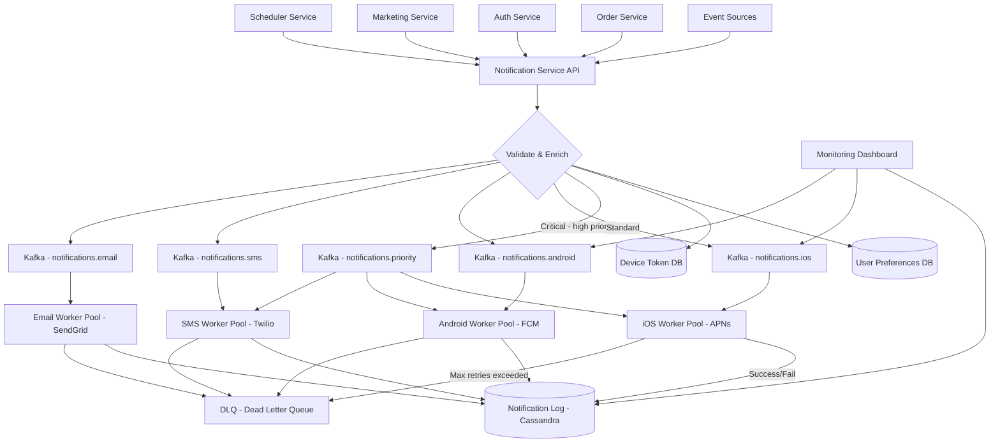

# 🏗️ System Design: Notification System

> [!abstract] TL;DR
> A multi-channel notification system delivers 10M notifications/day across iOS (APNs), Android (FCM), SMS (Twilio), and email (SendGrid) using Kafka per-channel queues, worker pools, and at-least-once delivery with idempotency-key deduplication.

---

## Requirements Clarification

**Functional Requirements:**
- RF1: Send notifications via 4 channels: iOS push (APNs), Android push (FCM), SMS (Twilio), Email (SendGrid)
- RF2: Users can configure per-channel preferences (opt-in/out per notification type)
- RF3: Support notification priorities: critical (OTP, alerts), high (order updates), low (marketing)
- RF4: Track delivery status per notification: queued → sent → delivered → failed
- RF5: Support scheduled notifications (send at a specific future time)
- RF6: Rate limit outbound notifications per user (prevent spam)
- RF7: Retry failed deliveries with exponential backoff; route to Dead Letter Queue (DLQ) after max retries

**Non-Functional Requirements:**
- Scale: 10M notifications/day → ~116 notifications/sec steady state; peak: ~1,000/sec (during flash sales, alerts)
- Latency: Critical notifications delivered within 5 seconds of trigger; low-priority within 60 seconds
- Availability: 99.9% — a transient failure in one channel (e.g., APNs outage) must not affect other channels
- Reliability: At-least-once delivery — never drop a notification; use deduplication to prevent duplicates
- Extensibility: Easy to add new channels (WhatsApp, Slack) without redesigning the core system
- Observability: Real-time dashboard showing delivery rates, failure rates, and queue depths per channel

---

## Capacity Estimation

**Notification Volume:**
- 10M/day total: ~5M push (iOS + Android), ~3M email, ~2M SMS
- Steady state: ~116/sec total; peak: ~1,000/sec (10× burst)

**Third-Party API Rate Limits:**
- APNs: 100K/sec (effectively unlimited for our scale)
- FCM: no documented hard limit; practically ~1M/hour per project
- Twilio SMS: 100/sec per long code, up to 3,000/sec with short code
- SendGrid Email: 100 emails/sec on basic plan; 3,000/sec on enterprise

**Storage (Notification Log):**
- Each notification record: ~1 KB (payload, status, timestamps, metadata)
- 10M/day × 1 KB = 10 GB/day
- 90-day retention: 900 GB → use Cassandra (append-only, time-series friendly)

**Message Queue Depth:**
- At peak 1,000 notifications/sec with workers consuming at 800/sec → 200 notifications/sec accumulate
- Kafka can buffer millions of messages; 1,000/sec is trivially manageable

---

## High-Level Design



**Notification flow:**
1. A service (Order, Auth, Marketing) calls the Notification API with a trigger event
2. Notification Service validates the request, looks up user preferences, fetches device tokens
3. Creates per-channel notification tasks, writes initial record to log (status: queued)
4. Publishes tasks to per-channel Kafka topics
5. Channel-specific workers consume from Kafka, call third-party APIs
6. Update notification log with delivery status (sent/delivered/failed)
7. On failure: exponential backoff retry; after max retries → DLQ

---

## Core Components Deep Dive

### Notification Service API

The entry point for all notification triggers. Exposes:
```http
POST /v1/notifications/send
{
  "event_type": "order_shipped",
  "user_id": "user_12345",
  "channels": ["push", "email"],   // optional override; defaults to user prefs
  "priority": "high",
  "payload": {
    "title": "Your order has shipped!",
    "body": "Order #78910 is on its way.",
    "order_id": "78910"
  },
  "idempotency_key": "order-78910-shipped-20260726",  // prevents duplicate sends
  "scheduled_at": null   // null = send immediately
}
```

Responsibilities:
1. **Idempotency check**: look up `idempotency_key` in Redis (or Cassandra). If already processed, return cached response — prevents duplicate notifications from retried API calls.
2. **User preference lookup**: fetch user's opted-in channels and DND (Do Not Disturb) windows from preferences DB. Respect hard opt-outs (never override) vs. soft preferences (can override for critical).
3. **Device token resolution**: fetch the user's registered device tokens for push channels.
4. **Rate limit check**: ensure the user hasn't exceeded their notification quota (prevent spam).
5. **Fan-out to channels**: create one task per channel, publish to Kafka.

### Kafka Topic Architecture

Each channel gets its own Kafka topic to ensure independent scaling and failure isolation:

| Topic | Partitions | Consumers | Notes |
|---|---|---|---|
| `notifications.ios` | 16 | iOS Worker Pool | Partitioned by user_id for ordering |
| `notifications.android` | 16 | Android Worker Pool | |
| `notifications.sms` | 8 | SMS Worker Pool | Fewer partitions — Twilio rate limit |
| `notifications.email` | 8 | Email Worker Pool | |
| `notifications.priority` | 4 | All worker pools | High-priority; critical alerts |
| `notifications.dlq` | 4 | DLQ processor | Failed deliveries for analysis |
| `notifications.scheduled` | 4 | Scheduler consumer | Future-scheduled notifications |

Partitioning by `user_id` ensures all notifications for a user arrive in order within a channel (important: don't show a "delivered" status before a "sent" status).

Why separate topics per channel?
- **Isolation**: an APNs outage slows the iOS topic consumers but doesn't affect the email queue
- **Independent scaling**: SMS workers can scale independently based on SMS queue depth
- **Independent retry policies**: SMS might retry 3× over 10 minutes; email might retry 5× over 24 hours

### Channel Workers

Each channel has a pool of workers (Kafka consumers) that:
1. Consume a notification task from Kafka
2. Look up device token / contact info (sometimes included in the message, sometimes fetched)
3. Format payload for the specific channel API (APNs JSON format differs from FCM)
4. Call third-party API with retry logic
5. Write delivery status to Cassandra notification log
6. On failure: retry with exponential backoff (1s, 2s, 4s, 8s, 16s max) before publishing to DLQ

**iOS Worker — APNs Integration:**
```
APNs requires HTTP/2 with TLS certificate auth
Payload format:
{
  "aps": {
    "alert": {"title": "...", "body": "..."},
    "badge": 1,
    "sound": "default"
  },
  "notification_id": "...",  // custom data for tracking
  "order_id": "78910"
}
Headers:
  apns-id: {uuid}     -- idempotency at APNs level
  apns-priority: 10   -- 10 = immediate, 5 = power-optimized
  apns-topic: com.example.app
```

**Android Worker — FCM Integration:**
```
FCM uses HTTP REST API with OAuth 2.0 token
Supports data messages (app handles display) vs notification messages (OS displays)
Use data messages for custom handling; notification messages for guaranteed display
Include notification_id for dedup on client side
```

**Email Worker — SendGrid Integration:**
- Template-based emails: store HTML templates in SendGrid, pass variables
- Batch sends: group multiple email tasks and use SendGrid's batch API (up to 1,000 recipients per API call) for efficiency
- Unsubscribe management: honor SendGrid's suppression list; sync it back to our preferences DB

### User Preferences Service

Stores per-user, per-channel, per-notification-type preferences:

```
Preference hierarchy (highest to lowest priority):
1. Hard opt-out (user explicitly unsubscribed from marketing emails) — NEVER override
2. Channel preference (user turned off push notifications entirely)
3. Notification type preference (user wants order updates but not promotions)
4. DND window (user set quiet hours 10pm-8am)
5. Default (send if no explicit preference exists)
```

Critical notifications (OTP, security alerts, account compromised) bypass DND windows and type preferences, but NEVER bypass hard opt-outs (legal compliance).

### Scheduler Service

For future-scheduled notifications:
1. Notification API publishes to `notifications.scheduled` Kafka topic with `scheduled_at` timestamp
2. Scheduler consumer reads from this topic and stores in a scheduled jobs DB (sorted by `scheduled_at`)
3. A background thread polls the jobs DB every 5 seconds, fetching all jobs with `scheduled_at <= now`
4. For each due job: re-publish to the appropriate channel topic (it becomes a normal notification)
5. Handle clock drift: use UTC timestamps consistently

**Alternative for high-volume scheduling:** Use Redis sorted sets (`ZADD scheduled_jobs {timestamp} {notification_id}`) — the Scheduler polls with `ZRANGEBYSCORE scheduled_jobs 0 {current_time}` to fetch due jobs in O(log N + M).

### At-Least-Once Delivery and Deduplication

**The reliability contract:** A notification MUST be delivered at least once. Losing a notification (zero delivery) is unacceptable. Delivering it twice is undesirable but recoverable.

**How Kafka ensures at-least-once:**
- Kafka consumers commit their offset (progress marker) ONLY AFTER successfully processing the message
- If a worker crashes mid-processing, the message is re-delivered from the last committed offset
- This can cause duplicate delivery → handled by idempotency

**Idempotency key lifecycle:**
1. Caller provides an `idempotency_key` (or we generate one: `{notification_type}:{user_id}:{day}`)
2. Notification Service stores it in Redis with status ("processing") and a 24-hour TTL
3. When delivery succeeds: update status to "delivered"
4. On re-delivery (duplicate Kafka message): check Redis → status is "delivered" → skip silently

**APNs-level idempotency:** APNs supports `apns-id` header — if the same UUID is used within 24 hours, APNs delivers the notification only once. Use `notification_id` as the APNs ID.

**Client-level deduplication:** Include `notification_id` in the push payload. The mobile app checks if it has already displayed a notification with that ID (using a local seen-set) and discards duplicates. Defense in depth.

---

## Data Model

### `notifications` table (Cassandra)

```sql
CREATE TABLE notifications (
    notification_id  UUID,
    user_id          BIGINT,
    channel          TEXT,       -- 'ios', 'android', 'sms', 'email'
    notification_type TEXT,      -- 'order_shipped', 'otp', 'marketing'
    priority         TEXT,       -- 'critical', 'high', 'low'
    payload          TEXT,       -- JSON
    status           TEXT,       -- 'queued', 'sent', 'delivered', 'failed'
    idempotency_key  TEXT,
    created_at       TIMESTAMP,
    sent_at          TIMESTAMP,
    delivered_at     TIMESTAMP,
    failed_at        TIMESTAMP,
    failure_reason   TEXT,
    retry_count      INT,
    PRIMARY KEY ((user_id), created_at, notification_id)
) WITH CLUSTERING ORDER BY (created_at DESC);
```

Partitioned by `user_id` → efficient "show all notifications for user X" queries. Clustering by `created_at DESC` → natural chronological order for user notification history.

### `user_device_tokens` table (MySQL)

```sql
CREATE TABLE user_device_tokens (
    id           BIGINT PRIMARY KEY AUTO_INCREMENT,
    user_id      BIGINT NOT NULL,
    platform     ENUM('ios', 'android'),
    token        VARCHAR(512) NOT NULL,       -- APNs token or FCM registration ID
    app_version  VARCHAR(20),
    is_active    BOOLEAN DEFAULT TRUE,
    registered_at TIMESTAMP,
    last_used_at TIMESTAMP,
    UNIQUE KEY (token),
    INDEX idx_user_id (user_id)
);
```

Tokens expire or become invalid (user uninstalls app, OS revokes token). When APNs/FCM returns a "bad token" error, mark `is_active = FALSE` immediately.

### `user_preferences` table (MySQL)

```sql
CREATE TABLE user_preferences (
    user_id           BIGINT,
    channel           ENUM('ios_push', 'android_push', 'sms', 'email'),
    notification_type VARCHAR(100),   -- 'order_updates', 'marketing', 'security'; NULL = all types
    is_enabled        BOOLEAN,
    dnd_start_hour    TINYINT,        -- 0-23; NULL = no DND
    dnd_end_hour      TINYINT,
    PRIMARY KEY (user_id, channel, notification_type)
);
```

### `idempotency_keys` (Redis)

```
Key: idempotency:{key_value}
Value: {notification_id, status, created_at}
TTL: 86400 seconds (24 hours)
```

Redis provides O(1) lookup with automatic TTL expiry — perfect for idempotency checking.

---

## Key Design Decisions & Trade-offs

### Decision 1: One Kafka Topic Per Channel vs. Single Topic
**Chose one topic per channel.** Alternative: a single `notifications` topic with channel as a field, consumed by all workers.
- Single topic problem: a spike in iOS push volume slows all channels (consumers compete for partitions)
- Per-channel topics allow independent scaling, independent retry policies, and isolated failure domains
- Trade-off: more Kafka management overhead; mitigated by automation

### Decision 2: At-Least-Once vs. Exactly-Once Delivery
**Chose at-least-once + deduplication.** Exactly-once in Kafka requires transactions across Kafka and external systems (APNs, FCM) — APNs does not support distributed transactions. At-least-once with idempotency key deduplication achieves the practical equivalent of exactly-once at the application level.

### Decision 3: Synchronous vs. Asynchronous Notification Processing
**Chose fully asynchronous** via Kafka. Alternative: Notification Service calls APNs/FCM synchronously, waits for response, returns result to caller.
- Synchronous problem: slow third-party API (APNs takes 500ms) blocks the API thread; timeout cascades cause request failures upstream
- Asynchronous allows the Notification API to return immediately (202 Accepted) and deliver via background workers
- Trade-off: caller doesn't know immediately if delivery succeeded — provide a status polling endpoint or webhook callback

### Decision 4: Cassandra for Notification Log
**Why not MySQL?** The notification log is append-only (status updates are new rows, not updates), time-series, and grows at 10GB/day. Cassandra's:
- Linear write scalability (no leader bottleneck)
- Built-in time-series data model (clustering by `created_at`)
- Automatic data expiry (TTL on rows)
...make it far better suited than MySQL for this use case.

### Decision 5: Retry Strategy per Channel

| Channel | Max Retries | Backoff | Total Window |
|---|---|---|---|
| iOS Push | 3 | 1s, 2s, 4s | ~7 seconds |
| Android Push | 3 | 1s, 2s, 4s | ~7 seconds |
| SMS | 5 | 10s, 20s, 40s, 80s, 160s | ~5 minutes |
| Email | 5 | 1min, 5min, 15min, 1hr, 4hr | ~5 hours |

Push notifications have short retry windows (user expects immediacy; stale push is useless). Email can retry for hours since it's asynchronous by nature. SMS is in between.

---

## Scalability & Bottlenecks

### Scaling Worker Pools
Kafka allows independent scaling per topic. Monitor consumer lag (time from message production to consumption). If iOS topic lag grows → add more iOS worker pods. Target: lag < 5 seconds for high-priority, < 60 seconds for low-priority.

### Third-Party API Rate Limits
Twilio SMS is the most constrained (100/sec on long codes). Mitigation:
- Use short codes (up to 3,000/sec)
- For marketing SMS: spread sends over hours (not bursts)
- Implement a per-channel rate limiter between workers and third-party APIs using the token bucket pattern

### Handling APNs/FCM Outages
When a channel's third-party API is down:
- Workers retry with exponential backoff
- Kafka topic buffers the backlog (Kafka retention: 7 days)
- When the API recovers, workers drain the backlog
- Critical notifications should have a fallback channel (if APNs is down → try FCM or SMS)

### Database Scaling
- User preferences DB (MySQL): read-heavy, cache aggressively in Redis (preferences rarely change)
- Device tokens DB (MySQL): high write rate (token updates on app launches) — shard by user_id
- Notification log (Cassandra): horizontally scalable by design; add nodes as volume grows

---

## Related Concepts

- [[_MOC_CaseStudies|↑ Section MOC]]
- [[Kafka]] — per-channel topics, consumer groups, offset management, DLQ pattern
- [[Message_Queues]] — Kafka as a durable message queue with replay capability
- [[Idempotent_Operations]] — idempotency keys for exactly-once effective delivery
- [[Asynchronism]] — fire-and-forget pattern for non-blocking notification delivery
- [[Back_Pressure]] — consumer lag as signal to scale worker pools

---

## Review Questions

1. Why does the notification system use separate Kafka topics per channel (iOS, Android, SMS, email) instead of a single topic with a channel field?
2. Explain how idempotency keys prevent a notification from being sent twice when Kafka redelivers a message after a worker crash. What is the exact sequence of operations that creates the duplicate without this mechanism?
3. A user opts out of marketing emails but receives a security alert via email. Is this the correct behavior? How does the preference hierarchy in the system enforce this?
4. APNs goes down for 30 minutes. Walk through what happens in the system during the outage and during recovery — specifically addressing Kafka topic depth, worker retry behavior, and eventual delivery.
5. Why is Cassandra a better choice than MySQL for the notification log? Give three specific reasons related to Cassandra's data model and scalability properties.
6. Design the `scheduled_at` feature in detail — how do you efficiently find all notifications due in the next 5-second window without full table scans?
7. How would you add a new channel (e.g., WhatsApp via Twilio API) to this system? List every component you need to add or modify and estimate the engineering effort.

---

## Sources

#SystemDesign #CaseStudy #NotificationSystem #Kafka #MessageQueues #APNs #FCM #AtLeastOnce #Idempotency #Cassandra
