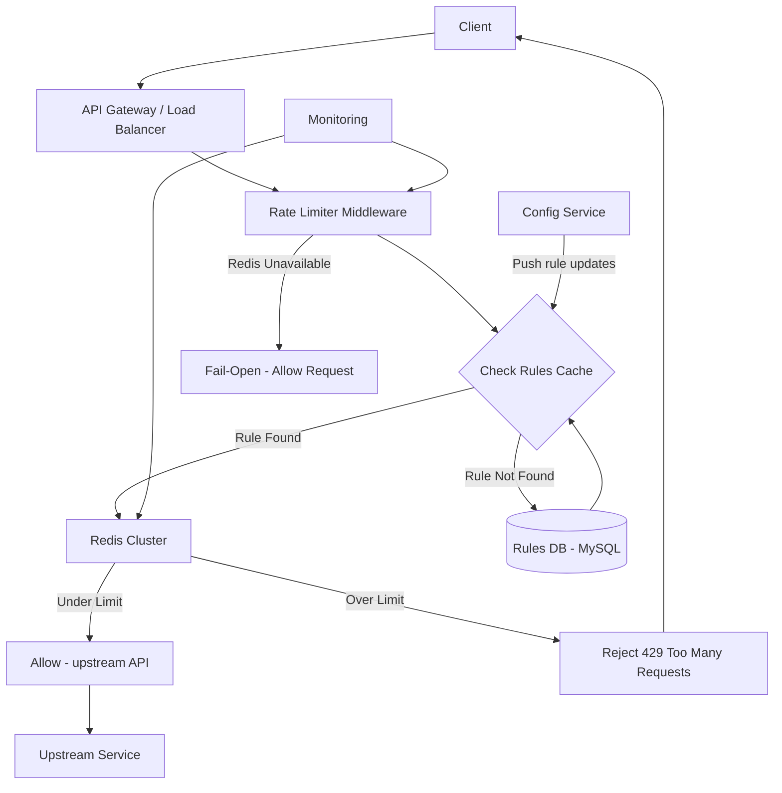

# 🏗️ System Design: Distributed Rate Limiter

> [!abstract] TL;DR
> A distributed rate limiter enforces per-client API quotas across 100K+ RPS using a Redis-backed token bucket algorithm with atomic Lua scripts, sub-millisecond decisions, and graceful degradation on Redis failure.

---

## Requirements Clarification

**Functional Requirements:**
- RF1: Limit the number of requests a client (user, API key, IP) can make within a time window
- RF2: Support multiple rate limiting strategies (per user, per IP, per endpoint, per tier)
- RF3: Return appropriate HTTP 429 status with headers indicating limit details
- RF4: Support burst allowance (e.g., allow 10 req/sec burst but sustain only 5 req/sec average)
- RF5: Rules should be configurable without code deployment (stored in config DB)

**Non-Functional Requirements:**
- Scale: Serve 100K+ RPS across thousands of API servers in a distributed cluster
- Latency: Rate limit decision in <1ms p99 — must not add perceptible latency to API calls
- Availability: 99.99% — rate limiter failure should not take down the API (fail-open strategy)
- Accuracy: At most 0.1% error rate — slight over-counting acceptable; significant under-limiting (DDoS passing through) is not
- Consistency: Eventual — a client may exceed limits slightly across distributed nodes; strong consistency across all nodes is too expensive
- Configurability: Rules updated within 1 minute of config change

---

## Capacity Estimation

**Redis Storage:**
- Token bucket per client: store `{tokens_remaining, last_refill_timestamp}` — ~32 bytes
- 10M active clients × 32 bytes = **320 MB** — comfortably fits in Redis memory

**Redis RPS:**
- Each API request triggers 1 Redis operation (Lua script with EVAL)
- 100K API RPS → 100K Redis RPS
- Single Redis node: ~200K commands/sec; Redis Cluster with 3 shards: easily handles 600K commands/sec

**Rule Storage:**
- Rate limit rules are small config (endpoint pattern, limit, window, tier) — ~1KB per rule
- 10,000 rules × 1KB = 10 MB — cache fully in application memory

---

## High-Level Design



**Decision flow per request:**
1. API Gateway receives request
2. Rate Limiter extracts client identifier (API key, user ID, or IP)
3. Look up applicable rule in local memory cache (< 1μs)
4. Execute atomic Lua script on Redis to check/update token count
5. If within limit: add `X-RateLimit-*` headers → forward to upstream
6. If over limit: return `429 Too Many Requests` immediately

---

## Core Components Deep Dive

### Rate Limiting Algorithms

**Option A: Fixed Window Counter**
- Divide time into fixed windows (e.g., 1-second buckets)
- Increment a counter per window: `INCR rate:{client_id}:{current_window_timestamp}`
- Set expiry: `EXPIRE rate:{client_id}:{ts} 2` (2-second TTL)
- Problem: **Boundary burst** — a client can make 2× the limit by sending requests at the end of window N and start of window N+1

**Option B: Sliding Window Log**
- Store timestamp of each request in a Redis sorted set
- On each request: remove entries older than window → count remaining → add current timestamp
- Most accurate; Problem: **high memory usage** — stores every request timestamp per client; at 100K RPS this is 100K entries/sec

**Option C: Sliding Window Counter (Hybrid)**
- Combines fixed window with linear interpolation
- Current_count = prev_window_count × (overlap%) + current_window_count
- Good accuracy with O(1) storage; slight imprecision (~0.1%) is acceptable

**Option D: Token Bucket (Recommended)**
- Each client has a "bucket" with capacity N tokens
- Tokens refill at a constant rate R tokens/sec
- Each request consumes 1 token; if bucket empty → reject
- Allows controlled bursting up to capacity N
- Storage per client: `{tokens: float, last_refill: timestamp}` — just 2 fields
- Implementation: atomic Lua script to calculate tokens and update atomically

**Option E: Leaky Bucket**
- Requests enter a queue (the "bucket"), processed at a fixed rate
- Smooths bursty traffic; but adds latency (queue wait) — bad for real-time APIs

**Recommendation: Token Bucket** — supports burst allowance (important for legitimate clients with occasional spikes), O(1) Redis storage, simple and well-understood. Implemented atomically with a Lua script.

### Token Bucket — Redis Implementation

The key challenge: the check-then-update must be **atomic** to avoid race conditions. Two API servers could both read "5 tokens remaining," both allow the request, then both decrement — allowing 2 requests when only 1 should be allowed. Solution: **Redis Lua scripts execute atomically**.

```lua
-- Lua script for token bucket (executed via EVAL, atomic on Redis)
local key = KEYS[1]             -- rate:{client_id}
local capacity = tonumber(ARGV[1])   -- max tokens (e.g., 100)
local refill_rate = tonumber(ARGV[2]) -- tokens per second (e.g., 10)
local now = tonumber(ARGV[3])        -- current timestamp in milliseconds
local requested = tonumber(ARGV[4])  -- tokens consumed per request (usually 1)

local bucket = redis.call('HMGET', key, 'tokens', 'last_refill')
local tokens = tonumber(bucket[1]) or capacity
local last_refill = tonumber(bucket[2]) or now

-- Refill tokens based on elapsed time
local elapsed = (now - last_refill) / 1000.0  -- convert ms to seconds
tokens = math.min(capacity, tokens + elapsed * refill_rate)

if tokens >= requested then
    tokens = tokens - requested
    redis.call('HMSET', key, 'tokens', tokens, 'last_refill', now)
    redis.call('EXPIRE', key, math.ceil(capacity / refill_rate) + 1)
    return {1, math.floor(tokens)}  -- allowed, remaining tokens
else
    redis.call('HMSET', key, 'tokens', tokens, 'last_refill', now)
    return {0, 0}  -- rejected
end
```

This Lua script is sent once, cached by its SHA1 hash (`EVALSHA`), and executes atomically in Redis without a round-trip mid-operation.

### Rate Limit Rules

Rules are stored in MySQL and cached in application memory (refreshed every 60 seconds). A rule specifies:

```json
{
  "rule_id": "api_free_tier",
  "match": {"tier": "free"},
  "limits": [
    {"window": "1s",  "max_requests": 10,   "burst": 20},
    {"window": "1h",  "max_requests": 1000},
    {"window": "24h", "max_requests": 10000}
  ],
  "key_by": "user_id"
}
```

Multiple limits can apply simultaneously (per-second burst + per-day quota). The rate limiter checks all applicable rules and rejects if any is violated.

### Response Headers

When requests are allowed:
```http
HTTP/1.1 200 OK
X-RateLimit-Limit: 100
X-RateLimit-Remaining: 87
X-RateLimit-Reset: 1722000060
X-RateLimit-Policy: 100;w=60
```

When rejected:
```http
HTTP/1.1 429 Too Many Requests
X-RateLimit-Limit: 100
X-RateLimit-Remaining: 0
X-RateLimit-Reset: 1722000060
Retry-After: 12
Content-Type: application/json

{"error": "rate_limit_exceeded", "message": "Retry after 12 seconds"}
```

### Client Identification Strategy

| Identifier | Use Case | Pros | Cons |
|---|---|---|---|
| API Key | Authenticated API access | Precise, per-client | Can be shared/leaked |
| User ID | Logged-in user actions | Links to account | Requires auth |
| IP Address | Public endpoints, unauthenticated | No auth needed | Shared IPs (NAT, corporate) punish many |
| Composite | IP + User-Agent + path | Fine-grained | Complex key space |

Best practice: use API key when available (authenticated), fall back to IP for unauthenticated requests. Apply stricter limits to IP-based clients.

---

## Data Model

### `rate_limit_rules` table (MySQL)

```sql
CREATE TABLE rate_limit_rules (
    rule_id      VARCHAR(64) PRIMARY KEY,
    tier         VARCHAR(32),          -- 'free', 'pro', 'enterprise'
    endpoint     VARCHAR(255),         -- NULL = applies to all
    window_sec   INT NOT NULL,         -- window in seconds
    max_requests INT NOT NULL,         -- requests allowed per window
    burst_max    INT,                  -- peak burst allowance (token bucket capacity)
    key_by       ENUM('user_id','api_key','ip'),
    is_active    BOOLEAN DEFAULT TRUE,
    updated_at   TIMESTAMP
);
```

### Redis Key Schema

```
rate:{version}:{key_by}:{identifier}:{window}
  e.g., rate:v1:user_id:12345:1s
  e.g., rate:v1:api_key:abc123:1h
  e.g., rate:v1:ip:192.168.1.1:1s
```

Versioning (`v1`) enables instant cache invalidation when rules change — bump the version prefix.

### `rate_limit_violations` log (Cassandra — optional)

```
violations
  client_id   TEXT
  violated_at TIMESTAMP
  endpoint    TEXT
  rule_id     TEXT
  request_count INT
  PRIMARY KEY (client_id, violated_at)
```

Used for abuse detection analytics, not for the hot path.

---

## Key Design Decisions & Trade-offs

### Decision 1: Fail-Open vs. Fail-Closed on Redis Unavailability
**Chose Fail-Open:** If Redis is down, allow all requests to pass through without rate limiting. Rationale: the cost of briefly over-serving legitimate traffic (Redis is down for 10 seconds) is lower than the cost of rejecting all traffic (service outage for clients). For security-critical APIs (payment endpoints), consider fail-closed. Mark this as a business decision, not a technical one.

### Decision 2: Centralized Redis vs. Local Counter
**Alternative:** Each API server keeps a local in-memory counter and periodically syncs with a central counter. This means 0 added latency (no Redis call), but allows each server to grant its full quota — with 10 servers, a client could exceed the limit by 10×. **Trade-off:** Choose Redis for accuracy (over-serving by at most 1-2% due to race conditions), or local for minimum latency (over-serving by up to N×, where N = server count). For most APIs, Redis is the right choice.

### Decision 3: Single Redis Call vs. Pipeline
Each rate check is a single Lua script call (EVALSHA) — one network round trip. Alternatives: batching multiple client checks (useful if the gateway processes many requests simultaneously), or Redis pipelining (sends multiple commands without waiting for responses). For our use case, single atomic Lua calls are optimal.

### Decision 4: Sliding Window vs. Token Bucket
Sliding window (log variant) is most accurate but memory-intensive. Token bucket is slightly less accurate at window boundaries but has O(1) storage and naturally handles burst. For a public API with legitimate clients who may have irregular but valid burst patterns, token bucket is more user-friendly.

### Decision 5: Where to Place the Rate Limiter
| Placement | Pros | Cons |
|---|---|---|
| API Gateway | Blocks requests before they reach services; single enforcement point | Gateway becomes bottleneck; all services share same limits |
| Service middleware | Per-service granularity; isolated failures | Each service adds Redis calls; inconsistent enforcement |
| Sidecar proxy | Service mesh approach; language-agnostic | Infrastructure complexity |

**Recommendation:** API Gateway for global limits (IP-based DDoS), plus per-service middleware for fine-grained per-endpoint limits.

---

## Scalability & Bottlenecks

### Scaling Redis
- Use **Redis Cluster** with consistent hashing: each client's rate limit key maps to a specific Redis node
- 3 primary nodes + 3 replicas → 6 nodes handling 200K+ commands/sec each → **1.2M commands/sec total**
- Rate limit keys distribute evenly because client identifiers are uniformly distributed

### Handling Hot Keys
- A single user with millions of aliases making requests → all rate limit checks hit the same Redis key
- Mitigation: replicate hot keys to multiple shards, use local in-memory counter for the first N requests per second before flushing to Redis

### Rule Update Propagation
- Rules are cached in application memory for 60 seconds
- On rule change: Config Service pushes a message to Kafka → all API server instances listen and refresh their cache immediately
- Prevents 60-second window where old rules are used

### Clock Skew
- Token bucket uses wall clock time to calculate token refill. If servers have different system times (clock drift), refill calculations are slightly off.
- Mitigation: use `TIME` command from Redis itself for timestamps (all Redis-side calculations use Redis's clock, not the API server's clock). The Lua script receives `now` from the calling server but this only affects the first call — subsequent refills use the stored `last_refill` from Redis, which is consistent.

---

## Related Concepts

- [[_MOC_CaseStudies|↑ Section MOC]]
- [[Rate_Limiting]] — core concepts: token bucket, sliding window, fixed window
- [[API_Gateway]] — the typical host for a distributed rate limiter
- [[Caching]] — local rule caching; Redis as shared state
- [[Idempotent_Operations]] — rate limiters rely on idempotency keys for deduplication
- [[Back_Pressure]] — rate limiting is a form of intentional back pressure

---

## Review Questions

1. Explain the "boundary burst" problem with fixed window counters. Give a concrete example with numbers.
2. Why must the Redis token bucket check-and-update be atomic? What goes wrong without atomicity (give a race condition example)?
3. A client sends exactly 10 requests in 1 second, hitting 5 different API servers. Each server has its own local counter (no Redis). How many requests might get through if the limit is 10/sec?
4. What does "fail-open" mean for a rate limiter, and under what business circumstances would you choose "fail-closed" instead?
5. How does the Lua script approach differ from using `INCR` followed by `EXPIRE` as two separate Redis commands? Why does the two-command approach have a bug?
6. Design a rate limiter for a payment API where slightly exceeding the limit (e.g., 11 requests when 10 are allowed) has serious consequences. What changes from the standard design?
7. If you wanted to add rate limiting by geographic region (e.g., only 1,000 requests/minute from any single country), what changes to the key schema and rules table would you need?

---

## Sources

#SystemDesign #CaseStudy #RateLimiting #APIGateway #Redis #TokenBucket #LuaScript #DistributedSystems
