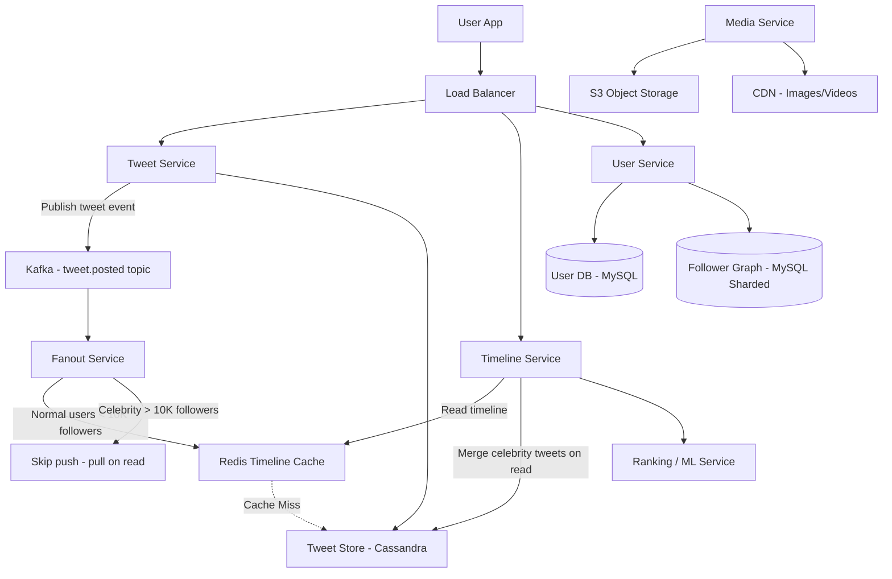

# 🏗️ System Design: Twitter Feed (News Feed)

> [!abstract] TL;DR
> Twitter's news feed serves 300M DAU with 500M tweets/day using a **hybrid fanout strategy** — push to followers' timeline caches for normal users, pull-on-read for celebrities — backed by Redis sorted sets and Kafka.

---

## Requirements Clarification

**Functional Requirements:**
- RF1: Users can post tweets (text, images, videos, polls)
- RF2: Users see a personalized chronological (or ranked) feed of tweets from people they follow
- RF3: Users can follow/unfollow other users
- RF4: Users can like, retweet, reply to tweets
- RF5: Feed should include tweets from followed users posted within the last ~7 days
- RF6: Support @mentions and hashtag search

**Non-Functional Requirements:**
- Scale: 300M Daily Active Users (DAU), 500M tweets posted/day
- Tweet writes: ~6,000 tweets/sec (500M / 86,400)
- Timeline reads: assume each DAU reads feed 5 times/day → 1.5B reads/day → ~17,000 reads/sec
- Fanout scale: Average user has 200 followers; celebrity has up to 100M followers
- Latency: <200ms p99 for timeline load; <500ms for tweet post
- Availability: 99.99% (feed must always be readable, even if slightly stale)
- Consistency: Eventual — it's acceptable if a new tweet takes a few seconds to appear in all followers' feeds

---

## Capacity Estimation

**Storage (tweets):**
- 500M tweets/day × 280 characters × 2 bytes (UTF-16) ≈ 280 GB/day text
- With metadata (user_id, timestamp, likes, retweet_count): ~500 bytes/tweet
- 500M × 500 bytes = 250 GB/day → **~91 TB/year** (text only)
- Media (images/videos): 20% of tweets have media → 100M × avg 2 MB = 200 TB/day → stored in object storage (S3)

**Timeline Cache (Redis):**
- Store last 800 tweets per user in timeline cache
- 300M users × 800 tweets × 8 bytes (tweet_id pointer) = **1.92 TB** of Redis memory for pointers
- In practice: only store for active users (use LRU eviction for inactive)

**Follower Graph:**
- 300M users × average 200 followers × 8 bytes = 480 GB — fits in a graph DB or sharded MySQL

---

## High-Level Design



**Tweet post flow:**
1. User posts tweet → Tweet Service validates and writes to Cassandra (tweet store)
2. Tweet Service publishes `tweet.posted` event to Kafka
3. Fanout Service consumes event, looks up follower list
4. For each follower with <10K followers: prepend tweet_id to their Redis timeline sorted set
5. Timeline Service reads from Redis → hydrates tweet objects from Cassandra

---

## Core Components Deep Dive

### The Fanout Problem

When a user with 100M followers posts a tweet, naive fanout means updating 100M timeline caches in milliseconds — this is physically impossible at write time. Two opposing approaches:

**Fanout on Write (Push Model):**
- On tweet creation: look up all followers → prepend tweet to each follower's timeline cache in Redis
- Pro: Timeline reads are O(1) — just read from pre-built cache
- Con: Celebrities create **write amplification**: 100M cache writes per tweet. A single celebrity tweet can cause a write storm that takes minutes to complete

**Fanout on Read (Pull Model):**
- On timeline load: fetch tweet IDs from all followed users → merge and sort → return feed
- Pro: No write amplification — celebrity tweets are just stored once
- Con: Timeline reads are O(following_count × tweets_per_user) — very slow for users following 1,000 accounts

**Hybrid Model (Twitter's Actual Approach):**
- Define "celebrity" threshold: users with >10,000 followers
- **Normal users** (< 10K followers): fanout on write → push tweet to all followers' Redis timeline caches
- **Celebrities** (> 10K followers): skip fanout → when a user loads their timeline, the Timeline Service fetches celebrity tweets separately and merges them with the pre-built cache

This hybrid means: 99%+ of tweets go through fast push fanout, and the expensive pull is only for a tiny fraction of celebrity accounts that are already followed widely.

### Tweet Service

Responsibilities: authentication, rate limiting, content validation, media upload coordination, writing to Cassandra, publishing to Kafka.

**Write path:**
```
POST /tweet
  → Validate (auth, content length, rate limit)
  → Generate tweet_id (Snowflake ID: timestamp + datacenter + sequence)
  → Write to Cassandra (tweet store)
  → Publish to Kafka topic: tweet.posted
  → Return tweet object to client
```

### Timeline Service

Responsibilities: reading the personalized feed, hydrating tweet objects, applying ranking (if ML feed).

**Read path:**
```
GET /timeline
  → Read up to 800 tweet_ids from Redis ZSET (user's timeline cache)
  → Fetch celebrity tweet_ids from followed celebrities (pull)
  → Merge + sort by timestamp (or ML score)
  → Batch fetch tweet objects from Cassandra by tweet_id
  → Return hydrated tweets
```

### Redis Timeline Cache (Sorted Set)

Each user has a Redis key: `timeline:{user_id}` storing a **sorted set** where:
- Member = `tweet_id`
- Score = `created_at` Unix timestamp (enables chronological ordering with `ZREVRANGE`)

Operations:
- Add tweet: `ZADD timeline:{follower_id} {timestamp} {tweet_id}` — O(log N)
- Read feed: `ZREVRANGE timeline:{user_id} 0 799` → returns latest 800 tweet IDs — O(log N + M)
- Trim: `ZREMRANGEBYRANK timeline:{user_id} 0 -801` — keep only latest 800 entries

Sorted sets give us pagination, chronological order, and O(log N) inserts — ideal for a feed.

### Fanout Service

A fleet of Kafka consumers processing `tweet.posted` events:
1. Receive `{tweet_id, author_id, timestamp}`
2. Fetch author's follower list (sharded MySQL or graph DB)
3. If author follower_count < 10,000: push tweet_id to all followers' Redis timeline caches
4. If author follower_count >= 10,000: skip Redis push (Timeline Service will pull on read)
5. Publish to notification service (for push notifications)

The Fanout Service is horizontally scalable — add more Kafka consumer instances to keep up with write volume. For a popular user with 1M followers (below celebrity threshold), fanout completes in ~2-3 seconds with parallel Redis writes.

### Media Storage

Images and videos are stored in S3 via a dedicated Media Service. Tweets store only the S3 URL, not the binary. CDN (CloudFront/Akamai) serves media at the edge with aggressive caching. This keeps the tweet store lean and media delivery fast globally.

---

## Data Model

### `tweets` table (Cassandra — optimized for tweet_id lookups)

```
tweets
  tweet_id      BIGINT (Snowflake ID — encodes timestamp)
  user_id       BIGINT
  content       TEXT (max 280 chars)
  media_urls    LIST<TEXT>
  reply_to_id   BIGINT (NULL if not a reply)
  retweet_of_id BIGINT (NULL if original)
  like_count    COUNTER
  retweet_count COUNTER
  created_at    TIMESTAMP

PRIMARY KEY (tweet_id)
```

*Why Cassandra?* Cassandra excels at high write throughput, is append-only by nature, and handles wide partitions well. Tweet_ids are Snowflake IDs (monotonically increasing) which distribute evenly across Cassandra nodes.

### `followers` table (MySQL, sharded by user_id)

```sql
CREATE TABLE followers (
    user_id     BIGINT NOT NULL,   -- the person being followed
    follower_id BIGINT NOT NULL,   -- the follower
    created_at  TIMESTAMP,
    PRIMARY KEY (user_id, follower_id),  -- lookup: "give me all followers of user X"
    INDEX idx_follower (follower_id, user_id)  -- lookup: "give me all accounts user X follows"
);
```

Sharded by `user_id` — each shard holds all followers for a range of user_ids.

### `users` table (MySQL)

```sql
CREATE TABLE users (
    user_id        BIGINT PRIMARY KEY,
    username       VARCHAR(50) UNIQUE,
    display_name   VARCHAR(100),
    follower_count BIGINT DEFAULT 0,
    following_count BIGINT DEFAULT 0,
    is_celebrity   BOOLEAN DEFAULT FALSE,  -- precomputed flag: follower_count > 10K
    created_at     TIMESTAMP
);
```

---

## Key Design Decisions & Trade-offs

### Decision 1: Where to Draw the Celebrity Threshold
Threshold of 10,000 followers balances fanout cost vs. read complexity. At 10K followers, a tweet fanout completes in <500ms. At 1M followers, it would take minutes. The threshold should be tunable — Twitter reportedly uses different thresholds based on system load.

### Decision 2: Redis Sorted Set vs. Simple List
Sorted set (ZSET) allows:
- Chronological ordering by score (timestamp)
- Efficient range queries (`ZREVRANGE`)
- Easy deduplication (same tweet_id can't be added twice)
- Pagination support with `ZREVRANGEBYSCORE`

A simple list (LPUSH/LRANGE) is faster but lacks the ordering flexibility needed when merging celebrity tweets on read.

### Decision 3: Cassandra vs. MySQL for Tweet Storage
Tweets are write-heavy (6K/sec) and read by tweet_id in bulk. Cassandra's leaderless replication and linear write scalability make it ideal. MySQL would require heavy sharding to keep up; Cassandra handles this natively. Trade-off: Cassandra lacks JOIN support — tweet hydration must be done in the application layer.

### Decision 4: Kafka for Decoupling
The Fanout Service, Notification Service, Search Indexing Service, and Analytics Service all need to react to new tweets. Rather than the Tweet Service calling each one synchronously (tight coupling, cascading failures), Kafka decouples them. The Tweet Service publishes once; each downstream service consumes independently at its own pace.

### Decision 5: Ranking vs. Chronological Feed
Chronological feeds (sort by timestamp) are simple but miss relevance. ML-ranked feeds (Twitter's "For You" timeline) improve engagement but require a ranking service that scores each candidate tweet. For this design, we keep both options: chronological by default (Redis ZSET score = timestamp), with an optional ML ranking service that re-scores the candidate set before returning to the client.

---

## Scalability & Bottlenecks

### Bottleneck 1: Fanout for Celebrities
**Problem:** A celebrity with 100M followers can't be fanned out synchronously.
**Solution:** Hybrid model — skip fanout for celebrities. Pull their tweets separately at read time. For extremely high-profile events (e.g., a president tweets), temporarily rate-limit fanout and use eventual propagation.

### Bottleneck 2: Hot User Timeline Cache Reads
**Problem:** 17K reads/sec distributed unevenly — some users read constantly, some never.
**Solution:** Redis Cluster with consistent hashing. Each timeline is on one shard; cache is horizontally scalable. Use read replicas for very popular users.

### Bottleneck 3: Follower List Fetching in Fanout Service
**Problem:** Fetching 1M followers from DB for each tweet is slow.
**Solution:** Cache follower lists in Redis for active accounts. Use pre-fetched follower lists in memory within the Fanout Service. Update follower cache asynchronously when follow/unfollow events occur.

### Bottleneck 4: Timeline Cache Cold Start
**Problem:** New deployment or cache eviction — user's timeline cache is empty.
**Solution:** Timeline Service detects empty cache → reads recent tweets from followed users via Cassandra → backfills Redis ZSET. This is the "cache warming" path and is acceptable to be slightly slower.

### Scaling Numbers
| Component | Scale Target | Scaling Strategy |
|---|---|---|
| Tweet Service | 6K writes/sec | Stateless, horizontal scale |
| Fanout Service | 6K events/sec → up to 6B fan-out writes/sec | Kafka partitions + consumer parallelism |
| Redis Timeline Cache | 17K reads/sec | Redis Cluster, 64 shards |
| Cassandra Tweet Store | 6K writes + 17K reads/sec | Multi-node cluster, RF=3 |
| Media (S3 + CDN) | Unlimited | CDN edge caching |

---

## Related Concepts

- [[_MOC_CaseStudies|↑ Section MOC]]
- [[Kafka]] — event streaming for decoupled fanout and downstream services
- [[Caching]] — Redis sorted sets for pre-built timeline caches
- [[Consistent_Hashing]] — distributing Redis shards and Cassandra partitions
- [[Load_Balancers]] — distributing read/write traffic across service instances
- [[Replication]] — Cassandra RF=3, Redis replicas for availability
- [[Message_Queues]] — Kafka as the backbone for async processing

---

## Review Questions

1. Explain the "fanout problem" and why a pure push model fails for celebrities with 100M followers.
2. What data structure does Redis use for timeline storage, and why is it better than a simple list?
3. A user follows 500 people including 5 celebrities. Walk through exactly what happens when they open their Twitter app — which data comes from cache and which is fetched on demand.
4. Why is Cassandra preferred over MySQL for the tweet store? What capability does MySQL have that you lose?
5. If Twitter wants to switch from chronological to ML-ranked feeds, which components change and which stay the same?
6. How does Kafka enable the Fanout Service, Notification Service, and Search Index to all react to a new tweet without the Tweet Service needing to know about them?
7. Design the `unfollow` operation — what caches and data stores need to be updated, and should these updates be synchronous or asynchronous?

---

## Sources

#SystemDesign #CaseStudy #NewsFeed #Fanout #SocialMedia #Redis #Kafka #Cassandra #HybridFanout
