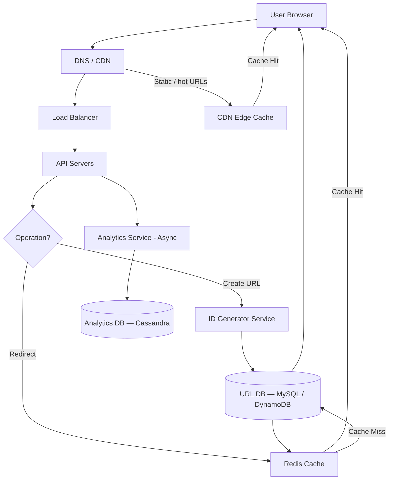

# 🏗️ System Design: URL Shortener

> [!abstract] TL;DR
> A URL shortener (like bit.ly or TinyURL) converts long URLs into compact codes and redirects ~12,000 reads/sec at 1B redirects/day using a key-value store, Redis cache, and async analytics.

---

## Requirements Clarification

**Functional Requirements:**
- RF1: Given a long URL, generate a unique short URL (e.g., `short.ly/aB3xZ`)
- RF2: Redirect users from the short URL to the original long URL
- RF3: Support custom aliases (e.g., `short.ly/my-brand`)
- RF4: URLs can optionally expire after a configurable TTL
- RF5: Track basic analytics: click count, referrer, geographic location

**Non-Functional Requirements:**
- Scale: 100M new URLs created/day; 10:1 read:write ratio → ~1B redirects/day
- Reads: ~12,000 RPS (peak ~20K RPS)
- Writes: ~1,200 RPS (peak ~2K RPS)
- Latency: <10ms p99 for redirects (user-facing); <100ms for URL creation
- Availability: 99.99% (redirect service); 99.9% (creation service)
- Consistency: Eventual — a short URL created by one user may take seconds to propagate globally, which is acceptable
- Durability: URLs must never be lost once created

---

## Capacity Estimation

**Storage:**
- Assume 500 bytes per URL record (short_code 7 chars + long_url avg 200 chars + metadata)
- 100M URLs/day × 500 bytes = 50 GB/day
- 5-year retention: 50 GB × 365 × 5 ≈ **91 TB total storage**
- With replication (3x): ~273 TB

**Bandwidth:**
- Write: 1,200 RPS × 500 bytes ≈ 600 KB/s
- Read (redirect): 12,000 RPS × 500 bytes ≈ 6 MB/s — very lightweight, mostly a key lookup

**Cache:**
- 80/20 rule: 20% of URLs drive 80% of traffic
- Cache the hot 20%: 100M URLs × 20% × 500 bytes ≈ **10 GB** fits in a single Redis instance

**Short Code Space:**
- Base62 (a-z, A-Z, 0-9) with 7 characters = 62^7 ≈ 3.5 trillion unique codes
- At 100M/day that's 3.5T / 100M ≈ **95 years of unique codes** — more than sufficient

---

## High-Level Design



**Request flow for a redirect:**
1. User clicks `short.ly/aB3xZ`
2. CDN checks its edge cache — if hot URL, returns 301 immediately
3. If CDN miss → Load Balancer → API Server
4. API Server checks Redis cache for `aB3xZ`
5. Cache hit → return 302 redirect to long URL, fire async analytics event
6. Cache miss → query URL DB → populate Redis → return redirect

---

## Core Components Deep Dive

### ID Generator Service

**Option A — Auto-increment + Base62 encoding (Recommended)**
- Use a database sequence or a distributed ID service (Snowflake-style) to generate a monotonically increasing integer
- Encode the integer in Base62: `integer_to_base62(1234567890)` → `"1LY7VK"`
- Pros: guaranteed uniqueness, no collision check needed, predictable 7-char output
- Cons: IDs are guessable / enumerable — mitigation: start the counter at a random large offset, or XOR with a secret

**Option B — MD5/SHA1 hash truncated**
- Hash the long URL: `md5(long_url + salt)` → take first 7 chars of the hex string → re-encode as Base62
- Pros: same long URL → same short URL (deduplication built-in)
- Cons: collisions possible (need Bloom filter + DB check), slower

**Option C — Random string generation**
- Generate a random 7-char Base62 string
- Check uniqueness against Bloom filter then DB if Bloom says "possibly exists"
- Pros: simple; Cons: collision risk grows, requires uniqueness checks

**Recommendation:** Option A with a centralized or distributed counter (e.g., Redis `INCR` or a dedicated ID service using Snowflake IDs) + Base62 encoding. Simple, fast, no collision risk.

### Custom Aliases
- User provides desired alias → check if it already exists in DB
- If available → reserve it (set alias as the short_code)
- If taken → return 409 Conflict with suggestions

### Redirect Service

**301 vs 302 — The Key Decision:**

| | 301 Permanent | 302 Temporary |
|---|---|---|
| Browser caches? | Yes — browser skips server next time | No — every click hits your server |
| Analytics possible? | No — redirects happen client-side | Yes — every request logged |
| Server load | Low after first visit | Higher (every click) |
| Use when | URL will never change | You need click analytics |

**Design choice: Use 302** because analytics is a core requirement. Without 302, we cannot count clicks. For maximum performance on known-static URLs, serve 301 selectively from CDN for URLs that have opted out of analytics.

### Expiration Handling
- Store `expires_at` in the URL record
- On redirect: check `expires_at`; if expired, return 410 Gone
- Background cleanup job runs nightly to purge expired records and free space
- Redis TTL automatically evicts expired entries from cache

### Bloom Filter for Code Existence Checks
- When generating a new code, use a Bloom filter (stored in Redis) to quickly test if a code has been used
- If Bloom says "definitely not present" → use the code without DB lookup (99%+ of cases)
- If Bloom says "possibly present" → do a DB lookup to confirm
- False positive rate ~1% → occasional unnecessary DB lookup, no correctness issue

---

## Data Model

### `urls` table (MySQL or DynamoDB)

```sql
CREATE TABLE urls (
    id            BIGINT PRIMARY KEY AUTO_INCREMENT,
    short_code    VARCHAR(16) UNIQUE NOT NULL,   -- the 7-char code or custom alias
    long_url      TEXT NOT NULL,                 -- original URL
    user_id       BIGINT,                        -- NULL for anonymous
    created_at    TIMESTAMP DEFAULT NOW(),
    expires_at    TIMESTAMP,                     -- NULL = no expiry
    is_active     BOOLEAN DEFAULT TRUE,
    INDEX idx_short_code (short_code)            -- primary lookup index
);
```

### `analytics_events` table (Cassandra — append-only, time-series)

```sql
-- Cassandra schema (wide-column)
CREATE TABLE click_events (
    short_code   TEXT,
    clicked_at   TIMESTAMP,
    user_agent   TEXT,
    ip_address   TEXT,
    country      TEXT,
    referrer     TEXT,
    PRIMARY KEY (short_code, clicked_at)
) WITH CLUSTERING ORDER BY (clicked_at DESC);
```

### `users` table (MySQL)

```sql
CREATE TABLE users (
    id           BIGINT PRIMARY KEY AUTO_INCREMENT,
    email        VARCHAR(255) UNIQUE,
    api_key      VARCHAR(64) UNIQUE,
    plan         ENUM('free','pro','enterprise'),
    created_at   TIMESTAMP DEFAULT NOW()
);
```

---

## Key Design Decisions & Trade-offs

### Decision 1: 301 vs 302
**Chose 302** — every redirect hits the server, enabling reliable click counting and referrer tracking. The added server load is handled by the Redis cache (>95% cache hit rate for popular links).

### Decision 2: Key-Value Store vs Relational DB for URL Lookup
The core operation is `short_code → long_url` — a point lookup by key. A key-value store (DynamoDB, Redis) is optimal. However, we still need MySQL for complex queries (user dashboards, expiry scans, admin). **Solution:** DynamoDB for the hot read path, MySQL as source-of-truth for management operations.

### Decision 3: Base62 Encoding vs Hash
**Chose auto-increment + Base62** — no collision risk, no Bloom filter needed for write path, simpler implementation. The only downside (enumerable IDs) is acceptable for a URL shortener.

### Decision 4: Async Analytics
Analytics writes are NOT in the critical path for redirects. Instead, the API server publishes a lightweight Kafka event (`{short_code, timestamp, ip, referrer}`) and returns the redirect immediately. Analytics workers consume Kafka and write to Cassandra. This keeps redirect latency at <10ms even with analytics enabled.

### Decision 5: Cache Strategy
Using **cache-aside** (lazy loading): on cache miss, load from DB and populate cache. TTL of 24 hours for most URLs (popular ones will be re-cached before expiry). Custom aliases and premium URLs can have longer TTL. Bloom filter prevents cache pollution from one-time-visit URLs.

---

## Scalability & Bottlenecks

### Scaling the Read Path
- **Redis cache** handles ~95% of redirect traffic — scale horizontally with Redis Cluster (consistent hashing across shards)
- **CDN** for the hottest ~1% of URLs — serve 301 directly from CDN edge, no origin hit
- **API servers** are stateless — add more instances behind load balancer

### Scaling the Write Path
- **ID generation** is the bottleneck — use a distributed Snowflake ID service, or pre-allocate batches of IDs per API server
- **DB writes** at 1,200 RPS are very manageable for MySQL with connection pooling; shard by `user_id` if needed

### Database Sharding
- Shard the URL table by `short_code` (first char) — 62 shards, each holding ~1.6% of URLs
- Alternatively, shard by `user_id` for user-centric queries
- Use a routing layer that maps short_code prefix → shard

### Handling Thundering Herd on Popular Links
- When a viral URL gets millions of concurrent visits: CDN absorbs most; Redis cache absorbs the rest
- On cache miss with many concurrent requests for same key: use a distributed mutex (Redis `SET NX`) so only one request fetches from DB while others wait briefly — prevents DB stampede

---

## Related Concepts

- [[_MOC_CaseStudies|↑ Section MOC]]
- [[Caching]] — Redis cache-aside pattern for hot URL reads
- [[Database_Sharding]] — partitioning URLs across DB nodes
- [[Key_Value_Store]] — the core data structure (short_code → long_url)
- [[Load_Balancers]] — distributing redirect traffic
- [[Content_Delivery_Network]] — CDN edge caching for top URLs

---

## Review Questions

1. Why does using 302 (instead of 301) redirect enable analytics, and what is the performance cost?
2. How does Base62 encoding convert an integer ID to a short URL code? Walk through an example.
3. If you had 100 API servers each generating short codes independently, how would you prevent collisions without a centralized counter?
4. Describe two ways to handle URL expiration — one at read time and one via background cleanup. What are the trade-offs?
5. A celebrity posts your short URL in a tweet and 10M people click it in 30 seconds. Walk through how each layer of your architecture handles this traffic spike.
6. How would you implement a "top 10 most clicked URLs" feature without adding latency to the redirect path?
7. Why is Cassandra a better choice than MySQL for storing click analytics events?

---

## Sources

#SystemDesign #CaseStudy #URLShortener #Hashing #KeyValueStore #Base62 #Redis #CDN
