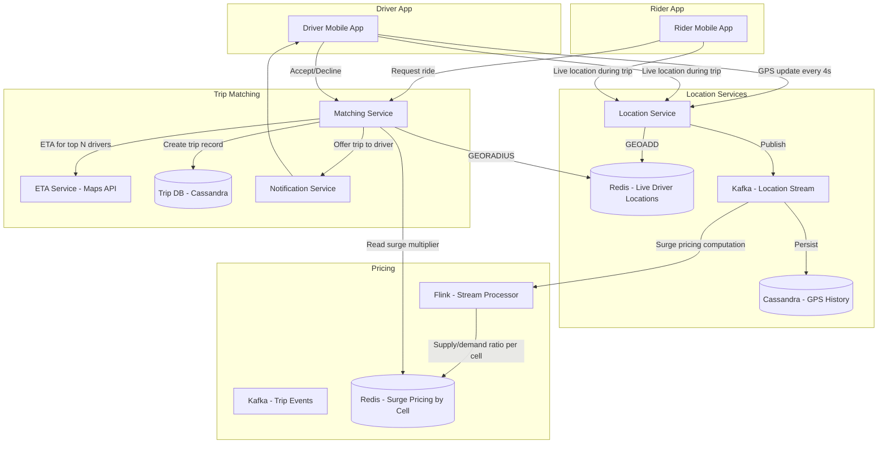

# 🏗️ System Design: Uber

> [!abstract] TL;DR
> Uber's hardest problem is sub-second geospatial lookup: find available drivers within X km of a rider in real time, while 14M active drivers update their GPS position every 4 seconds. Redis with native geospatial commands (GEOADD/GEORADIUS) stores live driver locations, indexed via Geohash. A matching service ranks nearby drivers by ETA, offers the trip sequentially, and runs the trip state machine. Surge pricing is computed in near-real-time by a stream processor (Kafka + Flink) over supply/demand ratios per geographic cell.

---

## Requirements Clarification

**Functional Requirements:**
- RF1: Riders can request a ride from their current location to a destination
- RF2: System finds nearby available drivers and matches the rider to the best one
- RF3: Drivers receive real-time trip requests and can accept or decline
- RF4: Both rider and driver see each other's live location during the trip
- RF5: Surge pricing applies when demand exceeds supply in an area
- RF6: Trip history, ratings, payments processed at trip completion

**Non-Functional Requirements:**
- Scale: 100M registered users, 14M trips/day
- Active drivers: ~14M active drivers at peak; each sends GPS update every 4 seconds
- Location update rate: 14M drivers ÷ 4s = **3.5M location writes/second**
- Trip request latency: match must be found and offer sent to driver within **1–2 seconds**
- Availability: 99.99% — unavailability means missed rides and lost revenue
- Consistency: Strong consistency for trip state (prevent double-booking a driver); eventual for location display
- Geographic scale: 10,000+ cities worldwide

---

## Capacity Estimation

**Location Updates:**
- 14M active drivers × 1 update/4s = 3.5M writes/sec to location store
- Each GPS update: ~50 bytes (driver_id, lat, lng, heading, speed, timestamp)
- 3.5M × 50 bytes = 175 MB/sec of location write throughput
- Redis can handle this: each `GEOADD` is O(log N), and Redis handles >1M ops/sec per node

**Trip Data:**
- 14M trips/day × ~2 KB metadata per trip = 28 GB/day
- Retention: 7 years (legal compliance) → ~70 TB total trip storage

**Matching Requests:**
- Trip request rate: 14M trips/day ÷ 86,400s ≈ 160 trip requests/sec
- Each request triggers: 1 Redis GEORADIUS query + ~10 ETA lookups (for top N drivers) + sequential driver offers
- Matching is compute-heavy but not storage-heavy

**GPS History:**
- 14M drivers × 1 position/4s × 86,400s ≈ 300B location records/day
- Stored in Cassandra for trip replay, fraud detection, route analytics
- ~300B × 50 bytes = 15 TB/day of raw GPS history

---

## High-Level Design



**Ride Request Flow:**
1. Rider opens app → sends `{pickup_lat, pickup_lng, destination_lat, destination_lng}`
2. Matching Service queries Redis `GEORADIUS` for available drivers within 5 km
3. ETA Service calculates real driving time from each candidate driver to rider (calls map/routing API)
4. Drivers ranked by ETA (closest ETA first); surge multiplier fetched from Redis
5. Trip offered to #1 ranked driver → 15-second timeout for acceptance
6. If driver accepts → trip created in Cassandra, both apps start showing each other's live location
7. If driver declines / no response → offer sent to #2 driver, repeat until accepted or no drivers found

---

## Core Components Deep Dive

### Location Service: Real-Time GPS Tracking

This is the highest-throughput component: 3.5M writes/second.

**Why Redis with Geospatial Commands?**
- Redis is in-memory → sub-millisecond writes and reads
- Native geospatial support: `GEOADD` stores lat/lng as a Geohash-encoded sorted set
- `GEORADIUS` returns all members within X km of a coordinate in O(N+log(M)) time
- A single Redis node handles 1M+ ops/sec; Redis Cluster handles 3.5M with ~4–5 nodes

**Redis Geospatial Commands:**
```
GEOADD drivers:available <lng> <lat> <driver_id>
GEORADIUS drivers:available <lng> <lat> 5 km ASC COUNT 20
ZREM drivers:available <driver_id>      -- when driver takes a trip
```

**Geohash encoding (how GEORADIUS works internally):**
- Latitude/longitude are encoded into a string where nearby locations share a common prefix
- Example: `9q8yy` represents a ~2.4 km × 4.8 km cell in San Francisco
- Redis encodes as a 52-bit integer (a Geohash variant) in a sorted set → range scans find nearby items efficiently

**Location data lifecycle:**
1. GPS update arrives → write to Redis (live) → publish to Kafka
2. Kafka consumers write to Cassandra (historical, for trip replay + fraud detection)
3. Flink consumes Kafka stream for surge pricing calculations

**Driver status filtering:**
- Redis stores only **available** drivers (`drivers:available` key)
- When driver starts a trip: `ZREM drivers:available <driver_id>`
- When driver completes a trip: `GEOADD drivers:available <lng> <lat> <driver_id>`
- Drivers can set themselves as "going offline" → removed from the set

### Geospatial Indexing: Geohash vs S2

Two common approaches for geospatial indexing:

| Approach | Description | Pros | Cons |
|----------|-------------|------|------|
| Geohash | Encode (lat, lng) as a base-32 string; nearby points share prefix | Simple, Redis-native, easy string prefix queries | Edge effects: nearby points on a cell boundary can have very different prefixes |
| Google S2 | Hierarchical spherical geometry; Earth divided into cells at multiple levels | More accurate, no edge distortion, better for polygons | More complex implementation |

**Redis uses Geohash internally.** For precise boundary handling in production, Uber uses S2 Geometry. Both achieve the same result for nearest-driver queries at the scale of a city block.

**Geohash edge case:** Two drivers on opposite sides of a cell boundary get different 5-character prefixes but are actually very close. Solution: when searching for nearby drivers, also check the 8 neighboring cells (always query the center cell + 8 neighbors).

### Matching Service

The Matching Service orchestrates the full ride-request lifecycle.

**Matching Algorithm:**
1. `GEORADIUS` returns up to 20 candidate drivers within 5 km
2. For each candidate: call ETA service (Google Maps / Uber's own maps) to get estimated pickup time
3. Sort drivers by ETA ascending (closest = fastest pickup)
4. Apply filters: driver rating > threshold, vehicle type matches request
5. Compute price = base_fare + (surge_multiplier × time_component + distance_component)

**Sequential offer flow (not parallel):**
- Uber offers to drivers one at a time (not broadcast to all simultaneously)
- **Why not broadcast?** Broadcasting causes the "thundering herd" — 10 drivers all see the same request, all accept, system must cancel 9 of them, causing driver frustration and race conditions on trip state
- Sequential with a 15-second timeout: driver #1 has 15s to accept; if no response, move to driver #2
- **Trade-off:** Slightly slower matching in the worst case (3 declines = 45 seconds). Acceptable vs. the chaos of parallel offers.

**Trip State Machine:**

```
REQUESTED
    │ (driver found and offered)
    ▼
DRIVER_OFFERED
    │ (driver accepts)          (timeout or decline)
    ▼                                    │
DRIVER_ACCEPTED             ─────────────┘ → offer to next driver
    │ (driver arrives at pickup)
    ▼
DRIVER_ARRIVED
    │ (rider boards, driver starts trip)
    ▼
IN_PROGRESS
    │ (driver ends trip)
    ▼
COMPLETED ──→ (trigger payment, rating prompt)
    │
    │ (dispute opened)
    ▼
DISPUTED
```

State transitions stored in Cassandra. State changes emit Kafka events consumed by payment, analytics, and driver incentive systems.

**Preventing double-booking:** When offering a trip to a driver, acquire a distributed lock (Redis `SET NX PX 15000` — set if not exists, expire in 15 seconds). This ensures only one Matching Service instance can be offering to a given driver at a time.

### Surge Pricing

Surge pricing reflects real-time supply/demand imbalance in a geographic area.

**Architecture:**
1. All driver location updates and trip request events flow into Kafka
2. Flink (stream processor) consumes this stream:
   - Computes, per Geohash cell, the count of available drivers (supply) and pending ride requests (demand)
   - Calculates `surge_multiplier = max(1.0, demand / supply × k)` where k is a calibrated constant
   - Outputs updated multipliers to Kafka → consumed by a writer that updates Redis
3. Redis stores `surge:<geohash5>` → multiplier, with short TTL (60s)
4. Matching Service reads the multiplier at price calculation time

**Update frequency:** Surge multipliers updated every 60 seconds (Flink tumbling window). A finer window (e.g., 10s) would cause the price to jitter too rapidly.

**Geographic granularity:** Surge is computed at Geohash level 5 (~4.9 km² cells). Coarser cells → averaging across large areas; finer cells → too few drivers per cell (noisy estimates).

### ETA Service

ETA estimation is critical to driver ranking and price estimation.

**Options:**
1. **Google Maps Distance Matrix API:** Simple, accurate, but expensive at scale ($0.005/element × 20 drivers × 160 req/sec = $57,600/day)
2. **Uber's proprietary routing engine (H3 + road network graph):** Built on a road network graph; precomputed travel times for common corridors. More accurate during events (knows about road closures in real-time).

**For an interview:** Describe Option 1 (external API) with Option 2 as a cost optimization for production. The key insight is that ETA is a read of precomputed data from a road network graph, not a real-time computation from scratch.

---

## Data Model

### `trips` table (Cassandra)

```sql
CREATE TABLE trips (
    trip_id          UUID PRIMARY KEY,
    rider_id         BIGINT,
    driver_id        BIGINT,
    status           TEXT,       -- REQUESTED, ACCEPTED, IN_PROGRESS, COMPLETED
    pickup_lat       DOUBLE,
    pickup_lng       DOUBLE,
    dropoff_lat      DOUBLE,
    dropoff_lng      DOUBLE,
    request_time     TIMESTAMP,
    pickup_time      TIMESTAMP,
    dropoff_time     TIMESTAMP,
    fare_amount      DECIMAL,
    surge_multiplier DOUBLE,
    route_polyline   TEXT        -- encoded GPS path of actual trip
);
```

### `driver_locations` history (Cassandra)

```sql
CREATE TABLE driver_locations (
    driver_id        BIGINT,
    recorded_at      TIMESTAMP,
    latitude         DOUBLE,
    longitude        DOUBLE,
    heading          INT,
    speed_kmh        DOUBLE,
    PRIMARY KEY (driver_id, recorded_at)
) WITH CLUSTERING ORDER BY (recorded_at DESC)
  AND default_time_to_live = 604800;   -- 7-day history
```

### Redis Keys

```
drivers:available                  → ZSET (Geohash-sorted) of available driver positions
driver:<driver_id>:status          → HASH {status, car_type, rating}  TTL=300s
surge:<geohash5>                   → FLOAT multiplier  TTL=120s
trip:<trip_id>:lock                → STRING  (distributed lock)  TTL=15s
```

---

## Key Design Decisions & Trade-offs

### Decision 1: Redis Geospatial vs PostGIS for Live Locations

**PostGIS (PostgreSQL with geospatial extension):** Full SQL, complex polygon queries, persistent storage. But disk-based → too slow for 3.5M writes/sec.
**Redis Geospatial:** In-memory, 3.5M writes/sec no problem, TTL-based expiry for stale driver data.

**Winner: Redis** for live locations. PostGIS for analytics queries over historical trip data (e.g., "all trips that passed through this neighborhood last month").

**Critical detail:** Redis does NOT persist driver locations durably — if Redis restarts, current driver positions are gone. That's acceptable: drivers send a new GPS update every 4 seconds, so Redis self-heals within 4 seconds of any failure. Meanwhile, Cassandra has the durable copy (with slight lag).

### Decision 2: Sequential vs. Parallel Driver Offers

As described above: sequential with timeout prevents double-booking race conditions and driver frustration from false offer/cancel cycles. The cost is slightly slower matching in edge cases (rare in dense cities; mitigated by having many drivers in the GEORADIUS result).

### Decision 3: Cassandra vs. MySQL for Trip Storage

Trip data has a high write rate (14M trips/day → 160 writes/sec, plus ongoing status updates during a trip). Cassandra's tunable consistency works here: use `LOCAL_QUORUM` for trip state updates (strong consistency within a region) and `ONE` for reads of completed trips.

**However:** payment and financial records should also be written to a relational DB (MySQL / Aurora) for ACID compliance. Cassandra holds the operational trip record; Aurora holds the immutable financial ledger.

### Decision 4: Flink for Surge Pricing (not Lambda Architecture)

An alternative is a Lambda architecture (batch layer + speed layer). Flink (stream-only) is simpler: one code path handles both real-time and historical data. The 60-second tumbling window gives enough data for stable surge estimates without needing a batch layer.

---

## Scalability

### Location Service (3.5M writes/sec)
- Redis Cluster with consistent hashing; partition by driver_id
- 5 nodes × 700K ops/sec/node → headroom for spikes
- Read replicas for GEORADIUS queries (read-heavy during surge)

### Matching Service
- Stateless → horizontal scaling; auto-scale based on trip request queue depth
- Distributed locks in Redis prevent race conditions at scale

### Geographic Scaling (City Isolation)
- Uber's system is sharded by geographic region (APAC, EMEA, Americas) and further by city
- All data (driver locations, trips, surge pricing) for a city lives in the same regional data center
- Cross-city requests are rare; handled by a global routing layer

### Handling Major Events (Concerts, Sports Games)
- When 50,000 people leave a stadium simultaneously, surge spikes to 3–5×
- System handles this via Flink's real-time surge detection (within 60 seconds of surge onset)
- Location service pre-scales: if a large event is in the calendar, proactively add Redis replicas in that city

---

## Related Concepts

- [[_MOC_CaseStudies|↑ Section MOC]]
- [[Consistent_Hashing]] — Redis Cluster distributes driver location data across nodes
- [[Redis_vs_Memcached]] — Redis chosen for its geospatial commands and Pub/Sub capabilities
- [[Message_Queues]] — Kafka as the backbone of the location event stream and trip event stream
- [[Stream_Processing]] — Flink computes real-time surge pricing over the Kafka stream
- [[Design_Notification_System]] — push notifications to driver app for trip offers
- [[Distributed_Locks]] — Redis `SET NX` prevents double-booking drivers
- [[Background_Jobs]] — Flink sliding window calculations run as continuous background computation

---

## Review Questions

1. Redis stores live driver locations but is not durable. What happens if the Redis primary node crashes, and how does the system recover within the 4-second GPS update interval?
2. Explain the Geohash edge case (two nearby drivers having different prefixes) and how querying 9 adjacent cells solves it. What is the computational cost of this approach?
3. Uber offers trips sequentially, not in parallel. Build the argument for why parallel offers would create worse outcomes despite being faster for the rider in the happy path.
4. Flink computes surge pricing on a 60-second tumbling window. A concert ends and 50,000 people all request Uber simultaneously. How long does it take for the surge multiplier to reflect reality? Could you reduce this latency, and what are the trade-offs?
5. Design the "driver goes offline" feature: a driver closes the app during a trip. What should happen, and what state do you need to track?

---

## Sources

#SystemDesign #CaseStudy #Uber #Geospatial #RealTimeLocation #Geohash #Redis #Matching #SurgePricing #Kafka #Flink #StreamProcessing
