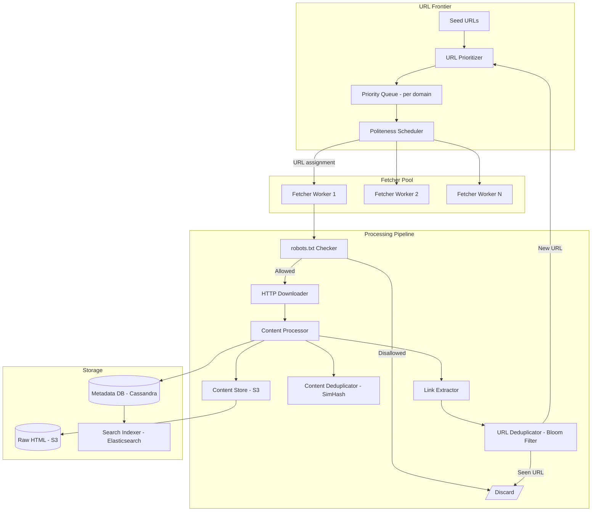

# 🏗️ System Design: Web Crawler

> [!abstract] TL;DR
> A web crawler at Google scale must crawl 1B pages with freshness. The URL Frontier is a prioritized, per-domain-partitioned queue that enforces politeness (rate limiting per host) while maximizing crawl throughput. Bloom filters detect duplicate URLs in O(1). SimHash detects near-duplicate content. The hardest problem is balancing breadth (crawling new URLs) vs. freshness (re-crawling changed pages) while respecting robots.txt and not hammering any single domain.

---

## Requirements Clarification

**Functional Requirements:**
- RF1: Crawl 1B web pages; discover new pages by following links found in crawled pages
- RF2: Respect `robots.txt` — do not crawl pages a domain disallows
- RF3: Enforce crawl politeness — do not send more than N requests per second to any single domain
- RF4: Detect and skip duplicate URLs (same page, different query string variants)
- RF5: Detect near-duplicate content (mirrors, scraped copies of existing pages)
- RF6: Store crawled content for downstream consumers (indexers, ML pipelines)
- RF7: Re-crawl pages periodically based on their change frequency (freshness)

**Non-Functional Requirements:**
- Scale: 1B pages total; assume 10B pages on the internet, crawl top 10%
- Crawl time: 1B pages in 4 weeks → 1B ÷ (4 × 7 × 86,400s) ≈ **41,000 pages/second** sustained
- Page size: avg 100 KB raw HTML → 41,000 × 100 KB = **4.1 GB/sec** of HTML downloaded
- Storage: 1B pages × 100 KB = **100 TB** of raw HTML; plus extracted links and metadata (~200 TB total)
- Freshness: re-crawl highly dynamic pages every few hours; static pages every few weeks
- Politeness: at most 1 request per domain per second (or per robots.txt `Crawl-delay`)
- Availability: crawler downtime = missed pages, not catastrophic; 99.9% uptime acceptable

---

## Capacity Estimation

**Fetch rate:**
- 41,000 pages/sec × 100 KB/page = 4.1 GB/sec download bandwidth
- This requires a CDN-scale network infrastructure (hundreds of Gbps links)

**Link extraction:**
- Each page contains avg 30 outgoing links
- 1B pages × 30 links = 30B URLs extracted
- After deduplication (80% are duplicates): ~6B unique URLs discovered per full crawl

**DNS lookups:**
- Each unique domain requires a DNS resolution
- 1B pages span ~200M unique domains → 200M DNS lookups over the crawl cycle
- DNS caching is essential: resolve once per domain, cache for TTL

**Storage breakdown:**
- Raw HTML (S3): 1B × 100 KB = 100 TB
- Extracted metadata (URL, title, links found, crawl timestamp, content hash): ~500 bytes × 1B = 500 GB → fits in Cassandra
- URL frontier state (known URLs + priorities): ~100 bytes × 30B URLs = 3 TB → distributed queue (Kafka + priority queue DB)

---

## High-Level Design



**Core crawl loop:**
1. URL Prioritizer selects next URL to crawl from priority queue
2. Politeness Scheduler checks: when was the last request to this domain? If too recent, delay.
3. Fetcher checks robots.txt for the domain (cached)
4. If allowed: HTTP GET the page, handle redirects
5. Content Processor: parse HTML, compute SimHash, detect duplicates
6. Store raw HTML in S3, metadata in Cassandra
7. Link Extractor finds all `<a href>` URLs in the page
8. URL Deduplicator (Bloom filter) filters out already-seen URLs
9. New URLs added to URL Frontier with computed priority

---

## Core Components Deep Dive

### URL Frontier: The Heart of the Crawler

The URL Frontier manages **which URL to crawl next** — this determines the crawler's quality, freshness, and politeness behavior.

**Two-layer architecture:**
```
Layer 1: Priority Queues (importance-based)
    High priority queue   — PageRank > threshold, news sites, recent changes
    Medium priority queue — normal pages
    Low priority queue    — deep pages, low PageRank, rarely-visited

Layer 2: Politeness Queues (domain-based, one queue per domain)
    queue[amazon.com]     → [url1, url2, url3, ...]
    queue[wikipedia.org]  → [url1, url2, ...]
    queue[nytimes.com]    → [url1, url2, ...]
```

**Mapping from priority → politeness:**
1. URL is assigned a priority (importance score)
2. Priority determines which priority queue it enters
3. The selector picks from priority queues proportionally (e.g., 60% high, 30% medium, 10% low)
4. Selected URL's domain determines which politeness queue it routes to
5. Crawler workers pull from politeness queues, enforcing the crawl delay per domain

**Priority calculation:**
- Base: URL depth from seed (BFS — shallow pages first)
- Boost: domain importance (Alexa/SimilarWeb rank), backlink count, update frequency
- Freshness penalty: pages recently crawled get lower priority for re-crawl; pages predicted to have changed get higher priority

**Distributed frontier:**
- For 30B URLs, the frontier cannot fit in a single machine's memory
- Solution: Consistent hashing — each URL is assigned to a specific frontier worker by `hash(domain) % N_workers`
- This ensures all URLs for a domain go to the same worker → centralized politeness enforcement per domain

### Politeness: Respecting Domains

**robots.txt:**
```
User-agent: Googlebot
Disallow: /admin/
Disallow: /private/
Crawl-delay: 2
```

- Fetch robots.txt once per domain and cache for 24 hours
- Parse `Disallow` rules → skip matching URLs before fetching
- Respect `Crawl-delay` directive: minimum seconds between requests to that domain
- If no `Crawl-delay`, apply a default (e.g., 1 second between requests to same domain)

**Implementation of crawl delay:**
- Per-domain last-crawl timestamp stored in Redis: `last_crawled:<domain>` → timestamp
- Before fetching: `current_time - last_crawled[domain] >= crawl_delay[domain]`?
- If not ready: return URL to the front of the domain's queue, move to another domain
- Redis TTL on last-crawled key: if domain hasn't been crawled in 24h, key expires → crawl delay resets

**Why politeness matters:**
- Hammering a site can trigger rate limiting (HTTP 429), IP bans, or legal action
- It's ethically required — the web relies on mutual respect between crawlers and site operators
- robots.txt is not legally binding in most jurisdictions but is the established social contract

### URL Deduplication: Bloom Filter

The Bloom filter answers: "Have I seen this URL before?" in O(1) time and O(1) space per query.

**Bloom filter math:**
- 30B URLs to track
- Desired false positive rate: 0.1% (1 in 1,000 new URLs incorrectly marked as seen)
- Required memory: `n × ln(1/p) / ln(2)² = 30B × 9.58 bits ≈ 35 GB` — fits in RAM
- Number of hash functions: `k = -ln(0.001) / ln(2) ≈ 10` hash functions per insert/query

**Operations:**
- `insert(url)`: compute 10 hashes → set 10 bits in the filter
- `lookup(url)`: compute 10 hashes → are all 10 bits set? If not → URL is definitely new. If yes → URL is probably seen (1 in 1,000 chance of false positive)

**False positive consequence:** A genuinely new URL is incorrectly marked as "seen" → we skip it. At 0.1% FP rate, 30M URLs might be missed over a crawl of 30B unique URLs. Acceptable for a web crawler.

**Bloom filter persistence:** The filter is rebuilt from the URL database on startup (it's a cache of what's in Cassandra). Alternatively, a persistent Bloom filter (stored in Redis `BITSET`) survives restarts.

**What about URL normalization?**
Before inserting into the Bloom filter, normalize the URL:
- Lowercase scheme and host: `HTTP://Example.COM` → `http://example.com`
- Remove default port: `http://example.com:80/` → `http://example.com/`
- Remove fragment: `http://example.com/page#section` → `http://example.com/page`
- Sort query parameters: `?b=2&a=1` → `?a=1&b=2`
- Remove session IDs and tracking parameters: `?utm_source=google` → removed

### Content Deduplication: SimHash

Different URLs can serve the same (or very similar) content. Example: a news article mirrored on 50 sites. Storing and indexing 50 copies wastes storage and degrades search quality.

**Exact deduplication (MD5/SHA256 of content):**
- Catches byte-for-byte identical content
- Fast: O(1) hash lookup
- Misses near-duplicates (same article with minor header differences)

**Near-duplicate detection: SimHash (Charikar's algorithm)**

SimHash produces a 64-bit fingerprint of a document such that similar documents have similar fingerprints (small Hamming distance = many similar bits).

```
Algorithm:
1. Extract N-grams (or word shingles) from the document
2. For each N-gram, compute a 64-bit hash
3. For each bit position (0-63):
   - If the hash's bit i = 1: add the N-gram's frequency to V[i]
   - If the hash's bit i = 0: subtract the N-gram's frequency from V[i]
4. SimHash fingerprint: bit i = 1 if V[i] > 0, else 0
```

**Near-duplicate threshold:** Two documents with Hamming distance ≤ 3 (differ in at most 3 out of 64 bits) are considered near-duplicates.

**Similarity lookup at scale:**
- Checking all 30B stored fingerprints against a new fingerprint is O(30B) — too slow
- Solution: Store fingerprints in a distributed hash table partitioned by subsets of bits. Use the fact that if Hamming distance ≤ 3, then two fingerprints must agree on at least one of several fixed 16-bit subsegments.

### Content Change Detection and Re-crawl Scheduling

**Problem:** After the first full crawl, when should each page be re-crawled?

**Strategy: History-based scheduling**
- Track change frequency from past crawls: if a page changed in 7 of the last 10 crawls, it changes frequently → re-crawl often
- Compute a `change_rate` per page based on history
- Re-crawl interval ∝ 1 / change_rate

**Implementation:**
```
change_rate[url] = (number of crawls where content changed) / (total crawls of this url)

If change_rate > 0.5: re-crawl every 1 day
If change_rate > 0.1: re-crawl every 1 week
Else: re-crawl every 1 month
```

**Sitemaps:** Many sites provide `sitemap.xml` listing all pages and their `<lastmod>` timestamps. This is a high-quality hint for scheduling re-crawls — use it.

**ETag and Last-Modified headers:** HTTP conditional GET:
```
GET /page.html
If-None-Match: "abc123"     (ETag from last crawl)
If-Modified-Since: Sat, 01 Jun 2026 00:00:00 GMT

Server returns:
304 Not Modified  → content hasn't changed, don't re-store
200 OK            → new content, process normally
```

Using conditional GETs avoids re-downloading and re-processing unchanged content → massive bandwidth savings.

### DNS Caching

DNS resolution is slow (50–100ms per lookup) and DNS servers have rate limits per IP.

**Solution: Local DNS cache per crawl worker**
- Maintain an in-memory `{domain → IP, TTL}` map on each fetcher worker
- Honor TTL: if TTL expired, re-resolve
- Share DNS cache across workers via Redis: `dns:<domain>` → IP, TTL

**Why this matters at scale:**
- 41,000 pages/sec × avg 1 unique domain per 5 pages = 8,200 DNS lookups/sec
- Without caching: 8,200 × 50ms = DNS becomes the bottleneck
- With caching: most domains are repeated; cache hit rate > 95%; effective DNS overhead < 1ms per page

---

## Data Model

### `crawl_frontier` (Cassandra — URL priority queue state)

```sql
CREATE TABLE crawl_frontier (
    domain           TEXT,
    priority         FLOAT,
    url              TEXT,
    last_crawled_at  TIMESTAMP,
    scheduled_at     TIMESTAMP,
    status           TEXT,       -- PENDING, CRAWLING, DONE
    PRIMARY KEY (domain, scheduled_at, url)
);
```

### `crawled_pages` metadata (Cassandra)

```sql
CREATE TABLE crawled_pages (
    url              TEXT PRIMARY KEY,
    domain           TEXT,
    crawled_at       TIMESTAMP,
    content_hash     CHAR(64),   -- SHA-256 of raw HTML
    simhash          BIGINT,     -- 64-bit SimHash fingerprint
    http_status      INT,
    content_length   INT,
    s3_key           TEXT,       -- location of raw HTML in S3
    page_rank        FLOAT,
    change_rate      FLOAT,      -- historical change frequency [0,1]
    next_crawl_at    TIMESTAMP,  -- computed from change_rate
    INDEX idx_domain (domain),
    INDEX idx_next_crawl (next_crawl_at)
);
```

### `robots_cache` (Redis)

```
robots:<domain>    → TEXT (robots.txt content)  TTL=86400s (24 hours)
dns:<domain>       → TEXT (IP address)  TTL=DNS TTL value
last_crawled:<domain>  → TIMESTAMP  TTL=3600s
```

### S3 Layout

```
s3://crawler-raw-html/
    2026/
        07/
            26/
                <sha256_hash>.html.gz    ← gzip-compressed raw HTML
```

---

## Key Design Decisions & Trade-offs

### Decision 1: BFS vs DFS vs Priority-Based Crawling

**BFS (Breadth-First):** Discovers shallow, broadly-linked pages first. Good for coverage. Bad: may waste time on low-quality deep pages.
**DFS:** Goes deep into one site before moving to another. Bad: politeness becomes easy to violate (hammering one site); poor coverage breadth.
**Priority-based (chosen):** Assigns a crawl priority to each URL based on quality signals (PageRank, link count, domain authority). High-quality pages crawled first. Most realistic for a production crawler.

**Trade-off:** Priority calculation requires signals (PageRank) that may not be available for newly discovered URLs. Default priority for unknown URLs is "medium" → they'll be crawled but after high-priority pages.

### Decision 2: Single Bloom Filter vs. Distributed Hash Set

**Bloom filter:** 35 GB for 30B URLs at 0.1% FP rate. Misses ~30M URLs (false positives). Fast O(1).
**Distributed Hash Set (Redis SET / distributed DB):** Exact deduplication, no false positives. But ~300 GB for 30B URL strings at avg 10 bytes/URL + overhead.

**Winner: Bloom filter** for the initial "have I seen this URL?" check. For exact deduplication of the URL store, a secondary Cassandra lookup confirms edge cases. The Bloom filter eliminates 99.9%+ of DB queries.

### Decision 3: Centralized vs Distributed Frontier

**Centralized:** One process manages all URL priorities. Simple to implement. Single point of failure; doesn't scale beyond one machine.
**Distributed (chosen):** URLs partitioned by domain (consistent hashing). Each frontier worker owns a set of domains → guaranteed politeness per domain (no inter-worker coordination needed). Scales to hundreds of workers.

**Trade-off:** Priority ordering is only enforced per-worker, not globally. A globally highest-priority URL might be on Worker 5, which is currently busy. Acceptable — we approximate global priority with local priority per worker.

### Decision 4: Store Raw HTML vs Extracted Content

**Store raw HTML (chosen):** The crawler doesn't know how downstream consumers (search indexer, ML pipeline, spam detector) want to use the data. Storing raw HTML lets any future consumer re-process the data without re-crawling.
**Store extracted content only:** Smaller storage, but irreversible — raw HTML is lost.

**Trade-off:** 100 TB of compressed raw HTML vs. ~10 TB of extracted text. The 10× storage cost buys full flexibility. At $0.023/GB (S3 Standard), 100 TB = $2,300/month — affordable at Google scale.

---

## Scalability

### Scaling Fetch Throughput
- Fetchers are stateless and embarrassingly parallel → add more workers
- Each worker handles ~100 concurrent HTTP requests (async I/O using epoll/asyncio)
- 41,000 pages/sec ÷ 100 concurrent requests per worker ÷ 0.5s avg page fetch = ~820 workers needed

### Scaling the URL Frontier
- Partition domains by consistent hashing across N frontier servers
- N = 50–100 servers for 1B-page scale
- Each frontier server manages in-memory priority queues for its assigned domains
- Persistent state (full URL list) in Cassandra; in-memory queues are a cache of "next 10,000 URLs to crawl"

### Scaling DNS
- DNS resolver cluster (Unbound or custom) with large caches
- Anycast routing to nearest DNS resolver
- Pre-warm DNS cache for top 1M domains at startup

### Scaling Content Storage
- Raw HTML in S3: auto-scales infinitely
- Metadata in Cassandra: add nodes; rebalances automatically
- Bloom filter: if it outgrows RAM (e.g., 30B URLs → 35 GB), shard the Bloom filter: hash URL to determine which shard's filter to check

### Handling Crawl Traps

A crawl trap is a site that generates infinite pages (calendar pages, search results with infinite pagination).

**Detection:**
- If a domain has yielded > X URLs (e.g., 1M) and none link back to high-PageRank pages → likely a trap
- If crawl depth from seed > threshold (e.g., 8 hops) → deprioritize sharply
- If URL contains repeating path components (e.g., `/a/b/a/b/a/b`) → structural loop detected

**Response:** Apply a per-domain URL cap: crawl at most 100,000 pages per domain. Prioritize shallow pages. Drop deep-crawl discoveries from low-PageRank domains.

---

## Related Concepts

- [[_MOC_CaseStudies|↑ Section MOC]]
- [[Bloom_Filter]] — O(1) URL deduplication; core data structure of the crawler
- [[Consistent_Hashing]] — partitions URL frontier across distributed workers by domain
- [[Message_Queues]] — Kafka as the backbone for distributing crawl tasks across workers
- [[Elasticsearch]] — downstream consumer of crawled content for full-text indexing
- [[Distributed_Locks]] — prevent two workers from crawling the same URL simultaneously
- [[Object_Storage]] — S3 stores raw HTML content; immutable, content-addressed by SHA-256
- [[Background_Jobs]] — re-crawl scheduling is a classic background job with priority scheduling

---

## Review Questions

1. The Bloom filter for URL deduplication has a 0.1% false positive rate. What exactly does a false positive mean for the crawler, and why is it acceptable (vs. a false negative, which is impossible with Bloom filters)?
2. Explain why partitioning the URL frontier by domain (rather than by URL hash) is essential for enforcing crawl politeness. What race condition would occur if multiple workers could pull URLs from the same domain's queue?
3. A popular news site publishes 500 new articles per hour. How does the re-crawl scheduling algorithm handle this site differently from a static corporate website that updates quarterly?
4. Describe a crawl trap. Design a detection algorithm that identifies a trap within the first 10,000 URLs crawled from a domain. What signals indicate a trap vs. a legitimately large site like Wikipedia?
5. The crawler uses SimHash to detect near-duplicate content. Describe a case where SimHash would incorrectly mark two non-duplicate pages as duplicates. How could you reduce this false-positive rate?

---

## Sources

#SystemDesign #CaseStudy #WebCrawler #URLFrontier #BloomFilter #SimHash #Politeness #RobotsTxt #Geohash #Deduplication #DistributedCrawling #Freshness
