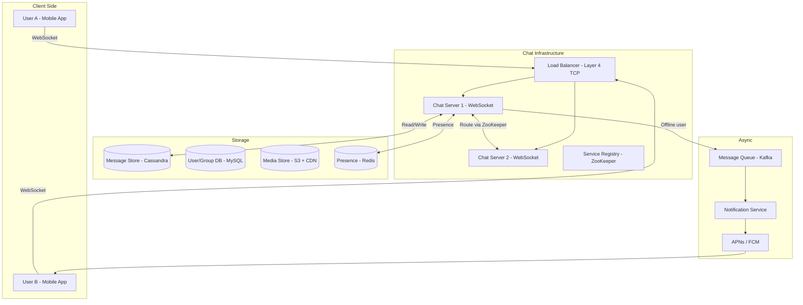

# 🏗️ System Design: WhatsApp

> [!abstract] TL;DR
> WhatsApp serves 2B users exchanging 100B messages/day with real-time delivery and end-to-end encryption. The core architecture relies on persistent WebSocket connections to stateful chat servers, with ZooKeeper tracking which user is on which server. Messages are stored in Cassandra (append-only, high write throughput) with monotonically increasing IDs for ordering. Group message fan-out and online presence (Redis with TTL heartbeats) are the hardest scaling problems.

---

## Requirements Clarification

**Functional Requirements:**
- RF1: Users can send and receive text messages in 1:1 and group chats (up to 1024 members)
- RF2: Real-time delivery when recipient is online; store-and-forward when offline
- RF3: Message delivery and read receipts (single tick, double tick, blue tick)
- RF4: Online presence indicator (online, last seen)
- RF5: Media sharing (images, video, documents) with end-to-end encryption

**Non-Functional Requirements:**
- Scale: 2B registered users, ~500M DAU, 100B messages/day
- Message throughput: 100B/day ÷ 86,400s ≈ **1.16M messages/second** peak (higher due to uneven distribution)
- Latency: <100ms message delivery when both users are online
- Availability: 99.99% — messaging is a lifeline product
- Durability: Messages must not be lost after delivery acknowledgement
- Consistency: Per-conversation message ordering guaranteed; cross-conversation is eventual
- Security: End-to-end encrypted (server cannot read message content)

---

## Capacity Estimation

**Messages:**
- 100B messages/day ÷ 86,400s ≈ 1.16M msg/sec average; assume 5M msg/sec peak
- Average message size: ~100 bytes (text) → 100B × 100 bytes = **10 TB/day** of message data
- Retention: messages stored on server 30 days (encrypted, server can't decrypt) → ~300 TB active storage
- After 30 days, messages deleted from server (users have local copies)

**Media:**
- ~20% of messages contain media; average media 500 KB → 20B × 500 KB = 10 PB/day — not stored on WhatsApp long-term (24-hour deletion policy from server after download)

**WebSocket Connections:**
- 500M DAU, average session ~3 hours/day → peak concurrent users ~60–100M
- 100M concurrent WebSocket connections across chat servers
- Each connection ~10 KB memory → 10M connections per server → **10–20 large chat servers** needed (in practice, hundreds of smaller ones for redundancy and geo-distribution)

**Presence Updates:**
- 500M users sending heartbeat every 30s → ~17M presence writes/second — must use Redis, not DB

---

## High-Level Design



**1:1 Message Flow (both users online):**
1. User A sends message via WebSocket to Chat Server 1 (where A is connected)
2. Chat Server 1 looks up which server User B is on → queries ZooKeeper service registry
3. ZooKeeper returns: "User B is on Chat Server 2"
4. Chat Server 1 forwards message to Chat Server 2 via internal RPC
5. Chat Server 2 pushes message to User B's WebSocket connection
6. Chat Server 2 sends delivery receipt back; Chat Server 1 forwards to User A (double tick)
7. Message persisted to Cassandra asynchronously

**1:1 Message Flow (recipient offline):**
1. Steps 1-2 same; ZooKeeper indicates User B has no active connection
2. Chat Server 1 persists message to Cassandra (message store)
3. Publishes `message.pending` event to Kafka
4. Notification Service consumes event → sends push notification via APNs (iOS) or FCM (Android)
5. When User B comes online and reconnects: client requests missed messages since last `message_id`

---

## Core Components Deep Dive

### WebSocket Connection Management

Why WebSockets over HTTP polling?
- **HTTP long-polling:** Client holds open an HTTP request waiting for a message. Server responds when a message arrives, then client immediately opens another long-poll request. Wasteful — a new connection is established per-message cycle.
- **WebSocket:** Single persistent bidirectional TCP connection. Server can push messages to client anytime. ~8x fewer connections overhead than long-polling at the same scale.

**Connection upgrade flow:**
```
Client → HTTP GET /chat?upgrade=websocket
Server → 101 Switching Protocols
         (connection now fully bidirectional)
```

**Chat server state:** Each chat server maintains an in-memory map of `{user_id → WebSocket connection}`. This makes chat servers stateful (a user's messages must be routed to the server they're connected to). Connection stickiness is handled at the TCP load balancer layer (by IP hash) rather than HTTP layer.

### Service Registry: ZooKeeper

ZooKeeper maintains `{user_id → chat_server_address}` mapping:
- When a WebSocket connection is established: chat server registers `user_id → self` in ZooKeeper
- When a connection drops: chat server removes the entry (or it expires via ephemeral node TTL)
- Chat servers subscribe to ZooKeeper watches — if a user's entry changes, subscribed servers are notified immediately

**Why not a regular DB for this?** The registry must support millions of reads and writes per second with sub-millisecond latency. ZooKeeper is designed exactly for this: small, high-frequency coordination data with change notification.

### Message Storage: Cassandra

Cassandra is chosen because:
1. **Write-heavy workload:** 1M+ msg/sec → Cassandra's LSM-tree (log-structured merge-tree) handles write-heavy loads better than B-tree (MySQL)
2. **Append-only access pattern:** Messages are only ever written and read sequentially — no random updates
3. **Time-ordered reads:** Fetch all messages in a conversation since a given timestamp → Cassandra's clustering key on time handles this natively

**Message table schema:**

```sql
-- Cassandra (CQL)
CREATE TABLE messages (
    conversation_id  UUID,
    message_id       BIGINT,     -- Snowflake ID (time-ordered, unique)
    sender_id        BIGINT,
    message_type     TEXT,       -- 'text', 'image', 'video', 'audio'
    body             BLOB,       -- encrypted ciphertext (server can't read this)
    media_url        TEXT,       -- for media messages
    status           TEXT,       -- 'SENT', 'DELIVERED', 'READ'
    created_at       TIMESTAMP,
    PRIMARY KEY (conversation_id, message_id)
) WITH CLUSTERING ORDER BY (message_id ASC)
  AND default_time_to_live = 2592000;  -- 30 days TTL
```

**Partition key is `conversation_id`** → all messages in a conversation live on the same Cassandra node(s). This makes "fetch all messages in conversation" a single-node operation. Messages expire automatically via TTL — no explicit deletion needed.

### Message Ordering: Snowflake IDs

Messages need a globally unique, time-ordered ID per conversation:
- A Snowflake-style ID (64-bit integer) encodes: timestamp (41 bits) + worker ID (10 bits) + sequence (13 bits)
- This is monotonically increasing with time → messages sort correctly by `message_id`
- IDs generated at the chat server (not the DB) — no round-trip for ID generation

**Ordering guarantee scope:** Message ordering is guaranteed **within a conversation** (same partition key in Cassandra). Cross-conversation ordering is not guaranteed — not needed.

### End-to-End Encryption (Signal Protocol)

WhatsApp uses the Signal Protocol for E2E encryption:

1. **Key Exchange:** Each device generates a public/private key pair. Public keys are uploaded to WhatsApp's key server. When User A wants to message User B for the first time, A downloads B's public key from the key server.
2. **Session Establishment:** Both parties perform a Diffie-Hellman key exchange to derive a shared secret. This happens once per session.
3. **Message Encryption:** Each message is encrypted with a unique ephemeral key derived from the shared session key using a ratchet mechanism. Even if one message's key is compromised, past and future messages remain secure (forward secrecy).
4. **Server's role:** The server only sees encrypted blobs. It cannot decrypt message content. This is the key architectural implication: WhatsApp cannot mine message content, comply with content subpoenas, or do spam filtering on message body.

**Storage implication:** Since messages are encrypted client-side, the server stores encrypted blobs. Deduplication of identical messages is impossible. Search on message content is impossible.

### Group Messaging: Fan-out

Groups can have up to 1,024 members. Sending a message to a group requires delivery to up to 1,024 endpoints.

**Fan-out on write (current approach for small-medium groups):**
- When a message arrives, the messaging service looks up all group members
- For each online member: route to their chat server and push via WebSocket
- For each offline member: store in their individual message queue + send push notification
- Complexity: sender sends once → system fans out to 1,024 copies

**Fan-out on read (for very large groups):**
- Store one copy of the message with the `group_id`
- When a member comes online, they pull messages since their last `message_id` from the group's conversation
- Reduces write amplification; increases read complexity

**WhatsApp's approach:** Fan-out on write for most groups. The 1,024 member limit exists precisely to cap fan-out cost. For broadcast lists (one-way large group), fan-out is done via a dedicated broadcast service with rate limiting per domain.

### Online Presence

**Challenge:** 500M users, each sending a heartbeat every 30 seconds = 17M writes/second.

**Solution:**
- **Redis** with a key per user: `presence:<user_id>` → `{status: 'online', last_seen: timestamp}`
- Set with TTL of 60 seconds. Client sends heartbeat every 30 seconds → refreshes TTL
- If client disconnects or heartbeat stops → key expires after 60s → user marked as offline

**Privacy control:** Users can hide last-seen status. The server still tracks it internally (for delivery routing); the privacy setting controls whether other users can query it.

**Subscription model:** When User A opens a chat with User B, the client subscribes to B's presence via WebSocket. The presence server sends push updates on status changes.

---

## Data Model

### `users` table (MySQL — master user store)

```sql
CREATE TABLE users (
    user_id         BIGINT PRIMARY KEY,
    phone_number    VARCHAR(20) UNIQUE NOT NULL,
    display_name    VARCHAR(64),
    profile_pic_url TEXT,
    public_key      TEXT,           -- current pre-key for E2E encryption
    registered_at   TIMESTAMP,
    last_seen_at    TIMESTAMP,      -- internal, for routing; privacy-controlled display
    INDEX idx_phone (phone_number)
);
```

### `conversations` table (MySQL)

```sql
CREATE TABLE conversations (
    conversation_id  BIGINT PRIMARY KEY,
    type             ENUM('direct','group'),
    created_at       TIMESTAMP
);

CREATE TABLE conversation_members (
    conversation_id  BIGINT NOT NULL,
    user_id          BIGINT NOT NULL,
    joined_at        TIMESTAMP,
    last_read_msg_id BIGINT DEFAULT 0,   -- for unread count
    PRIMARY KEY (conversation_id, user_id),
    INDEX idx_user (user_id)
);
```

### Redis Keys

```
presence:<user_id>         → HASH {status, last_seen, device_type}  TTL=60s
pending_msgs:<user_id>     → LIST of message_ids for offline delivery
group:<group_id>:members   → SET of user_ids (cached membership)
```

---

## Key Design Decisions & Trade-offs

### Decision 1: Stateful Chat Servers vs Stateless

**Stateful (chosen):** Each WebSocket connection is pinned to one chat server. Message routing requires a registry (ZooKeeper) to find the target server.
- **Pro:** Very low-latency message delivery (in-memory lookup of connection)
- **Con:** Server failure drops all connections on that server; clients must reconnect

**Stateless alternative:** All connections go through a shared message bus; any server can handle any message.
- **Pro:** Any server can handle any connection
- **Con:** All messages must traverse the message bus, adding latency and a central bottleneck

**Winner: Stateful** — WhatsApp's original Erlang-based servers are famously efficient stateful connection holders, supporting millions of connections per server.

### Decision 2: Cassandra vs MySQL for Messages

At 1M+ writes/sec, MySQL cannot keep up without heroic sharding. Cassandra's write path (MemTable → SSTable flush → compaction) is purpose-built for high write throughput. The access pattern (sequential reads by `conversation_id`) maps perfectly to Cassandra's partition+clustering key model.

**Trade-off accepted:** Cassandra offers eventual consistency by default. We configure `QUORUM` writes (at least 2 of 3 replicas must acknowledge) for message writes to avoid message loss. Read consistency is also `QUORUM` for message fetches. This adds slightly more latency vs. `ONE` but prevents lost messages.

### Decision 3: Push Notification Delivery for Offline Users

Delivering to an offline user requires a push notification (APNs for iOS, FCM for Android). The push notification contains only the sender name and a count (not the message content — E2E encrypted). When the app wakes, it connects via WebSocket and fetches the actual messages from Cassandra.

**The dual-delivery problem:** If a push notification wakes the app AND the app reconnects and fetches messages, we need idempotency: the client tracks the highest `message_id` seen and only shows messages with `message_id > last_seen_id`.

### Decision 4: Group Size Limit

The 1,024 member limit is an explicit capacity decision: at 1,024 fan-out × 1M group messages/day, we generate ~1B individual message deliveries/day just from group messages. Raising the limit to 10K would require rethinking fan-out strategy (move to fan-out-on-read for large groups).

---

## Scalability

### Scaling Chat Servers
- Stateless at the load balancer level — any new chat server can accept new connections
- ZooKeeper handles routing → adding more chat servers just means more ZooKeeper entries
- Geographic sharding: APAC users connect to APAC chat servers; message routing between regions goes through a backbone network link

### Scaling Cassandra
- Cassandra already horizontally scales natively via consistent hashing + virtual nodes
- Add nodes → data rebalances automatically (no manual resharding)
- Partition by `conversation_id` distributes load across all nodes

### Scaling Presence
- Redis Cluster partitions presence keys across shards by `user_id`
- 500M users × 100 bytes/entry = 50 GB — fits in a medium Redis Cluster

### Scaling Group Fan-out
- Large group (close to 1,024 members): async fan-out via Kafka — one message to Kafka, a pool of fan-out workers consume and deliver
- Rate limit fan-out to prevent a single large group message from consuming all resources

---

## Related Concepts

- [[_MOC_CaseStudies|↑ Section MOC]]
- [[WebSockets]] — persistent bidirectional transport for real-time message delivery
- [[Consistent_Hashing]] — Cassandra uses it for data distribution; ZooKeeper for routing
- [[Message_Queues]] — Kafka for async delivery to offline users and fan-out
- [[Object_Storage]] — S3 + CDN for encrypted media (images, video, documents)
- [[Design_Notification_System]] — APNs/FCM push notification delivery for offline users
- [[Key_Value_Store]] — Redis for presence tracking and ephemeral state
- [[Design_Distributed_Cache]] — Redis caching pattern for group membership

---

## Review Questions

1. Why are chat servers stateful in WhatsApp's architecture, and what problem does ZooKeeper solve that a simple load balancer cannot?
2. Explain why Cassandra's partition key design (`conversation_id` as the partition key) makes message retrieval efficient. What would happen if you partitioned by `sender_id` instead?
3. WhatsApp uses the Signal Protocol for E2E encryption. What does this mean for the server's ability to perform spam filtering, content moderation, and search? Is there a way to add these features without breaking E2E encryption?
4. For a group with 1,024 members, compare fan-out-on-write vs. fan-out-on-read. Under what conditions would you switch strategies?
5. A chat server crashes while holding 500,000 WebSocket connections. Walk through exactly what happens to those users' messages in the next 30 seconds.

---

## Sources

#SystemDesign #CaseStudy #WhatsApp #Messaging #WebSockets #E2E_Encryption #SignalProtocol #Cassandra #ZooKeeper #RealTime #GroupMessaging
