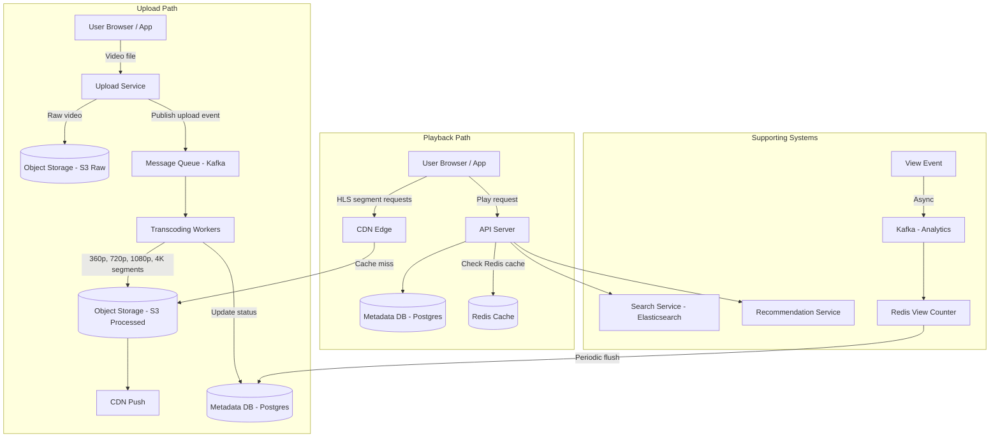

# 🏗️ System Design: YouTube

> [!abstract] TL;DR
> YouTube handles 500 hours of video uploaded per minute and 1 billion hours watched per day. The core insight is separating the write path (async transcoding pipeline) from the read path (CDN-first streaming). Videos are chunked into 10-second HLS segments, transcoded to 5+ resolutions in parallel, pushed to CDN edges, and served via adaptive bitrate streaming. The top 20% of videos serve 80% of traffic, making aggressive CDN caching the single most impactful design decision.

---

## Requirements Clarification

**Functional Requirements:**
- RF1: Users can upload videos of any length and format
- RF2: Users can stream videos at multiple quality levels (360p to 4K)
- RF3: Platform automatically transcodes uploads to multiple resolutions and formats
- RF4: Users can search for videos by title, description, tags
- RF5: Platform tracks view counts and recommends videos

**Non-Functional Requirements:**
- Scale: 2B DAU; 500 hours of video uploaded every minute; 1B hours watched per day
- Upload throughput: 500 hrs/min × 60 min/hr × ~1 GB/hr ≈ **30 TB/hour** of raw video ingested
- Streaming: 1B hrs/day ÷ 86,400 seconds ≈ **11.5M concurrent viewers** at any moment
- Read:Write ratio ≈ 200:1 (far more viewing than uploading)
- Latency: Video must start playing within 2 seconds (time-to-first-frame)
- Availability: 99.99% for video playback; 99.9% for upload
- Consistency: Eventual — a newly uploaded video may take minutes to become available globally (transcoding takes time)

---

## Capacity Estimation

**Storage:**
- Raw video: 500 hrs/min × 1 GB/hr ≈ 500 GB/min ≈ 720 TB/day
- After transcoding to 5 resolutions (360p, 480p, 720p, 1080p, 4K): roughly 3× the original size on average
- Daily storage added: ~2.2 PB/day
- With 3× replication: ~6.6 PB/day — YouTube stores exabytes total

**Bandwidth (outgoing streaming):**
- 1B hours/day ÷ 86,400s = ~11.5M concurrent streams
- Avg bitrate ~2 Mbps: 11.5M × 2 Mbps = **23 Tbps** outgoing — hence the absolute necessity of CDN

**Upload RPS:**
- 500 hours/min → each upload averages ~10 min → ~3,000 active uploads at any time
- Plus metadata writes, thumbnail generation, etc.

**View count writes:**
- 1B hours watched/day ≈ multiple views per video per second → use approximate counters (Redis), not exact DB writes

---

## High-Level Design



**Upload request flow:**
1. Client sends video to Upload Service (resumable upload via signed URLs)
2. Upload Service stores raw video in S3 and publishes a `video.uploaded` Kafka event
3. Transcoding workers consume the event, fan out to per-resolution tasks (DAG)
4. Each worker produces HLS-segmented output at one resolution, stores segments in S3
5. On completion, metadata DB updated to `READY`, CDN warmed for popular videos

**Playback request flow:**
1. Client requests video metadata → API Server → Postgres (or Redis cache)
2. API Server returns a manifest URL (HLS `.m3u8` playlist)
3. Client fetches `.m3u8` from CDN → receives list of 10-second segment URLs
4. Client fetches segments sequentially from CDN edge — almost never reaches origin
5. Player adapts quality by switching to a different quality-level `.m3u8` based on measured bandwidth

---

## Core Components Deep Dive

### Video Upload Service

**Resumable uploads** are critical for large files over mobile connections:
- Client calls `POST /upload/initiate` → server returns `upload_id` and a signed S3 multipart upload URL
- Client uploads in 5 MB chunks; on failure, resumes from last confirmed chunk
- This uses S3 Multipart Upload API natively

**File format validation** happens before anything is stored:
- Magic-byte check to confirm the file is a real video container
- Duration and size limits enforced server-side

### Transcoding Pipeline

This is the most computationally expensive piece of the system.

**Architecture: DAG-based task fan-out**

```
Raw Video (S3)
      │
  ┌───┼───┬────┬────┐
  ▼   ▼   ▼    ▼    ▼
360p 480p 720p 1080p 4K     ← parallel workers, one per resolution
  │   │   │    │    │
  └───┴───┴────┴────┘
         │
    HLS Segmenter
         │
  10-sec .ts segments + .m3u8 playlist per resolution
         │
     S3 Processed
```

**HLS Segmentation:** The video is split into ~10-second `.ts` (MPEG Transport Stream) segments. The `.m3u8` manifest file lists all segment URLs and their durations. Segment duration is a trade-off: shorter = faster quality switching; longer = fewer file requests overhead.

**Formats:** MP4 (H.264/H.265) for compatibility + WebM (VP9/AV1) for Chrome. Thumbnails generated from frames at 10-second intervals.

**Infrastructure:** Workers are containers on EC2 Spot Instances (cost: ~70% cheaper than on-demand; acceptable because transcoding failures are retried). Each resolution is an independent task — if 4K transcoding fails, 1080p is still served.

| Quality | Resolution | Bitrate | Primary Format |
|---------|------------|---------|---------------|
| 360p    | 640×360    | 400 Kbps | H.264/MP4 |
| 480p    | 854×480    | 800 Kbps | H.264/MP4 |
| 720p    | 1280×720   | 2.5 Mbps | H.264/MP4 |
| 1080p   | 1920×1080  | 5 Mbps   | H.264/MP4 |
| 4K      | 3840×2160  | 20 Mbps  | H.265/HEVC |

### Streaming: Adaptive Bitrate (ABR) with HLS

**How HLS works:**
1. The server produces a **Master Playlist** (`.m3u8`) listing URLs for each quality-level playlist
2. Each quality-level playlist lists URLs of 10-second `.ts` segments
3. The player fetches segments sequentially; it monitors actual download speed and switches playlists if bandwidth changes
4. The player maintains a buffer of ~30 seconds, so a quality switch doesn't cause a stall

**Adaptive Bitrate Decision Logic (client-side):**
- If last-3-segments downloaded faster than current tier's bitrate → upgrade to next tier
- If buffer < 10 seconds → downgrade immediately
- Prevents the "buffering" spinner the user sees when connection degrades

### CDN Architecture

The CDN is the single most important scalability tool for YouTube.

**Cache hierarchy:**
- **L1 (Edge PoPs):** ~2,000 edge nodes globally. Cache popular segments. Handles >95% of video traffic.
- **L2 (Regional):** ~100 nodes. Cache less-popular content. Edge nodes miss here before hitting origin.
- **Origin (S3):** Only truly long-tail videos reach here.

**Cache policy:**
- Video segments: immutable (a segment file never changes) → set `Cache-Control: max-age=31536000`
- `.m3u8` playlists: short TTL (30s) to allow metadata updates
- Thumbnails: long TTL

**Cache warming:** When a video goes viral, proactively push segments to edge nodes before traffic spikes. Trending detection (view velocity) triggers pre-warm jobs.

### Metadata Service

**Postgres** for video metadata (strong consistency needed for payment/copyright tracking):
- Primary + read replicas; sharded by `video_id` for scale
- Redis cache in front for hot video metadata (title, thumbnail URL, view count approximation)

**View count accuracy trade-off:**
- Exact count in DB: would require millions of DB writes/sec → not feasible
- Solution: Redis `INCR` per video (in-memory, extremely fast) + periodic batch flush to Postgres every 60 seconds
- Display the Redis approximate count; use the DB value for billing/analytics

### Search

**Elasticsearch** indexes video metadata: title, description, tags, transcript (auto-generated captions).
- Index updated asynchronously when video is published
- Queries support full-text search, filtering by duration/date, faceting by category
- Suggest/autocomplete via Elasticsearch's completion suggester

---

## Data Model

### `videos` table (Postgres)

```sql
CREATE TABLE videos (
    video_id        VARCHAR(11) PRIMARY KEY,    -- YouTube-style ID (e.g., "dQw4w9WgXcQ")
    user_id         BIGINT NOT NULL,
    title           VARCHAR(100) NOT NULL,
    description     TEXT,
    status          ENUM('UPLOADING','PROCESSING','READY','FAILED') DEFAULT 'UPLOADING',
    duration_secs   INT,
    uploaded_at     TIMESTAMP DEFAULT NOW(),
    published_at    TIMESTAMP,
    view_count      BIGINT DEFAULT 0,           -- periodically synced from Redis
    like_count      BIGINT DEFAULT 0,
    thumbnail_url   TEXT,
    manifest_url    TEXT,                        -- CDN URL of HLS master playlist
    INDEX idx_user_id (user_id),
    INDEX idx_published_at (published_at DESC)
);
```

### `video_formats` table (Postgres)

```sql
CREATE TABLE video_formats (
    video_id        VARCHAR(11) NOT NULL,
    resolution      VARCHAR(10) NOT NULL,        -- '360p', '720p', etc.
    format          VARCHAR(10) NOT NULL,        -- 'mp4', 'webm'
    manifest_url    TEXT,                        -- per-resolution .m3u8
    size_bytes      BIGINT,
    bitrate_kbps    INT,
    status          ENUM('PENDING','DONE','FAILED'),
    PRIMARY KEY (video_id, resolution, format)
);
```

### `transcoding_jobs` table (Postgres — job tracking)

```sql
CREATE TABLE transcoding_jobs (
    job_id          BIGINT PRIMARY KEY,
    video_id        VARCHAR(11) NOT NULL,
    resolution      VARCHAR(10),
    worker_id       VARCHAR(64),
    started_at      TIMESTAMP,
    completed_at    TIMESTAMP,
    status          ENUM('QUEUED','RUNNING','DONE','FAILED'),
    error_msg       TEXT
);
```

### Redis Keys

```
video:view_count:<video_id>       → INCR counter (approximate, flushed to DB)
video:meta:<video_id>             → HASH of hot metadata (title, thumbnail_url, duration)
trending:videos                   → ZSET scored by view velocity (views/hour)
```

---

## Key Design Decisions & Trade-offs

### Decision 1: Async Transcoding via Message Queue

**Alternative considered:** Synchronous transcoding during upload — user waits for all resolutions before the video is available.
**Why async wins:** 4K transcoding can take 30× real-time for a 1-hour video. Blocking the upload response is unacceptable UX. Instead: upload completes immediately, transcoding happens in the background, video is available at 360p first (fastest to transcode) and higher resolutions become available progressively.
**Trade-off:** Eventual availability — the video isn't immediately watchable at all resolutions. Acceptable for YouTube's use case.

### Decision 2: HLS over DASH

Both are adaptive streaming protocols. YouTube actually uses MPEG-DASH for most browsers and HLS for iOS/Safari.
**The key design insight that applies to both:** Segment-based delivery over plain HTTP means CDN caching works out of the box (segments are static files). No custom streaming server needed — just a standard HTTP CDN.

### Decision 3: Object Storage (S3) over HDFS

- S3: managed, infinitely scalable, pay-per-use, built-in geo-replication, integrates with CDN
- HDFS: better for MapReduce batch jobs, requires cluster management, not HTTP-native
**Winner: S3** for video blobs. HDFS-based systems (like HDFS or equivalent) are used for analytics/data pipelines, not video serving.

### Decision 4: Approximate View Counts

**Problem:** 1B hours/day ≈ billions of individual view events. Writing each to Postgres would saturate the DB.
**Solution:** Redis `INCR` (atomic, in-memory) aggregates counts in real-time. A background job flushes to Postgres every 60 seconds. Users see a number accurate to within 1 minute, which is sufficient.
**Edge case:** If the Redis node dies, we lose up to 60 seconds of view counts. Acceptable trade-off vs. the cost of making counts exact.

### Decision 5: Content Deduplication

The same viral video gets re-uploaded thousands of times. Store a perceptual hash (pHash) of each video during transcoding. On upload, check the hash → if a near-duplicate exists, serve the existing copy and soft-link it. Reduces storage and transcoding costs significantly.

---

## Scalability

### Upload Bottleneck: Transcoding Throughput
- 500 hrs/min incoming → ~3,000 concurrent transcoding jobs needed
- Scale: Kubernetes job queue + EC2 Spot Instance auto-scaling based on Kafka consumer lag
- Transcoding is CPU-bound and stateless → horizontally scales linearly

### Streaming Bottleneck: Bandwidth
- At 23 Tbps outgoing, no single CDN PoP can handle this
- Scale: multi-CDN strategy (Akamai + CloudFront + in-house) with traffic split by geography
- CDN cache hit rate must stay above 95% — if it drops, origin (S3) gets hammered

### Metadata DB Bottleneck: Read Amplification
- Billions of video metadata lookups/day
- Scale: Redis cache in front of Postgres absorbs >99% of reads; Postgres handles cache misses and writes only

### Search Bottleneck: Index Size
- 800M+ videos indexed
- Scale: Elasticsearch cluster with 100+ shards; index hot/recent videos on faster nodes; cold archive on cheaper nodes

### Geographic Scaling
- Upload: route to the nearest regional upload endpoint; replicate raw video to US/EU/APAC S3 buckets
- Playback: CDN edge nodes in 200+ cities; DNS-based geo-routing directs users to the nearest PoP

---

## Related Concepts

- [[_MOC_CaseStudies|↑ Section MOC]]
- [[Content_Delivery_Network]] — CDN serves >95% of all video traffic
- [[Push_vs_Pull_CDNs]] — pull CDN for long-tail videos; push for viral content
- [[Message_Queues]] — Kafka decouples upload from transcoding pipeline
- [[Object_Storage]] — S3 stores all raw and processed video segments
- [[Elasticsearch]] — powers video search and autocomplete
- [[Design_Distributed_Cache]] — Redis caches view counts and hot metadata
- [[Horizontal_Scaling]] — stateless transcoding workers scale out freely
- [[Background_Jobs]] — transcoding is the canonical background job use case

---

## Review Questions

1. Why is HLS/DASH segment-based streaming superior to a continuous byte-stream for CDN caching? What property of segments makes this work?
2. A user uploads a 2-hour 4K video. Walk through every step from the moment the bytes land on the upload server until a viewer in Tokyo can watch the 1080p version.
3. YouTube's view count shown on a video is not always exact. Describe the two-tier counting architecture (Redis + Postgres) and explain what data could be lost in a failure scenario.
4. Why are EC2 Spot Instances an appropriate choice for the transcoding workers but would be a bad choice for the metadata API servers?
5. If the CDN cache hit rate drops from 97% to 90%, how does that affect origin bandwidth? At 11.5M concurrent streams at 2 Mbps, calculate the difference in origin traffic.

---

## Sources

#SystemDesign #CaseStudy #YouTube #VideoStreaming #HLS #AdaptiveBitrate #Transcoding #CDN #ObjectStorage #Kafka #Elasticsearch
