# 🏗️ Case Studies — Map of Content

> [!abstract] What This Section Covers
> End-to-end system design walkthroughs modeled on real interview questions — applying all concepts from the vault to concrete systems. Each case study follows the interview format: requirements clarification, capacity estimation, high-level design, component deep-dives, and trade-off discussion. Intermediate studies anchor core concepts; advanced studies require combining multiple architectural patterns.

## Concept Map

```mermaid
graph TD
    Center["🏗️ Case Studies"]

    Center -->|Intermediate| URL_Shortener["Design_URL_Shortener"]
    Center -->|Intermediate| Rate_Limiter["Design_Rate_Limiter"]
    Center -->|Intermediate| Notification_System["Design_Notification_System"]
    Center -->|Advanced| Twitter_Feed["Design_Twitter_Feed"]
    Center -->|Advanced| Distributed_Cache["Design_Distributed_Cache"]
    Center -->|Advanced| YouTube["Design_YouTube"]
    Center -->|Advanced| WhatsApp["Design_WhatsApp"]
    Center -->|Advanced| Uber["Design_Uber"]
    Center -->|Advanced| Google_Drive["Design_Google_Drive"]
    Center -->|Advanced| Web_Crawler["Design_Web_Crawler"]

    style Center fill:#7c3aed,color:#fff
    style URL_Shortener fill:#059669,color:#fff
    style Rate_Limiter fill:#059669,color:#fff
    style Notification_System fill:#059669,color:#fff
    style Twitter_Feed fill:#dc2626,color:#fff
    style Distributed_Cache fill:#dc2626,color:#fff
    style YouTube fill:#dc2626,color:#fff
    style WhatsApp fill:#dc2626,color:#fff
    style Uber fill:#dc2626,color:#fff
    style Google_Drive fill:#dc2626,color:#fff
    style Web_Crawler fill:#dc2626,color:#fff
```

## Learning Path

1. [[Design_URL_Shortener]] — Classic warm-up: hashing, collision handling, redirect storage, expiry
2. [[Design_Rate_Limiter]] — Applies token bucket / sliding window algorithms with distributed enforcement
3. [[Design_Notification_System]] — Fan-out patterns, push vs pull delivery, multi-channel routing
4. [[Design_Twitter_Feed]] — Fan-out on write vs fan-out on read, celebrity problem, timeline caching
5. [[Design_Distributed_Cache]] — Consistent hashing, eviction policies, replication, and cache invalidation at scale
6. [[Design_YouTube]] — Video upload pipeline, async transcoding DAG, HLS adaptive streaming, CDN delivery
7. [[Design_WhatsApp]] — WebSocket stateful chat servers, Signal Protocol E2E encryption, group fan-out
8. [[Design_Uber]] — Geospatial driver matching via Redis GEORADIUS, Geohash, Flink surge pricing
9. [[Design_Google_Drive]] — Content-addressed chunking, delta sync, deduplication, conflict resolution
10. [[Design_Web_Crawler]] — URL frontier with politeness queues, Bloom filter dedup, SimHash near-duplicate detection

## All Notes at a Glance

| Note | Summary | Difficulty |
|------|---------|------------|
| [[Design_URL_Shortener]] | Encode a long URL to a short key, handle redirects at scale with a fast key-value store, and manage expiry | Intermediate |
| [[Design_Twitter_Feed]] | Generate personalized timelines at scale using fan-out strategies, sharded storage, and read-path caching | Advanced |
| [[Design_Rate_Limiter]] | Enforce per-client or global request quotas using token bucket, leaky bucket, or sliding window counters in a distributed store | Intermediate |
| [[Design_Distributed_Cache]] | Build a horizontally scalable, consistent cache layer using consistent hashing, replication, and TTL-based eviction | Advanced |
| [[Design_Notification_System]] | Route push/email/SMS notifications across millions of users using async fan-out, retry queues, and per-channel adapters | Intermediate |
| [[Design_YouTube]] | Handle 500 hrs/min of video uploads via async transcoding DAG + HLS segmented streaming delivered entirely via CDN | Advanced |
| [[Design_WhatsApp]] | Real-time 1:1 and group messaging with E2E encryption via stateful WebSocket servers, ZooKeeper routing, and Cassandra message storage | Advanced |
| [[Design_Uber]] | Sub-second driver matching using Redis geospatial commands and Geohash; real-time surge pricing via Flink stream processor | Advanced |
| [[Design_Google_Drive]] | File sync across devices using 4 MB content-addressed chunks, delta upload, deduplication, and WebSocket change notifications | Advanced |
| [[Design_Web_Crawler]] | Crawl 1B pages with a partitioned priority-plus-politeness URL frontier, Bloom filter dedup, and SimHash near-duplicate detection | Advanced |

## Key Questions This Section Answers

- What makes a design "production-ready" vs a whiteboard sketch?
- How do you estimate capacity (QPS, storage, bandwidth) before committing to a design?
- When do you choose fan-out on write over fan-out on read for a social feed?
- How does the celebrity problem break naive fan-out and what is the hybrid solution?
- What is the single most important thing to decide first in any system design interview?
- How do you handle hotspots in a distributed cache under uneven access patterns?
- How does adaptive bitrate streaming (HLS) work and why is CDN the primary scalability lever for video?
- Why are WhatsApp chat servers stateful, and how does ZooKeeper enable inter-server message routing?
- How does Redis GEORADIUS find nearby drivers, and what is the Geohash edge case that requires querying 9 cells?
- What is content-addressed storage, and how does it enable automatic file deduplication in Google Drive?
- How does a Bloom filter enable O(1) URL deduplication at 30B-URL scale in a web crawler?

## Related Sections

- [[_MOC_SystemDesign_Master|↑ System Design Master MOC]]
- All section MOCs — case studies draw on every section of the vault
- [[_MOC_Databases]] — Every case study needs a storage decision
- [[_MOC_Caching]] — Caching decisions appear in every advanced case study
- [[_MOC_Asynchronism]] — Notification and feed systems rely heavily on async pipelines
- [[_MOC_API_Gateway]] — Rate limiter design maps directly to API gateway rate limiting

#MOC #SystemDesign
