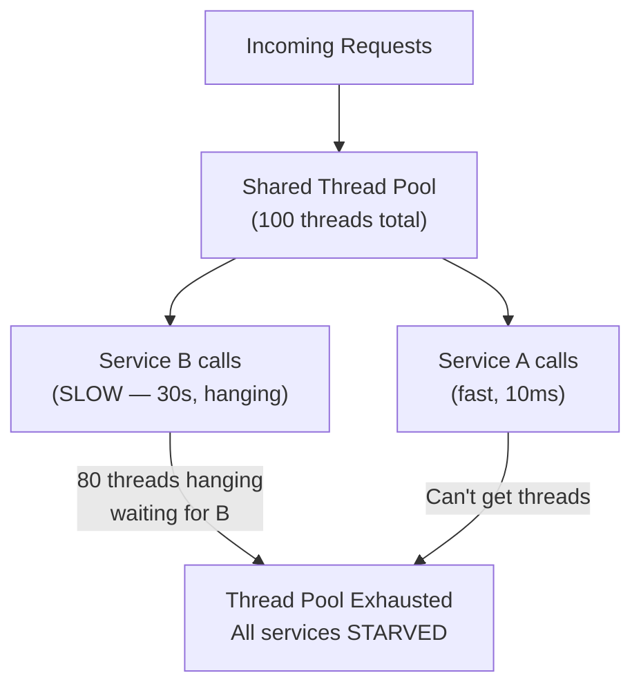
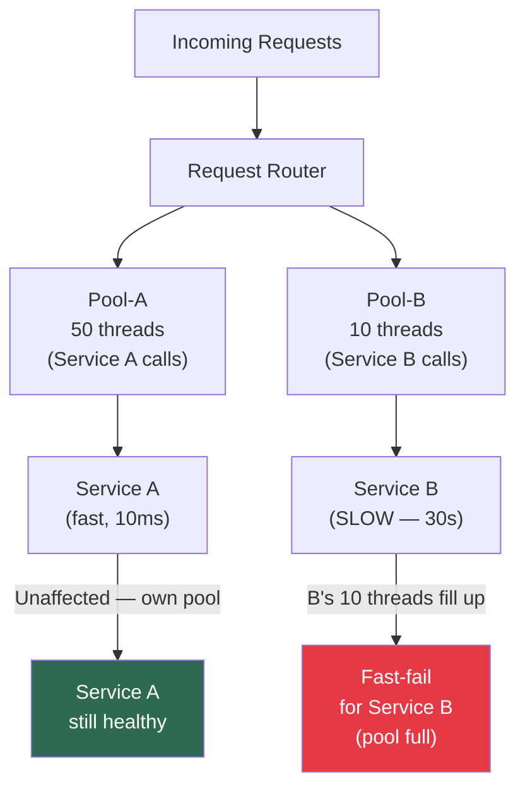

# Anchor Bulkhead Pattern

> [!abstract] TL;DR
> Named after watertight compartments in a ship's hull: if one compartment floods, the ship doesn't sink. In distributed systems, bulkheads isolate resources (thread pools, connection pools, memory) per service or tenant so that one slow or failing component can't exhaust shared resources and cascade into a total system failure. Combine with [[Circuit_Breaker]] for defense-in-depth resilience.

---

## Intuition — analogy FIRST

Picture a cargo ship without bulkheads: a single hull breach anywhere on the ship floods the entire vessel — it sinks completely. With bulkheads, the hull is divided into sealed compartments. One compartment floods; the rest remain dry. The ship limps to port instead of sinking.

Without bulkheads in software: your service calls a slow payment provider. The payment thread pool fills up with waiting threads. New requests for your entire application — including the completely unrelated product catalog — start queuing behind those blocked threads. Eventually the whole JVM is thread-starved. One slow external dependency killed your entire application.

With bulkheads: the payment provider gets its own dedicated thread pool of 10 threads. It fills up. New payment requests get fast-failed (not queued). Meanwhile, the product catalog continues using its own separate thread pool of 50 threads, completely unaffected.

---

## How It Works + mermaid

### Before Bulkhead — Shared Thread Pool



### After Bulkhead — Isolated Thread Pools



---

## Implementation Patterns

### 1. Thread Pool Bulkheads (most common)

Each downstream dependency gets its own bounded thread pool. When the pool is full, new calls are **rejected immediately** (fast-fail) rather than queued indefinitely.

**Netflix Hystrix (pioneered this pattern):**
```java
// Each command class gets its own thread pool
@HystrixCommand(
    threadPoolKey = "paymentServicePool",
    threadPoolProperties = {
        @HystrixProperty(name="coreSize", value="10"),
        @HystrixProperty(name="maxQueueSize", value="5")
    },
    fallbackMethod = "paymentFallback"
)
public PaymentResult processPayment(Order order) {
    return paymentService.charge(order);
}

// When pool is full: paymentFallback() is called immediately
// Product catalog, user service, etc. continue on their own pools
```

**Resilience4j (modern replacement for Hystrix):**
```java
// Thread pool bulkhead
BulkheadConfig config = BulkheadConfig.custom()
    .maxConcurrentCalls(10)          // Max concurrent calls
    .maxWaitDuration(Duration.ofMs(500))  // Wait max 500ms for a slot
    .build();

Bulkhead bulkhead = Bulkhead.of("paymentService", config);

// Semaphore-based bulkhead (lighter weight, same-thread)
BulkheadConfig semaphoreConfig = BulkheadConfig.custom()
    .maxConcurrentCalls(25)
    .build();
```

### 2. Connection Pool Bulkheads

Each service/component gets its own DB connection pool. Service A can't exhaust Service B's DB connections.

```yaml
# HikariCP configuration per service
datasource:
  order-service:
    maximum-pool-size: 20
    minimum-idle: 5
  payment-service:
    maximum-pool-size: 10
    minimum-idle: 2
  # inventory-service gets its own pool — not shared
```

### 3. Process / Instance Bulkheads

Deploy separate service instances per tenant or per tier. A "premium" tenant's traffic goes to dedicated pods; a "free" tier's noisy traffic can't affect premium SLAs.

```yaml
# Kubernetes — separate deployments per tier
# premium-tier-deployment.yaml
replicas: 10
nodeSelector:
  tier: premium

# free-tier-deployment.yaml
replicas: 3
nodeSelector:
  tier: free
# Free tier CPU throttling can't affect premium pods
```

### 4. Kubernetes Resource Quotas (Tenant Bulkheads)

```yaml
# Each tenant namespace gets resource limits
apiVersion: v1
kind: ResourceQuota
metadata:
  name: tenant-a-quota
  namespace: tenant-a
spec:
  hard:
    requests.cpu: "10"
    requests.memory: 20Gi
    limits.cpu: "20"
    limits.memory: 40Gi
    pods: "50"
```

---

## Bulkhead vs Circuit Breaker

These are complementary, not competing:

| Pattern | What it prevents | How |
|---------|-----------------|-----|
| **Bulkhead** | Slow service from exhausting shared resources | Limits concurrent resource usage per service |
| **Circuit Breaker** | Repeatedly calling a service that is failing | Stops sending requests when failure rate threshold is hit |

**Mental model:**
- **Bulkhead** = flood compartment on a ship — contains the damage
- **Circuit Breaker** = tripping a fuse — stops sending electricity when there's a short

**They work together:**
1. Service B starts failing (or slowing down)
2. Bulkhead ensures B's failures don't exhaust threads for services A, C, D
3. Circuit Breaker opens after enough failures, so B's thread pool stops filling up entirely
4. Circuit Breaker half-opens → probes → closes when B recovers

---

## Semaphore vs Thread Pool Bulkhead

| Dimension | Semaphore Bulkhead | Thread Pool Bulkhead |
|-----------|-------------------|----------------------|
| How | Counts concurrent calls with a semaphore | Executes in a separate thread pool |
| Overhead | Very low | Thread context switching overhead |
| Timeout support | Cannot timeout mid-execution | Can interrupt a hung thread |
| Use case | Fast calls, same JVM | Blocking I/O, calls that might hang |
| Hystrix/R4j | Resilience4j `BulkheadConfig` | Hystrix `ThreadPoolProperties` |

---

## Real-World Systems

- **Netflix Hystrix (2012):** The library that popularized the bulkhead pattern. Each of Netflix's 600+ microservices uses thread pool isolation for all downstream dependencies. When a recommendation service was slow, it didn't bring down the video player.
- **Amazon:** Product page aggregates data from 100+ services. Each service call is bounded — one slow service returns a cached/degraded response instead of hanging the entire page render.
- **Kubernetes resource quotas:** GKE/EKS multi-tenant clusters use namespace-level ResourceQuota objects to prevent noisy neighbors from consuming cluster resources.
- **AWS Lambda concurrency limits:** Per-function concurrency reservations are bulkheads — one runaway function can't consume all Lambda concurrency in the account.
- **Database connection pools in PgBouncer:** Separate pools per application service so one service's connection surge doesn't starve others.

---

## Trade-offs (table)

| Dimension | Benefit | Cost |
|-----------|---------|------|
| Fault isolation | Failure in B doesn't kill A | Need to size each pool individually |
| Predictable performance | Resources are reserved | Total resource utilization lower (each pool partially idle) |
| Fast-fail | Client gets immediate error instead of hanging | Client must handle partial failures gracefully |
| Observability | Per-pool metrics reveal bottlenecks | More metrics to monitor |
| Complexity | Clear ownership of resources | Configuration overhead per service |

**The sizing problem:** if you have 20 downstream services each with a 10-thread pool, you've reserved 200 threads minimum even if average load is light. Size pools based on: `(average concurrency) × (safety factor 2-3)`.

---

## When to Use vs Avoid

**Use bulkheads when:**
- Microservices with multiple downstream dependencies
- One slow downstream dependency could cascade into system-wide failure
- Multi-tenant systems where one tenant's load mustn't affect others
- Services with wildly different latency SLAs (fast reads + slow batch writes)

**Less necessary when:**
- Simple monolith with few downstream calls
- All downstream calls are fast, non-blocking (sub-millisecond)
- Already using reactive/non-blocking I/O (Project Reactor, vert.x) — thread starvation isn't the failure mode

---

## Common Pitfalls

> [!danger] Bulkhead anti-patterns
> 1. **One global thread pool** — if every service shares a thread pool, there are no bulkheads. This is the default in many frameworks — you have to explicitly configure per-service pools.
> 2. **Pool too large** — a bulkhead pool of 500 threads for one downstream service isn't a bulkhead, it just delays the problem. Pools should be small enough that filling them doesn't destabilize the host.
> 3. **No fallback** — when a bulkhead pool is full and a call is rejected, you need a fallback: return cached data, return an empty response, queue for later. Propagating the rejection as a 500 error defeats the point.
> 4. **Not combining with circuit breaker** — bulkheads limit damage, but circuit breakers stop the bleeding. Use both.
> 5. **Ignoring queue depth** — Hystrix's `maxQueueSize` parameter is easy to miss. An unbounded queue in front of the thread pool negates the bulkhead: `HystrixProperty(name="maxQueueSize", value="-1")` means infinite queue.
> 6. **Applying only externally** — apply bulkheads to internal service-to-service calls too, not just external API calls.

---

## Related Concepts

- [[_MOC_Distributed_Systems|↑ Section MOC]]
- [[Circuit_Breaker]] — stops calling a failing service; complementary to bulkhead
- [[Rate_Limiting]] — limits requests per client; bulkhead limits resource consumption per service
- [[Microservices]] — the architecture where bulkheads are most critical
- [[Retry_Storm]] — retries without bulkheads amplify the resource exhaustion problem
- [[Timeout_Pattern]] — timeouts + bulkheads together prevent thread starvation from hung calls
- [[Service_Mesh]] — Istio/Envoy implement bulkheads at the proxy layer (connection/request limits per upstream)

---

## Review Questions

1. Your e-commerce service calls three downstream APIs: inventory (10ms avg), payment (200ms avg), and fraud detection (sometimes hangs for 30 seconds). Without bulkheads, explain the failure cascade. With thread pool bulkheads, explain what happens when fraud detection hangs. What pool sizes would you choose?

2. Compare and contrast a thread pool bulkhead with a semaphore bulkhead. In which scenario would you choose each? Give a concrete example where the timeout capability of thread pool bulkheads is essential.

3. Netflix has 700 microservices. Explain how Hystrix thread pool bulkheads ensure that a slow recommendation service doesn't prevent users from playing videos. What are the pools, what happens when recommendations are slow, and what's the user experience?

---

## Sources

- [Netflix Tech Blog: Introducing Hystrix for Resilience Engineering](https://netflixtechblog.com/introducing-hystrix-for-resilience-engineering-13531c1ab362)
- [Resilience4j Bulkhead Documentation](https://resilience4j.readme.io/docs/bulkhead)
- Michael T. Nygard, *Release It! Design and Deploy Production-Ready Software* (2018)
- [Microsoft Azure Architecture Patterns: Bulkhead](https://learn.microsoft.com/en-us/azure/architecture/patterns/bulkhead)

#SystemDesign #Resilience #Bulkhead #ThreadPoolIsolation #Microservices #Intermediate
