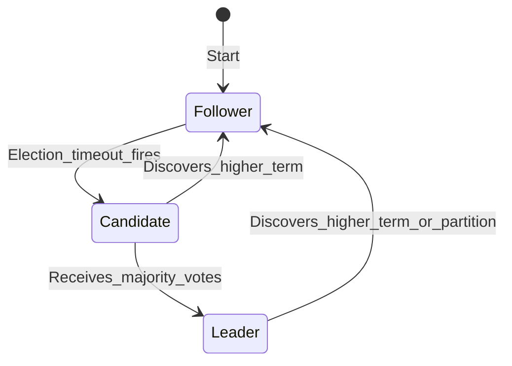
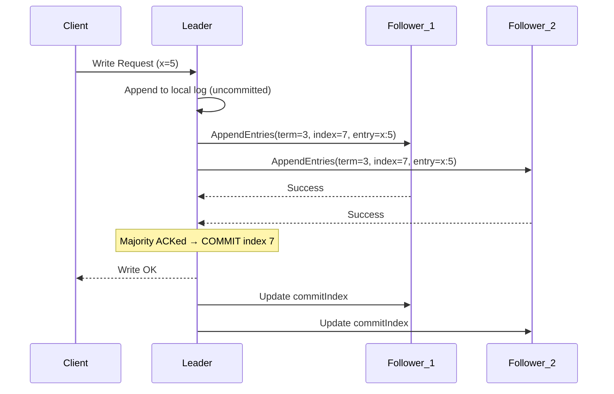

# 🗳️ Consensus and Raft

> [!abstract] TL;DR
> Distributed consensus is the problem of getting multiple nodes to agree on a single value (or sequence of values) even when some nodes crash or messages are delayed. Paxos solved it first but is notoriously hard to understand. Raft was explicitly designed for understandability — it uses leader election, log replication, and safety rules to guarantee committed entries are never lost. Used in etcd (Kubernetes), CockroachDB, TiDB, Kafka KRaft, and Consul.

---

## Intuition — Analogy First

Imagine a parliament voting on legislation. Each MP (node) has their own copy of the law book (replicated log). To keep all copies identical, there must be a Speaker (Leader) who controls the order of new laws being added. If the Speaker becomes incapacitated, the MPs elect a new Speaker before any new laws pass. Any law that a majority of MPs have recorded in their books cannot be undone — that is the "committed" state.

The hard part: what if the old Speaker wasn't really incapacitated — just briefly offline? Now two MPs think they are Speaker. Raft prevents this by using **terms** (logical time epochs) — the new Speaker has a higher term, and the old one will defer when it sees a higher-term message.

---

## How It Works

### The Consensus Problem

Given N servers, consensus requires:
- **Agreement**: all non-crashed servers decide on the same value
- **Validity**: the decided value was proposed by some server
- **Termination**: all non-crashed servers eventually decide

**FLP Impossibility (Fischer-Lynch-Paterson, 1985)**: In an asynchronous network (where message delays are unbounded), consensus is impossible if even one node can crash. Raft and Paxos sidestep this by using **timeouts** and **partial synchrony** assumptions — the network is eventually synchronous.

### Paxos

Paxos (Lamport, 1989) was the first practical consensus protocol. It has two phases (Prepare/Promise and Accept/Accepted) and handles node failures and network partitions correctly. However:
- The original paper is famously difficult to understand.
- Multi-Paxos (for a series of decisions, i.e., a log) requires significant additional design not specified in the paper.
- Correct implementation is notoriously error-prone.

### Raft

Raft (Ongaro & Ousterhout, 2014) was designed with understandability as a first-class requirement. It decomposes consensus into three relatively independent sub-problems:
1. **Leader Election** — select one server as leader
2. **Log Replication** — leader accepts entries and replicates them to followers
3. **Safety** — ensure committed entries are never lost

### Raft Roles and Terms

Each server is in one of three states:

**Terms** are logical clocks. Each election starts a new term (monotonically increasing integer). Terms detect stale leaders — if a server receives a message with a higher term, it immediately converts to Follower and updates its term.

### Leader Election

1. A **Follower** starts an election when it hasn't heard from the leader within the **election timeout** (randomized, typically 150-300ms — randomization prevents split votes).
2. The Follower increments its term, transitions to **Candidate**, votes for itself, and sends `RequestVote` RPCs to all other servers.
3. A server grants a vote if:
   - It hasn't voted in this term yet.
   - The candidate's log is **at least as up-to-date** as the voter's log (ensures only a node with all committed entries can become leader).
4. The Candidate becomes **Leader** when it receives votes from a majority (⌊N/2⌋+1).
5. The new Leader immediately sends heartbeat `AppendEntries` (empty) RPCs to all followers to establish authority and reset their election timers.

**Split vote**: If two candidates start elections simultaneously, neither may reach majority. Both wait for a new randomized timeout and restart the election in the next term. The randomization makes this rare and self-resolving.

### Log Replication

1. Client sends write to Leader.
2. Leader appends the entry to its log (uncommitted state).
3. Leader sends `AppendEntries` RPC to all Followers in parallel.
4. Once a majority (including the Leader itself) has written the entry, the Leader advances its `commitIndex` and responds to the client.
5. Future `AppendEntries` messages carry the updated `commitIndex`, which tells Followers they can apply committed entries to their state machines.

### Safety Guarantees

**Log Matching Property**: If two logs have an entry with the same index and term, then the logs are identical in all entries up to that index. Raft enforces this by having Leaders reject `AppendEntries` that don't match the previous entry's term/index.

**Leader Completeness**: A candidate cannot win an election unless its log contains all committed entries. This is enforced by the vote-granting rule: followers only vote for candidates whose logs are at least as up-to-date (compare last log term, then last log index). This ensures the new Leader never needs to "pull" committed entries from Followers — it already has them.

**State Machine Safety**: If a server has applied a log entry at index i, no other server will ever apply a different entry at index i. This follows from Leader Completeness + the fact that only committed entries are applied.

### Liveness

Raft makes progress as long as a **quorum** (majority) is available:
- 3-node cluster tolerates 1 failure
- 5-node cluster tolerates 2 failures
- 7-node cluster tolerates 3 failures

Formula: cluster size N = 2f+1 where f is the number of tolerable failures.

If quorum is lost, Raft **stops accepting writes** — it prefers consistency (CP) over availability (AP) per the [[CAP_Theorem]].

### Cluster Configuration Changes

Adding or removing nodes from a Raft cluster while it's running requires a **joint consensus** approach (both the old and new configuration must separately agree) to avoid having two leaders active simultaneously during the transition.

---

## Real-World Systems

- **etcd**: The Kubernetes control plane's backing store. Uses Raft with a 3-node or 5-node cluster. If a majority of etcd nodes die, the Kubernetes API server stops accepting writes — the cluster becomes read-only.
- **CockroachDB**: Each range (shard of data) is a Raft group. Writes to that range go through Raft consensus. A 3-node CockroachDB cluster can survive 1 node failure per range.
- **TiDB / TiKV**: TiKV (the storage layer) uses Raft groups per region. Multiple Raft groups run independently in parallel — the system can sustain high write throughput across many shards.
- **Kafka KRaft mode**: Kafka 3.x replaces ZooKeeper with an internal Raft-based metadata quorum (KRaft). Controller nodes use Raft to agree on partition leadership and broker membership.
- **Consul**: Uses Raft for its service catalog and KV store. Consul agents run a 3-5 node server cluster with Raft.
- **HashiCorp Vault**: Uses a Raft-based integrated storage backend as of Vault 1.4, eliminating the need for an external Consul cluster.

---

## Trade-offs

| Property | Raft | Multi-Paxos |
|---|---|---|
| **Understandability** | High (designed for it) | Low (notoriously complex) |
| **Leader overhead** | All writes go through leader (bottleneck) | Same |
| **Read scalability** | Followers can serve stale reads; linearizable reads need quorum | Same |
| **Write latency** | 1 RTT to majority (parallel AppendEntries) | Similar |
| **Election speed** | Randomized timeout (~150-300ms typical) | Similar |
| **Fault tolerance** | N=2f+1 nodes for f failures | Same |
| **Operational tooling** | Rich (etcd, Consul have mature tooling) | Less standardized |

---

## When to Use vs Avoid

**Use Raft / consensus-backed systems when:**
- You need linearizable (strongly consistent) reads and writes.
- You are doing leader election for a distributed system's control plane.
- You need a distributed configuration store (etcd, Consul) that must be consistent.
- Your distributed lock implementation requires strong correctness guarantees ([[Distributed_Locks]]).

**Avoid Raft when:**
- You need high write throughput — Raft serializes all writes through the Leader, limiting throughput to one node's capacity. Instead, shard data across multiple Raft groups (like TiKV).
- You can tolerate eventual consistency and want higher availability — use a leaderless replication system (Dynamo-style) instead.
- Latency is critical and your nodes are geographically distributed — consensus requires a round trip to a majority, and inter-region RTTs add 50-200ms per write.

---

## Common Pitfalls

1. **Quorum loss stops all writes**: In a 3-node Raft cluster, if 2 nodes die, the cluster is stuck. Plan node placement to minimize correlated failures (different racks, AZs, regions).

2. **etcd cluster too small**: Running a single-node etcd is convenient but has zero fault tolerance. Production Kubernetes clusters must use at least 3 etcd nodes, ideally 5 for greater resilience.

3. **Unbounded log growth**: Raft logs grow indefinitely. Implement **log compaction** (snapshotting) — take a snapshot of the state machine, then truncate all log entries before the snapshot index. etcd's `--auto-compaction-mode` handles this.

4. **Split-brain from misconfigured timeouts**: If the election timeout is too short relative to network RTT (e.g., 10ms election timeout on a 50ms RTT network), spurious leader elections happen constantly. Set `election_timeout ≥ 10x heartbeat_interval ≥ 10x one-way RTT`.

5. **Reading from Followers without understanding staleness**: Followers serve data that may lag behind the Leader's committed state by a few milliseconds. If you need linearizable reads, read from the Leader or use `ReadIndex` (Raft extension that confirms current Leader state before answering).

6. **Treating Raft as a general replication solution**: Raft is designed for small clusters (3-7 nodes). It does not scale horizontally by itself. Use sharding with multiple Raft groups (like CockroachDB ranges) for large-scale systems.

---

## Related Concepts

- [[_MOC_Distributed_Systems|↑ Section MOC]]
- [[Distributed_Locks]] — etcd/ZooKeeper use Raft/ZAB to provide reliable locks
- [[Distributed_Transactions]] — Raft-backed stores (etcd, CockroachDB) provide transaction semantics on top of consensus
- [[Kafka]] — Kafka KRaft mode uses Raft internally for controller quorum
- [[CAP_Theorem]] — Raft clusters are CP (choose consistency over availability on partition)
- [[Vector_Clocks]] — alternative approach to ordering in eventually-consistent systems (no leader required)

---

## Review Questions

1. **Walk through what happens when a Raft Follower's election timeout fires. Trace every state transition and message exchange until a new Leader is elected. What prevents two nodes from simultaneously winning the election?**

2. **Kubernetes etcd is a 3-node cluster. Node 2 goes down. Node 3 goes down. What happens to the Kubernetes API server, and why? What must an operator do to restore cluster functionality?**

3. **Explain the "Log Completeness" safety property in Raft. How does the vote-granting rule enforce it? Give a concrete example where a Follower with a stale log is correctly prevented from becoming Leader.**

---

## Sources

- Diego Ongaro & John Ousterhout, "In Search of an Understandable Consensus Algorithm" (Raft paper, USENIX ATC 2014) — https://raft.github.io/raft.pdf
- Raft visualization: https://raft.github.io/
- etcd Raft implementation: https://github.com/etcd-io/raft
- Martin Kleppmann, *Designing Data-Intensive Applications*, Chapter 9 (Linearizability and Consensus)
- CockroachDB Raft overview: https://www.cockroachlabs.com/blog/scaling-raft/

#SystemDesign #DistributedSystems #Consensus #Raft #Paxos #LeaderElection #etcd #LogReplication
