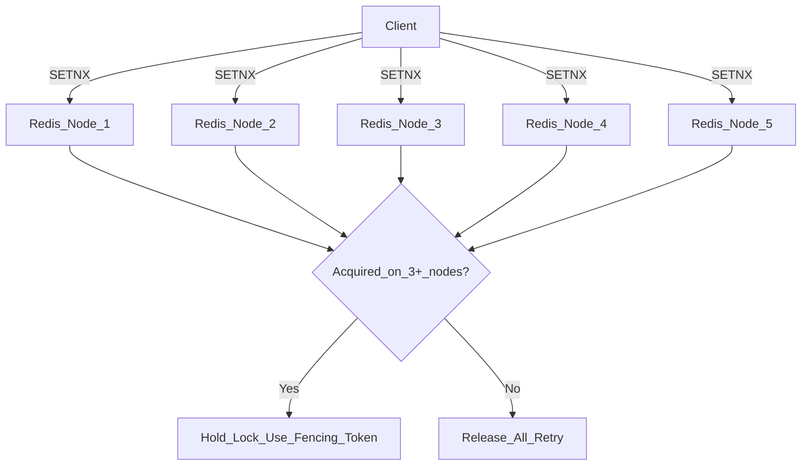

# 🔒 Distributed Locks

> [!abstract] TL;DR
> A distributed lock provides mutual exclusion across multiple processes or nodes. Use cases include preventing double-processing of cron jobs, avoiding overselling in inventory systems, and leader election. Redis SETNX is simple but has correctness edge cases under network partitions. Redlock (multi-node Redis) is contested. ZooKeeper/etcd with fencing tokens are the reliable choice for correctness-critical operations.

---

## Intuition — Analogy First

A single-server mutex (like `synchronized` in Java or `std::mutex` in C++) works because all threads share the same memory space. The OS kernel arbitrates access.

In a distributed system, there is no shared memory. Multiple nodes each believe they might be "the one" running a job. Without coordination, two nodes simultaneously run the nightly billing job and charge customers twice.

The analogy: a shared whiteboard with "ROOM OCCUPIED" written on it — but now the whiteboard is in a different building. The rules: (1) check the whiteboard before entering, (2) erase your name when you leave, (3) the sign auto-erases after 10 minutes in case you die with the pen in hand (TTL). The challenge: walking to the whiteboard building takes time, and your note might auto-erase before you finish your work.

---

## How It Works

### Use Cases

| Use Case | Why a Lock? |
|---|---|
| **Cron job scheduling** | Only one node should run the job; others skip |
| **Inventory decrement** | Prevent overselling: check-then-decrement must be atomic |
| **Leader election** | One node is the primary; others are standbys |
| **Cache refresh** | Prevent thundering herd: only one node rebuilds hot cache |
| **Rate limiting** | Shared counter across nodes (though usually handled by Redis atomic ops) |

### Redis SETNX (Simple Approach)

```
SET lock_key unique_value NX EX 30
```
- `NX` — only set if Not eXists (atomic check-and-set)
- `EX 30` — expire after 30 seconds (prevents deadlock if holder crashes)
- `unique_value` — a UUID or random token **owned by this client** (so only the lock holder can release it)

**Release** (Lua script for atomicity):
```lua
if redis.call("GET", KEYS[1]) == ARGV[1] then
    return redis.call("DEL", KEYS[1])
else
    return 0
end
```
The Lua script is critical — without it, a client could release a lock it no longer holds (if the TTL expired and another client acquired it).

**Problems with single-node Redis:**
- Redis crashes and all locks are lost — clients think they still hold the lock
- Clock skew: if the Redis server's clock drifts or the client takes longer than the TTL, the lock expires while the client thinks it's still holding it
- Single Redis is a SPOF — if it goes down, no locks can be acquired

### Redlock (Multi-Node Redis)

Antirez (Redis creator) proposed Redlock to address single-node failures:

**Algorithm:**
1. Client notes current timestamp T1.
2. Client tries to acquire the lock on N Redis nodes (N ≥ 5, independent masters) **sequentially**, with a short timeout per node.
3. Lock is considered acquired if:
   - It was acquired on **majority (≥ N/2+1)** of nodes.
   - Total elapsed time < lock validity TTL.
4. If the lock is not acquired on majority, release on all nodes and retry.



**The Martin Kleppmann Critique:**

Martin Kleppmann wrote a famous blog post arguing Redlock is NOT safe for correctness-critical operations:

- A process can hold a Redlock, then experience a GC pause (JVM stop-the-world) longer than the TTL. The lock expires, another client acquires it. When the GC pause ends, the original client resumes, thinking it still holds the lock, and writes to the shared resource — **two clients write concurrently**.
- This is not a Redlock-specific bug — it affects any TTL-based lock. The fundamental issue is that a process can be paused for an arbitrary duration.

**The fix: Fencing Tokens (see below).**

Antirez countered that Redlock is designed for "efficiency" locks (avoid duplicate work) not "correctness" locks (avoid data corruption). For correctness, use ZooKeeper/etcd.

### ZooKeeper / etcd

Both are consensus-backed coordination services (ZooKeeper uses ZAB, etcd uses Raft). Locks from these are **linearizable** — they go through consensus before being granted.

**ZooKeeper ephemeral nodes:**
- Client creates `/locks/my-lock` as an **ephemeral** znode.
- Ephemeral znodes disappear automatically when the client's session ends (crash, disconnect, timeout).
- To implement a lock: create sequential ephemeral nodes under `/locks/`. The client with the lowest sequence number holds the lock. Others watch the node just before them.

**etcd leases:**
- Client creates a key with a lease (TTL).
- Lease must be kept alive by the client sending keepalive heartbeats.
- When client dies, lease expires, key is deleted → lock released.
- Other clients watch for the key's deletion to know the lock is available.

**Safety:** ZooKeeper and etcd operations go through the Raft/ZAB consensus protocol. A write is not acknowledged until a majority of nodes have durably written it. This makes them much safer than Redis for correctness-critical scenarios — at the cost of higher latency (consensus takes multiple network round trips).

### Fencing Tokens

A **fencing token** is a monotonically increasing number issued with each lock grant. The lock service increments the counter every time it grants a lock.

```
Client A acquires lock → gets token 33
Client A pauses (GC)   → lock expires
Client B acquires lock → gets token 34
Client B writes to storage with token 34 → storage accepts
Client A resumes       → tries to write with token 33
Storage sees 33 < 34   → REJECTS Client A's write
```

The storage layer must enforce "reject writes with tokens older than the last seen token." This moves the safety guarantee from the lock service into the storage system, making it robust even when the lock TTL expires prematurely.

ZooKeeper's `zxid` (transaction ID) and etcd's revision number serve as natural fencing tokens.

---

## Real-World Systems

- **Kubernetes controller leader election**: Uses etcd leases. Only one controller manager replica acts as leader at a time; the others watch the lease and take over if it expires.
- **Quartz Scheduler (Java)**: Uses DB-level distributed locking (SELECT FOR UPDATE on a `QRTZ_LOCKS` table) to ensure only one node fires each job.
- **ShedLock (Java)**: A popular library that uses DB tables or Redis for distributed job scheduling locks.
- **Redis SETNX**: Widely used for "efficiency locks" — preventing duplicate Kafka message processing in consumer groups, [[Cache_Stampede|cache stampede prevention]].
- **Apache Curator**: A ZooKeeper client library for Java that provides high-level distributed lock primitives (InterProcessMutex) on top of ZooKeeper.

---

## Trade-offs

| Approach | Safety | Latency | Ops Complexity | Suitable For |
|---|---|---|---|---|
| **Redis SETNX** | Low (single SPOF, GC pause risk) | Very low (1 RTT) | Low | Efficiency locks, cache |
| **Redlock (5 nodes)** | Medium (still TTL-based) | Low (5 RTTs) | Medium | Efficiency locks |
| **ZooKeeper** | High (consensus, ephemeral sessions) | Medium | High | Correctness-critical |
| **etcd** | High (Raft consensus, leases) | Medium | Medium | K8s leader election |
| **DB (SELECT FOR UPDATE)** | High (DB transactions) | High (DB overhead) | Low | Simple use cases |

---

## When to Use vs Avoid

**Use distributed locks when:**
- A cron job or background task must run on exactly one node.
- An operation requires check-and-act atomicity across a fleet (e.g., inventory).
- You need leader election for primary/standby coordination.

**Avoid distributed locks when:**
- The operation can be made idempotent or conflict-free by design (e.g., use CAS operations, optimistic locking, or CRDTs).
- The lock scope is so broad that it serializes all writes, becoming a bottleneck — reconsider your data model.
- You need sub-millisecond latency — lock acquisition adds RTT overhead.
- The "critical section" is longer than your TTL — redesign so the critical section is short, or implement fencing tokens.

---

## Common Pitfalls

1. **Not using fencing tokens for correctness-critical ops**: TTL-based locks can expire under GC pauses or network delays. If correctness matters (not just efficiency), always pair the lock with a fencing token enforced by the storage layer.

2. **Long critical sections**: If your lock holder does DB queries, external API calls, and file I/O inside the locked section, the TTL might expire. Keep critical sections short — acquire the lock, do the minimal state change, release.

3. **Not releasing the lock on exceptions**: Always release in a `finally` block (Java) or `with` statement (Python). A lock not released due to an exception will block other processes until TTL expiry.

4. **Using the same Redis instance as your primary cache**: If Redis goes down for an outage, you lose both your cache and your locks. Use separate Redis instances for different concerns.

5. **Redlock with fewer than 5 nodes**: The algorithm requires a true majority. With 3 nodes and one failing, you can still acquire. With 2 nodes and one failing, majority is impossible. Always use 5 independent nodes.

6. **Not monitoring lock contention**: High lock contention (many processes waiting) is a signal of a hot spot. Monitor with `redis-cli monitor` or Prometheus metrics and reconsider your locking strategy.

---

## Related Concepts

- [[_MOC_Distributed_Systems|↑ Section MOC]]
- [[Consensus_and_Raft]] — the protocol that makes etcd and ZooKeeper reliable
- [[ACID_and_Transactions]] — DB-level locking (SELECT FOR UPDATE) as an alternative
- [[Kafka]] — distributed locks are sometimes used to coordinate Kafka consumer assignments
- [[Idempotent_Operations]] — often a better alternative to locking for idempotent operations

---

## Review Questions

1. **Explain the fencing token concept. Draw a timeline where Client A holds a Redis lock, experiences a GC pause longer than the TTL, and Client B acquires the lock. Show how fencing tokens prevent a split-brain write.**

2. **Why does Kleppmann argue that Redlock is not safe for correctness-critical operations, even with 5 independent Redis masters? What specific failure mode does he describe?**

3. **Your team uses Quartz Scheduler with a DB lock table for cron jobs. The lock table SELECT for UPDATE takes 500ms under heavy load. Propose an alternative architecture that maintains correctness while reducing lock acquisition latency.**

---

## Sources

- Martin Kleppmann, "How to do distributed locking" — https://martin.kleppmann.com/2016/02/08/how-to-do-distributed-locking.html
- Antirez (Salvatore Sanfilippo), "Is Redlock safe?" — http://antirez.com/news/101
- Redis Redlock algorithm: https://redis.io/docs/manual/patterns/distributed-locks/
- etcd distributed locking: https://etcd.io/docs/v3.5/dev-guide/api_concurrency_reference_v3/
- Martin Kleppmann, *Designing Data-Intensive Applications*, Chapter 8 (The Trouble with Distributed Systems)

#SystemDesign #DistributedSystems #DistributedLocks #Redis #Redlock #ZooKeeper #etcd #FencingTokens
