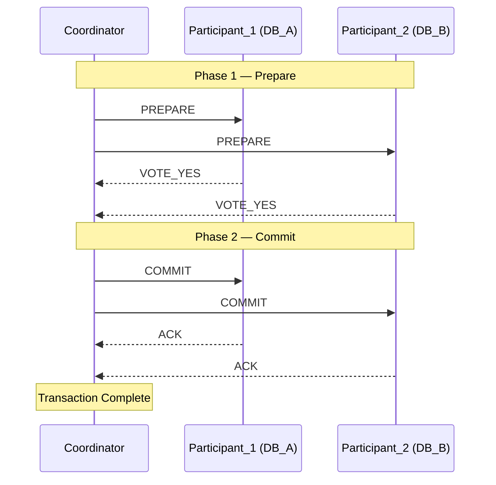

# 💳 Distributed Transactions

> [!abstract] TL;DR
> When a business operation spans multiple databases or services, you can't wrap it in a single DB transaction. Two-Phase Commit (2PC) is the classical protocol that tries to guarantee atomicity across nodes — but it's a blocking protocol with serious failure modes. Modern systems prefer Saga or event-driven eventual consistency instead.

---

## Intuition — Analogy First

Imagine a wire transfer between two banks. Bank A must debit your account and Bank B must credit the recipient's account. If Bank A debits but Bank B crashes before crediting, money vanishes. If you credit first and the debit fails, money is created out of thin air.

A notary coordinating a real-estate closing is the analogy for 2PC: both the buyer and seller must sign in front of the notary before the deed changes hands. If either party doesn't show, nothing happens and both sides walk away with the status quo. The notary (coordinator) is the single point of truth — but if the notary disappears mid-signing, both parties are stuck waiting indefinitely.

---

## How It Works

### The Core Problem

A single database transaction gives you atomicity for free via its [[Write_Ahead_Log|WAL]] and lock manager. Once you have two separate databases (or two microservices with their own DBs), no single lock manager controls both. You need a protocol.

### Two-Phase Commit (2PC)

2PC introduces a **Coordinator** (often the application server or a transaction manager) and **Participants** (the databases or services involved).

```
Phase 1 — Prepare:
  Coordinator → "Can you commit?" → all Participants
  Each Participant:
    - Acquires locks on the affected rows
    - Writes intent to local WAL (durable)
    - Replies VOTE_YES or VOTE_NO

Phase 2 — Commit or Abort:
  If ALL voted YES:
    Coordinator → COMMIT → all Participants → each releases locks and commits
  If ANY voted NO (or timed out):
    Coordinator → ABORT → all Participants → each rolls back
```

**Key property**: once a participant votes YES, it has promised it *can* commit. It cannot unilaterally abort after voting YES — it must wait for the coordinator's final decision.



### Failure Scenarios

| Failure Point | Consequence |
|---|---|
| Coordinator crashes after Phase 1, before sending COMMIT | Participants hold locks indefinitely — **blocking protocol** |
| Participant crashes after voting YES but before receiving COMMIT | Must recover from WAL and re-ask coordinator |
| Network partition between coordinator and one participant | That participant is stuck until partition heals |
| Slow participant | All other participants hold locks, waiting |

### XA Transactions

XA is the X/Open standard that defines the interface between a transaction manager and a resource manager (database). Java's JTA (Java Transaction API) implements XA. MySQL, PostgreSQL, and Oracle all support XA. It's 2PC under the hood with a standardized API.

```java
// Java JTA example (conceptual)
UserTransaction tx = context.lookup("java:comp/UserTransaction");
tx.begin();
// operations on DataSource A and DataSource B
tx.commit(); // triggers 2PC internally
```

### Alternatives to 2PC

| Approach | Mechanism | Consistency |
|---|---|---|
| **Saga Pattern** | Sequence of local txns + compensating txns | Eventual |
| **TCC (Try-Confirm-Cancel)** | Reserve → Confirm or Cancel in two app-level phases | Strong (app-enforced) |
| **Event-driven eventual consistency** | Publish events, let consumers reconcile | Eventual |
| **Outbox Pattern** | Atomic write + event in same DB txn | Eventual (at-least-once) |

---

## Real-World Systems

- **MySQL XA**: Used in legacy banking systems for cross-branch transfers. Still present in older monoliths but avoided in new greenfield services.
- **Java EE / Jakarta EE application servers**: JBoss, WebLogic, and WebSphere support XA via JTA for enterprise applications coordinating across multiple datasources.
- **Google Spanner**: Uses a variant of 2PC with TrueTime for externally-consistent distributed transactions — but Google controls the full stack (custom hardware clocks). Not viable for typical deployments.
- **CockroachDB**: Implements a distributed transaction protocol internally, but exposes a standard SQL interface. The 2PC complexity is hidden inside the database engine itself.
- **Modern microservices**: Almost universally avoid 2PC in favor of Saga + Outbox. Stripe, Uber, and Netflix have all published on this migration.

---

## Trade-offs

| Property | Two-Phase Commit | Saga / Eventual |
|---|---|---|
| **Atomicity** | Strong (all-or-nothing) | Weak (compensated) |
| **Isolation** | Full (locks held during protocol) | None (intermediate states visible) |
| **Latency** | High (two round trips + lock contention) | Low (local txns only) |
| **Availability** | Low (coordinator SPOF; blocking on failure) | High (services independent) |
| **Complexity** | Protocol is simple; failure handling is not | Compensation logic is complex |
| **Cross-datacenter** | Practically unusable (network latency explodes) | Fine |
| **Scalability** | Poor (global locking) | Good |

---

## When to Use vs Avoid

**Use 2PC when:**
- Transactions are entirely within a single datacenter and all participants are internal.
- Transaction duration is very short (milliseconds) to minimize lock hold time.
- You are working with a system that already uses XA (migrating an existing monolith).
- Strong consistency is a regulatory requirement and the system is small enough that coordinator failure is acceptable.

**Avoid 2PC when:**
- Any participant is across a WAN or in a different datacenter.
- You need high availability — coordinator failure makes all in-flight transactions blocked.
- You have more than 2-3 participants — coordination overhead grows linearly.
- You are building a new microservices system — choose Saga from the start.

---

## Common Pitfalls

1. **Coordinator as SPOF**: The coordinator holds the ground truth for all in-flight transactions. Without HA for the coordinator, a single failure blocks everything. Use a replicated coordinator (e.g., via Raft) if you must use 2PC.

2. **Forgetting about heuristic outcomes**: Some databases (MySQL XA) allow a DBA to manually commit or roll back a stuck prepared transaction. This breaks the protocol's guarantee — use only as last resort and document it.

3. **Lock escalation**: Participants hold row-level locks from Phase 1 until Phase 2 completes. Under load, these can escalate to table locks, causing deadlocks or timeouts that are hard to diagnose.

4. **Assuming XA = safe**: XA is still 2PC. Its failure modes are the same. The standard interface does not fix the blocking problem.

5. **Using 2PC for long-running operations**: A 2PC that spans seconds or minutes (e.g., calling an external API inside the transaction) will hold locks for that entire duration, causing severe contention.

6. **Conflating 2PC with 2-phase locking (2PL)**: They are different. 2PL is a concurrency control mechanism within a single DB. 2PC is a commit protocol across multiple nodes.

---

## Related Concepts

- [[_MOC_Distributed_Systems|↑ Section MOC]]
- [[Saga_Pattern]] — the preferred alternative for microservices
- [[Outbox_Pattern]] — solves the dual-write problem atomically
- [[ACID_and_Transactions]] — the properties 2PC tries to preserve across nodes
- [[Kafka]] — the event backbone that makes event-driven alternatives practical
- [[Consensus_and_Raft]] — used to make the coordinator itself fault-tolerant
- [[CAP_Theorem]] — explains why strong consistency across a partition is impossible

---

## Review Questions

1. **Why is 2PC called a "blocking protocol"?** Describe the exact failure scenario that causes participants to block indefinitely and explain why they cannot unilaterally decide.

2. **A payment system uses 2PC between a Payments DB and an Inventory DB. The coordinator sends PREPARE to both, both vote YES, but then the coordinator crashes before sending COMMIT. What happens to each participant, and what are the recovery options?**

3. **Your team is building a new e-commerce checkout service that must debit a user's wallet and create an order record in two separate microservices. Your tech lead says "use 2PC." What would you recommend instead, and why?**

---

## Sources

- Martin Kleppmann, *Designing Data-Intensive Applications*, Chapter 9 (Consistency and Consensus)
- Gray & Lamport, "Consensus on Transaction Commit" (2004) — formal analysis of 2PC vs Paxos Commit
- MySQL XA Transactions: https://dev.mysql.com/doc/refman/8.0/en/xa.html
- Google Spanner paper (Corbett et al., 2012) — distributed transactions with TrueTime

#SystemDesign #DistributedSystems #Transactions #2PC #XA #Microservices
