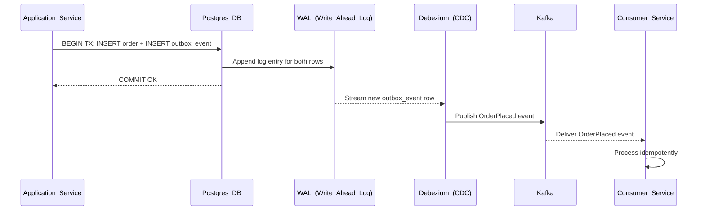

# 📬 Outbox Pattern

> [!abstract] TL;DR
> The Outbox Pattern solves the "dual-write" problem: saving to a database and publishing to a message broker (e.g., Kafka) in the same logical operation. Instead of writing to both directly (which can lead to inconsistency), write the event into an "outbox" table in the same database transaction as your business data. A separate relay process reads the outbox and publishes to Kafka, guaranteeing at-least-once delivery.

---

## Intuition — Analogy First

Imagine you run a mailroom. You need to update your internal records and send a letter to a customer in the same operation. The naive approach: update records, then hand the letter to the postal service. But what if the postal service office is closed when you walk over? Your records are updated but the letter was never sent.

The outbox approach: update your records and drop the letter in your own internal outbox tray — in the same motion, in the same room. A dedicated mail runner then periodically picks up everything from the outbox tray and hands it to the postal service. If the mail runner fails, the letter stays in the tray and gets picked up on the next run. Your internal records and the outbox tray are always in sync because they live in the same filing cabinet.

---

## How It Works

### The Dual-Write Problem

A service that saves an Order to its database and publishes an `OrderPlaced` event to Kafka has two writes that need to appear atomic:

```
// NAIVE — BROKEN
saveOrder(order);         // DB write succeeds
publishEvent(order);      // Kafka publish FAILS → order saved but event never published
                          // OR: Kafka publishes → DB write FAILS → ghost event

// Result: DB and Kafka are now inconsistent
```

This is sometimes called the "dual-write" or "two generals" problem at the service level.

### The Solution: Outbox Table

Add an `outbox_events` table to the service's own database. In the same database transaction that saves the business entity, insert a row into `outbox_events`. Because both happen in one DB transaction, they are atomic — either both succeed or both fail.

```sql
-- outbox_events table schema
CREATE TABLE outbox_events (
    id          UUID PRIMARY KEY DEFAULT gen_random_uuid(),
    aggregate_type VARCHAR(255) NOT NULL,  -- e.g., 'Order'
    aggregate_id   VARCHAR(255) NOT NULL,  -- e.g., order UUID
    event_type     VARCHAR(255) NOT NULL,  -- e.g., 'OrderPlaced'
    payload        JSONB        NOT NULL,  -- event data
    created_at     TIMESTAMP    NOT NULL DEFAULT now(),
    published_at   TIMESTAMP                            -- NULL until published
);
```

```sql
-- In one DB transaction:
BEGIN;
  INSERT INTO orders (id, customer_id, total, status)
    VALUES ($1, $2, $3, 'PENDING');

  INSERT INTO outbox_events (aggregate_type, aggregate_id, event_type, payload)
    VALUES ('Order', $1, 'OrderPlaced', '{"orderId": "...", "total": ...}');
COMMIT;
-- If either INSERT fails, both roll back. Kafka is not touched yet.
```

### The Relay Process

A separate process reads unpublished rows from `outbox_events` and publishes them to Kafka (or any broker). There are two relay strategies:

**1. Polling Relay (simple):**
```
Loop every N seconds:
  SELECT * FROM outbox_events WHERE published_at IS NULL ORDER BY created_at LIMIT 100;
  For each event: publish to Kafka, then UPDATE outbox_events SET published_at = now();
```
- Simple to implement
- Adds latency (up to polling interval)
- Adds DB load from frequent reads
- Must handle failures atomically (mark published only after broker ACK)

**2. CDC Relay via Debezium (preferred):**

Change Data Capture (CDC) tools like **Debezium** connect directly to the database's [[Write_Ahead_Log|Write-Ahead Log (WAL)]]. Every INSERT into `outbox_events` appears as a WAL entry, which Debezium streams to Kafka in near-real-time.



**Debezium advantages over polling:**
- Near-real-time (milliseconds vs polling interval)
- No added DB read load — reads from WAL, not the table
- No application code for the relay — Debezium is a Kafka connector, configured via JSON
- Reliable — Debezium tracks WAL offset, so on restart it resumes from where it left off

### At-Least-Once Delivery

The Outbox Pattern guarantees **at-least-once** delivery, not exactly-once. If Debezium publishes to Kafka but crashes before saving its offset, it will re-publish the same event on restart. Consumers **must be idempotent** — they must handle duplicate events safely.

Common idempotency strategies:
- Check if the event's `id` (UUID) already exists in a `processed_events` table before processing
- Make operations naturally idempotent (INSERT ... ON CONFLICT DO NOTHING)
- Use Kafka's idempotent producer + transactional semantics for exactly-once within Kafka

---

## Real-World Systems

- **Debezium + PostgreSQL WAL**: The canonical implementation. Debezium is a Red Hat open-source project and the de facto standard for CDC-based outbox relay. Used at LinkedIn, Shopify, and many others.
- **Debezium Outbox Event Router SMT**: Debezium provides a built-in Single Message Transform specifically for the Outbox Pattern, routing events from the outbox table to the correct Kafka topic based on `aggregate_type`.
- **Axon Framework**: A Java CQRS/Event Sourcing framework that implements the Outbox Pattern internally — developers write events to the framework's store, and the framework handles reliable publishing.
- **AWS EventBridge Pipes + DynamoDB Streams**: AWS's managed equivalent — DynamoDB Streams acts as the CDC mechanism, and Pipes can relay events to EventBridge or other targets.

---

## Trade-offs

| Property | Dual-Write (Naive) | Polling Outbox | CDC Outbox (Debezium) |
|---|---|---|---|
| **Consistency** | Broken (race condition) | Strong | Strong |
| **Latency** | Low (direct publish) | Medium (polling interval) | Low (WAL streaming) |
| **DB load** | Normal | Higher (poll queries) | Minimal (WAL tail) |
| **Complexity** | Low | Low-medium | Medium-high (ops complexity) |
| **Delivery guarantee** | None | At-least-once | At-least-once |
| **Infrastructure** | None | None | Debezium cluster + Kafka Connect |
| **Ordering** | Not guaranteed | By `created_at` | By WAL order |

---

## When to Use vs Avoid

**Use the Outbox Pattern when:**
- You have a microservice that must reliably publish events to Kafka after a DB write.
- You are implementing a [[Saga_Pattern]] and need event publication to be atomic with the triggering state change.
- You cannot tolerate lost events (e.g., payment events, inventory events, audit logs).
- Your business operation spans one service — the Outbox handles that service's atomic publish.

**Avoid the Outbox Pattern when:**
- Your service already uses event sourcing (events are the source of truth — outbox is redundant).
- The event volume is so low that a polling approach adds unacceptable complexity versus a simple transactional script with retry.
- You are using a database that doesn't support transactions (e.g., DynamoDB without transactions — use DynamoDB Streams + Lambda as the CDC analog instead).

---

## Common Pitfalls

1. **Polling without marking atomically**: If you SELECT events, publish to Kafka, and then crash before updating `published_at`, you will re-publish on restart (at-least-once). This is correct behavior — but ensure consumers are ready to handle it before declaring the outbox "done."

2. **Not cleaning up the outbox table**: Outbox rows accumulate. Add a background job to delete rows where `published_at IS NOT NULL AND published_at < now() - interval '7 days'`, or use table partitioning with partition drops.

3. **Using the outbox for synchronous responses**: The Outbox Pattern is asynchronous by design. Do not use it if the caller expects a synchronous response to the published event.

4. **Outbox table in a different DB**: The entire point is that the outbox row is written in the same transaction as the business data. If they are in different databases, you have the dual-write problem again.

5. **Ignoring Debezium connector lag**: In production, Debezium can fall behind the WAL under heavy write load. Monitor `kafka.consumer.records-lag` and set up alerts. A lagging connector means delayed event delivery downstream.

6. **Large payloads in the outbox**: The `payload` column should contain the event data, but avoid embedding very large blobs. Store large artifacts in object storage and reference them by ID in the event.

---

## Related Concepts

- [[_MOC_Distributed_Systems|↑ Section MOC]]
- [[Saga_Pattern]] — the Outbox Pattern is almost always used within Sagas to guarantee event publication
- [[Kafka]] — the message broker that receives events from the relay process
- [[Write_Ahead_Log]] — the DB mechanism that CDC (Debezium) reads to stream changes
- [[Idempotent_Operations]] — required at the consumer side for at-least-once delivery
- [[Distributed_Transactions]] — the problem space the Outbox Pattern helps avoid

---

## Review Questions

1. **Explain the dual-write problem. Give a concrete example with a Payments service that writes to Postgres and publishes to Kafka, and show exactly how inconsistency arises without the Outbox Pattern.**

2. **Compare polling relay vs CDC relay (Debezium) for the Outbox Pattern. Under what conditions would you choose polling despite its limitations?**

3. **The Outbox Pattern guarantees at-least-once delivery. Your consumer receives a duplicate `OrderPlaced` event. Walk through two different strategies the consumer could use to handle this idempotently.**

---

## Sources

- Gunnar Morling (Red Hat), "The Outbox Pattern" — https://debezium.io/blog/2019/02/19/reliable-microservices-data-exchange-with-the-outbox-pattern/
- Debezium Outbox Event Router: https://debezium.io/documentation/reference/stable/transformations/outbox-event-router.html
- Chris Richardson, *Microservices Patterns*, Chapter 3 (Interprocess Communication)
- Martin Kleppmann, *Designing Data-Intensive Applications*, Chapter 11 (Stream Processing)

#SystemDesign #DistributedSystems #OutboxPattern #Debezium #CDC #Kafka #AtLeastOnce
