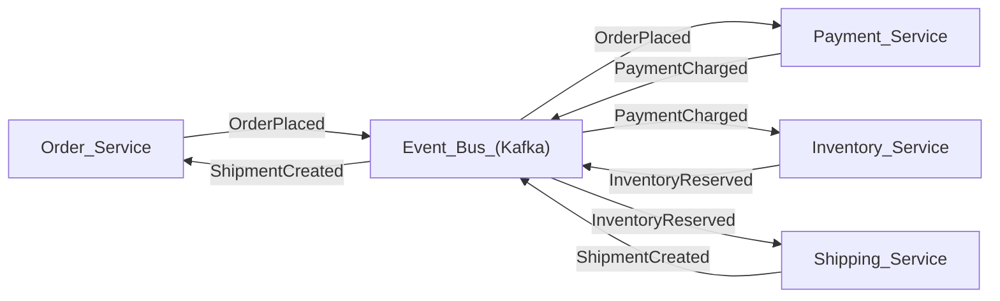
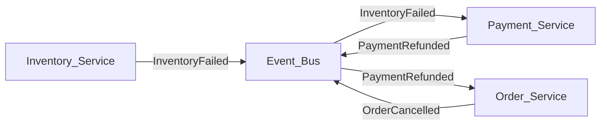
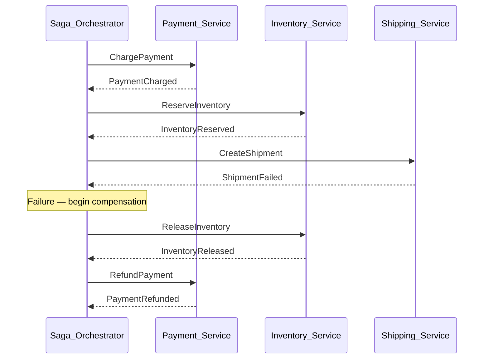

# 🔄 Saga Pattern

> [!abstract] TL;DR
> A Saga is a sequence of local database transactions, each publishing an event (or message) that triggers the next step. If any step fails, compensating transactions run in reverse to undo the completed steps. Sagas replace distributed transactions (2PC) with eventual consistency + compensation, trading isolation for availability and scalability.

---

## Intuition — Analogy First

Think of booking a vacation through a travel agent in the pre-internet era. The agent books your flight, then your hotel, then your rental car — each with a separate company. If the car rental falls through at the last step, the agent doesn't magically undo everything atomically. Instead, they **cancel** the hotel and **refund** the flight — those are the compensating actions.

The saga is the script the agent follows: both the happy path (book everything) and the unhappy path (what to cancel, in what order). The key insight: **no single entity locks all three bookings simultaneously**. Each is a local transaction with its own cancellation policy.

---

## How It Works

### Core Concept

A Saga breaks a long-lived distributed transaction into a sequence of **local transactions** (T1, T2, T3 ... Tn). Each local transaction updates one service's database and publishes an event or sends a command to trigger the next step.

For each Ti, there is a **compensating transaction Ci** that semantically undoes Ti's effect. Compensating transactions are business-level undos — they are not SQL rollbacks (those only work locally).

```
Happy Path:  T1 → T2 → T3 → ... → Tn
Failure at T3: T3-fails → C2 → C1 (compensate in reverse)
```

**Critical properties of compensating transactions:**
- Must be **idempotent** (can be retried safely if the network drops)
- Must account for **partial effects** (e.g., if an item was already shipped, issue a return label, not a simple cancel)
- Must be **semantically reversible** (some operations cannot be undone — e.g., sending an SMS — these are "pivotal transactions" and require careful design)

### Choreography Saga

Each service knows its role. Services listen on an event bus (e.g., Kafka topic), react to events, and publish their own events. No central coordinator.



**Failure path (choreography):**



**Pros of choreography:**
- Loose coupling — services don't know about each other, only about events
- No SPOF coordinator
- Easy to add new participants (subscribe to existing events)

**Cons:**
- Hard to track overall saga state (need distributed tracing)
- Risk of cyclic event chains if not carefully designed
- Debugging is harder — no single place to see the full saga flow

### Orchestration Saga

A central **Saga Orchestrator** (a dedicated service or a workflow engine) tells each participant what to do via commands. It receives replies and decides the next step.



**Pros of orchestration:**
- Single place to see and control the entire saga lifecycle
- Easier to implement complex conditional flows and retries
- Saga state is centralized and queryable

**Cons:**
- Orchestrator becomes a bottleneck and potential SPOF (mitigated with HA)
- Services are coupled to the orchestrator's command interface
- Orchestrator can accumulate too much business logic ("God service" anti-pattern)

### Saga vs 2PC

| Property | 2PC | Saga |
|---|---|---|
| **Isolation** | Full ACID isolation | None — intermediate states are visible |
| **Rollback** | Automatic DB rollback | Manual compensating transactions |
| **Failure mode** | Blocking | Non-blocking (compensate and move on) |
| **Latency** | High (lock + two round trips) | Low (local txns) |
| **Cross-datacenter** | Unusable | Fine |
| **Complexity** | Protocol is simple; ops failures are hard | Compensation logic is complex |

---

## Real-World Systems

- **Uber (Trip lifecycle)**: Uses orchestration sagas for the ride lifecycle — driver assigned, payment held, trip started, payment charged, trip completed. Each step has compensating actions (release hold, re-assign driver, etc.).
- **Netflix (Movie licensing)**: Licensing a movie involves contracts, encoding, CDN distribution, and catalog updates. Netflix uses orchestration sagas (via Conductor, their open-source workflow engine) to manage this multi-step process.
- **Amazon (Order fulfillment)**: The original paper describing the Saga pattern was written by Hector Garcia-Molina in 1987. Amazon's order pipeline is the canonical example in modern microservices literature.
- **Temporal.io / Cadence**: Workflow engines designed specifically to implement orchestration sagas with durable execution — code survives server restarts, automatically retries, and compensates on failure.

---

## Trade-offs

| Dimension | Choreography | Orchestration |
|---|---|---|
| **Coupling** | Low (event-based) | Higher (command-based) |
| **Visibility** | Low — hard to see full flow | High — orchestrator holds state |
| **Debugging** | Hard — requires distributed tracing | Easier — check orchestrator state |
| **SPOF risk** | None | Orchestrator (mitigate with HA) |
| **Adding participants** | Easy | Requires orchestrator change |
| **Complex flows** | Hard (conditionals get messy) | Easy |

---

## When to Use vs Avoid

**Use Sagas when:**
- You have a business operation that spans multiple microservices, each with its own database.
- You need high availability and can tolerate eventual consistency.
- The operation is long-running (seconds to minutes) — 2PC cannot hold locks that long.
- You are replacing a 2PC-based system to improve scalability.

**Avoid Sagas when:**
- You need true ACID isolation (e.g., financial accounting where intermediate states cannot be visible). Use a single database or consider a distributed database (Spanner, CockroachDB).
- All data lives in one database — a local transaction is simpler and correct.
- The compensating transactions are difficult or impossible to define (e.g., sending an irreversible external notification).

---

## Common Pitfalls

1. **Non-idempotent compensating transactions**: If compensation is retried (network failure), it runs twice. Always design compensating transactions to be safe to retry (use idempotency keys).

2. **Assuming compensation = rollback**: A saga compensation is a *new business transaction*, not a database rollback. An already-shipped package cannot be "unshipped" — the compensation is issuing a return label and refund.

3. **Missing the "lost update" problem**: Because intermediate states are visible, another saga can read partially-updated data. This is the ACD (Atomicity, Consistency, Durability) without Isolation. Design your data model to handle this (e.g., optimistic locking, versioning).

4. **Orchestrator as God service**: The orchestrator should coordinate, not contain business logic. Keep business rules in the participant services.

5. **Not handling duplicate events**: In choreography, the event bus delivers at-least-once. Every consumer must be idempotent. The [[Outbox_Pattern]] helps ensure events are published exactly as committed.

6. **Forgetting about "in-flight" sagas on deploy**: A new deployment can encounter sagas started by the old version. Version your saga state machines and handle backward compatibility.

---

## Related Concepts

- [[_MOC_Distributed_Systems|↑ Section MOC]]
- [[Distributed_Transactions]] — 2PC, the alternative Sagas replace
- [[Outbox_Pattern]] — ensures event publication is atomic with the DB write
- [[CQRS]] — often paired with Sagas (event sourcing maintains saga state)
- [[Event_Driven_Architecture]] — the infrastructure that makes choreography sagas work
- [[Kafka]] — the most common event bus for saga choreography
- [[Idempotent_Operations]] — critical property for compensating transactions

---

## Review Questions

1. **Explain why the intermediate states of a Saga are visible to other transactions. Why is this acceptable in practice for most e-commerce scenarios, but not for a bank's ledger?**

2. **An e-commerce saga has completed steps: Order Created → Payment Charged → Inventory Reserved. The Shipping service then fails permanently. Write out the compensating transactions that must run, in order, and explain why order matters.**

3. **You are choosing between choreography and orchestration for a new checkout saga with 5 steps. The business team frequently changes the flow logic. Which would you choose and why?**

---

## Sources

- Hector Garcia-Molina & Kenneth Salem, "Sagas" (1987) — original paper
- Chris Richardson, *Microservices Patterns*, Chapter 4 (Managing Transactions with Sagas)
- Martin Fowler, "Saga" pattern: https://martinfowler.com/articles/patterns-of-distributed-systems/saga.html
- Netflix Conductor: https://conductor.netflix.com/
- Temporal.io documentation: https://docs.temporal.io/

#SystemDesign #DistributedSystems #Saga #Microservices #EventDriven #CompensatingTransactions
