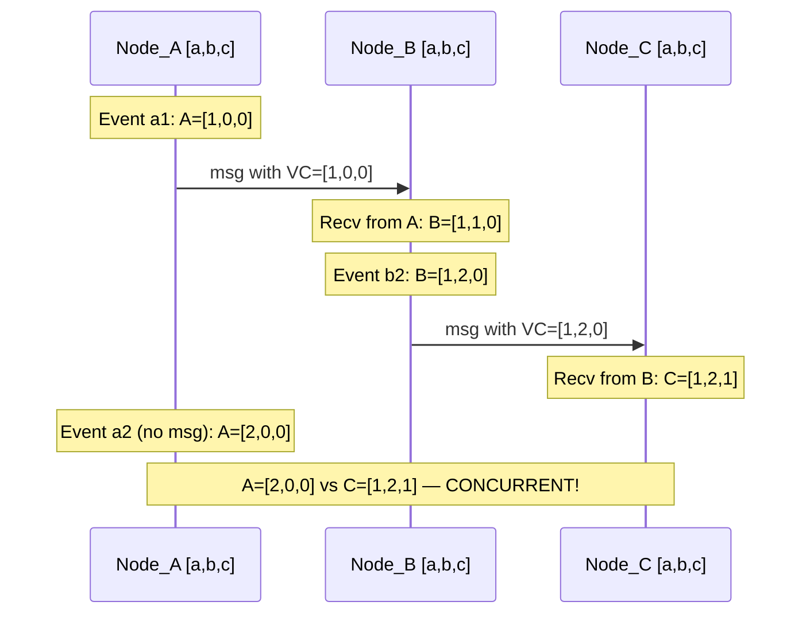

# ⏱️ Vector Clocks

> [!abstract] TL;DR
> In distributed systems, wall-clock time is unreliable (NTP drift, clock skew). Logical clocks track causal relationships between events without relying on physical time. Lamport timestamps give a total order but lose information. Vector clocks give each node a counter, capturing causality precisely: if A's vector < B's vector component-wise, A happened-before B. If neither dominates, the events are concurrent (a conflict). Used in DynamoDB, Riak, and Git's DAG.

---

## Intuition — Analogy First

Three friends — Alice, Bob, and Carol — are collaborating on a shared document over email. Each keeps their own version. Alice edits version 1 and sends it to Bob. Bob edits Alice's version and sends it back. Alice also edits her own version independently at the same time. Now there are two versions descended from the original Alice-Bob exchange — a **conflict**.

Wall clocks won't help: if Alice's laptop clock is 2 minutes fast, her "later" edit might have an earlier timestamp than Bob's. What we need is a way to say "Bob's version knows about Alice's first edit" and "Alice's independent version doesn't know about Bob's." That's causality — and vector clocks capture exactly this.

Each node keeps a count of its own events and what it has heard from others. By comparing counts, we can determine: "did A know about B's change when A made its change?"

---

## How It Works

### The Problem with Physical Clocks

Physical clocks (NTP-synchronized system clocks) cannot be trusted for event ordering in distributed systems:
- NTP sync accuracy is typically ±1-50ms, sometimes worse
- Leap seconds cause time to jump or repeat
- Virtual machines can have wildly drifting clocks
- A node's clock can go backward after NTP correction

**Cannot say**: "event A at 10:00:00.100 happened before event B at 10:00:00.101" if A and B are on different machines — the 1ms gap is within NTP error bounds.

### Lamport Timestamps

Leslie Lamport (1978) introduced logical clocks. Each process maintains a counter C:

**Rules:**
1. Before sending a message, increment C: `C = C + 1`
2. Include C in the message.
3. On receiving a message with timestamp T: `C = max(C, T) + 1`

**Happened-before relation (→):**
- If A and B are events on the same process and A occurs before B: A → B
- If A is a send event and B is the corresponding receive: A → B
- Transitivity: if A → B and B → C, then A → C

**Limitation of Lamport clocks**: They give a total order consistent with happened-before, but the converse is false. If `L(A) < L(B)`, you cannot conclude A → B. Two concurrent events (neither knows about the other) will have different Lamport timestamps, but those timestamps don't tell you they're concurrent.

### Vector Clocks

A vector clock assigns a **vector** (array) of counters to each event — one counter per node in the system. For a system with nodes {A, B, C}, each event has a vector `[counterA, counterB, counterC]`.

**Rules (for node i):**
1. Initialize: `VC = [0, 0, ..., 0]`
2. On internal event or before sending: `VC[i] = VC[i] + 1`
3. Send the updated VC with the message.
4. On receiving message with vector `VC_msg`: merge by taking component-wise max, then increment own counter:
   `VC[j] = max(VC[j], VC_msg[j])` for all j, then `VC[i] = VC[i] + 1`

**Comparison:**
- `VC_A < VC_B` (A happened-before B) if: every component of VC_A ≤ VC_B, and at least one component is strictly less.
- `VC_A == VC_B`: same event.
- **Concurrent**: neither `VC_A < VC_B` nor `VC_B < VC_A` → events are concurrent → **conflict**.

A's second event `[2,0,0]` and C's event `[1,2,1]` are concurrent: A[0]=2 > C[0]=1 but A[1]=0 < C[1]=2. Neither dominates. This means A's second event did not know about C's change, and C did not know about A's second event — they are independent, potentially conflicting updates.

### Version Vectors (DynamoDB / Riak)

In databases, **version vectors** apply vector clock principles to data objects rather than events. Each replica that modifies an object increments its own counter in the version vector attached to the object.

**Conflict detection:**
- `VV_replica1 < VV_replica2`: replica2's version is a descendant of replica1's — replica2 is newer, no conflict.
- Concurrent: neither dominates — **conflict** — the DB must resolve it.

**Conflict resolution strategies:**
- **Last-writer-wins (LWW)**: use a wall clock timestamp as a tiebreaker — loses data silently, but simple. DynamoDB's default.
- **Return siblings**: return both versions to the client and ask it to merge. Riak's approach.
- **CRDTs (Conflict-free Replicated Data Types)**: data structures that merge deterministically without conflicts. A grow-only counter (G-Counter) uses per-node counts and merges by taking max — never conflicts.

### CRDTs as an Alternative

CRDTs sidestep conflict resolution by using data structures where concurrent updates **always merge correctly**:

| CRDT Type | Example | Merge rule |
|---|---|---|
| G-Counter | view count | sum of per-node counters |
| PN-Counter | likes/dislikes | GCounter for + and − |
| LWW-Register | last-write value | highest timestamp wins |
| OR-Set (Observed-Remove) | shopping cart | tag each add, remove by tag |
| RGA (Replicated Growable Array) | collaborative text | position IDs with causality |

CRDTs are used in: Riak (PN-Counters, OR-Sets), Redis Cluster (LWW for most types), collaborative editors (Figma, Google Docs internally use OT/CRDT hybrids).

---

## Real-World Systems

- **Amazon DynamoDB**: Uses version vectors for detecting conflicts in multi-region replication. DynamoDB defaults to last-writer-wins, but customers can implement custom resolution.
- **Amazon S3**: Internally uses vector clocks for replication state among storage nodes to detect divergence.
- **Riak (Basho)**: One of the few databases that exposes vector clocks to the client explicitly (as "causal context" or `vclock` header). Supports sibling resolution or CRDTs.
- **Apache Cassandra**: Uses a hybrid approach — timestamps + tombstones. Cassandra relies on LWW (last-write-wins via client-provided timestamp) rather than vector clocks, which is simpler but can lose writes.
- **Git**: Git's DAG (directed acyclic graph) of commits is structurally equivalent to vector clocks — a commit records all parent commits it "knows about." Merge commits have two parents, representing a reconciliation of two concurrent branches.
- **CRDTs in production**: Figma uses CRDTs for real-time collaborative document editing. Automerge and Yjs are popular open-source CRDT libraries.

---

## Trade-offs

| Approach | Causality | Conflict Detection | Merge | Overhead |
|---|---|---|---|---|
| **Physical clocks** | No | No | N/A | None |
| **Lamport timestamps** | Partial (one-way) | No | N/A | O(1) per message |
| **Vector clocks** | Full | Yes | Manual or LWW | O(N) per message (N=nodes) |
| **Version vectors** | Full (object-level) | Yes | Manual or CRDT | O(N) per object |
| **CRDTs** | Full (implicit) | None needed | Automatic | Varies (structure overhead) |

**Vector clock scaling problem**: With N nodes, each vector has N entries. In large systems (100s of nodes), this becomes expensive. Solutions: prune entries for nodes no longer participating, use dotted version vectors (more compact), or use hybrid logical clocks (HLC).

**Hybrid Logical Clocks (HLC):** Combines physical clocks (for human-readable timestamps) with logical clocks (for causality). Used in CockroachDB and TiDB — allows querying data as-of a real wall-clock time while still maintaining causal ordering.

---

## When to Use vs Avoid

**Use vector clocks / version vectors when:**
- You are building an eventually consistent, multi-master replication system where any replica can accept writes.
- You need to detect concurrent edits (conflicts) rather than silently losing data with LWW.
- You are implementing a distributed cache, KV store, or document store where partition tolerance is prioritized.

**Avoid vector clocks when:**
- You have a single-leader replication system — the leader's monotonically increasing log sequence number is sufficient.
- You use a consensus protocol (Raft, Paxos) — Raft's `term + index` already provides a total order, making vector clocks redundant.
- N (number of nodes) is very large — vector size grows with N. Use HLCs or a different architecture.

---

## Common Pitfalls

1. **Confusing Lamport timestamps with vector clocks**: Lamport timestamps give a partial order but cannot detect concurrency. Vector clocks can. Don't use Lamport timestamps for conflict detection — they will give false negatives.

2. **Assuming LWW is safe**: Many systems default to last-writer-wins for simplicity. LWW silently discards concurrent writes. For shopping carts, counters, and collaborative documents, LWW causes data loss. Use CRDTs or sibling resolution instead.

3. **Vector clocks growing unboundedly**: In a system where nodes join and leave frequently, the vector can grow indefinitely. Implement a pruning strategy: remove entries for nodes that have been decommissioned for more than T time.

4. **Conflating vector clocks with conflict resolution**: Vector clocks detect conflicts. They do not resolve them. You still need a resolution strategy (LWW, application-level merge, CRDT, ask the user).

5. **Not understanding the "concurrent means conflict" implication**: Concurrent events are not necessarily conflicting at the application level. Two users adding different items to a shopping cart are concurrent but not conflicting — OR-Set CRDT handles this naturally. The key is choosing the right data structure, not just the clock mechanism.

6. **Using physical timestamps as tiebreakers incorrectly**: If two writes are concurrent (by vector clock) and you break the tie with the physical timestamp, you are back to relying on NTP accuracy. This can cause spurious data loss if clocks are skewed.

---

## Related Concepts

- [[_MOC_Distributed_Systems|↑ Section MOC]]
- [[CAP_Theorem]] — explains why eventual consistency (and thus conflict detection with vector clocks) exists
- [[Consensus_and_Raft]] — the alternative approach: avoid conflicts entirely by enforcing a total order via a leader
- [[PACELC_Theorem]] — extends CAP; PA/EL systems (like Dynamo) favor availability and low latency, accepting the need for conflict resolution
- [[Replication]] — the context in which vector clocks operate (detecting divergence between replicas)

---

## Review Questions

1. **Node A has vector `[3, 1, 0]` and Node B has vector `[2, 2, 0]`. Are these events concurrent or causally ordered? Show your comparison work. What does your answer imply about the data stored at A and B?**

2. **Amazon DynamoDB uses version vectors for conflict detection but defaults to last-writer-wins resolution. Describe a realistic e-commerce scenario where LWW causes data loss. What would a safer resolution strategy look like for that scenario?**

3. **Explain why Git's commit DAG is structurally equivalent to vector clocks. What is the "vector" in Git's case, and what does a merge commit represent in terms of causality?**

---

## Sources

- Leslie Lamport, "Time, Clocks, and the Ordering of Events in a Distributed System" (1978) — the foundational paper
- Colin Fidge, "Timestamps in Message-Passing Systems" (1988) — formal vector clock definition
- Werner Vogels, "Eventually Consistent" (Amazon, 2008) — DynamoDB's eventual consistency model
- Martin Kleppmann, *Designing Data-Intensive Applications*, Chapter 8 (The Trouble with Distributed Systems)
- Marc Shapiro et al., "A Comprehensive Study of Convergent and Commutative Replicated Data Types" (CRDT paper, 2011)
- Hybrid Logical Clocks: https://jaredforsyth.com/posts/hybrid-logical-clocks/

#SystemDesign #DistributedSystems #VectorClocks #LamportTimestamps #CausalOrdering #CRDT #Riak #DynamoDB
