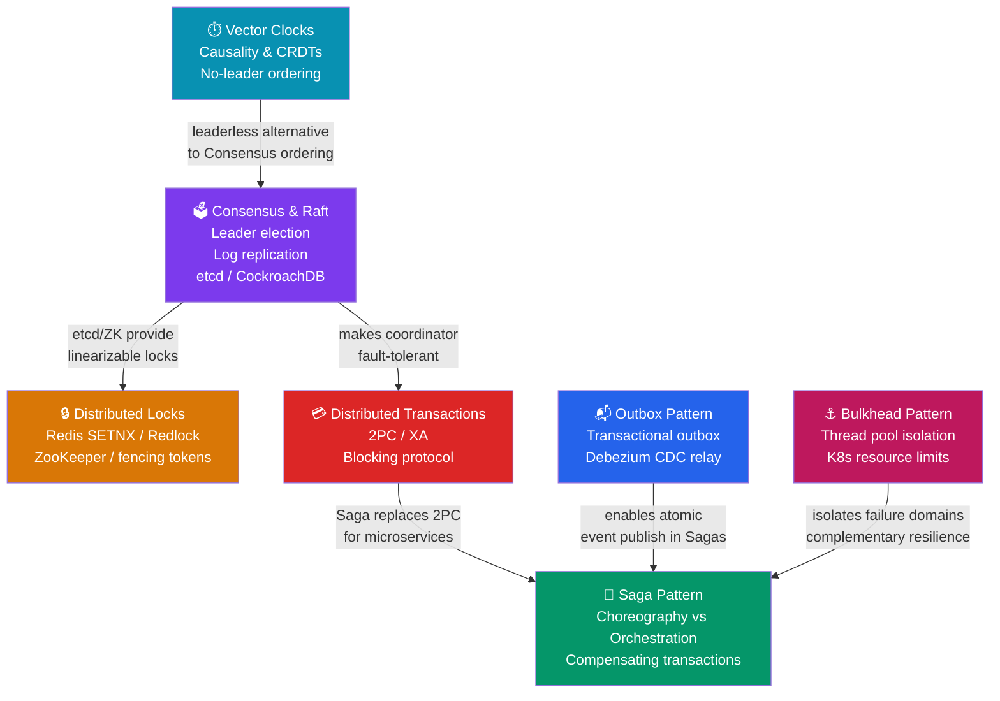

# 🗺️ Distributed Systems Primitives — Map of Content

> [!abstract] What's in this section?
> This section covers the foundational primitives that make distributed systems safe, consistent, and resilient. Seven notes span the full spectrum from transaction coordination (2PC, Saga, Outbox) to time and ordering (Vector Clocks), to coordination primitives (Distributed Locks, Consensus/Raft), and fault isolation (Bulkhead). Together they answer the core question every distributed system must answer: how do you get multiple independent nodes to behave like one reliable system?

## Concept Map

## Learning Path

Recommended reading order — start with the problem space, then explore alternatives and supporting patterns:

1. **[[Distributed_Transactions]]** — Understand 2PC and why it is a blocking protocol with serious failure modes. This is the baseline that motivates everything else.
2. **[[Saga_Pattern]]** — The modern microservices alternative to 2PC. Learn choreography vs orchestration and why compensating transactions are not SQL rollbacks.
3. **[[Outbox_Pattern]]** — The reliability glue for Sagas. Understand how a simple outbox table + Debezium eliminates the dual-write problem.
4. **[[Consensus_and_Raft]]** — The foundation for strong coordination. Walk through leader election and log replication; understand why Raft powers etcd, CockroachDB, and Kafka KRaft.
5. **[[Distributed_Locks]]** — Apply Consensus in practice. Compare Redis SETNX (fast, weak) vs ZooKeeper/etcd (slow, strong) and understand why fencing tokens are essential for correctness.
6. **[[Vector_Clocks]]** — The leaderless alternative to consensus-based ordering. Understand Lamport clocks, vector clocks, CRDTs, and why DynamoDB and Git use this approach.
7. **[[Bulkhead_Pattern]]** — Fault isolation at the infrastructure level. Understand thread pool isolation, connection pool bulkheads, and K8s resource quotas as the last line of defence against cascading failures.

## All Notes at a Glance

| Note | Difficulty | What you'll learn |
|------|------------|-------------------|
| [[Distributed_Transactions]] | Advanced | 2PC protocol, XA interface, why it's blocking, Saga as alternative |
| [[Saga_Pattern]] | Advanced | Choreography vs orchestration, compensating transactions, Saga vs 2PC |
| [[Outbox_Pattern]] | Intermediate | Dual-write problem, outbox table + Debezium CDC, at-least-once semantics |
| [[Distributed_Locks]] | Intermediate | Redis SETNX, Redlock algorithm, ZooKeeper ephemeral nodes, fencing tokens |
| [[Consensus_and_Raft]] | Advanced | Raft leader election, log replication, safety guarantees, etcd/CockroachDB |
| [[Vector_Clocks]] | Advanced | Lamport timestamps, vector clocks, version vectors, CRDTs, Git DAG |
| [[Bulkhead_Pattern]] | Intermediate | Thread pool isolation, semaphore vs pool bulkhead, K8s quotas, Hystrix/R4j |

## Key Questions This Section Answers

- Why is Two-Phase Commit (2PC) described as a "blocking protocol," and what failure scenario makes it dangerous in production?
- When a microservice must save to a database and publish to Kafka atomically, what pattern prevents the dual-write inconsistency?
- In what situation is Redis SETNX sufficient for distributed locking, and when must you use etcd or ZooKeeper with fencing tokens?
- How does the Raft consensus algorithm ensure that committed log entries are never lost, even after a leader failure?
- How can DynamoDB and Git track causal ordering without a central leader, and what happens when concurrent edits are detected?
- What is the difference between a Bulkhead and a Circuit Breaker, and why should both be used together?
- How does a Saga's choreography model differ from orchestration, and what are the real-world trade-offs in choosing between them?

## Cross-Section Links

- Related: [[_MOC_Databases]] — ACID transactions, replication, and sharding provide the storage layer that Sagas and Outbox build on
- Related: [[_MOC_Event_Driven]] — Kafka is the event backbone for Saga choreography and the Outbox relay target
- Related: [[_MOC_Caching]] — Distributed Locks use Redis, which is also the central caching system; understand when to use Redis for each purpose
- Related: [[_MOC_SystemDesign_Master]] — Master index for all System Design sections
