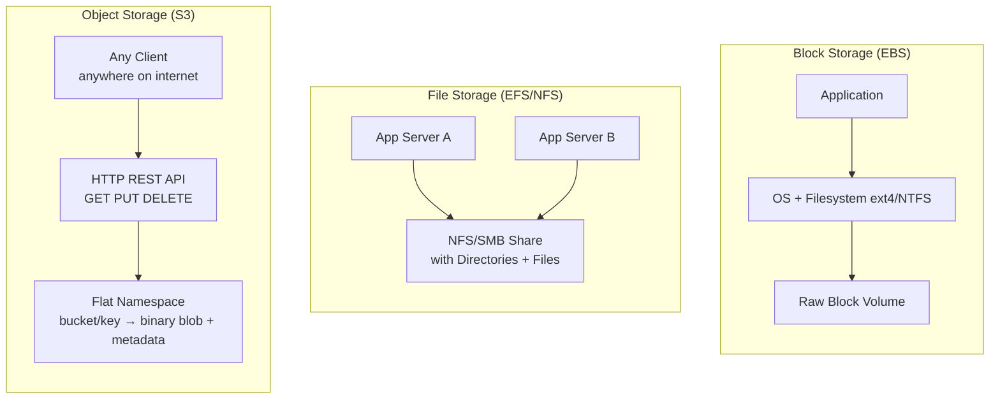

# 🗄️ Block vs Object vs File Storage

> [!abstract] TL;DR
> Three fundamental storage abstractions serve different needs: **Block** gives raw volumes for databases and VMs (low latency), **File** gives a shared hierarchical filesystem for apps that need a familiar interface, and **Object** gives a flat, massively scalable key→blob store for images, videos, and backups. Choosing the wrong one is one of the most common infrastructure mistakes.

---

## Intuition — Analogy First

Think of a **city's storage infrastructure**:

- **Block storage** is like a **raw parking garage floor** — completely empty concrete. The tenant (OS) decides how to paint the lines, what to put where, and how to organize it. It is the most flexible and fastest because there is no overhead — just raw space.
- **File storage** is like a **shared filing cabinet** in an office — everyone uses the same familiar folder/drawer/label system. Multiple people can open the cabinet at the same time and find things where they expect them to be.
- **Object storage** is like a **massive warehouse with a barcode scanner** — no shelves, no folders, just a flat floor where every item has a unique barcode. You can store billions of items cheaply, but you must know the exact barcode to retrieve something. You cannot "browse" efficiently.

---

## How It Works

### Block Storage
The storage system presents raw fixed-size blocks (e.g., 512-byte or 4 KB sectors) to a host. The host OS mounts them and applies a filesystem (ext4, NTFS, XFS) on top. The application sees a normal disk. Operations are at the block level — the storage system has no understanding of files or directories.

- **Access protocol:** iSCSI (over network) or direct NVMe/SAS attachment
- **Typical latency:** sub-millisecond (< 1 ms for NVMe, 1–5 ms for network block)
- **Attachment model:** one volume → one instance (usually), like a hard drive

### File Storage
A dedicated file server (or distributed file system) manages directories and files and exposes them via a standard protocol. Multiple clients mount the same share and see the same filesystem tree.

- **Access protocol:** NFS (Linux) or SMB/CIFS (Windows)
- **Typical latency:** 1–10 ms (network round-trip + server processing)
- **Attachment model:** many instances → one share (shared read/write)

### Object Storage
A distributed key-value store where each object is addressed by a globally unique key (often called a path but with no real hierarchy). Objects are immutable — to "update" an object you write a new version. Accessed entirely over HTTPS REST API.

- **Access protocol:** HTTP REST (GET, PUT, DELETE)
- **Typical latency:** 50–200 ms (first-byte latency; high throughput once streaming)
- **Attachment model:** any client anywhere via HTTP; no mounting

---

## Real-World Systems

| Type | AWS | GCP | Azure | Open Source |
|------|-----|-----|-------|-------------|
| Block | EBS | Persistent Disk | Managed Disks | Ceph RBD |
| File | EFS | Filestore | Azure Files | NFS, GlusterFS |
| Object | S3 | GCS | Blob Storage | MinIO, Ceph RGW |

**Real usage examples:**
- **Netflix:** video files (original and transcoded) stored in S3 (object), served via CloudFront CDN. Databases (metadata, user data) run on EBS-backed RDS instances (block).
- **Enterprise shared drive:** config files, code deploys, and shared application assets accessed by 10 app servers via EFS (file). Each server mounts the same NFS share.
- **PostgreSQL on EC2:** database files live on an EBS volume attached exclusively to one EC2 instance (block). Sub-millisecond I/O is essential for transactional workloads.

---

## Trade-offs

| Dimension | Block | File | Object |
|-----------|-------|------|--------|
| **Latency** | Sub-ms (best) | Low-ms (good) | 50–200 ms (high) |
| **Throughput** | High (sequential) | Medium | Very high (parallel) |
| **Scalability** | Limited by volume size | Limited by server | Essentially unlimited |
| **Cost** | Highest ($/GB) | Medium | Lowest ($/GB) |
| **Mutability** | Full random read/write | Full random read/write | Immutable (overwrite only) |
| **Access pattern** | Single host (usually) | Multiple hosts (shared) | Any HTTP client |
| **Max object size** | Volume size limit | FS limits (TB range) | 5 TB per object (S3) |
| **Typical use case** | Databases, VMs, boot volumes | Shared app files, CMS, ML datasets | Images, videos, backups, data lakes |
| **Durability** | Multi-AZ replication | Depends on config | 11 nines (99.999999999%) |
| **Operations** | Block-level I/O syscalls | POSIX (open/read/write/seek) | REST API (PUT/GET/DELETE) |

---

## When to Use vs Avoid

**Block Storage — Use when:**
- Running a relational database (PostgreSQL, MySQL, Oracle)
- Running a VM or container with stateful data
- Workload requires random read/write with low latency
- You need POSIX semantics and fine-grained I/O control

**Block Storage — Avoid when:**
- You need to share data between many instances simultaneously
- You need massive scale at low cost (cost per GB is high)

**File Storage — Use when:**
- Multiple app servers need to share the same files simultaneously
- Migrating a legacy on-premises application that expects NFS/SMB
- Storing ML training datasets accessed by multiple training workers
- CMS or media systems where many services need shared access

**File Storage — Avoid when:**
- You need the lowest possible latency (NFS adds overhead)
- Storing billions of small objects (too much metadata overhead)
- Cost is a primary concern (more expensive than object storage)

**Object Storage — Use when:**
- Storing large amounts of static content (images, videos, documents)
- Building a data lake or archival system
- Serving static website assets (HTML, CSS, JS)
- Backup and disaster recovery storage
- Need global accessibility over HTTP without a VPN

**Object Storage — Avoid when:**
- You need to frequently modify small parts of a file (immutable by design)
- Your application requires low latency random I/O (databases)
- You need a POSIX interface (cannot be mounted like a disk)

---

## Common Pitfalls

1. **Running a database on object storage.** Object storage is immutable and has high first-byte latency. Databases need random read/write at sub-millisecond speeds — always use block storage for database files.

2. **Confusing S3's flat namespace for a filesystem.** S3 keys that look like paths (`/images/2024/photo.jpg`) are just string keys — there are no real directories. Operations like "list all files in a folder" require a list call that scans all keys with a prefix, which is expensive at scale.

3. **Mounting object storage with FUSE and expecting file performance.** Tools like `s3fs` mount S3 as a filesystem but latency is 100× worse than EBS because every read/write is an HTTP call. This is a last resort, not a general solution.

4. **Not using multipart uploads for large files.** Uploading a 10 GB file as a single HTTP PUT is fragile. If it fails at 99%, you restart from zero. Multipart upload lets you resume and parallelize.

5. **Forgetting that file storage shares a throughput limit.** A single NFS server is a bottleneck. If 50 app servers all hammer the same EFS mount point with high I/O, you will hit throughput limits. Plan capacity accordingly.

6. **Assuming block storage is inherently durable.** A single EBS volume can fail. Use snapshots, cross-AZ replication, or RAID configurations for critical data.

---

## Related Concepts

- [[_MOC_Storage|↑ Section MOC]]
- [[Object_Storage]] — deep dive into S3-style storage internals
- [[Distributed_File_Systems]] — GFS and HDFS for large-scale distributed storage
- [[Databases]] — how RDBMS and NoSQL systems build on top of block storage
- [[CDNs]] — how object storage (S3) integrates with CloudFront/Akamai for delivery
- [[Data_Lake_and_Lakehouse]] — data lakes use object storage as their foundation
- [[RDBMS]] — relational databases require block storage with low-latency random I/O

---

## Review Questions

1. A startup is building a video streaming platform. They need to store 5 PB of video files and serve them globally to millions of users. Which storage type should they choose and why? What are the tradeoffs of that choice?

2. You have a fleet of 20 application servers that all need to read and write from the same set of configuration files and uploaded user profile pictures. Block storage is not suitable here — explain why, and what the correct alternative is.

3. Why is object storage described as "immutable"? What does this mean in practice when a user updates their profile picture — how does S3 actually handle this operation under the hood?

---

## Sources

- [AWS Storage Types Overview](https://aws.amazon.com/products/storage/)
- [AWS EBS vs EFS vs S3](https://aws.amazon.com/blogs/storage/choosing-the-right-aws-storage-service/)
- [Google Cloud Storage Options](https://cloud.google.com/storage/docs/storage-classes)
- [Netflix Tech Blog — Storing Images at Scale](https://netflixtechblog.com)

#SystemDesign #Storage #BlockStorage #ObjectStorage #FileStorage #AWS #EBS #S3 #EFS
