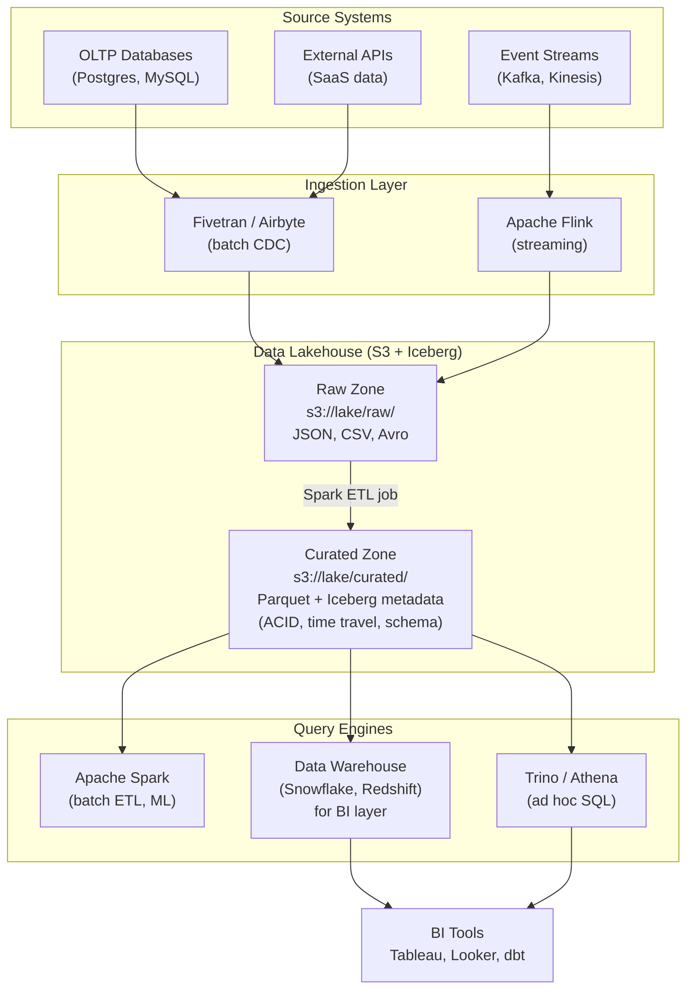

# 🏞️ Data Lake and Lakehouse

> [!abstract] TL;DR
> A **data lake** stores raw data of any type cheaply in object storage (S3) with schema on read — but suffers from no ACID transactions, no efficient updates, and "data swamp" sprawl. A **data lakehouse** (Delta Lake, Apache Iceberg, Apache Hudi) adds a metadata layer on top of Parquet files to bring ACID transactions, time travel, and efficient upserts to the lake, combining the lake's cheap scale with the warehouse's reliability. Iceberg is emerging as the open standard (Netflix, Apple, AWS).

---

## Intuition — Analogy First

**Data Lake** is like a **massive warehouse where you throw in everything** as it arrives — boxes, bags, raw materials, half-finished goods, loose papers. Storage is cheap, you keep everything, and the idea is "we will figure out how to use it later." The problem: six months later, nobody knows what is in box 7,432, formats are inconsistent, half the data is garbage, and finding anything requires excavation.

**Data Lakehouse** is the same warehouse, but now someone has installed a **digital inventory management system on the shelves**: every item is catalogued, every change is logged with a timestamp, you can roll back to yesterday's inventory if someone made a mistake, and you can update individual records without repacking every box. The cheap storage stays — you just add a smart organizational layer on top.

The warehouse floor (raw storage) = S3. The inventory system = Iceberg/Delta Lake metadata layer. The ability to query it efficiently = Apache Spark or Trino.

---

## How It Works

### Data Lake Architecture

**Core idea:** Dump all data (structured, semi-structured, unstructured) into cheap object storage (S3, GCS, ADLS) without defining a schema upfront.

```
s3://company-data-lake/
├── raw/
│   ├── clickstream/2024/01/15/events_001.json.gz
│   ├── orders/2024/01/15/orders_001.csv
│   └── logs/nginx/2024/01/15/access.log
├── processed/
│   ├── user_sessions/2024/01/15/part-00001.parquet
│   └── daily_orders/2024/01/15/summary.parquet
└── curated/
    └── marketing_cohorts/cohort_2024_q1.parquet
```

**Schema on read:** When you write to the lake, you write raw data in any format (CSV, JSON, Avro, Parquet). When you query, the compute engine (Spark, Athena, Presto) infers or you provide the schema at query time. Contrast with schema on write (databases, warehouses): you define the schema before inserting data.

**Technologies for querying a data lake:**
- **Amazon Athena:** Serverless SQL over S3 using Presto. Pay per TB scanned.
- **Apache Spark:** Distributed compute engine that reads from S3 natively.
- **Apache Presto / Trino:** Fast distributed SQL engine, used by Facebook at scale.
- **Google Dataproc / Databricks:** Managed Spark environments.

### Problems with a Raw Data Lake

> [!warning] The "Data Swamp" Problem
> Without governance and tooling, data lakes become unusable.

1. **No ACID transactions.** If a Spark job writing 1,000 Parquet files to `s3://lake/orders/2024/` fails at file 500, queries see half the data — a partial, inconsistent state. There is no rollback.

2. **No efficient upserts.** To update a single customer's record in 1 TB of Parquet files, you must rewrite the entire partition. There is no `UPDATE` statement — just rewrite.

3. **Schema drift.** The upstream orders system adds a new column `promo_code`. New files have it; old files do not. Queries that expect a fixed schema break.

4. **No data versioning.** Accidentally deleted a partition? It is gone. There is no `UNDO`.

5. **Slow partition discovery.** With millions of files, just listing the available partitions requires listing millions of S3 keys — slow and expensive.

6. **No statistics for query optimization.** A SQL query optimizer needs column statistics (min, max, null count) to choose efficient join strategies. Bare Parquet files have no central statistics registry.

### Data Lakehouse — The Solution

A **lakehouse** adds a transactional metadata layer on top of object storage. The files themselves remain Parquet on S3 — the metadata layer adds:

1. **Transaction log:** Every change (INSERT, UPDATE, DELETE, MERGE) is recorded as an atomic entry in a transaction log. This provides ACID semantics.
2. **File manifest:** The metadata layer tracks exactly which Parquet files make up the current (and historical) table state.
3. **Column statistics:** Per-file min/max/null statistics for every column, enabling the query engine to skip irrelevant files (data skipping).
4. **Schema enforcement:** Writes that violate the declared schema are rejected.



### Open Table Formats — Delta Lake vs Iceberg vs Hudi

All three solve the same problems but with different design philosophies:

**Delta Lake (Databricks, 2019)**
- Transaction log stored as JSON files in `_delta_log/` directory inside the table path
- Tight integration with Apache Spark (Databricks' primary engine)
- `OPTIMIZE` command compacts small files; `ZORDER` for multi-dimensional clustering
- Became open source in 2019; Delta Sharing protocol for cross-org sharing
- **Best for:** Databricks shops; tightest Spark integration

**Apache Iceberg (Netflix, 2018 → Apache 2020)**
- Metadata stored as a hierarchy: snapshot → manifest list → manifest files → data files
- Engine-agnostic: works with Spark, Trino, Flink, Dremio, Snowflake, BigQuery
- **Hidden partitioning:** partition strategy stored in metadata, not in the physical path (unlike Hive `dt=2024-01-15/`). You can change partition strategy without rewriting data.
- Table format spec is open and stable — any engine implementing the spec can read/write
- **Best for:** multi-engine shops; engine-agnostic standard; the emerging industry default

**Apache Hudi (Uber, 2016 → Apache 2019)**
- Focused on **streaming upserts** (CDC ingestion use case — stream database changes into the lake)
- Copy-on-Write (COW) for reads, Merge-on-Read (MOR) for fast writes with compaction
- Built-in DeltaStreamer for Kafka → lake ingestion
- **Best for:** real-time CDC pipelines; near-real-time data ingestion

| Dimension | Delta Lake | Iceberg | Hudi |
|-----------|-----------|---------|------|
| **Creator** | Databricks | Netflix | Uber |
| **ACID** | Yes | Yes | Yes |
| **Time travel** | Yes | Yes | Yes |
| **Schema evolution** | Yes | Yes | Yes |
| **Engine agnostic** | Mostly (Spark-first) | Yes (widest support) | Yes |
| **Hidden partitioning** | No | Yes | Partial |
| **Streaming upserts** | Good | Good | Best |
| **Industry adoption** | High (Databricks users) | Growing fast (Apple, Netflix) | High (CDC use cases) |
| **AWS native support** | EMR, Glue | S3 Tables, Athena, Glue | EMR, Glue |

**Iceberg is winning the open standard battle** — AWS launched native Iceberg tables in S3 (S3 Tables) in 2024, Snowflake supports Iceberg as an external table format, BigQuery supports Iceberg, and Apple runs Iceberg at an almost incomprehensibly large scale (exabytes of Iceberg tables).

### Time Travel

One of the most powerful lakehouse features — query data as it existed at any past point in time:

```sql
-- Iceberg time travel syntax
SELECT * FROM orders FOR SYSTEM_TIME AS OF '2024-01-15 00:00:00';
SELECT * FROM orders FOR VERSION AS OF 1234567;

-- Delta Lake syntax
SELECT * FROM orders TIMESTAMP AS OF '2024-01-15';
SELECT * FROM orders VERSION AS OF 100;
```

**How it works:** Each transaction creates a new snapshot. A snapshot references a set of data files. The metadata layer retains old snapshots (until you run `VACUUM`/`EXPIRE_SNAPSHOTS`). Time travel just reads the old snapshot's file list.

**Use cases:** Audit compliance, debugging data quality issues, reproducing ML training datasets at a point in time, recovering from accidental deletes.

---

## Real-World Systems

**Netflix (Iceberg):** Netflix invented Apache Iceberg to solve problems with Hive metastore at their scale (hundreds of PB of data). They run petabyte-scale Iceberg tables for their recommendation system training data, content analytics, and A/B test results. Iceberg's hidden partitioning lets Netflix restructure table layouts without migrating data.

**Databricks (Delta Lake):** Databricks built Delta Lake as the foundation of their "Lakehouse" product. The Databricks Lakehouse Platform (formerly Delta Engine) runs Delta Lake tables as the primary storage format, with Unity Catalog for governance. Databricks coined the term "Lakehouse" in their 2020 CIDR paper.

**Apple (Iceberg):** Apple runs Apache Iceberg at one of the largest scales in the world — reportedly multiple exabytes of Iceberg data. They contributed significantly to the Iceberg open source project. Their use case includes ML feature stores, device telemetry analytics, and internal business intelligence.

**Airbnb:** Uses a mix — they adopted Apache Hudi early for CDC ingestion (syncing MySQL production data into the data lake), and use Spark + Presto for queries on their S3-based data lake.

**Uber:** Invented Apache Hudi for their real-time analytics use case: ingesting database change streams from their Postgres/MySQL production databases into the data lake with sub-minute latency, enabling analysts to query near-real-time data.

---

## Trade-offs

| Dimension | Raw Data Lake | Data Lakehouse |
|-----------|--------------|----------------|
| **ACID transactions** | No | Yes |
| **Efficient upserts** | No (rewrite partition) | Yes (merge into) |
| **Time travel** | No | Yes |
| **Schema enforcement** | Optional (schema on read) | Yes (enforced + evolve) |
| **Query performance** | Poor (no file stats) | Good (file skipping, Z-ordering) |
| **Setup complexity** | Minimal | Moderate (Iceberg catalog) |
| **Storage cost** | Minimal (just S3) | Slightly higher (metadata overhead) |
| **Compute required** | Spark/Athena | Spark/Trino with table format support |
| **Mature tooling** | Yes (years of Hive patterns) | Growing rapidly (2021–2024 inflection) |

---

## When to Use vs Avoid

**Use a Data Lake / Lakehouse when:**
- Storing large volumes of diverse data (structured + semi-structured + raw logs) cheaply
- Running ML training pipelines that need historical snapshots of data
- Building an analytical platform that multiple query engines (Spark, Trino, Snowflake) must access
- You need ACID + time travel but want to avoid the cost of a full data warehouse for all data
- Your data arrives via streaming (Kafka) and needs near-real-time availability for analysis

**Avoid / complement with a warehouse when:**
- Business analysts need fast, interactive SQL (seconds) — the lakehouse alone may not be fast enough for BI without a serving layer
- Data is purely structured and well-modeled upfront — a data warehouse is simpler to operate
- Team lacks Spark/distributed systems expertise — managed warehouses (Snowflake, BigQuery) are operationally simpler

---

## Common Pitfalls

1. **Small file problem.** Streaming ingestion writes thousands of tiny Parquet files per hour. Queries must open and read the footer of each file — massive overhead. Run regular compaction jobs (`OPTIMIZE` in Delta, `rewrite_data_files` in Iceberg) to merge small files into large ones.

2. **Forgetting to run VACUUM/expire snapshots.** Time travel retains old data files. Without periodic cleanup, storage costs grow unboundedly. Run `VACUUM` (Delta) or `expire_snapshots` + `remove_orphan_files` (Iceberg) regularly.

3. **Using wrong partition granularity.** Partitioning by `day` is fine for a table written once per hour. Partitioning by `hour` on a high-cardinality table creates millions of partition directories, slowing list operations. Iceberg's hidden partitioning lets you change strategy without rewriting data.

4. **Ignoring the Hive metastore scaling limit.** Hive metastore (MySQL-backed catalog) struggles with thousands of partitions and concurrent writers. Use Iceberg (which stores metadata in the files themselves) or a scalable catalog (AWS Glue, Nessie) to escape this bottleneck.

5. **Mixing raw and curated data in the same table.** Accidentally writing malformed raw events into a curated Iceberg table corrupts it. Maintain strict zone boundaries: raw → Bronze (typed but raw) → Silver (clean) → Gold (aggregated).

6. **Not testing schema evolution.** Adding a nullable column is safe. Dropping a column or changing a type without checking downstream consumers breaks pipelines silently. Iceberg tracks schema versions — always test downstream consumers before schema changes.

---

## Related Concepts

- [[_MOC_Storage|↑ Section MOC]]
- [[Data_Warehouse]] — the structured analytical store that complements or replaces parts of the lakehouse
- [[OLTP_vs_OLAP]] — the foundational read/write pattern distinction that motivates this architecture
- [[Object_Storage]] — S3/GCS is the storage layer that makes the lakehouse economically viable
- [[Distributed_File_Systems]] — HDFS was the original data lake storage layer before cloud object storage
- [[Lambda_Architecture]] — batch + streaming architecture that the lakehouse partially replaces

---

## Review Questions

1. Explain the "data swamp" problem. A company has been dumping all their raw data into S3 for 3 years. What specific technical and organizational problems have they likely accumulated, and how does adopting Apache Iceberg address each one?

2. Compare Apache Iceberg and Apache Hudi at an architectural level. Which would you choose for a CDC (Change Data Capture) pipeline that ingests Postgres binlog changes into your data lake every 30 seconds? Justify your answer.

3. You are a data engineer at a company that currently uses a traditional data warehouse (Snowflake). The team proposes migrating to a "pure" data lakehouse (S3 + Iceberg + Trino). What are the legitimate benefits of this migration, and what capabilities do you risk losing? Under what conditions would the migration make sense?

---

## Sources

- [Databricks — Lakehouse: A New Generation of Open Platforms (CIDR 2021)](https://www.cidrdb.org/cidr2021/papers/cidr2021_paper17.pdf)
- [Apache Iceberg — Table Spec](https://iceberg.apache.org/spec/)
- [Delta Lake — Technical Documentation](https://docs.delta.io/latest/)
- [Apache Hudi — Architecture Overview](https://hudi.apache.org/docs/next/concepts/)
- [Netflix Tech Blog — Iceberg at Netflix](https://netflixtechblog.com/iceberg-at-netflix-9f0ed9f72eb3)
- [AWS S3 Tables (Iceberg-native, 2024)](https://aws.amazon.com/s3/features/tables/)

#SystemDesign #Storage #DataLake #Lakehouse #Iceberg #DeltaLake #Hudi #Parquet #S3 #Analytics #ACID #TimeTravel
